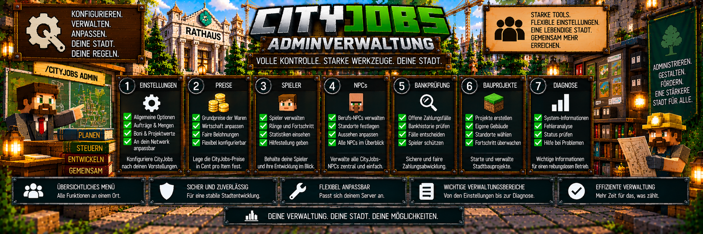

<link rel="stylesheet" href="style.css">



# 🛠️ CityJobs – Adminverwaltung

CityJobs besitzt eine umfangreiche **Adminverwaltung**, mit der wichtige Bereiche des Berufssystems direkt im Spiel konfiguriert und kontrolliert werden können.

Das zentrale Admin-Menü wird geöffnet mit:

`/cityjobs admin`

Die Verwaltung ist für Administratoren mit **Berechtigungsstufe 2 beziehungsweise OP-Rechten** vorgesehen.

CityJobs 1.0.0 besitzt sieben zentrale Verwaltungsbereiche:

1. ⚙️ Einstellungen
2. 💰 Preise
3. 👤 Spieler
4. 🧑‍💼 NPCs
5. 🔍 Bankprüfung
6. 🏗️ Bauprojekte
7. 🩺 Diagnose

---

# 🧭 Admin-Menü öffnen

Verwende:

`/cityjobs admin`

Dadurch öffnet sich die zentrale CityJobs-Verwaltung.

Von dort aus können die verschiedenen Bereiche ausgewählt werden.

```text
CITYJOBS ADMIN

⚙️ Einstellungen
💰 Preise
👤 Spieler
🧑‍💼 NPCs
🔍 Bankprüfung
🏗️ Bauprojekte
🩺 Diagnose
```

Viele wichtige CityJobs-Funktionen können damit direkt über Menüs verwaltet werden.

---

# ⚙️ Einstellungen

Im Bereich **Einstellungen** befinden sich die allgemeinen Servereinstellungen von CityJobs.

Hier können unter anderem Werte für:

- persönliche Aufträge
- Auftragsbelohnungen
- Auftragsmengen
- Berufswechsel
- Rangboni
- Großaufträge
- Meisteraufträge
- Gemeinschaftsaufträge
- Bauprojekte
- Lieferhistorie
- Erfolge

angepasst werden.

---

# 📦 Aufträge pro Tag

Standardmäßig können Spieler:

**3 persönliche Aufträge pro Minecraft-Tag**

abschließen.

Möglicher Einstellungsbereich:

**1 bis 100**

Das Limit gilt gemeinsam über alle Berufe.

Ein Berufswechsel setzt das Tageslimit nicht zurück.

---

# 💰 Allgemeine Belohnung

Die allgemeine Auftragsbelohnung beträgt standardmäßig:

**100 %**

Möglicher Bereich:

**1 bis 1.000 %**

Damit kann die gesamte Auszahlung neuer persönlicher Aufträge erhöht oder reduziert werden.

---

# 📦 Auftragsmenge

Standardmäßig beträgt die Auftragsmenge:

**100 %**

Möglicher Bereich:

**25 bis 500 %**

Damit kann gesteuert werden, wie groß neu erzeugte Aufträge ausfallen.

---

# 🔄 Berufswechsel-Cooldown

Nach einem Berufswechsel gilt standardmäßig eine Wechselpause von:

**60 Minuten Serverlaufzeit**

Möglicher Bereich:

**0 bis 1.440 Minuten**

Bei:

`0`

ist der Cooldown deaktiviert.

---

# 📈 Preisbonus pro Rang

Höhere Berufs-Ränge können zusätzliche wirtschaftliche Vorteile erhalten.

Standard:

**20 % Preisbonus pro Rang**

Möglicher Bereich:

**0 bis 100 %**

---

# ⭐ Auftrags-XP pro Rangstufe

Standardmäßig können höhere Rangstufen zusätzliche Auftrags-XP erhalten.

Standardwert:

**50**

Möglicher Bereich:

**0 bis 1.000**

---

# 📦 Großaufträge

Großaufträge können ebenfalls über die Einstellungen angepasst werden.

Standardmäßig gelten:

| Einstellung | Standard | Bereich |
|---|---:|---:|
| Großauftrag-Chance | 20 % | 0–100 % |
| Mengenfaktor | 3 | 2–8 |
| Preisbonus | 15 % | 0–100 % |

Damit kann festgelegt werden, wie häufig Großaufträge auftreten und wie umfangreich sie sind.

---

# 👑 Meisteraufträge

Meisteraufträge sind standardmäßig:

**aktiviert**

Für sie gelten standardmäßig:

| Einstellung | Standard | Bereich |
|---|---:|---:|
| Mengenfaktor | 4 | 2–8 |
| zusätzlicher Bonus | 25 % | 0–100 % |

Meisteraufträge richten sich an Spieler mit dem höchsten Berufs-Rang.

---

# 🤝 Gemeinschaftsaufträge

Das Gemeinschaftssystem kann ebenfalls über die Einstellungen verwaltet werden.

Standardmäßig gelten:

| Einstellung | Standard | Bereich |
|---|---:|---:|
| Gemeinschaftssystem | aktiviert | an / aus |
| Menge pro Ware | 512 | 64–8.192 |
| Gemeinschaftsbonus | 10 % | konfigurierbar |
| Berufs-XP pro Gegenstand | 1 | 0–20 |

Administratoren können das Gemeinschaftssystem auch vollständig deaktivieren.

---

# 🏗️ Projektbonus

Für öffentliche Stadtbauprojekte gilt standardmäßig ein zusätzlicher Bonus von:

**+50 %**

Der entsprechende Wert kann angepasst werden.

Möglicher Bereich:

**1 bis 500 %**

Damit können Lieferungen für große Stadtprojekte wirtschaftlich attraktiver gemacht werden.

---

# ⚡ Baugeschwindigkeit

CityJobs baut seine Stadtprojekte schrittweise auf.

Standardmäßig werden:

**4 Blöcke pro Tick**

verarbeitet.

Möglicher Bereich:

**1 bis 64 Blöcke pro Tick**

Ein höherer Wert lässt Gebäude schneller entstehen, kann aber entsprechend mehr Arbeit innerhalb kurzer Zeit verursachen.

---

# 📜 Lieferhistorie

Standardmäßig werden:

**50 Historieneinträge**

gespeichert.

Möglicher Bereich:

**10 bis 100**

Die Lieferhistorie kann im Berufsbuch eingesehen werden.

---

# 🏆 Erfolgssystem

Das CityJobs-Erfolgssystem ist standardmäßig:

**aktiviert**

Administratoren können es deaktivieren, wenn auf dem Server keine Erfolge und Profiltitel verwendet werden sollen.

---

# 💾 Änderungen an Einstellungen

Änderungen an Preisen oder Auftragswerten beeinflussen hauptsächlich **neu erzeugte Angebote**.

Bereits angenommene persönliche Aufträge speichern ihre wichtigen Werte.

Dazu gehören unter anderem:

- benötigte Ware
- Menge
- Belohnung
- Berufs-XP

Dadurch verändert sich ein bereits angenommener Auftrag nicht plötzlich durch eine spätere Adminänderung.

---

# 💰 Preise

Der zweite große Verwaltungsbereich lautet:

**Preise**

Hier können die CityJobs-Grundpreise der Waren eingestellt werden.

Die Preise werden intern in:

**Cent pro Gegenstand**

gespeichert.

---

# 💵 Preisbereich

Der erlaubte Preisbereich beträgt:

**1 bis 100.000 Cent pro Gegenstand**

Dadurch können Administratoren die CityJobs-Wirtschaft passend an ihren Server anpassen.

---

# ⛏️ Berufsbezogene Preise

Preise können für die verschiedenen Waren der Berufe festgelegt werden.

Dazu gehören beispielsweise Waren von:

- ⛏️ Bergarbeitern
- 🪓 Holzfällern
- 🌾 Landwirten

Die Grundpreise werden anschließend von den verschiedenen CityJobs-Systemen für ihre Berechnungen verwendet.

---

# 👤 Spieler

Im Bereich **Spieler** können Administratoren den Berufsfortschritt von Spielern verwalten.

Dazu gehören insbesondere:

- aktiven Beruf festlegen
- Berufs-XP ansehen
- Berufs-XP verändern

---

# 🔄 Aktiven Beruf setzen

Bei einem Online-Spieler kann der Administrator den aktiven Beruf festlegen.

Verfügbare Berufe:

```text
bergarbeiter
holzfaeller
landwirt
```

Dafür existiert zusätzlich der Befehl:

`/cityjobs admin job <Spieler> bergarbeiter|holzfaeller|landwirt`

---

# ⭐ Berufs-XP kontrollieren

Administratoren können die Berufs-XP eines Spielers für die verschiedenen Berufe einsehen.

Da jeder Beruf seinen Fortschritt getrennt speichert, kann ein Spieler beispielsweise besitzen:

```text
Bergarbeiter
8.500 XP

Holzfäller
2.300 XP

Landwirt
500 XP
```

Der aktive Beruf bestimmt lediglich, welcher Beruf aktuell weiterentwickelt wird.

---

# ✏️ Berufs-XP verändern

Über die Spielerverwaltung können Administratoren Berufs-XP setzen.

Der Wert darf nicht negativ sein.

Diese Funktion kann beispielsweise bei administrativen Korrekturen verwendet werden.

---

# 🧑‍💼 NPCs

Im Bereich **NPCs** werden die CityJobs-Berufs-NPCs verwaltet.

CityJobs besitzt aktuell vier wichtige NPC-Rollen:

- 🧑‍💼 Berufsberater
- ⛏️ Bergbau-Vorarbeiter
- 🪓 Holzfäller
- 🌾 Landwirt

---

# 🧑‍💼 Berufsberater

Der Berufsberater ist die zentrale Anlaufstelle für die Berufswahl.

Spieler können dort:

- ihren ersten Beruf auswählen
- ihren aktiven Beruf wechseln
- ihren Berufsfortschritt weiterführen

Der Berufsberater bleibt ein zentraler Bestandteil von CityJobs.

---

# ⛏️ Bergbau-Vorarbeiter

Der Bergbau-Vorarbeiter ist der Berufs-NPC für den Bergarbeiter.

Über ihn werden die entsprechenden Bergarbeiter-Funktionen und Aufträge erreicht.

---

# 🪓 Holzfäller-NPC

Der Holzfäller-NPC ist für den Beruf Holzfäller zuständig.

Spieler können dort die entsprechenden beruflichen Funktionen verwenden.

---

# 🌾 Landwirt-NPC

Der Landwirt-NPC ist die zentrale Anlaufstelle für den Beruf Landwirt.

Auch hier werden die zum Beruf gehörenden Auftrags- und Lieferfunktionen angeboten.

---

# ➕ NPC erstellen

NPCs können über das Adminsystem beziehungsweise über den entsprechenden Befehl erstellt werden:

`/cityjobs npc berufsberater|bergarbeiter|holzfaeller|landwirt`

Beispiel:

`/cityjobs npc bergarbeiter`

Dadurch wird der entsprechende Berufs-NPC erstellt.

---

# ❌ NPC entfernen

Ein CityJobs-NPC kann über folgenden Befehl entfernt werden:

`/cityjobs npc entfernen`

Dabei wird der nächstgelegene passende NPC innerhalb von ungefähr:

**4 Blöcken**

entfernt.

---

# 🛡️ NPC-Schutz

CityJobs-NPCs sind für ihre Aufgabe geschützt.

Sie sind unter anderem:

- persistent
- unverwundbar
- unbeweglich
- gegen Knockback geschützt

Zusätzlich können sie Spieler in ihrer Nähe ansehen und passend zu ihrer Berufsrolle ein Werkzeug halten.

---

# 📍 NPC-Interaktion

Für die normale Menüinteraktion gelten Sicherheitsprüfungen.

Der Spieler muss unter anderem:

- am Leben sein
- darf kein Zuschauer sein
- sich innerhalb von ungefähr 6 Blöcken befinden

Eine geöffnete NPC-Sitzung bleibt nur begrenzte Zeit gültig.

Die Sitzungsdauer beträgt ungefähr:

**1 Minute**

---

# 🔍 Bankprüfung

Der Bereich **Bankprüfung** ist für unklare CityJobs-Zahlungen vorgesehen.

Ein Bankprüffall kann entstehen, wenn Waren bereits verarbeitet wurden, aber der Status der MineBank-Zahlung nicht eindeutig festgestellt werden konnte.

---

# ⚠️ Warum Bankprüffälle entstehen

Bei vielen CityJobs-Lieferungen müssen zwei Vorgänge zusammenpassen:

```text
Ware entfernen
        +
Geld auszahlen
```

Ist die Bankantwort nicht eindeutig, darf CityJobs nicht einfach erneut bezahlen.

Stattdessen wird der Fall zur Prüfung gespeichert.

---

# 📋 Welche Fälle werden geprüft?

Die Bankprüfung kann Fälle aus mehreren Systemen enthalten:

- 📦 persönliche Aufträge
- 🤝 Gemeinschaftsbeiträge
- 🏗️ Bauprojektlieferungen

Dadurch gibt es einen zentralen Verwaltungsbereich für problematische Zahlungen.

---

# 🔎 Bankhistorie prüfen

Der Administrator sollte kontrollieren, ob die entsprechende Zahlung tatsächlich ausgeführt wurde.

Danach kann entschieden werden:

```text
Zahlung vorhanden
        ↓
Fall als bezahlt behandeln

oder

keine Zahlung vorhanden
        ↓
Waren zurückgeben
```

---

# ✅ Persönliche Zahlung bestätigen

Für persönliche Aufträge kann verwendet werden:

`/cityjobs zahlung <Spieler> <job> bestaetigt`

Damit wird ein entsprechender persönlicher Zahlungsfall nach der Kontrolle als bestätigt behandelt.

---

# ↩️ Waren zurückgeben

Wurde keine erfolgreiche Zahlung gefunden, steht für persönliche Aufträge zur Verfügung:

`/cityjobs zahlung <Spieler> <job> zurueckgeben`

Dadurch kann der Fall ohne Warenverlust für den Spieler aufgelöst werden.

---

# 🏗️ Bauprojekte

Im Bereich **Bauprojekte** werden die großen CityJobs-Stadtprojekte verwaltet.

Dazu gehören:

- 🏛️ Rathaus
- 🏦 Stadtbank
- 🏠 eigene Gebäudevorlagen

---

# 🏛️ Rathaus auswählen

Das moderne Rathaus ist eines der vorgefertigten CityJobs-Projekte.

Es besitzt:

- eine feste Gebäudestruktur
- mehrere Bauphasen
- Materiallieferungen
- schrittweisen Aufbau
- Neustart-Speicherung

---

# 🏦 Stadtbank auswählen

Auch die moderne Stadtbank kann als Bauprojekt gestartet werden.

Die Bank besitzt unter anderem:

- Schalterhalle
- Beratungsbereich
- Wartebereich
- Tresorbereich
- freie ATM-Nische

Ein funktionierender MineBank-ATM wird nicht automatisch gesetzt.

---

# 🏠 Eigene Gebäude

Administratoren können außerdem eigene Gebäude kopieren und als CityJobs-Vorlage speichern.

Wähle dafür im Bereich Bauprojekte:

**Eigenes Haus kopieren**

Anschließend werden zwei Eckpunkte für den Gebäudebereich festgelegt.

Mehr dazu findest du unter:

**[Eigene Gebäudevorlagen](cityjobs-eigene-gebaeude.md)**

---

# 🧭 Standort auswählen

Vor dem Start eines Bauprojekts wird der gewünschte Standort festgelegt.

CityJobs prüft den vorgesehenen Bereich, bevor das Projekt endgültig gestartet wird.

---

# 🧭 Ausrichtung

Bauprojekte können in vier horizontalen Ausrichtungen platziert werden.

Dadurch können Gebäude passend zur vorhandenen Stadtplanung ausgerichtet werden.

---

# 👁️ Vorschau

Vor dem endgültigen Start steht eine Vorschau zur Verfügung.

Damit können Administratoren kontrollieren:

- Position
- Ausrichtung
- benötigten Bereich
- mögliche Hindernisse

Erst danach sollte das Projekt bestätigt werden.

---

# ⏸️ Projekt pausieren

Ein laufendes Bauprojekt kann pausiert werden.

Der bisherige Fortschritt bleibt gespeichert.

---

# ▶️ Projekt fortsetzen

Ein pausiertes Projekt kann später wieder fortgesetzt werden.

Es beginnt nicht erneut bei null.

Dadurch können größere Stadtprojekte flexibel verwaltet werden.

---

# 🟧 Hindernisse

CityJobs kann während eines Bauprojekts problematische Hindernisse erkennen.

Das aktuelle Hindernis kann für Administratoren entsprechend markiert werden.

Ein OP kann das gemeldete Problem kontrollieren und bei Bedarf entfernen.

---

# 🏦 Ältere Stadtbanken nachrüsten

Bereits fertiggestellte ältere CityJobs-Stadtbanken können mit dem neueren Innenraum nachgerüstet werden.

Dabei versucht CityJobs vorhandene Änderungen zu schützen.

Positionen mit beispielsweise:

- BlockEntities
- Spielern
- NPCs
- eigenen Änderungen

werden entsprechend berücksichtigt beziehungsweise übersprungen.

---

# 🏛️ Ältere Rathäuser

Für ältere abgeschlossene CityJobs-Rathäuser stehen ebenfalls Verwaltungsfunktionen für den Innenbereich zur Verfügung.

Diese Funktionen befinden sich im Bereich:

**Bauprojekte**

---

# 🩺 Diagnose

Der Bereich **Diagnose** dient der Kontrolle des aktuellen CityJobs-Zustands.

Die Diagnose ist:

**schreibgeschützt**

Das bedeutet:

Sie zeigt Informationen an, verändert aber keine Spielerdaten, NPCs oder Projekte.

---

# 👤 Online-Spieler

Für Online-Spieler können unter anderem angezeigt werden:

- aktiver Beruf
- aktueller Rang
- Berufs-XP
- aktiver persönlicher Auftrag
- täglicher Auftragsstand
- offene Bankprüffälle

Damit können Administratoren Probleme schneller nachvollziehen.

---

# 🧑‍💼 NPC-Diagnose

Die Diagnose kann Informationen zu geladenen CityJobs-NPCs anzeigen.

Dazu gehören unter anderem:

- NPC-Rolle
- Dimension
- Koordinaten
- Anzahl der NPCs pro Rolle

Damit lässt sich beispielsweise kontrollieren, ob die benötigten Berufs-NPCs korrekt geladen sind.

---

# 🏗️ Projekt-Diagnose

Für Bauprojekte können ebenfalls wichtige Informationen angezeigt werden.

Dazu gehören unter anderem:

- aktuelles Hindernis
- Anzahl archivierter Projekte
- laufende Stadtbank-Nachrüstungen

Dadurch können Probleme mit großen Bauprojekten leichter gefunden werden.

---

# 💾 Interne Datenversion

Die Diagnose kann außerdem Informationen zur internen CityJobs-Datenversion anzeigen.

Das hilft insbesondere bei der technischen Fehlersuche nach Updates oder bei Problemen mit gespeicherten Weltdaten.

---

# 📊 Die sieben Bereiche im Überblick

| Bereich | Aufgabe |
|---|---|
| ⚙️ Einstellungen | allgemeine CityJobs-Konfiguration |
| 💰 Preise | Grundpreise der Waren |
| 👤 Spieler | Berufe und XP verwalten |
| 🧑‍💼 NPCs | Berufs-NPCs verwalten |
| 🔍 Bankprüfung | unklare Zahlungen kontrollieren |
| 🏗️ Bauprojekte | Stadtprojekte verwalten |
| 🩺 Diagnose | Systemzustand kontrollieren |

Damit befinden sich die wichtigsten Verwaltungsfunktionen an einem zentralen Ort.

---

# 🔐 Berechtigungen

Die CityJobs-Adminverwaltung ist nicht für normale Spieler vorgesehen.

Adminbefehle benötigen:

**Berechtigungsstufe 2 beziehungsweise OP-Rechte**

Dadurch können normale Spieler nicht:

- Preise verändern
- Berufs-XP administrativ setzen
- NPCs erstellen oder entfernen
- Bankprüffälle entscheiden
- Bauprojekte administrieren
- Diagnosefunktionen als Admin verwenden

---

# 💾 Wo werden die Einstellungen gespeichert?

CityJobs verwendet unter anderem die Serverkonfiguration:

`world/serverconfig/cityjobs-server.toml`

Dort befinden sich grundlegende Konfigurationswerte.

Zusätzlich werden umfangreiche Einstellungen und CityJobs-Weltdaten innerhalb der gespeicherten CityJobs-Daten verwaltet.

---

# 🗃️ Gespeicherte CityJobs-Daten

CityJobs speichert unter anderem:

- Berufe und Berufs-XP
- Berufswechsel-Cooldowns
- aktive Aufträge
- tägliche Auftragslimits
- Lieferhistorie
- Erfolge
- Bankprüffälle
- gesetzte Blockpositionen für Anti-Farm
- Einstellungen
- Preise
- Gemeinschaftsprojekte
- Bauprojekte
- Baufortschritte
- eigene Gebäudevorlagen

Die CityJobs-SavedData verwendet intern den Namen:

`cityjobs`

---

# ⚠️ Vor großen Änderungen

Vor umfangreichen Änderungen an einer produktiven Serverwelt empfiehlt sich grundsätzlich ein Backup.

Besonders wichtig ist das vor größeren Änderungen an:

- Preisen
- Bauprojekten
- Weltdaten
- Mod-Versionen
- Serverkonfigurationen

Dadurch kann der vorherige Zustand bei einem unerwarteten Problem wiederhergestellt werden.

---

# 🧭 Typischer Admin-Ablauf

Nach einer neuen CityJobs-Installation könnte die Einrichtung beispielsweise so aussehen:

```text
1. Server mit CityJobs + MineBank starten

2. /cityjobs admin öffnen

3. Einstellungen kontrollieren

4. Preise kontrollieren

5. Berufsberater platzieren

6. Bergbau-Vorarbeiter platzieren

7. Holzfäller-NPC platzieren

8. Landwirt-NPC platzieren

9. MineBank-Konten testen

10. persönlichen Auftrag testen

11. Gemeinschaftsauftrag testen

12. Bankprüfung kontrollieren

13. optional Bauprojekt vorbereiten

14. Diagnose kontrollieren

15. Server für Spieler freigeben
```

---

# 🛡️ Verwaltung ohne zweite Oberfläche

CityJobs setzt bei seinen Berufs- und Verwaltungsfunktionen auf das bestehende Ingame-System.

Für die Berufsinteraktion bleiben die NPCs ein zentraler Bestandteil.

Es wird kein zusätzliches Jobcenter-PC-System benötigt.

Spieler verwenden weiterhin:

- Berufsberater
- Berufs-NPCs
- Berufsbuch

während Administratoren die zentralen Verwaltungsfunktionen über:

`/cityjobs admin`

erreichen.

---

# 💡 Kurz erklärt

Die CityJobs-Adminverwaltung funktioniert so:

```text
/cityjobs admin
        ↓
┌─────────────────────────────┐
│ ⚙️ Einstellungen            │
│ 💰 Preise                   │
│ 👤 Spieler                  │
│ 🧑‍💼 NPCs                  │
│ 🔍 Bankprüfung              │
│ 🏗️ Bauprojekte             │
│ 🩺 Diagnose                 │
└─────────────────────────────┘
        ↓
CityJobs konfigurieren
        ↓
Spieler und NPCs verwalten
        ↓
Zahlungen kontrollieren
        ↓
Stadtprojekte steuern
        ↓
Probleme diagnostizieren
```

Damit bietet CityJobs Administratoren eine zentrale Verwaltung für die wichtigsten Bereiche des Berufs-, Wirtschafts- und Stadtentwicklungssystems.

---

[← Zurück: MineBank-Integration](cityjobs-bankmod.md) | [Weiter: Befehle →](cityjobs-befehle.md)
