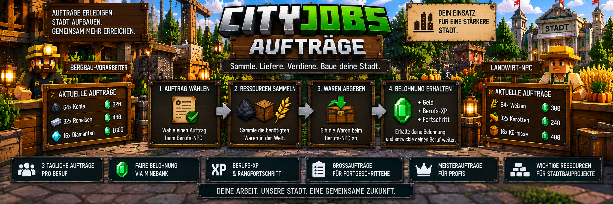

<link rel="stylesheet" href="style.css">



# 📦 CityJobs – Aufträge

Persönliche Lieferaufträge sind ein wichtiger Bestandteil von CityJobs.

Spieler nehmen bei ihrem Berufs-NPC einen Auftrag an, sammeln die verlangten Waren und liefern sie anschließend wieder beim passenden NPC ab.

Als Belohnung erhalten sie:

- 💰 Geld über MineBank
- ⭐ Berufs-XP
- 📈 Fortschritt im aktiven Beruf
- 📖 einen Eintrag in der Lieferhistorie

Die verfügbaren Aufträge richten sich nach dem aktuell aktiven Beruf und dem erreichten Rang.

---

# 🔄 So funktioniert ein Auftrag

Der grundlegende Ablauf ist einfach:

```text
Berufs-NPC aufsuchen
        ↓
Auftrag auswählen
        ↓
Auftrag annehmen
        ↓
Waren sammeln
        ↓
zum Berufs-NPC zurückkehren
        ↓
Waren abgeben
        ↓
MineBank-Auszahlung + Berufs-XP
```

Die Waren müssen sich bei der Abgabe im Inventar des Spielers befinden.

---

# 🧑‍💼 Welcher NPC ist zuständig?

Jeder Beruf besitzt seinen eigenen Berufs-NPC.

| Beruf | Zuständiger NPC |
|---|---|
| ⛏️ Bergarbeiter | Bergbau-Vorarbeiter |
| 🪓 Holzfäller | Holzfäller-NPC |
| 🌾 Landwirt | Landwirt-NPC |

Nur der aktuell aktive Beruf kann für die entsprechenden persönlichen Aufträge verwendet werden.

---

# 📋 Drei aktuelle Angebote

Beim Berufs-NPC werden dem Spieler **drei aktuelle Auftragsangebote** angezeigt.

Die Angebote werden passend zu:

- aktivem Beruf
- aktuellem Rang
- verfügbaren Waren
- Servereinstellungen

erstellt.

Eines der Angebote kann außerdem ein gemischter Auftrag sein.

---

# 📦 Gemischte Aufträge

Ein gemischter Auftrag verlangt zwei unterschiedliche Waren.

Beispiel:

```text
⛏️ Bergarbeiter-Auftrag

32x Roheisen
+
16x Kohle

Belohnung:
💰 Geld
⭐ Berufs-XP
```

Dadurch bestehen nicht alle Aufträge nur aus einer einzigen Ware.

---

# ⛏️ Bergarbeiter-Aufträge

Bergarbeiter können unter anderem Aufträge für folgende Waren erhalten:

- Kohle
- Rohkupfer
- Roheisen
- Rohgold
- Redstone
- Lapislazuli
- Diamanten
- Smaragde

Welche Mengen und Belohnungen angeboten werden, hängt unter anderem vom Rang und den Servereinstellungen ab.

---

# 🪓 Holzfäller-Aufträge

Holzfäller erhalten Aufträge für verschiedene Holzarten.

Dazu gehören:

- Eichenstämme
- Birkenstämme
- Fichtenstämme
- Tropenholzstämme
- Akazienstämme
- Schwarzeichenstämme
- Mangrovenstämme
- Kirschstämme

Mit steigendem Rang können sich die angebotenen Mengen und Belohnungen verändern.

---

# 🌾 Landwirt-Aufträge

Landwirte können Aufträge für zahlreiche landwirtschaftliche Waren erhalten.

Dazu gehören unter anderem:

- Weizen
- Karotten
- Kartoffeln
- Rote Bete
- Melonenscheiben
- Kürbisse
- Süßbeeren
- Leuchtbeeren
- getrockneter Seetang
- Pilze
- Kakaobohnen
- Netherwarzen
- Chorusfrüchte
- Zuckerrohr
- Bambus
- Kakteen

---

# ⭐ Einfluss des Berufs-Rangs

Der aktuelle Berufs-Rang beeinflusst die Aufträge.

CityJobs besitzt fünf Ränge:

| Rang | Benötigte Gesamt-XP |
|---|---:|
| Lehrling | 0 |
| Geselle | 500 |
| Facharbeiter | 2.000 |
| Experte | 6.000 |
| Meister | 15.000 |

Mit höheren Rängen können sich unter anderem verändern:

- verfügbare Waren
- Auftragsmengen
- Berufs-XP
- Stückpreise
- Großaufträge
- Meisteraufträge

Mehr zum Rangsystem findest du unter:

**[Ränge & Berufs-XP](cityjobs-raenge-xp.md)**

---

# 💰 Auszahlung über MineBank

Alle Geldzahlungen von CityJobs laufen über **MineBank**.

Damit ein persönlicher Auftrag erfolgreich abgegeben werden kann, benötigt der Spieler ein gültiges Bankkonto.

Bei erfolgreicher Abgabe:

```text
Waren werden geprüft
        ↓
Waren werden entfernt
        ↓
MineBank-Zahlung
        ↓
Berufs-XP
        ↓
Auftrag abgeschlossen
```

Die Auszahlung wird centgenau über die Bank-Schnittstelle durchgeführt.

---

# 🏦 Kein Bankkonto vorhanden

Besitzt der Spieler kein gültiges MineBank-Konto, kann die normale Auszahlung nicht durchgeführt werden.

CityJobs nimmt in diesem Fall die Waren nicht einfach dauerhaft weg.

Der Spieler muss zunächst ein gültiges Bankkonto besitzen, bevor die entsprechende Lieferung erfolgreich abgeschlossen werden kann.

---

# 📦 Welche Waren werden akzeptiert?

Für persönliche Aufträge müssen die verlangten Waren als normale passende Gegenstände im Spielerinventar vorhanden sein.

Gegenstände mit zusätzlichen ungewöhnlichen NBT-Daten werden für die normale Auftragsabgabe nicht verwendet.

Dadurch wird verhindert, dass besondere oder veränderte Gegenstände versehentlich als normale Lieferware eingezogen werden.

---

# 📥 Auftrag annehmen

Ein Auftrag wird beim passenden Berufs-NPC angenommen.

Nach der Annahme speichert CityJobs die wichtigen Werte des Auftrags.

Dazu gehören unter anderem:

- benötigte Ware
- benötigte Menge
- Belohnung
- Berufs-XP
- zugehöriger Beruf

Dadurch verändert sich ein bereits angenommener Auftrag nicht plötzlich, wenn ein Administrator später die Preise oder Einstellungen ändert.

---

# 💾 Angenommene Aufträge bleiben gespeichert

Ein angenommener Auftrag wird gespeichert.

Dadurch geht der aktive Auftrag nicht einfach verloren, wenn:

- der Spieler den Server verlässt
- der Server neu gestartet wird
- Einstellungen später verändert werden

Die für den Auftrag gespeicherten Werte bleiben erhalten.

---

# ❌ Auftrag abbrechen

Ein bereits angenommener persönlicher Auftrag kann wieder abgebrochen werden.

Vor dem Abbruch muss der Spieler die Aktion bestätigen.

Beim Abbrechen werden **keine Waren aus dem Inventar entfernt**.

Der Auftrag wird lediglich beendet.

---

# 📅 Tägliches Auftragslimit

Standardmäßig können Spieler:

**3 persönliche Aufträge pro Minecraft-Tag**

abschließen.

Das Limit gilt gemeinsam über die verschiedenen Berufe.

Ein Berufswechsel setzt das Tageslimit also nicht zurück.

Beispiel:

```text
Bergarbeiter:
2 Aufträge abgeschlossen

↓ Beruf wechseln ↓

Holzfäller:
noch 1 persönlicher Auftrag möglich
```

Administratoren können das Tageslimit verändern.

---

# ⚙️ Aufträge pro Tag einstellen

Die Standardkonfiguration beträgt:

**3 Aufträge pro Minecraft-Tag**

Administratoren können einen Wert zwischen:

**1 und 100**

festlegen.

Die Einstellung befindet sich in der CityJobs-Verwaltung.

Öffne:

`/cityjobs admin`

und anschließend:

**Einstellungen**

---

# 📈 Belohnungen und Mengen

CityJobs bietet verschiedene Einstellungen für die Auftragsgenerierung.

Standardmäßig gelten unter anderem:

| Einstellung | Standard |
|---|---:|
| Aufträge pro Minecraft-Tag | 3 |
| Belohnung | 100 % |
| Auftragsmenge | 100 % |
| Preisbonus pro Rang | 20 % |
| Auftrags-XP pro Rangstufe | 50 |
| Großauftrag-Chance | 20 % |
| Großauftrag-Mengenfaktor | 3 |
| Großauftrag-Preisbonus | 15 % |
| Meisteraufträge | aktiviert |
| Meisterauftrag-Mengenfaktor | 4 |
| Meisterauftrag-Bonus | 25 % |

Administratoren können diese Werte an ihren Server anpassen.

---

# 📦 Großaufträge

Neben normalen Aufträgen kann CityJobs auch **Großaufträge** erzeugen.

Großaufträge verlangen größere Warenmengen und können zusätzliche Belohnungen bieten.

Standardmäßig beträgt die Chance auf einen Großauftrag:

**20 %**

Der Standard-Mengenfaktor beträgt:

**3**

und der zusätzliche Preisbonus:

**15 %**

---

## Beispiel für einen Großauftrag

Ein normales Angebot könnte beispielsweise eine bestimmte Menge Rohstoffe verlangen.

Ein Großauftrag kann daraus eine deutlich umfangreichere Lieferung machen.

```text
NORMALER AUFTRAG

Ware
↓
normale Menge
↓
normale Belohnung


GROSSAUFTRAG

Ware
↓
größere Menge
↓
zusätzlicher Preisbonus
```

Die genauen Werte hängen von den Einstellungen des Servers und dem erzeugten Auftrag ab.

---

# 👑 Meisteraufträge

Spieler mit dem Rang **Meister** können besondere Meisteraufträge erhalten.

Meister ist mit:

**15.000 Berufs-XP**

der aktuell höchste Rang.

Meisteraufträge können vom Administrator vollständig aktiviert oder deaktiviert werden.

Standardmäßig sind sie aktiviert.

---

## ⚙️ Meisterauftrag-Einstellungen

Standardmäßig gelten:

| Einstellung | Wert |
|---|---:|
| Meisteraufträge | aktiviert |
| Mengenfaktor | 4 |
| zusätzlicher Bonus | 25 % |

Damit können Meister umfangreichere Aufträge mit entsprechenden Belohnungen erhalten.

---

# 🎮 Kreativmodus

Spieler im Kreativmodus können persönliche Aufträge nicht regulär zur Auszahlung einreichen.

Dadurch soll verhindert werden, dass Waren aus dem Kreativmodus für normale wirtschaftliche Aufträge verwendet werden.

---

# 📖 Lieferhistorie

Abgeschlossene Lieferungen werden in der CityJobs-Historie gespeichert.

Spieler können ihre bisherigen Lieferungen über das Berufsbuch ansehen.

Öffne es mit:

`/cityjobs`

Die Lieferhistorie kann unter anderem anzeigen:

- gelieferte Ware
- Menge
- Beruf
- verdientes Geld
- erhaltene Berufs-XP
- Datum der Lieferung

Das gespeicherte Datum wird in UTC geführt.

---

# 📚 Anzahl gespeicherter Lieferungen

Standardmäßig speichert CityJobs:

**50 Historieneinträge**

Administratoren können diesen Wert einstellen.

Möglicher Bereich:

**10 bis 100 Einträge**

Dadurch kann der Server selbst bestimmen, wie umfangreich die sichtbare Lieferhistorie sein soll.

---

# 🏆 Aufträge und Erfolge

Persönliche Aufträge sind außerdem mit dem Erfolgssystem verbunden.

Beispiele:

| Erfolg | Voraussetzung |
|---|---|
| Erster Auftrag | 1 persönlicher Auftrag |
| Zuverlässige Lieferung | 10 persönliche Aufträge |
| Stadtversorger | 100 persönliche Aufträge |
| Meisterlieferant | einen Meisterauftrag abschließen |

Freigeschaltete Erfolge können außerdem als Profiltitel verwendet werden.

---

# 🛡️ Sichere Zahlungsabwicklung

CityJobs besitzt zusätzliche Schutzmechanismen für die Bankabwicklung.

Das ist wichtig, weil bei einer Lieferung sowohl:

- Waren entfernt
- als auch Geld ausgezahlt

werden muss.

CityJobs versucht dabei zu verhindern, dass Spieler durch einen Fehler Waren verlieren oder eine Zahlung mehrfach erhalten.

---

# ↩️ Sauber abgelehnte Zahlung

Wird eine Zahlung von MineBank eindeutig abgelehnt, werden die Waren nicht einfach verloren gegeben.

CityJobs kann die betroffenen Waren an den Spieler zurückgeben.

Damit soll eine fehlgeschlagene Auszahlung nicht gleichzeitig zu einem Warenverlust führen.

---

# ⚠️ Unklarer Zahlungsstatus

In seltenen Fällen kann nach dem Entfernen der Waren nicht eindeutig festgestellt werden, ob die Bankzahlung erfolgreich war.

In diesem Fall erzeugt CityJobs einen:

**Bankprüffall**

Der Spieler kann denselben Vorgang anschließend nicht einfach erneut einreichen.

Dadurch wird verhindert, dass möglicherweise eine doppelte Auszahlung entsteht.

---

# 🔍 Bankprüffall

Ein Administrator kann offene Bankprüffälle über das Admin-Menü kontrollieren.

Öffne:

`/cityjobs admin`

und anschließend:

**Bankprüfung**

Dort können persönliche Auftragszahlungen überprüft werden.

Der Administrator prüft dabei die entsprechende Bankhistorie.

Anschließend kann entschieden werden, ob die Zahlung:

- bereits erfolgreich war
- oder die Waren zurückgegeben werden müssen

---

# ✅ Zahlung als bestätigt markieren

Für persönliche Aufträge steht zusätzlich ein Adminbefehl zur Verfügung:

`/cityjobs zahlung <Spieler> <job> bestaetigt`

Damit kann ein offener persönlicher Bankprüffall nach erfolgreicher Kontrolle als bezahlt bestätigt werden.

---

# ↩️ Waren zurückgeben

Wurde festgestellt, dass keine erfolgreiche Zahlung stattgefunden hat, kann ein Administrator den Prüffall entsprechend auflösen.

Dafür steht bei persönlichen Aufträgen unter anderem zur Verfügung:

`/cityjobs zahlung <Spieler> <job> zurueckgeben`

Damit soll verhindert werden, dass ein Spieler wegen eines technischen Zahlungsproblems seine Waren verliert.

---

# 💾 Aufträge überleben Serverneustarts

Wichtige Auftragsdaten werden in den CityJobs-Weltdaten gespeichert.

Dazu gehören unter anderem:

- aktive persönliche Aufträge
- gespeicherte Auftragswerte
- tägliche Auftragslimits
- Lieferhistorie
- Erfolge
- Bankprüffälle

Dadurch bleibt der Auftragsfortschritt auch nach einem Serverneustart erhalten.

---

# 🏗️ Persönliche Aufträge und Stadtbauprojekte

Persönliche Aufträge sind nicht dasselbe wie Stadtbauprojekte.

Bei persönlichen Aufträgen arbeitet der Spieler für seinen eigenen Berufsfortschritt und seine eigene Belohnung.

Stadtbauprojekte verfolgen dagegen ein gemeinsames Ziel für die Stadt.

Beispiel:

```text
PERSÖNLICHER AUFTRAG

Spieler
↓
Berufs-NPC
↓
Waren liefern
↓
persönliche Belohnung


STADTBAUPROJEKT

viele Spieler
↓
verschiedene Berufe
↓
Baumaterial liefern
↓
gemeinsames Gebäude entsteht
```

---

# 🤝 Unterschied zu Gemeinschaftsaufträgen

Neben persönlichen Aufträgen gibt es **Gemeinschaftsaufträge**.

Diese sind serverweit und können von mehreren Spielern gemeinsam erfüllt werden.

Persönliche Aufträge gehören dagegen immer einem einzelnen Spieler.

| Persönliche Aufträge | Gemeinschaftsaufträge |
|---|---|
| einzelner Spieler | serverweit |
| persönliches Angebot | gemeinsames Ziel |
| Auftrag wird angenommen | Spieler tragen Waren bei |
| Tageslimit | eigener Projektfortschritt |
| persönliche Lieferhistorie | gemeinsamer Fortschritt |
| Geld + Berufs-XP | Geld + Berufs-XP pro Beitrag |

Mehr zu den serverweiten Aufträgen findest du auf der nächsten Seite:

**[Gemeinschaftsaufträge](cityjobs-gemeinschaft.md)**

---

# 💡 Kurz erklärt

Der normale persönliche Auftragsablauf lautet:

```text
1. Beruf auswählen

2. passenden Berufs-NPC aufsuchen

3. eines der aktuellen Angebote auswählen

4. Auftrag annehmen

5. benötigte Waren sammeln

6. Waren im Inventar mitbringen

7. zum Berufs-NPC zurückkehren

8. Auftrag abgeben

9. MineBank-Auszahlung erhalten

10. Berufs-XP erhalten

11. Lieferung wird in der Historie gespeichert
```

Mit höheren Berufs-Rängen werden weitere und größere Auftragsmöglichkeiten interessant.

So verbindet CityJobs das Sammeln von Rohstoffen mit Berufsentwicklung und der Wirtschaft des Servers.

---

[← Zurück: Ränge & Berufs-XP](cityjobs-raenge-xp.md) | [Weiter: Gemeinschaftsaufträge →](cityjobs-gemeinschaft.md)
