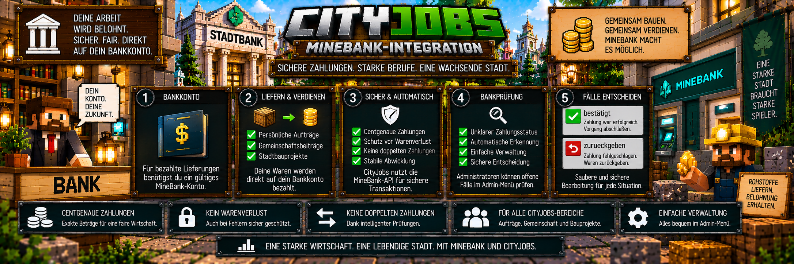

<link rel="stylesheet" href="style.css">



# 🏦 CityJobs – MineBank-Integration

CityJobs verwendet **MineBank** für seine komplette Geldabwicklung.

CityJobs entscheidet dabei, wie hoch eine Belohnung ausfällt. Die eigentliche Auszahlung wird anschließend über die Bank-Schnittstelle von MineBank durchgeführt.

Die Integration wird unter anderem verwendet für:

- 📦 persönliche Aufträge
- 🤝 Gemeinschaftsbeiträge
- 🏗️ Stadtbauprojekte
- 💰 centgenaue Auszahlungen
- 🔐 sichere Zahlungsabwicklung
- 🔍 Bankprüffälle

Dadurch werden die Berufs- und Auftragssysteme direkt mit der Wirtschaft des Servers verbunden.

---

# 📦 Benötigte MineBank-Version

CityJobs 1.0.0 benötigt:

**MineBank / BankMod ab Version 1.0.0.1**

MineBank ist eine erforderliche Abhängigkeit von CityJobs.

Im Gegensatz zu CityShops ist MineBank also nicht nur eine optionale Erweiterung.

---

# 💳 Bankkonto erforderlich

Für bezahlte Lieferungen benötigt der Spieler ein gültiges MineBank-Konto.

Ohne Bankkonto kann CityJobs die entsprechende Auszahlung nicht normal durchführen.

Das betrifft unter anderem:

```text
📦 persönliche Aufträge

🤝 Gemeinschaftsbeiträge

🏗️ Lieferungen für Stadtbauprojekte
```

Der Spieler sollte deshalb ein Bankkonto besitzen, bevor er bezahlte CityJobs-Lieferungen abgibt.

---

# 💰 Centgenaue Zahlungen

CityJobs arbeitet bei Geldbeträgen mit **Cent**.

Dadurch können auch genaue Geldwerte verarbeitet werden.

Beispiel:

```text
100 Cent
=
1,00

250 Cent
=
2,50

1.275 Cent
=
12,75
```

CityJobs berechnet die Belohnung und übergibt den entsprechenden Betrag anschließend an MineBank.

---

# 🔄 Grundprinzip

Die Zusammenarbeit zwischen CityJobs und MineBank funktioniert vereinfacht so:

```text
Spieler erfüllt CityJobs-Aufgabe
        ↓
CityJobs prüft die Lieferung
        ↓
CityJobs berechnet die Belohnung
        ↓
MineBank-Zahlung wird ausgelöst
        ↓
Zahlungsstatus wird geprüft
        ↓
Vorgang wird abgeschlossen
```

Dadurch bleiben Berufslogik und Banklogik voneinander getrennt.

---

# 📦 Persönliche Aufträge

Persönliche Lieferaufträge verwenden MineBank für die Auszahlung.

Der normale Ablauf:

```text
Auftrag annehmen
        ↓
Waren sammeln
        ↓
zum Berufs-NPC zurückkehren
        ↓
Waren werden geprüft
        ↓
Waren werden entfernt
        ↓
MineBank-Auszahlung
        ↓
Berufs-XP
        ↓
Auftrag abgeschlossen
```

Die Auszahlung erfolgt auf das Bankkonto des Spielers.

---

# 🏦 Kein Bankkonto bei persönlichem Auftrag

Besitzt der Spieler kein gültiges Bankkonto, kann die normale Auszahlung nicht abgeschlossen werden.

CityJobs soll in diesem Fall nicht einfach die Waren dauerhaft einziehen und den Spieler ohne Bezahlung zurücklassen.

Das Bankkonto ist deshalb eine Voraussetzung für die bezahlte Lieferung.

---

# 🤝 Gemeinschaftsbeiträge

Auch Gemeinschaftsprojekte verwenden MineBank.

Bei einem gültigen Beitrag erhält der Spieler seine Belohnung direkt.

Beispiel:

```text
Gemeinschaftsprojekt
        ↓
64x Roheisen beitragen
        ↓
Beitrag wird geprüft
        ↓
Waren werden angenommen
        ↓
MineBank-Auszahlung
        ↓
Berufs-XP
        ↓
Gemeinschaftsfortschritt steigt
```

Der Spieler muss nicht warten, bis das komplette Gemeinschaftsprojekt abgeschlossen wurde.

---

# 🏗️ Stadtbauprojekte

MineBank wird außerdem für bezahlte Materiallieferungen an Stadtbauprojekte verwendet.

Dazu gehören beispielsweise:

- 🏛️ Rathaus
- 🏦 Stadtbank
- 🏠 eigene Gebäudevorlagen

Spieler liefern die benötigten Materialien über ihre Berufs-NPCs.

CityJobs berechnet die vorgesehene Belohnung und MineBank übernimmt die Geldzahlung.

---

# 💵 Projektbelohnungen

Öffentliche Bauprojekte können einen zusätzlichen Preisbonus verwenden.

Standardmäßig beträgt dieser:

**+50 %**

Die Preisberechnung erfolgt durch CityJobs.

Die daraus entstehende Geldzahlung wird anschließend über MineBank abgewickelt.

---

# 🛡️ Warum gibt es eine besondere Zahlungsabsicherung?

Bei CityJobs müssen bei vielen Vorgängen zwei Dinge zusammenpassen:

```text
1. Ware entfernen

2. Geld auszahlen
```

Das klingt zunächst einfach.

Bei einem technischen Problem könnte jedoch beispielsweise folgende Situation entstehen:

```text
Ware wurde entfernt
        ↓
Bankantwort unklar
        ↓
CityJobs weiß nicht sicher,
ob die Zahlung angekommen ist
```

CityJobs besitzt deshalb zusätzliche Schutzmechanismen.

---

# 🔐 Ziel der Zahlungsabsicherung

Das System soll insbesondere verhindern, dass:

- Waren ohne Bezahlung verloren gehen
- Spieler doppelt bezahlt werden
- ein unklarer Vorgang mehrfach eingereicht wird
- Bankprobleme unbemerkt bleiben

Dafür unterscheidet CityJobs zwischen eindeutigem und unklarem Zahlungsstatus.

---

# ❌ Zahlung eindeutig abgelehnt

Wenn MineBank eine Zahlung eindeutig ablehnt, ist bekannt, dass keine erfolgreiche Auszahlung stattgefunden hat.

CityJobs kann den Vorgang entsprechend sauber behandeln.

Wurden bereits Waren entfernt, sollen diese wieder zurückgegeben werden.

Vereinfacht:

```text
Waren entfernt
        ↓
MineBank-Zahlung
        ↓
eindeutig abgelehnt
        ↓
Waren zurückgeben
        ↓
keine Auszahlung
```

Dadurch soll der Spieler wegen einer klar fehlgeschlagenen Zahlung keine Waren verlieren.

---

# ⚠️ Unklarer Zahlungsstatus

Problematischer ist eine Situation, in der CityJobs nicht sicher feststellen kann, ob die Zahlung erfolgreich war.

Beispiel:

```text
Waren entfernt
        ↓
MineBank-Zahlung ausgelöst
        ↓
Status nicht eindeutig
        ↓
?
```

In diesem Fall darf CityJobs nicht einfach:

- noch einmal bezahlen
- oder automatisch davon ausgehen, dass keine Zahlung erfolgt ist

Sonst könnte eine doppelte Auszahlung entstehen.

---

# 🔍 Bankprüffall

Bei einem unklaren Zahlungsstatus kann CityJobs einen:

**Bankprüffall**

erstellen.

Der Vorgang wird damit für eine spätere Kontrolle gespeichert.

```text
Unklarer Zahlungsstatus
        ↓
Bankprüffall
        ↓
Spieler kann Vorgang
nicht einfach erneut einreichen
        ↓
Administrator prüft Fall
        ↓
Fall wird entschieden
```

---

# 🚫 Keine erneute Einreichung

Solange ein entsprechender Bankprüffall offen ist, kann der Spieler den betroffenen Vorgang nicht einfach erneut einreichen.

Das ist wichtig, weil möglicherweise bereits eine Zahlung stattgefunden hat.

Ohne diese Sperre könnte folgende Situation entstehen:

```text
erste Zahlung möglicherweise erfolgreich
        ↓
Spieler reicht erneut ein
        ↓
zweite Zahlung
        ↓
Doppelzahlung
```

Die Sperre verhindert genau dieses Problem.

---

# 🛠️ Bankprüfung öffnen

Administratoren können offene Bankprüffälle über das CityJobs-Adminmenü verwalten.

Öffne:

`/cityjobs admin`

und anschließend:

**Bankprüfung**

Dort können offene Fälle kontrolliert werden.

---

# 📋 Welche Bereiche können Bankprüffälle erzeugen?

Die Bankprüfung ist nicht nur für persönliche Aufträge vorgesehen.

Sie kann Fälle aus mehreren CityJobs-Systemen enthalten:

- 📦 persönliche Aufträge
- 🤝 Gemeinschaftsbeiträge
- 🏗️ Bauprojektlieferungen

Dadurch gibt es einen zentralen Bereich für problematische CityJobs-Zahlungen.

---

# 🔎 Was muss der Administrator prüfen?

Bei einem offenen Fall sollte der Administrator die entsprechende Bankhistorie kontrollieren.

Die entscheidende Frage lautet:

**Hat der Spieler die Zahlung tatsächlich erhalten?**

Danach kann der Fall entsprechend abgeschlossen werden.

---

# ✅ Zahlung war erfolgreich

Zeigt die Bankhistorie, dass die Zahlung erfolgreich ausgeführt wurde, darf der Spieler natürlich nicht noch einmal bezahlt werden.

Der Fall wird dann als bereits bezahlt beziehungsweise bestätigt behandelt.

Bei persönlichen Aufträgen steht dafür ein Adminbefehl zur Verfügung.

---

# ⌨️ Persönliche Zahlung bestätigen

Für persönliche Aufträge kann ein Administrator verwenden:

`/cityjobs zahlung <Spieler> <job> bestaetigt`

Beispiel:

```text
/cityjobs zahlung Spielername bergarbeiter bestaetigt
```

Damit wird der entsprechende offene persönliche Zahlungsfall nach der Kontrolle als bestätigt behandelt.

---

# ↩️ Zahlung war nicht erfolgreich

Ergibt die Prüfung, dass keine erfolgreiche Zahlung stattgefunden hat, dürfen die entfernten Waren nicht einfach verloren bleiben.

Der Fall kann deshalb entsprechend auf Rückgabe gesetzt werden.

---

# ⌨️ Waren zurückgeben

Für persönliche Aufträge steht dafür zur Verfügung:

`/cityjobs zahlung <Spieler> <job> zurueckgeben`

Beispiel:

```text
/cityjobs zahlung Spielername bergarbeiter zurueckgeben
```

Damit wird der persönliche Zahlungsfall entsprechend aufgelöst und die betroffenen Waren können zurückgegeben werden.

---

# ⚠️ Nicht einfach raten

Ein offener Bankprüffall sollte nicht ohne Kontrolle bestätigt oder zurückgegeben werden.

Prüfe zuerst die entsprechende Bankhistorie.

Das verhindert:

```text
Zahlung war erfolgreich
+
Waren werden trotzdem zurückgegeben
=
unbeabsichtigter Vorteil
```

oder:

```text
Zahlung war nicht erfolgreich
+
Fall wird als bezahlt bestätigt
=
Spieler verliert Waren
```

Die Bankprüfung dient genau dazu, beide Situationen zu vermeiden.

---

# 🤝 Gemeinschafts-Bankprüffälle

Auch bei Gemeinschaftsbeiträgen kann ein unklarer Zahlungsstatus auftreten.

Diese Fälle werden über den Bereich:

**Bankprüfung**

im Admin-Menü behandelt.

Für diese Fälle ist die Admin-Verwaltung der zentrale Weg.

---

# 🏗️ Bauprojekt-Bankprüffälle

Dasselbe gilt für Lieferungen an Stadtbauprojekte.

Wenn bei einer Materiallieferung ein unklarer Zahlungsstatus entsteht, kann der entsprechende Fall ebenfalls in der Bankprüfung erscheinen.

Dadurch wird auch bei großen Bauprojekten verhindert, dass Spieler:

- Waren verlieren
- doppelt bezahlt werden
- denselben Vorgang mehrfach auslösen

---

# 🧑‍💼 Admin-Menü

Die Bankprüfung ist einer der sieben Hauptbereiche der CityJobs-Verwaltung.

Öffne:

`/cityjobs admin`

Dort stehen aktuell folgende Bereiche zur Verfügung:

1. Einstellungen
2. Preise
3. Spieler
4. NPCs
5. Bankprüfung
6. Bauprojekte
7. Diagnose

Für Zahlungsprobleme ist der Bereich **Bankprüfung** zuständig.

---

# 🔎 Diagnose

Zusätzlich besitzt CityJobs einen Diagnosebereich.

Öffne:

`/cityjobs admin`

und anschließend:

**Diagnose**

Dort können Administratoren unter anderem Informationen zu offenen Bankfällen einsehen.

Die Diagnose dient nur zur Kontrolle.

Sie verändert keine Bank-, Spieler- oder Projektdaten.

---

# 💾 Bankprüffälle bleiben gespeichert

Offene Bankprüffälle gehören zu den gespeicherten CityJobs-Daten.

Dadurch verschwinden sie nicht einfach durch einen Serverneustart.

Beispiel:

```text
Offener Bankprüffall
        ↓
Server wird neu gestartet
        ↓
CityJobs lädt Weltdaten
        ↓
Bankprüffall weiterhin vorhanden
        ↓
Administrator kann ihn prüfen
```

Das ist wichtig, damit ungeklärte Zahlungen nicht durch einen Neustart vergessen werden.

---

# 🔄 Beispiel: erfolgreiche Zahlung

Ein normaler erfolgreicher Vorgang:

```text
32x Roheisen
        ↓
Auftrag wird abgegeben
        ↓
Waren werden geprüft
        ↓
Waren werden entfernt
        ↓
MineBank erhält Zahlungsauftrag
        ↓
Zahlung erfolgreich
        ↓
Spieler erhält Geld
        ↓
Berufs-XP
        ↓
Auftrag abgeschlossen
```

Hier ist keine Bankprüfung notwendig.

---

# ❌ Beispiel: Zahlung klar fehlgeschlagen

```text
32x Roheisen
        ↓
Waren werden verarbeitet
        ↓
MineBank-Zahlung
        ↓
eindeutig fehlgeschlagen
        ↓
keine erfolgreiche Auszahlung
        ↓
Waren zurückgeben
```

Der Vorgang kann sauber beendet werden, weil der Zahlungsstatus eindeutig ist.

---

# ⚠️ Beispiel: Zahlung unklar

```text
32x Roheisen
        ↓
Waren werden entfernt
        ↓
MineBank-Zahlung ausgelöst
        ↓
Antwort nicht eindeutig
        ↓
⚠ Bankprüffall
        ↓
erneute Einreichung gesperrt
        ↓
Administrator prüft Bankhistorie
```

Danach gibt es zwei Möglichkeiten.

---

# ✅ Möglichkeit 1: Zahlung gefunden

```text
Bankhistorie prüfen
        ↓
Zahlung vorhanden
        ↓
Fall bestätigen
        ↓
keine zweite Auszahlung
        ↓
Vorgang abgeschlossen
```

Bei persönlichen Aufträgen:

`/cityjobs zahlung <Spieler> <job> bestaetigt`

---

# ↩️ Möglichkeit 2: Keine Zahlung gefunden

```text
Bankhistorie prüfen
        ↓
keine Zahlung vorhanden
        ↓
Fall auf Rückgabe setzen
        ↓
Waren zurückgeben
        ↓
Vorgang abgeschlossen
```

Bei persönlichen Aufträgen:

`/cityjobs zahlung <Spieler> <job> zurueckgeben`

---

# 💰 CityJobs berechnet – MineBank bezahlt

Die Aufgaben der beiden Mods sind klar getrennt.

## CityJobs

CityJobs verwaltet unter anderem:

- Berufe
- Berufs-XP
- Aufträge
- Liefermengen
- Preise
- Boni
- Gemeinschaftsprojekte
- Stadtbauprojekte
- Zahlungsstatus
- Bankprüffälle

## MineBank

MineBank übernimmt die eigentliche Bank- und Geldabwicklung.

Vereinfacht:

```text
CITYJOBS
berechnet Belohnung
        ↓
MINEBANK
führt Zahlung aus
        ↓
CITYJOBS
prüft Ergebnis
```

---

# 🏪 CityShops ist davon getrennt

CityShops kann optional für bestimmte Preisermittlungen verwendet werden.

Es übernimmt jedoch nicht die CityJobs-Bankzahlung.

Die Rollen sind damit:

```text
CityJobs
Berufe + Aufträge + Belohnungen

MineBank
Bankkonten + Zahlungen

CityShops
optionale Marktpreisquelle
```

CityShops ist optional.

MineBank ist für CityJobs erforderlich.

---

# 🏦 Die CityJobs-Stadtbank

CityJobs besitzt außerdem ein eigenes Bauprojekt für eine moderne Stadtbank.

Dieses Gebäude darf nicht mit der MineBank-Abhängigkeit verwechselt werden.

Das CityJobs-Bauprojekt erstellt das **Gebäude**.

Ein funktionierender MineBank-ATM wird dabei nicht automatisch gesetzt.

---

# 🏧 ATM selbst einrichten

Die CityJobs-Stadtbank besitzt eine vorgesehene freie ATM-Nische.

Nach Fertigstellung kann der Administrator dort selbst die gewünschte MineBank-Einrichtung ergänzen.

Damit bleibt die Gestaltung des eigentlichen Bankbetriebs flexibel.

---

# 🛡️ Warum das System wichtig ist

Ohne eine abgesicherte Verarbeitung könnte bei Netzwerk-, API- oder Serverproblemen schwer festzustellen sein, ob eine Zahlung tatsächlich stattgefunden hat.

CityJobs versucht deshalb nicht, einen unklaren Zustand einfach zu erraten.

Stattdessen gilt:

```text
eindeutig erfolgreich
→ Vorgang abschließen

eindeutig fehlgeschlagen
→ Waren schützen / zurückgeben

unklar
→ Bankprüffall
```

Damit steht die Sicherheit der Spielerwaren und der Serverwirtschaft im Mittelpunkt.

---

# 👑 Adminrechte

Die Verwaltung von Bankprüffällen ist für Administratoren vorgesehen.

Die entsprechenden CityJobs-Adminfunktionen benötigen:

**Berechtigungsstufe 2 beziehungsweise OP-Rechte**

Normale Spieler können offene Bankprüffälle nicht selbst administrativ bestätigen oder zurückgeben.

---

# 💡 Kurz erklärt

Die MineBank-Integration funktioniert so:

```text
1. Spieler besitzt ein gültiges MineBank-Konto

2. Spieler erfüllt eine bezahlte CityJobs-Lieferung

3. CityJobs prüft Waren und Voraussetzungen

4. CityJobs berechnet die Belohnung

5. MineBank führt die Zahlung aus

6. CityJobs prüft den Zahlungsstatus

7. Zahlung erfolgreich:
   Vorgang abschließen

8. Zahlung eindeutig fehlgeschlagen:
   Waren schützen beziehungsweise zurückgeben

9. Zahlungsstatus unklar:
   Bankprüffall erstellen

10. erneute Einreichung verhindern

11. Administrator öffnet /cityjobs admin

12. Bankprüfung auswählen

13. Bankhistorie kontrollieren

14. Zahlung vorhanden:
    Fall bestätigen

15. Zahlung nicht vorhanden:
    Waren zurückgeben

16. Fall ist sauber abgeschlossen
```

So verbindet CityJobs seine Berufs- und Auftragssysteme mit MineBank, ohne bei einem unklaren Zahlungsstatus einfach Waren oder Geld zu riskieren.

---

[← Zurück: Preise & Wirtschaft](cityjobs-preise.md) | [Weiter: Adminverwaltung →](cityjobs-admin.md)
