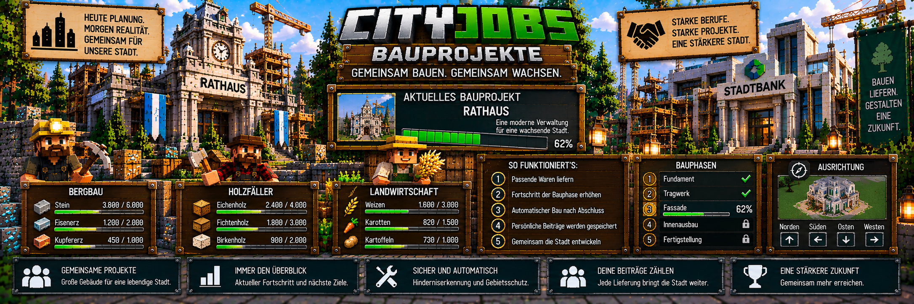

<link rel="stylesheet" href="style.css">



# 🏗️ CityJobs – Bauprojekte

Mit den **Stadtbauprojekten** können Spieler gemeinsam große Gebäude für ihre Stadt errichten.

Die benötigten Rohstoffe werden von den passenden Berufen geliefert. Sobald genügend Materialien vorhanden sind, baut CityJobs das Gebäude schrittweise direkt in der Minecraft-Welt auf.

CityJobs 1.0.0 unterstützt unter anderem:

- 🏛️ ein modernes Rathaus
- 🏦 eine moderne Stadtbank
- 🏠 eigene gespeicherte Gebäudevorlagen

Dadurch werden Berufe, Wirtschaft und die Entwicklung der Stadt direkt miteinander verbunden.

---

# 🌆 Gemeinsam die Stadt aufbauen

Ein Stadtbauprojekt wird von einem Administrator gestartet.

Anschließend können Spieler über ihre Berufs-NPCs die benötigten Materialien liefern.

Der grundlegende Ablauf:

```text
Administrator startet Bauprojekt
        ↓
Standort und Ausrichtung festlegen
        ↓
Vorschau kontrollieren
        ↓
Projekt bestätigen
        ↓
Spieler liefern Materialien
        ↓
Baufortschritt steigt
        ↓
CityJobs baut schrittweise
        ↓
Gebäude wird fertiggestellt
```

Das Projekt bleibt während des gesamten Vorgangs gespeichert.

---

# 👷 Welche Berufe liefern Materialien?

Für die Stadtbauprojekte werden die bereits vorhandenen CityJobs-Berufe verwendet.

Aktuell gibt es:

- ⛏️ Bergarbeiter
- 🪓 Holzfäller
- 🌾 Landwirt

Je nach Bauprojekt werden unterschiedliche Materialien benötigt.

Vor allem Bergarbeiter und Holzfäller liefern viele der klassischen Baustoffe.

Ein eigener Bauarbeiter-Beruf wird dafür nicht benötigt.

---

# 📦 Materialien liefern

Spieler liefern benötigte Materialien über den passenden **Berufs-NPC**.

Dabei muss der Spieler den entsprechenden aktiven Beruf besitzen.

Beispiel:

```text
⛏️ Bergarbeiter
        ↓
Bergbau-Vorarbeiter
        ↓
benötigte Baustoffe ansehen
        ↓
Materialien liefern
        ↓
Projektfortschritt steigt
```

Andere Berufe funktionieren nach demselben Grundprinzip mit ihren jeweils passenden Materialien.

---

# 💰 Bezahlung für Projektlieferungen

Lieferungen für Stadtbauprojekte können über MineBank bezahlt werden.

CityJobs verwendet dafür seine Wirtschaftsintegration und die für das Projekt bestimmten Preise.

Die Zahlung erfolgt über die Bank-Schnittstelle.

Besitzt ein Spieler kein gültiges Bankkonto, können bezahlte Lieferungen nicht normal abgeschlossen werden.

---

# 💵 Projektbonus

Öffentliche Bauprojekte besitzen standardmäßig einen zusätzlichen Preisbonus.

Der Standardwert beträgt:

**+50 %**

auf den für das Projekt bestimmten Marktpreis.

Administratoren können diesen Wert verändern.

Damit sollen große Stadtprojekte für Spieler wirtschaftlich interessant bleiben.

---

# 🏪 Optionale CityShops-Preise

Ist CityShops installiert, kann CityJobs optional Preise aus CityShops berücksichtigen.

Dabei werden nur passende aktive **Admin-Ankaufshops** verwendet.

CityShops ist für CityJobs jedoch **nicht erforderlich**.

Ohne CityShops verwendet CityJobs weiterhin seine eigenen konfigurierten Grundpreise.

Mehr dazu findest du später unter:

**[Preise & Wirtschaft](cityjobs-preise.md)**

---

# 🏛️ Modernes Rathaus

Eines der großen vorgefertigten CityJobs-Projekte ist das **moderne Rathaus**.

Das Rathaus besitzt eine Größe von:

**35 × 27 × 17 Blöcken**

Es wird nicht sofort vollständig in die Welt gesetzt.

Stattdessen entsteht es schrittweise über mehrere Bauphasen.

---

# 🚧 Baustelle

Bevor das eigentliche Rathaus fertiggestellt wird, beginnt das Projekt mit einer Baustellensituation.

Danach folgen die einzelnen Bauphasen.

Dadurch entsteht das Gebäude sichtbar Schritt für Schritt und nicht plötzlich als vollständig fertiges Bauwerk.

---

# 🏛️ Rathaus-Bauphasen

Das Rathaus besitzt vier Hauptphasen:

| Phase | Bauabschnitt |
|---:|---|
| 1 | Fundament |
| 2 | Tragwerk |
| 3 | Fassade und Dach |
| 4 | Einrichtung und Vorplatz |

Jede Phase benötigt die entsprechenden Materialien.

---

# 1️⃣ Fundament

Die erste eigentliche Bauphase bildet das **Fundament**.

Hier entsteht die Grundlage für das spätere Rathaus.

Spieler liefern die benötigten Rohstoffe über ihre Berufs-NPCs.

Sobald die Voraussetzungen erfüllt sind, kann CityJobs mit dem entsprechenden Bauabschnitt beginnen.

---

# 2️⃣ Tragwerk

Nach dem Fundament folgt das **Tragwerk**.

In dieser Phase nimmt das Rathaus zunehmend seine endgültige Form an.

Weitere Rohstoffe werden benötigt und durch die Spieler geliefert.

---

# 3️⃣ Fassade und Dach

Die dritte Phase umfasst:

- Fassade
- Außenwände
- Dachbereiche

Das Gebäude wirkt dadurch bereits weitgehend fertig.

---

# 4️⃣ Einrichtung und Vorplatz

In der letzten Rathausphase werden:

- Innenbereiche
- Einrichtung
- Vorplatz

fertiggestellt.

Nach Abschluss dieser Phase ist das Rathaus vollständig errichtet.

---

# 🏦 Moderne Stadtbank

Neben dem Rathaus besitzt CityJobs ein zweites großes vorgefertigtes Gebäude:

**die moderne Stadtbank**

Die Stadtbank besitzt eine Größe von:

**33 × 29 × 12 Blöcken**

---

# 🏦 Bereiche der Stadtbank

Die Stadtbank enthält unter anderem:

- Schalterhalle
- Beratungsbereich
- Wartebereich
- Tresorbereich
- beleuchtete freie ATM-Nische

Damit kann die Bank anschließend passend für den Server eingerichtet werden.

---

# 🏧 MineBank-ATM

CityJobs platziert **keinen funktionierenden MineBank-ATM automatisch**.

Die vorgesehene ATM-Nische bleibt frei.

Ein Administrator kann dort anschließend selbst den gewünschten MineBank-ATM beziehungsweise die entsprechenden Bankfunktionen einrichten.

Dadurch bleiben CityJobs und MineBank technisch getrennte Systeme.

---

# 👤 Bank-NPCs

Auch Bank-NPCs oder andere zusätzliche Bankfunktionen werden nicht automatisch durch das CityJobs-Bauprojekt eingerichtet.

Diese können nach Fertigstellung passend zum verwendeten Banksystem eingerichtet werden.

---

# 🔄 Nachrüstung älterer Stadtbanken

Bereits mit älteren CityJobs-Versionen fertiggestellte Stadtbanken können eine Innenraum-Nachrüstung erhalten.

CityJobs kann dabei die neuere Inneneinrichtung ergänzen.

Das System versucht vorhandene Änderungen zu schützen.

Positionen werden übersprungen, wenn dort beispielsweise:

- eigene Änderungen
- BlockEntities
- Spieler
- NPCs

eine sichere Änderung verhindern.

Der Fortschritt der Nachrüstung bleibt über Serverneustarts erhalten.

---

# 🏛️ Ältere Rathäuser

Auch für ältere Rathaus-Projekte stehen Verwaltungsfunktionen zur Verfügung.

Diese können über den Bereich **Bauprojekte** im Admin-Menü erreicht werden.

Dadurch können bestehende CityJobs-Projekte weiterhin mit neueren Funktionen verwaltet werden.

---

# 🧭 Standort auswählen

Ein neues Bauprojekt wird durch einen Administrator an einem geeigneten Standort vorbereitet.

Öffne:

`/cityjobs admin`

und anschließend:

**Bauprojekte**

Dort kann das gewünschte Gebäudeprojekt ausgewählt werden.

---

# 👁️ Vorschau

Bevor ein Bauprojekt endgültig gestartet wird, zeigt CityJobs eine Vorschau.

Damit kann der Administrator kontrollieren:

- Position
- Ausrichtung
- benötigte Fläche
- mögliche Hindernisse

Erst danach wird das Projekt bestätigt.

---

# 🧱 Rathaus-Vorschau

Bei der Rathaus-Vorschau wird die nordwestliche Ecke anhand der Position unter dem Administrator bestimmt.

Dadurch kann der Standort vor der endgültigen Bestätigung kontrolliert werden.

---

# 🧭 Vier Ausrichtungen

Vorgefertigte Bauprojekte können in vier horizontalen Richtungen ausgerichtet werden.

Dadurch kann ein Gebäude passend zum Straßennetz oder zur Stadtplanung gesetzt werden.

Die Ausrichtung wird vor dem endgültigen Start festgelegt.

---

# ✅ Standortprüfung

CityJobs prüft den vorgesehenen Bereich, bevor ein Projekt gestartet wird.

Der Projektbereich muss unter anderem:

- vollständig geladen sein
- innerhalb der Weltgrenze liegen
- ausreichend Platz besitzen
- für das Projekt geeignet sein

Dadurch sollen problematische Bauplätze bereits vor dem eigentlichen Bau erkannt werden.

---

# 🚫 Problematische Inhalte

Ein Bauprojekt kann nicht einfach über ungeeignete Bereiche gesetzt werden.

CityJobs prüft unter anderem auf problematische Inhalte wie:

- BlockEntities
- Flüssigkeiten
- Tiere
- NPCs

Dadurch wird verhindert, dass wichtige Inhalte einfach durch ein neues Stadtprojekt überschrieben werden.

---

# 🟧 Hinderniserkennung

Während eines aktiven Projekts kann CityJobs Hindernisse erkennen.

Wird ein Problem festgestellt, kann das betroffene Hindernis für Administratoren mit einer **orangenen Markierung** angezeigt werden.

Dadurch lässt sich die problematische Stelle leichter finden.

---

# 🛠️ Hindernisse als Administrator beheben

Ein OP kann ein gemeldetes Hindernis kontrollieren und gegebenenfalls entfernen.

Anschließend kann das Bauprojekt fortgesetzt werden.

Dadurch muss ein großes Projekt wegen eines einzelnen problematischen Blocks nicht vollständig neu gestartet werden.

---

# ⏸️ Bauprojekt pausieren

Administratoren können ein aktives Bauprojekt pausieren.

Öffne:

`/cityjobs admin`

und anschließend:

**Bauprojekte**

Dort stehen Funktionen zum Pausieren und Fortsetzen des aktuellen Projekts zur Verfügung.

---

# ▶️ Bauprojekt fortsetzen

Ein pausiertes Projekt kann später wieder fortgesetzt werden.

Der bisherige Fortschritt bleibt erhalten.

Beispiel:

```text
Projektfortschritt
62 %

↓ Projekt pausieren ↓

Server läuft weiter

↓ später fortsetzen ↓

Projektfortschritt
62 %

↓ Weiterbau ↓
```

Das Projekt beginnt also nicht wieder von vorne.

---

# ⚙️ Schrittweiser automatischer Bau

CityJobs setzt große Gebäude nicht komplett in einem einzigen Moment.

Stattdessen wird der Bau schrittweise ausgeführt.

Standardmäßig verarbeitet CityJobs:

**4 Blöcke pro Tick**

Administratoren können diesen Wert anpassen.

Der mögliche Bereich liegt bei:

**1 bis 64 Blöcken pro Tick**

---

# 🚀 Baugeschwindigkeit

Ein höherer Wert kann Gebäude schneller entstehen lassen.

Ein niedrigerer Wert verteilt den Aufbau stärker über mehrere Ticks.

Die passende Einstellung hängt unter anderem von der Serverleistung und der gewünschten Baugeschwindigkeit ab.

Standard:

```text
Rathaus-Blöcke pro Tick:
4
```

---

# 💾 Neustartsicherer Baufortschritt

Der Fortschritt eines aktiven Bauprojekts wird gespeichert.

Dadurch kann ein teilweise gebautes Gebäude nach einem Serverneustart weitergeführt werden.

Beispiel:

```text
Bauphase 3
Fortschritt 47 %

↓ Serverneustart ↓

Bauphase 3
Fortschritt 47 %

↓ Projekt läuft weiter ↓
```

Das gilt auch für wichtige interne Projekt- und Nachrüstungsfortschritte.

---

# 🛡️ Schutz des aktiven Projektbereichs

Solange ein Stadtbauprojekt noch nicht abgeschlossen ist, wird der Projektbereich geschützt.

Normale Spieler sollen den laufenden Bau nicht einfach verändern oder zerstören können.

Geschützt werden unter anderem normale Blockänderungen im aktiven Projektbereich.

---

# 💥 Explosionsschutz

Auch Explosionen werden beim Schutz eines aktiven, noch nicht abgeschlossenen Projektbereichs berücksichtigt.

Dadurch kann beispielsweise eine Explosion nicht einfach Teile des laufenden Bauprojekts zerstören.

---

# 👑 OP-Rechte

Administratoren beziehungsweise OPs besitzen weiterhin die notwendigen Möglichkeiten zur Verwaltung des Projekts.

Sie können beispielsweise gemeldete Hindernisse bearbeiten und das Projekt über die Admin-Verwaltung kontrollieren.

---

# 🏁 Nach Fertigstellung

Sobald ein Gebäude vollständig abgeschlossen wurde, gilt es nicht mehr als aktive Baustelle.

Ein fertiggestelltes Gebäude kann anschließend von OPs bearbeitet werden.

Damit kann der Server das fertige Gebäude später noch anpassen oder erweitern.

---

# 📊 Persönliche Beiträge

CityJobs speichert bei Bauprojekten auch die persönlichen Beiträge der Spieler.

Dadurch kann nachvollzogen werden, wer Materialien zum Projekt geliefert hat.

Das verbindet die individuelle Arbeit mit dem Fortschritt der gesamten Stadt.

---

# 👷 Beispiel

Ein Stadtprojekt könnte beispielsweise so wachsen:

```text
⛏️ Bergarbeiter
liefert Rohstoffe
        +
🪓 Holzfäller
liefert Holz
        +
🌾 Landwirt
liefert passende Waren
        ↓
Materialziele werden erreicht
        ↓
Bauphase wird freigegeben
        ↓
CityJobs baut weiter
        ↓
🌆 Stadt wächst
```

---

# 🗂️ Mehrere Gebäude

Nach Abschluss eines Bauprojekts kann ein weiteres Gebäude an einem freien Standort errichtet werden.

Das vorherige Projekt wird archiviert.

Dadurch ist CityJobs nicht auf ein einziges Gebäude pro Welt beschränkt.

---

# 📚 Archivierte Projekte

CityJobs kann bis zu:

**16 abgeschlossene Bauprojekte**

archivieren.

Damit bleibt eine begrenzte Historie der bereits errichteten Stadtprojekte erhalten.

---

# 🚫 Projekte dürfen sich nicht überschneiden

Neue Stadtbauprojekte können nicht einfach über bereits vorhandene CityJobs-Projektbereiche gelegt werden.

Die Projektflächen dürfen sich nicht überschneiden.

Dadurch wird verhindert, dass zwei CityJobs-Gebäude denselben Bereich beanspruchen.

---

# 🏠 Eigene Gebäudevorlagen

Neben Rathaus und Stadtbank können Administratoren eigene Gebäude als Bauvorlage speichern.

Damit lassen sich beispielsweise eigene Servergebäude in das CityJobs-Bausystem integrieren.

Mögliche Beispiele:

- Feuerwehr
- Polizeistation
- Schule
- Lagerhalle
- Markthalle
- Bahnhof
- Verwaltungsgebäude
- eigene Servergebäude

Die eigenen Vorlagen besitzen ein umfangreicheres System und werden deshalb auf einer eigenen Wiki-Seite erklärt.

**[Eigene Gebäudevorlagen](cityjobs-eigene-gebaeude.md)**

---

# 🔐 Sichere Bankabwicklung

Auch Projektlieferungen verwenden die abgesicherte Bankabwicklung von CityJobs.

Falls nach einer Warenabgabe nicht eindeutig festgestellt werden kann, ob die Bankzahlung erfolgreich war, kann ein:

**Bankprüffall**

entstehen.

Dadurch soll verhindert werden, dass:

- Spieler Waren verlieren
- Zahlungen doppelt ausgeführt werden
- unklare Lieferungen mehrfach eingereicht werden

---

# 🔍 Bankprüfung

Administratoren können entsprechende Fälle über:

`/cityjobs admin`

und anschließend:

**Bankprüfung**

kontrollieren.

Die Bankprüfung berücksichtigt unter anderem Fälle aus:

- persönlichen Aufträgen
- Gemeinschaftsbeiträgen
- Stadtbauprojekten

---

# 🛠️ Bauprojekte im Admin-Menü

Die zentrale Verwaltung erfolgt über:

`/cityjobs admin`

und anschließend:

**Bauprojekte**

Dort können Administratoren unter anderem:

- Rathaus auswählen
- Stadtbank auswählen
- eigene Vorlage auswählen
- Standort festlegen
- Ausrichtung bestimmen
- Vorschau anzeigen
- Projekt bestätigen
- Projekt pausieren
- Projekt fortsetzen
- ältere Rathaus-Innenbereiche verwalten
- ältere Stadtbanken nachrüsten
- eigene Gebäude kopieren und speichern

---

# 🔎 Diagnose

Informationen zu den Bauprojekten können zusätzlich über die CityJobs-Diagnose kontrolliert werden.

Öffne:

`/cityjobs admin`

und anschließend:

**Diagnose**

Dort können unter anderem Informationen angezeigt werden zu:

- aktivem Projekt
- aktuellem Hindernis
- Anzahl archivierter Projekte
- laufenden Bank-Nachrüstungen

Die Diagnose ist schreibgeschützt und verändert keine Projektdaten.

---

# 🆚 Gemeinschaftsauftrag oder Bauprojekt?

Gemeinschaftsaufträge und Stadtbauprojekte sind zwei unterschiedliche Systeme.

| Gemeinschaftsauftrag | Stadtbauprojekt |
|---|---|
| gemeinsames Lieferziel | echtes Gebäude in der Welt |
| mehrere Berufe | mehrere Berufe |
| Waren beitragen | Baumaterial beitragen |
| direkter gemeinsamer Fortschritt | Baufortschritt |
| neues Projekt nach Abschluss | Gebäude wird errichtet |
| kein Weltgebäude notwendig | verändert die Minecraft-Welt |

Beide Systeme fördern die Zusammenarbeit zwischen den Spielern.

---

# 🌆 Von Rohstoffen zur fertigen Stadt

Das Bauprojekt-System verbindet viele CityJobs-Funktionen miteinander:

```text
👷 BERUFE
    ↓
⛏️🪓🌾
Rohstoffe sammeln
    ↓
📦 Materialien liefern
    ↓
💰 MineBank-Auszahlung
    ↓
📊 Projektfortschritt
    ↓
🏗️ Bauphasen
    ↓
🏛️ Gebäude entsteht
    ↓
🌆 Stadt wächst
```

Dadurch haben die gesammelten Rohstoffe einen sichtbaren Einfluss auf die Minecraft-Welt.

---

# 💡 Kurz erklärt

So entsteht ein CityJobs-Stadtbauprojekt:

```text
1. Administrator öffnet /cityjobs admin

2. Bauprojekte auswählen

3. Rathaus, Stadtbank oder eigene Vorlage wählen

4. Standort festlegen

5. Ausrichtung bestimmen

6. Vorschau kontrollieren

7. Projekt bestätigen

8. Spieler sammeln benötigte Materialien

9. Materialien über Berufs-NPCs liefern

10. Spieler erhalten ihre vorgesehenen Belohnungen

11. Projektfortschritt steigt

12. CityJobs baut das Gebäude schrittweise

13. Hindernisse werden bei Bedarf gemeldet

14. Fortschritt bleibt über Neustarts gespeichert

15. Alle Bauphasen abschließen

16. Gebäude wird fertiggestellt

17. Projekt wird archiviert

18. Nächstes Gebäude kann gebaut werden
```

So wird aus der Arbeit einzelner Spieler Schritt für Schritt eine gemeinsam aufgebaute Stadt.

---

[← Zurück: Erfolge & Profiltitel](cityjobs-erfolge-titel.md) | [Weiter: Eigene Gebäudevorlagen →](cityjobs-eigene-gebaeude.md)
