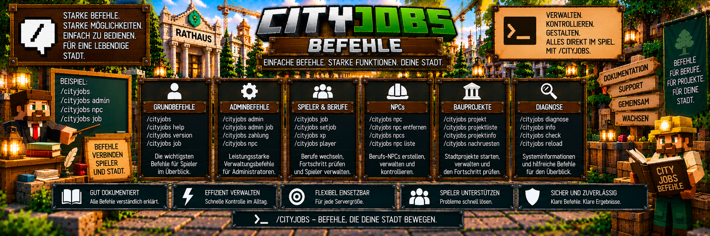

<link rel="stylesheet" href="style.css">



# ⌨️ CityJobs – Befehle

CityJobs besitzt nur wenige Textbefehle, da viele Funktionen direkt über **NPCs, das Berufsbuch und das Admin-Menü** bedient werden.

Der wichtigste Spielerbefehl ist:

`/cityjobs`

Administratoren erreichen die zentrale Verwaltung über:

`/cityjobs admin`

---

# 👤 Spielerbefehle

## 📖 `/cityjobs`

Öffnet das persönliche **Berufsbuch** des Spielers.

```text
/cityjobs
```

Das Berufsbuch zeigt unter anderem:

- aktiven Beruf
- Berufsfortschritt
- Berufs-Rang
- abgeschlossene persönliche Aufträge
- verdientes Geld
- Lieferhistorie
- Erfolge
- Profiltitel
- aktuelles Stadtbauprojekt

Das Berufsbuch kann zusätzlich über die entsprechenden Berufs-NPCs erreicht werden.

---

# 🛠️ Adminbefehle

Die folgenden Befehle sind für Administratoren vorgesehen.

Sie benötigen:

**Berechtigungsstufe 2 beziehungsweise OP-Rechte**

---

# ⚙️ `/cityjobs admin`

Öffnet die zentrale CityJobs-Adminverwaltung.

```text
/cityjobs admin
```

Das Admin-Menü besitzt sieben Hauptbereiche:

1. ⚙️ Einstellungen
2. 💰 Preise
3. 👤 Spieler
4. 🧑‍💼 NPCs
5. 🔍 Bankprüfung
6. 🏗️ Bauprojekte
7. 🩺 Diagnose

Viele administrative Funktionen werden direkt über dieses Menü ausgeführt und benötigen deshalb keinen eigenen Textbefehl.

---

# 👷 Beruf eines Spielers setzen

Administratoren können den aktiven Beruf eines Online-Spielers festlegen.

Syntax:

```text
/cityjobs admin job <Spieler> bergarbeiter|holzfaeller|landwirt
```

Verfügbare Berufe:

```text
bergarbeiter
holzfaeller
landwirt
```

---

# ⛏️ Beispiel: Bergarbeiter

```text
/cityjobs admin job Spielername bergarbeiter
```

Dadurch wird der aktive Beruf des Spielers auf:

**Bergarbeiter**

gesetzt.

---

# 🪓 Beispiel: Holzfäller

```text
/cityjobs admin job Spielername holzfaeller
```

Dadurch wird der aktive Beruf auf:

**Holzfäller**

gesetzt.

---

# 🌾 Beispiel: Landwirt

```text
/cityjobs admin job Spielername landwirt
```

Dadurch wird der aktive Beruf auf:

**Landwirt**

gesetzt.

---

# 💾 Fortschritt der anderen Berufe

Das administrative Wechseln des aktiven Berufs bedeutet nicht, dass die Fortschritte der anderen Berufe gelöscht werden.

CityJobs speichert den Fortschritt jedes Berufs getrennt.

Beispiel:

```text
Bergarbeiter
8.500 XP

Holzfäller
3.200 XP

Landwirt
750 XP
```

Wird anschließend der Holzfäller aktiviert, bleiben die XP von Bergarbeiter und Landwirt erhalten.

---

# 🧑‍💼 NPC-Befehle

CityJobs besitzt vier aktuelle NPC-Rollen:

- Berufsberater
- Bergbau-Vorarbeiter
- Holzfäller
- Landwirt

Administratoren können diese NPCs direkt über einen Befehl erstellen.

---

# ➕ Berufsberater erstellen

```text
/cityjobs npc berufsberater
```

Erstellt einen Berufsberater.

Der Berufsberater ist die zentrale Anlaufstelle für:

- erste Berufswahl
- späteren Berufswechsel

---

# ⛏️ Bergarbeiter-NPC erstellen

```text
/cityjobs npc bergarbeiter
```

Erstellt den Berufs-NPC für den:

**Bergarbeiter**

Dieser NPC dient als Bergbau-Vorarbeiter.

---

# 🪓 Holzfäller-NPC erstellen

```text
/cityjobs npc holzfaeller
```

Erstellt den Berufs-NPC für:

**Holzfäller**

---

# 🌾 Landwirt-NPC erstellen

```text
/cityjobs npc landwirt
```

Erstellt den Berufs-NPC für:

**Landwirt**

---

# 📋 NPC-Befehl allgemein

Die vollständige Syntax lautet:

```text
/cityjobs npc berufsberater|bergarbeiter|holzfaeller|landwirt
```

Damit kann direkt die gewünschte NPC-Rolle ausgewählt werden.

---

# ❌ NPC entfernen

Zum Entfernen eines CityJobs-NPCs wird verwendet:

```text
/cityjobs npc entfernen
```

Der Befehl sucht nach dem nächstgelegenen passenden CityJobs-NPC innerhalb von ungefähr:

**4 Blöcken**

und entfernt diesen.

---

# ⚠️ NPC nicht einfach töten

CityJobs-NPCs sind für ihre Aufgabe geschützt.

Sie sind unter anderem:

- persistent
- unverwundbar
- unbeweglich
- gegen Knockback geschützt

Zum administrativen Entfernen sollte deshalb der vorgesehene NPC-Befehl verwendet werden:

```text
/cityjobs npc entfernen
```

---

# 🏦 Befehle für Bankprüffälle

CityJobs besitzt ein Sicherheitssystem für unklare Bankzahlungen.

Ein solcher Fall kann entstehen, wenn Waren bereits verarbeitet wurden, aber CityJobs nicht eindeutig feststellen konnte, ob die Bankzahlung erfolgreich war.

Für **persönliche Aufträge** stehen zwei administrative Befehle zur Verfügung.

---

# ✅ Zahlung bestätigen

Syntax:

```text
/cityjobs zahlung <Spieler> <job> bestaetigt
```

Beispiel:

```text
/cityjobs zahlung Spielername bergarbeiter bestaetigt
```

Dieser Befehl wird verwendet, wenn der Administrator geprüft hat, dass die entsprechende Zahlung tatsächlich erfolgreich war.

Der Fall kann anschließend als bestätigt behandelt werden.

---

# ↩️ Waren zurückgeben

Syntax:

```text
/cityjobs zahlung <Spieler> <job> zurueckgeben
```

Beispiel:

```text
/cityjobs zahlung Spielername bergarbeiter zurueckgeben
```

Dieser Befehl wird verwendet, wenn die Prüfung ergeben hat, dass die entsprechende Zahlung **nicht erfolgreich** war.

Dadurch kann der persönliche Zahlungsfall entsprechend aufgelöst und die Ware zurückgegeben werden.

---

# ⚠️ Bankprüfung zuerst durchführen

Die Zahlungsbefehle sollten nicht ohne vorherige Kontrolle verwendet werden.

Bei einem offenen Bankprüffall muss zunächst geprüft werden:

**Hat der Spieler die Zahlung tatsächlich erhalten?**

Danach gilt:

```text
Zahlung vorhanden
        ↓
bestaetigt

Zahlung nicht vorhanden
        ↓
zurueckgeben
```

Dadurch werden sowohl doppelte Zahlungen als auch Warenverlust vermieden.

---

# 🤝 Gemeinschaftsaufträge

Für Bankprüffälle aus Gemeinschaftsaufträgen gibt es keinen öffentlichen separaten Textbefehl.

Diese Fälle werden über:

```text
/cityjobs admin
```

und anschließend:

**Bankprüfung**

verwaltet.

---

# 🏗️ Bauprojekt-Zahlungen

Dasselbe gilt für Bankprüffälle aus Stadtbauprojekten.

Sie werden über das Admin-Menü behandelt:

```text
/cityjobs admin
```

→ **Bankprüfung**

Es sollte kein zusätzlicher Zahlungsbefehl verwendet werden, wenn der entsprechende Fall über die Admin-Bankprüfung verwaltet wird.

---

# 🏗️ Bauprojekt-Befehle

CityJobs verwendet für die umfangreiche Verwaltung seiner Bauprojekte hauptsächlich das Admin-Menü.

Öffne:

```text
/cityjobs admin
```

und wähle:

**Bauprojekte**

Dort können unter anderem verwaltet werden:

- Rathaus
- Stadtbank
- eigene Gebäudevorlagen
- Projektstandort
- Ausrichtung
- Vorschau
- Projektstart
- Pause
- Fortsetzen
- ältere Rathaus-Innenbereiche
- ältere Stadtbank-Nachrüstungen

Für diese Funktionen müssen keine zusätzlichen erfundenen `/cityjobs projekt ...` Befehle verwendet werden.

---

# 🏠 Eigene Gebäudevorlagen

Eigene Gebäude werden ebenfalls über:

```text
/cityjobs admin
```

verwaltet.

Öffne anschließend:

**Bauprojekte**

und wähle:

**Eigenes Haus kopieren**

Dort kann eine eigene Gebäudestruktur als CityJobs-Projektvorlage gespeichert werden.

---

# 🩺 Diagnose

Die CityJobs-Diagnose wird ebenfalls über das Admin-Menü geöffnet.

```text
/cityjobs admin
```

Anschließend:

**Diagnose**

Die Diagnose ist schreibgeschützt und zeigt wichtige Informationen über den aktuellen Zustand von CityJobs.

Dazu können gehören:

- Online-Spieler
- aktiver Beruf
- Rang
- Berufs-XP
- aktive persönliche Aufträge
- täglicher Auftragsstand
- offene Bankprüffälle
- geladene NPCs
- NPC-Rollen
- NPC-Koordinaten
- aktive Bauprojekte
- aktuelle Hindernisse
- archivierte Projekte
- laufende Bank-Nachrüstungen
- interne Datenversion

Ein separater Diagnose-Textbefehl ist dafür nicht notwendig.

---

# 📜 Legacy-Befehle

CityJobs besitzt außerdem ältere Befehle aus früheren Varianten des NPC-Systems.

Diese bleiben aus Kompatibilitätsgründen vorhanden.

---

# 🧑‍💼 Legacy: Berufsberater

```text
/cityjobs berater
```

Dieser Befehl gehört zum älteren Berufsberater-System.

Für die aktuelle Verwaltung sollte bevorzugt das aktuelle NPC-System verwendet werden:

```text
/cityjobs npc berufsberater
```

---

# ❌ Legacy: Entfernen

```text
/cityjobs entfernen
```

Dieser Befehl gehört ebenfalls zum älteren NPC-System.

Für die aktuelle NPC-Verwaltung sollte bevorzugt verwendet werden:

```text
/cityjobs npc entfernen
```

---

# 📋 Alle Spielerbefehle

Normale Spieler benötigen im Alltag nur sehr wenige Textbefehle.

| Befehl | Funktion |
|---|---|
| `/cityjobs` | Berufsbuch öffnen |

Die meisten Spieleraktionen erfolgen direkt über die CityJobs-NPCs.

---

# 📋 Alle aktuellen Adminbefehle

| Befehl | Funktion |
|---|---|
| `/cityjobs admin` | Adminverwaltung öffnen |
| `/cityjobs admin job <Spieler> bergarbeiter` | Bergarbeiter aktivieren |
| `/cityjobs admin job <Spieler> holzfaeller` | Holzfäller aktivieren |
| `/cityjobs admin job <Spieler> landwirt` | Landwirt aktivieren |
| `/cityjobs npc berufsberater` | Berufsberater erstellen |
| `/cityjobs npc bergarbeiter` | Bergbau-Vorarbeiter erstellen |
| `/cityjobs npc holzfaeller` | Holzfäller-NPC erstellen |
| `/cityjobs npc landwirt` | Landwirt-NPC erstellen |
| `/cityjobs npc entfernen` | nächstgelegenen CityJobs-NPC entfernen |
| `/cityjobs zahlung <Spieler> <job> bestaetigt` | persönlichen Zahlungsfall bestätigen |
| `/cityjobs zahlung <Spieler> <job> zurueckgeben` | Waren eines persönlichen Zahlungsfalls zurückgeben |

---

# 📜 Legacy-Befehle im Überblick

| Befehl | Status |
|---|---|
| `/cityjobs berater` | Legacy |
| `/cityjobs entfernen` | Legacy |

Für neue Servereinrichtungen sollte das aktuelle NPC-System verwendet werden.

---

# 🔐 Berechtigungen

Die administrativen CityJobs-Befehle benötigen:

**Berechtigungsstufe 2 beziehungsweise OP-Rechte**

Normale Spieler sollen damit keine Möglichkeit erhalten:

- Berufe anderer Spieler administrativ zu ändern
- Berufs-NPCs zu erstellen
- Berufs-NPCs zu entfernen
- Bankprüffälle zu entscheiden
- Bauprojekte zu administrieren
- Servereinstellungen zu verändern

---

# 💡 Warum gibt es nicht für alles einen Befehl?

CityJobs verwendet bewusst eine Kombination aus:

```text
Spieler
        ↓
NPCs + Berufsbuch

Administratoren
        ↓
/cityjobs admin
        ↓
Admin-Menüs
```

Dadurch müssen Administratoren nicht für jede einzelne Einstellung lange Textbefehle kennen.

Beispielsweise werden:

- Preise
- Servereinstellungen
- Spielerfortschritt
- Bankprüfung
- Bauprojekte
- Diagnose

größtenteils über die grafische Adminverwaltung bedient.

---

# 🧭 Typischer Spielerablauf

```text
/cityjobs
        ↓
Berufsbuch öffnen

oder

Berufs-NPC anklicken
        ↓
Aufträge und Berufsfunktionen verwenden
```

---

# 🛠️ Typischer Adminablauf

```text
/cityjobs admin
        ↓
gewünschten Verwaltungsbereich wählen
        ↓
Einstellungen / Preise / Spieler
NPCs / Bankprüfung / Bauprojekte / Diagnose
        ↓
Änderung durchführen
```

---

# 🧑‍💼 NPC schnell einrichten

Beispielsweise kann ein Administrator die vier benötigten NPC-Rollen nacheinander erstellen:

```text
/cityjobs npc berufsberater
/cityjobs npc bergarbeiter
/cityjobs npc holzfaeller
/cityjobs npc landwirt
```

Die NPCs sollten jeweils an ihrem gewünschten Standort erstellt werden.

---

# 🔍 Befehl funktioniert nicht?

Wenn ein Adminbefehl nicht funktioniert, kontrolliere zuerst:

### 1. OP-Rechte

Besitzt der Spieler die erforderlichen Administratorrechte?

### 2. Schreibweise

Wurde der Befehl korrekt eingegeben?

Beispiel:

```text
/cityjobs admin
```

### 3. Spieler online

Bei einem Befehl, der einen Spieler betrifft, sollte der entsprechende Spieler online sein, wenn die Funktion dies voraussetzt.

### 4. Richtiger Berufsname

Verwende:

```text
bergarbeiter
holzfaeller
landwirt
```

### 5. Richtiger NPC-Abstand

Bei:

```text
/cityjobs npc entfernen
```

muss sich der entsprechende NPC in der vorgesehenen Nähe befinden.

---

# 📌 Wichtig

Nicht jeder Menüpunkt aus CityJobs besitzt einen eigenen Textbefehl.

Wenn du eine Funktion nicht als Befehl findest, öffne zuerst:

```text
/cityjobs admin
```

Viele Verwaltungsfunktionen befinden sich direkt dort.

---

# 💡 Kurz erklärt

Die wichtigsten CityJobs-Befehle sind:

```text
SPIELER

/cityjobs
→ Berufsbuch


ADMIN

/cityjobs admin
→ zentrale Verwaltung


BERUFE

/cityjobs admin job <Spieler> bergarbeiter|holzfaeller|landwirt
→ aktiven Beruf setzen


NPCs

/cityjobs npc berufsberater|bergarbeiter|holzfaeller|landwirt
→ NPC erstellen

/cityjobs npc entfernen
→ NPC entfernen


PERSÖNLICHE BANKPRÜFFÄLLE

/cityjobs zahlung <Spieler> <job> bestaetigt
→ Zahlung wurde bestätigt

/cityjobs zahlung <Spieler> <job> zurueckgeben
→ Waren zurückgeben


LEGACY

/cityjobs berater

/cityjobs entfernen
```

Damit sind die tatsächlich benötigten CityJobs-Befehle übersichtlich gehalten, während die umfangreicheren Verwaltungsfunktionen direkt über die Ingame-Menüs erreichbar bleiben.

---

[← Zurück: Adminverwaltung](cityjobs-admin.md) | [Weiter: Häufige Fragen →](cityjobs-haeufige-fragen.md)
