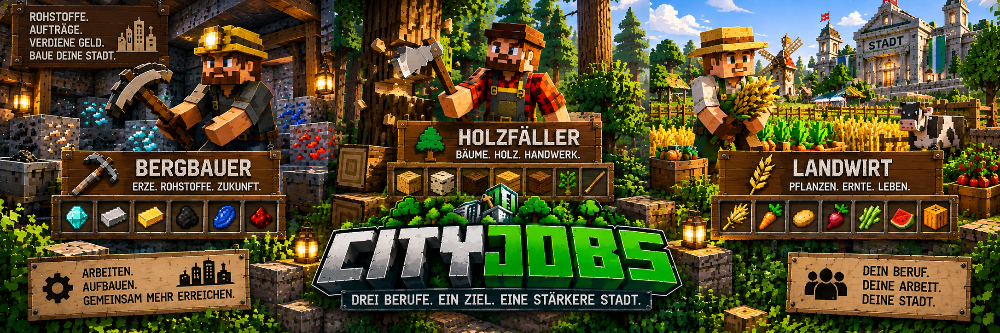

<link rel="stylesheet" href="style.css">



# 👷 CityJobs – Berufe

CityJobs 1.0.0 enthält aktuell drei Berufe:

- ⛏️ **Bergarbeiter**
- 🪓 **Holzfäller**
- 🌾 **Landwirt**

Jeder Beruf besitzt seinen eigenen Berufsfortschritt, eigene Rohstoffe und passende Lieferaufträge.

Spieler sammeln durch ihre Arbeit **Berufs-XP**, steigen im Rang auf und erhalten mit höheren Rängen Zugriff auf umfangreichere Aufträge.

---

# 🧑‍💼 Beruf auswählen

Die Berufswahl erfolgt über den **Berufsberater**.

Klicke den Berufsberater mit der rechten Maustaste an.

Dort werden die verfügbaren Berufe sowie dein bisheriger Fortschritt angezeigt.

Beim ersten Mal kannst du deinen Beruf direkt auswählen.

---

# 🔄 Beruf wechseln

Ein bereits gewählter Beruf kann später wieder gewechselt werden.

Der Wechsel muss bestätigt werden.

Standardmäßig gilt anschließend eine Wechselpause von:

**60 Minuten Serverlaufzeit**

Administratoren können diese Zeit verändern oder vollständig deaktivieren.

---

## 💾 Fortschritt bleibt erhalten

Beim Wechsel des Berufs geht dein bisheriger Fortschritt **nicht verloren**.

Beispiel:

```text
Bergarbeiter
8.500 XP
Experte

↓ Wechsel ↓

Holzfäller
2.300 XP
Facharbeiter

↓ später zurück ↓

Bergarbeiter
8.500 XP
Experte

Jeder Beruf speichert seine Berufs-XP unabhängig von den anderen Berufen.

Es wird jedoch immer nur der aktuell aktive Beruf durch normale Arbeit und dessen Aufträge weiterentwickelt.

⛏️ Bergarbeiter

Der Bergarbeiter konzentriert sich auf natürliche Erze und Bergbau-Rohstoffe.

Berufs-XP gibt es nur für gültige Blöcke.

⛏️ Bergarbeiter-XP
Rohstoff	Berufs-XP
Kohleerz	1
Kupfererz	2
Eisenerz	5
Redstone-Erz	5
Lapislazuli-Erz	6
Golderz	8
Diamanterz	20
Smaragderz	25
Netherquarzerz	2
Nethergolderz	3
Antiker Schrott	30
anderes korrekt getaggtes Mod-Erz	5
📦 Bergarbeiter-Aufträge

Mögliche Auftragswaren sind unter anderem:

Kohle
Rohkupfer
Roheisen
Rohgold
Redstone
Lapislazuli
Diamanten
Smaragde

Bei Stadtbauprojekten können zusätzlich Materialien wie:

Bruchstein
Sand
Kies
Quarz

benötigt werden.

Dadurch spielt der Bergarbeiter auch bei großen gemeinschaftlichen Stadtbauprojekten eine wichtige Rolle.

🪨 Normale Steine

Normale Steine werden teilweise für den Anti-Farm-Schutz mitverfolgt.

Sie geben jedoch durch die aktuelle Bergarbeiter-XP-Tabelle keine Berufs-XP.

🪓 Holzfäller

Der Holzfäller ist für natürlich gewachsene Bäume und Holz zuständig.

XP gibt es für natürlich gewachsene Stämme, die vom System als gültiges Holz erkannt werden.

🪵 Holzfäller-XP
Holzart	Berufs-XP
Eiche	2
Birke	3
Fichte	2
Akazie	4
Schwarzeiche	2
Tropenholz	2
Mangrove	5
Kirschholz	4
anderes korrekt getaggtes Mod-Holz	4
📦 Holzfäller-Aufträge

Mögliche Auftragswaren sind:

Eichenstämme
Birkenstämme
Fichtenstämme
Tropenholzstämme
Akazienstämme
Schwarzeichenstämme
Mangrovenstämme
Kirschstämme

Holz wird außerdem für verschiedene städtische Bauprojekte benötigt.

🌾 Landwirt

Der Landwirt kümmert sich um Pflanzen und landwirtschaftliche Erzeugnisse.

Bei vielen Pflanzen gibt es Berufs-XP nur dann, wenn sie vollständig reif sind.

Dadurch wird verhindert, dass unreife Pflanzen ständig abgebaut und erneut gesetzt werden, um schnell XP zu sammeln.

🌱 Landwirt-XP
Pflanze / Erzeugnis	Bedingung	Berufs-XP
Weizen	vollständig reif	2
Kartoffeln	vollständig reif	3
Karotten	vollständig reif	3
Rote Bete	vollständig reif	3
Kakao	vollständig reif	4
Netherwarzen	vollständig reif	5
Süßbeeren	vollständig reif	2
Leuchtbeeren	Beeren vorhanden	2
Kürbis	gültiger natürlicher Block	4
Melone	gültiger natürlicher Block	4
Zuckerrohr	gültiger natürlicher Block	1
Kaktus	gültiger natürlicher Block	1
Bambus	gültiger natürlicher Block	1
Seetang	gültiger natürlicher Block	1
Pilze und Pilzblöcke	gültiger natürlicher Block	2
Chorus-Pflanze	gültiger natürlicher Block	4
📦 Landwirt-Aufträge

Mögliche Auftragswaren sind unter anderem:

Weizen
Karotten
Kartoffeln
Rote Bete
Melonenscheiben
Kürbisse
Süßbeeren
Leuchtbeeren
getrockneter Seetang
Pilze
Kakaobohnen
Netherwarzen
Chorusfrüchte
Zuckerrohr
Bambus
Kakteen
🛡️ Anti-Farm-Schutz

CityJobs besitzt einen Anti-Farm-Schutz.

Selbst gesetzte Blöcke können nicht einfach immer wieder abgebaut werden, um unbegrenzt Berufs-XP zu erhalten.

Das System merkt sich entsprechende Blockpositionen.

Dabei werden auch:

Dimension
Blockposition
gesetzte Blöcke

berücksichtigt.

Diese Informationen bleiben auch nach einem Serverneustart erhalten.

🌳 Natürlich gewachsene Bäume

Natürlich gewachsene Baumstämme können vom Holzfäller regulär für Berufs-XP verwendet werden.

Dadurch können normale Wälder und nachgewachsene Bäume weiterhin für den Beruf genutzt werden.

🌾 Reife Pflanzen

Bei Pflanzen wie Weizen, Kartoffeln, Karotten oder Roter Bete zählt nur eine ausreichend reife Pflanze.

Unreife Pflanzen geben keine Berufs-XP.

Direkt platzierbare Farmblöcke werden zusätzlich gegen einfaches Wiederaufstellen und erneutes Abernten geschützt.

🚫 Kreativ- und Zuschauermodus

Spieler im Kreativmodus oder Zuschauermodus erhalten keine normalen Arbeits-XP.

Dadurch kann der Berufsfortschritt nicht einfach über den Kreativmodus hochgelevelt werden.

⭐ Berufs-XP und Ränge

Alle drei Berufe verwenden dasselbe grundlegende Rangsystem:

Stufe	Rang	Benötigte Gesamt-XP
1	Lehrling	0
2	Geselle	500
3	Facharbeiter	2.000
4	Experte	6.000
5	Meister	15.000

Der Fortschritt wird für jeden Beruf getrennt gespeichert.

Mehr über das komplette XP- und Rangsystem findest du auf der nächsten Seite:

Ränge & Berufs-XP

📦 Berufe und Aufträge

Jeder Beruf besitzt eigene passende Aufträge.

Du kannst nur Aufträge des aktuell aktiven Berufs bearbeiten.

Mit höheren Rängen können sich unter anderem verändern:

verfügbare Waren
Auftragsmengen
Berufs-XP
Stückpreise
Großaufträge
Meisteraufträge

Die eigentliche Auftragsverwaltung erfolgt über den passenden Berufs-NPC.

🤝 Berufe und Gemeinschaftsprojekte

Gemeinschaftsprojekte verbinden die verschiedenen Berufe miteinander.

Ein Projekt kann beispielsweise gleichzeitig Rohstoffe von:

⛏️ Bergarbeitern
🪓 Holzfällern
🌾 Landwirten

benötigen.

Jeder Spieler darf nur zu dem Bereich beitragen, der zu seinem aktuell aktiven Beruf gehört.

So arbeiten unterschiedliche Berufe gemeinsam an einem serverweiten Ziel.

🏗️ Berufe und Stadtbauprojekte

Auch bei großen Stadtbauprojekten spielen die Berufe eine wichtige Rolle.

Die benötigten Ressourcen werden von den Spielern über ihre Berufs-NPCs geliefert.

Vor allem Bergarbeiter und Holzfäller liefern viele der Materialien für große Gebäude wie das Rathaus oder die Stadtbank.

Ein eigener Bauarbeiter-Beruf wird dafür nicht benötigt.

Die vorhandenen Berufe versorgen die Stadt mit den benötigten Rohstoffen.

📖 Berufsbuch

Mit

/cityjobs

kannst du dein Berufsbuch öffnen.

Dort findest du unter anderem Informationen zu:

deinen Lieferungen
abgeschlossenen Aufträgen
verdientem Geld
Erfolgen
Profiltiteln
aktuellen Stadtbauprojekten

Das Berufsbuch kann außerdem über den passenden Berufs-NPC erreicht werden.

💡 Welcher Beruf passt zu mir?
⛏️ Bergarbeiter

Wenn du gerne:

Höhlen erkundest
Erze sammelst
seltene Rohstoffe suchst

ist der Bergarbeiter passend.

🪓 Holzfäller

Wenn du gerne:

Wälder erkundest
Bäume fällst
große Mengen Holz sammelst

ist der Holzfäller passend.

🌾 Landwirt

Wenn du gerne:

Felder bewirtschaftest
Pflanzen anbaust
verschiedene Erzeugnisse sammelst

ist der Landwirt passend.

Du kannst deinen Beruf später wieder wechseln, ohne den bereits erreichten Fortschritt der anderen Berufe zu verlieren.

← Zurück: Installation | Weiter: NPCs & Berufsberater →
