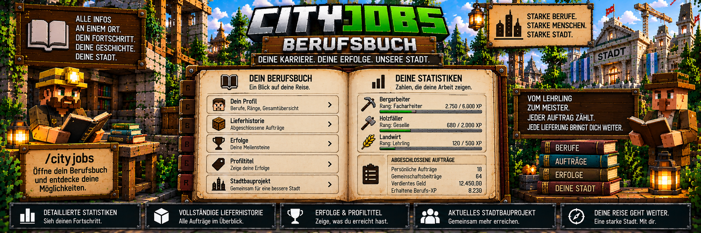

<link rel="stylesheet" href="style.css">



# 📖 CityJobs – Berufsbuch

Das **Berufsbuch** ist die persönliche Übersicht eines Spielers in CityJobs.

Hier können Spieler ihren bisherigen Berufsweg verfolgen und wichtige Informationen zu ihren Aufträgen, Lieferungen, Erfolgen und Stadtprojekten einsehen.

Das Berufsbuch verbindet damit viele Bereiche von CityJobs an einem zentralen Ort.

---

# 📖 Berufsbuch öffnen

Das Berufsbuch kann jederzeit mit folgendem Befehl geöffnet werden:

`/cityjobs`

Zusätzlich kann das Berufsbuch über den passenden **Berufs-NPC** erreicht werden.

---

# 📋 Was zeigt das Berufsbuch?

Das Berufsbuch enthält unter anderem Informationen zu:

- abgeschlossenen persönlichen Aufträgen
- verdientem Geld
- Lieferhistorie
- Berufs-XP
- Erfolgen
- Profiltiteln
- aktuellem Stadtbauprojekt

Damit können Spieler ihren bisherigen Fortschritt jederzeit nachvollziehen.

---

# 👷 Berufsfortschritt

CityJobs speichert den Fortschritt für jeden Beruf getrennt.

Aktuell gibt es:

- ⛏️ Bergarbeiter
- 🪓 Holzfäller
- 🌾 Landwirt

Der Fortschritt eines Berufs bleibt auch dann erhalten, wenn der Spieler später zu einem anderen Beruf wechselt.

Beispiel:

```text
⛏️ Bergarbeiter
8.500 XP
Experte

🪓 Holzfäller
2.700 XP
Facharbeiter

🌾 Landwirt
650 XP
Geselle
```

Dadurch kann ein Spieler mehrere Berufskarrieren entwickeln, ohne seinen bisherigen Fortschritt zu verlieren.

---

# ⭐ Ränge

Jeder Beruf besitzt fünf mögliche Ränge.

| Rang | Benötigte Gesamt-XP |
|---|---:|
| Lehrling | 0 |
| Geselle | 500 |
| Facharbeiter | 2.000 |
| Experte | 6.000 |
| Meister | 15.000 |

Mehr zum Rangsystem findest du unter:

**[Ränge & Berufs-XP](cityjobs-raenge-xp.md)**

---

# 📦 Abgeschlossene persönliche Aufträge

Das Berufsbuch zeigt Informationen zu den abgeschlossenen persönlichen Aufträgen.

Dadurch kann ein Spieler nachvollziehen, wie aktiv er bereits innerhalb des CityJobs-Berufssystems war.

Persönliche Aufträge werden über den jeweiligen Berufs-NPC angenommen und abgeschlossen.

---

# 💰 Verdientes Geld

CityJobs kann im Berufsbuch anzeigen, wie viel Geld der Spieler durch die entsprechenden CityJobs-Lieferungen verdient hat.

Die Geldzahlungen selbst laufen über **MineBank**.

Dadurch kann der Spieler nicht nur seinen XP-Fortschritt verfolgen, sondern auch sehen, welchen wirtschaftlichen Erfolg seine Arbeit gebracht hat.

---

# 📜 Lieferhistorie

Ein wichtiger Bestandteil des Berufsbuchs ist die **Lieferhistorie**.

Dort werden die letzten abgeschlossenen Lieferungen gespeichert.

Ein Eintrag kann unter anderem enthalten:

- gelieferte Ware
- gelieferte Menge
- Beruf
- erhaltenes Geld
- erhaltene Berufs-XP
- Datum der Lieferung

---

# 📝 Beispiel einer Lieferhistorie

Eine Lieferhistorie kann beispielsweise so aussehen:

```text
Roheisen
32 Stück
Bergarbeiter
Geld: Auszahlung über MineBank
XP: Berufs-XP
Datum: UTC

----------------

Eichenstämme
64 Stück
Holzfäller
Geld: Auszahlung über MineBank
XP: Berufs-XP
Datum: UTC

----------------

Weizen
64 Stück
Landwirt
Geld: Auszahlung über MineBank
XP: Berufs-XP
Datum: UTC
```

Die tatsächlichen Werte richten sich nach den jeweiligen Aufträgen und Servereinstellungen.

---

# 🕒 Datum der Lieferungen

Das Datum der gespeicherten Lieferungen wird in:

**UTC**

geführt.

Dadurch besitzt CityJobs eine einheitliche Zeitbasis für die gespeicherte Lieferhistorie.

---

# 📚 Anzahl gespeicherter Einträge

Standardmäßig speichert CityJobs:

**50 Einträge**

in der Lieferhistorie.

Administratoren können diesen Wert verändern.

Der mögliche Bereich beträgt:

**10 bis 100 Einträge**

---

# ⚙️ Lieferhistorie einstellen

Administratoren können die maximale Anzahl der gespeicherten Historieneinträge über die CityJobs-Verwaltung einstellen.

Öffne:

`/cityjobs admin`

und anschließend:

**Einstellungen**

Dort kann die Größe der Lieferhistorie angepasst werden.

---

# 🏆 Erfolge

Das Berufsbuch enthält außerdem das **Erfolgssystem** von CityJobs.

Spieler können durch verschiedene Aktivitäten Erfolge freischalten.

Aktuell gehören dazu unter anderem:

| Erfolg | Voraussetzung |
|---|---|
| 🏆 Erster Auftrag | 1 persönlichen Auftrag abschließen |
| 📦 Zuverlässige Lieferung | 10 persönliche Aufträge abschließen |
| 🌆 Stadtversorger | 100 persönliche Aufträge abschließen |
| 🤝 Gemeinsam stark | mindestens einen Gemeinschaftsbeitrag leisten |
| 👑 Meisterlieferant | einen Meisterauftrag abschließen |

Dadurch werden verschiedene Meilensteine innerhalb des Berufssystems festgehalten.

---

# 🏷️ Profiltitel

Freigeschaltete Erfolge können als **Profiltitel** verwendet werden.

Der Spieler kann einen passenden Titel auswählen und damit einen seiner erreichten Meilensteine hervorheben.

Beispielsweise:

```text
Spielerprofil

Beruf:
⛏️ Bergarbeiter

Rang:
Experte

Profiltitel:
🏆 Zuverlässige Lieferung
```

Welche Titel zur Verfügung stehen, hängt von den bereits freigeschalteten Erfolgen ab.

---

# 🔄 Profiltitel auswählen

Spieler können über das CityJobs-System zwischen ihren bereits freigeschalteten Profiltiteln wählen.

Ein noch nicht freigeschalteter Erfolg kann nicht einfach als Titel verwendet werden.

Dadurch zeigen Profiltitel tatsächlich erreichte Meilensteine des Spielers.

---

# ⚙️ Erfolge deaktivieren

Administratoren können das Erfolgssystem deaktivieren.

Standardmäßig ist es aktiviert.

Wird das System auf einem Server nicht gewünscht, kann es über die CityJobs-Einstellungen abgeschaltet werden.

---

# 🤝 Gemeinschaftsprojekte

Beiträge zu Gemeinschaftsprojekten können ebenfalls mit dem Berufsbuch und dem Erfolgssystem verbunden sein.

Wer mindestens einen gültigen Gemeinschaftsbeitrag leistet, kann den Erfolg:

**Gemeinsam stark**

freischalten.

Mehr zu diesem System findest du unter:

**[Gemeinschaftsaufträge](cityjobs-gemeinschaft.md)**

---

# 👑 Meisteraufträge

Auch Meisteraufträge besitzen eine Verbindung zum Erfolgssystem.

Wer einen Meisterauftrag erfolgreich abschließt, kann den Erfolg:

**Meisterlieferant**

freischalten.

Meisteraufträge stehen Spielern mit dem entsprechenden höchsten Berufs-Rang zur Verfügung, sofern das System auf dem Server aktiviert ist.

---

# 🏗️ Aktuelles Stadtbauprojekt

Das Berufsbuch zeigt außerdem Informationen zum **aktuellen Stadtbauprojekt**.

Dadurch können Spieler sehen, an welchem großen Projekt die Stadt momentan arbeitet.

CityJobs unterstützt unter anderem:

- 🏛️ Rathaus
- 🏦 Stadtbank
- 🏠 eigene gespeicherte Gebäudevorlagen

Die benötigten Materialien werden durch die entsprechenden Berufe geliefert.

---

# 🏛️ Rathaus

Das moderne Rathaus ist eines der großen CityJobs-Bauprojekte.

Es wird in mehreren Bauphasen errichtet:

1. Fundament
2. Tragwerk
3. Fassade und Dach
4. Einrichtung und Vorplatz

Spieler liefern die benötigten Materialien über ihre Berufs-NPCs.

Der Fortschritt wird gespeichert und kann über Serverneustarts hinweg fortgesetzt werden.

---

# 🏦 Stadtbank

CityJobs unterstützt außerdem den Bau einer modernen Stadtbank.

Die Stadtbank besitzt unter anderem Bereiche wie:

- Schalterhalle
- Beratung
- Wartebereich
- Tresorbereich
- freie ATM-Nische

Ein funktionierender MineBank-ATM wird dabei nicht automatisch platziert.

Bankfunktionen und entsprechende NPCs können anschließend passend eingerichtet werden.

---

# 🏠 Eigene Gebäudeprojekte

Administratoren können zusätzlich eigene Gebäude als CityJobs-Bauvorlagen speichern.

Dadurch können neben Rathaus und Stadtbank weitere gemeinschaftliche Bauprojekte entstehen.

Beispiele könnten sein:

```text
Feuerwehr
Polizeistation
Lagerhalle
Markthalle
Bahnhof
Schule
oder eigene Servergebäude
```

Welche eigenen Gebäude tatsächlich verfügbar sind, hängt von den vom Server gespeicherten Vorlagen ab.

---

# 📊 Persönlicher Beitrag zu Bauprojekten

CityJobs speichert bei Bauprojekten auch persönliche Beiträge.

Dadurch kann nachvollzogen werden, wie viel ein Spieler zum Aufbau der Stadt beigetragen hat.

Das verbindet den persönlichen Berufsfortschritt mit den großen gemeinsamen Stadtprojekten.

---

# 🧭 Berufsbuch als Karriereübersicht

Das Berufsbuch verbindet verschiedene CityJobs-Systeme miteinander.

Vereinfacht sieht das so aus:

```text
                📖 BERUFSBUCH
                      │
        ┌─────────────┼─────────────┐
        │             │             │
        ▼             ▼             ▼
   📦 Aufträge    🏆 Erfolge    🏗️ Stadtprojekt
        │             │             │
        ▼             ▼             ▼
   Lieferungen    Profiltitel    Fortschritt
        │
        ▼
   💰 Geld + ⭐ XP
```

Dadurch müssen Spieler nicht verschiedene Befehle verwenden, um ihre wichtigsten Karriereinformationen zu verfolgen.

---

# 💾 Daten bleiben gespeichert

Die Informationen des Berufsbuchs gehören zu den gespeicherten CityJobs-Weltdaten.

Dazu gehören unter anderem:

- Berufe
- Berufs-XP
- aktive Aufträge
- tägliche Auftragslimits
- Lieferhistorie
- Erfolge
- Profiltitel
- Gemeinschaftsprojekte
- Bauprojekte

Dadurch bleiben die wichtigen Karriereinformationen auch nach einem Serverneustart erhalten.

---

# 🛠️ Administrator-Einstellungen

Einige Bereiche des Berufsbuchs können vom Administrator beeinflusst werden.

Dazu gehören beispielsweise:

| Einstellung | Standard |
|---|---:|
| Historieneinträge | 50 |
| Erfolge | aktiviert |
| persönliche Aufträge pro Minecraft-Tag | 3 |
| Gemeinschaftsaufträge | aktiviert |
| Meisteraufträge | aktiviert |

Administratoren öffnen die Verwaltung mit:

`/cityjobs admin`

---

# 🔍 Diagnose

CityJobs besitzt zusätzlich einen Diagnosebereich für Administratoren.

Dieser wird über:

`/cityjobs admin`

und anschließend:

**Diagnose**

geöffnet.

Dort können unter anderem Informationen zu Online-Spielern eingesehen werden.

Dazu gehören beispielsweise:

- aktiver Beruf
- Rang
- Berufs-XP
- aktiver persönlicher Auftrag
- täglicher Auftragsstand
- offene Bankprüffälle

Die Diagnose dient zur Kontrolle und verändert keine Spielerdaten.

---

# 💡 Kurz erklärt

Das Berufsbuch ist deine persönliche CityJobs-Übersicht.

Öffne es mit:

`/cityjobs`

Dort kannst du unter anderem verfolgen:

```text
👷 deine Berufe
        ↓
⭐ deinen Fortschritt
        ↓
📦 deine Lieferungen
        ↓
💰 dein verdientes Geld
        ↓
🏆 deine Erfolge
        ↓
🏷️ deine Profiltitel
        ↓
🏗️ das aktuelle Stadtbauprojekt
```

Damit begleitet dich das Berufsbuch vom ersten Auftrag als Lehrling bis zum Meister und zeigt, welchen Beitrag du zur Entwicklung der Stadt geleistet hast.

---

[← Zurück: Gemeinschaftsaufträge](cityjobs-gemeinschaft.md) | [Weiter: Erfolge & Profiltitel →](cityjobs-erfolge-titel.md)
