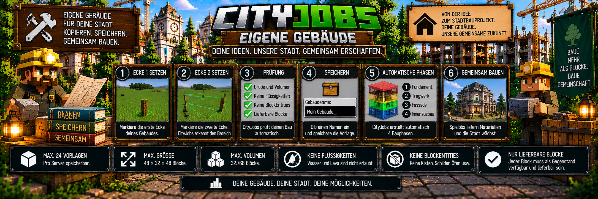

<link rel="stylesheet" href="style.css">



# 🏠 CityJobs – Eigene Gebäude

Neben den vorgefertigten Bauprojekten wie Rathaus und Stadtbank können Administratoren in CityJobs auch **eigene Gebäude als Bauvorlagen speichern**.

Damit können selbst gebaute Gebäude später zu richtigen CityJobs-Stadtbauprojekten werden.

Die Spieler sammeln und liefern die benötigten Materialien und CityJobs baut das gespeicherte Gebäude anschließend schrittweise wieder auf.

---

# 🌆 Eigene Gebäude als Stadtprojekt

Mit diesem System können Server ihre ganz eigenen Bauprojekte erstellen.

Mögliche Beispiele sind:

- 🚒 Feuerwehr
- 🚓 Polizeistation
- 🏫 Schule
- 🚉 Bahnhof
- 🏭 Fabrik
- 📦 Lagerhalle
- 🛒 Markthalle
- 🏢 Verwaltungsgebäude
- 🏠 eigene Servergebäude

Dabei ist CityJobs nicht auf bestimmte Gebäudetypen beschränkt.

Entscheidend ist, dass das Gebäude die Voraussetzungen für eine CityJobs-Vorlage erfüllt.

---

# 🔄 So funktioniert das System

Der grundlegende Ablauf sieht so aus:

```text
Gebäude fertig bauen
        ↓
/cityjobs admin
        ↓
Bauprojekte
        ↓
Eigenes Haus kopieren
        ↓
Ecke 1 festlegen
        ↓
Ecke 2 festlegen
        ↓
CityJobs prüft den Bereich
        ↓
Gebäude benennen
        ↓
Vorlage speichern
        ↓
CityJobs erstellt 4 Bauphasen
        ↓
Vorlage kann als Bauprojekt verwendet werden
```

---

# 🛠️ Eigene Vorlage erstellen

Die Verwaltung eigener Gebäude erfolgt über:

`/cityjobs admin`

Öffne anschließend:

**Bauprojekte**

und wähle:

**Eigenes Haus kopieren**

Danach wird der Bereich des Gebäudes über zwei Eckpunkte festgelegt.

---

# 1️⃣ Ecke 1 setzen

Der erste Punkt befindet sich an einer unteren Ecke des Gebäudes.

Für die Auswahl wird der Block **unter den Füßen des Administrators** verwendet.

Stelle dich deshalb an die gewünschte erste Ecke des Gebäudes.

Diese Position bildet den ersten Auswahlpunkt.

---

# 2️⃣ Ecke 2 setzen

Anschließend wird die gegenüberliegende obere Ecke des Gebäudes festgelegt.

Der zweite Punkt sollte sich auf der gegenüberliegenden Seite **oberhalb der entsprechenden Dachecke** befinden.

Dadurch wird ein dreidimensionaler Bereich um das komplette Gebäude ausgewählt.

Vereinfacht:

```text
                 Ecke 2
                    ●
                  / |
                /   |
              /     |
            /       |
          /         |
        ●───────────┘
      Ecke 1
```

Alles innerhalb dieses Bereichs gehört zur Gebäudevorlage.

---

# 📐 Der komplette Bereich zählt

CityJobs kopiert nicht nur die Außenwände.

Der gesamte ausgewählte Bereich wird für die Vorlage berücksichtigt.

Dazu gehören beispielsweise:

- Fundament
- Böden
- Wände
- Decken
- Dach
- Treppen
- Fenster
- dekorative Blöcke
- Innenausbau

Deshalb sollte die Auswahl möglichst genau um das gewünschte Gebäude gelegt werden.

---

# 🔍 Automatische Prüfung

Bevor eine eigene Gebäudevorlage gespeichert wird, prüft CityJobs den ausgewählten Bereich.

Dabei werden unter anderem kontrolliert:

- Abmessungen
- Gesamtvolumen
- Höhe
- geladener Bereich
- Flüssigkeiten
- BlockEntities
- verwendete Baumaterialien

Nur eine gültige Vorlage kann gespeichert werden.

---

# 📏 Maximale Größe

Eine eigene Gebäudevorlage darf maximal folgende Abmessungen besitzen:

**48 × 32 × 48 Blöcke**

Damit können bereits ziemlich große Gebäude als CityJobs-Projekt verwendet werden.

---

# 📦 Maximales Volumen

Zusätzlich zur maximalen Größe gilt eine Volumengrenze von:

**32.768 Blöcken**

Die äußeren Abmessungen dürfen also nicht nur innerhalb von 48 × 32 × 48 liegen.

Auch das gesamte Auswahlvolumen darf höchstens 32.768 Blöcke betragen.

---

# 📐 Mindesthöhe

Eine Gebäudevorlage muss mindestens:

**2 Blöcke hoch**

sein.

Dadurch werden ungültige oder versehentlich extrem flache Auswahlen verhindert.

---

# 🗂️ Maximale Anzahl Vorlagen

CityJobs kann maximal:

**24 eigene Gebäudevorlagen**

speichern.

Dadurch können Administratoren eine Sammlung unterschiedlicher Stadtprojekte vorbereiten.

Beispiel:

```text
1. Feuerwehr
2. Polizeistation
3. Schule
4. Bahnhof
5. Lagerhalle
6. Markthalle
7. Wohnhaus
8. Fabrik
...
bis maximal 24 Vorlagen
```

---

# 🌍 Bereich muss geladen sein

Der komplette ausgewählte Gebäudebereich muss geladen sein.

CityJobs kann keine Vorlage zuverlässig kopieren, wenn Teile des ausgewählten Gebäudes momentan nicht geladen sind.

Bei größeren Gebäuden sollte deshalb kontrolliert werden, dass sich der gesamte Auswahlbereich in geladenen Chunks befindet.

---

# 💧 Keine Flüssigkeiten

Eigene Gebäudevorlagen dürfen keine Flüssigkeiten enthalten.

Dazu gehören beispielsweise:

- Wasser
- Lava

Enthält der ausgewählte Bereich Flüssigkeiten, kann die Vorlage nicht normal gespeichert werden.

---

# 📦 Keine BlockEntities

Eigene Gebäudevorlagen dürfen keine BlockEntities enthalten.

Dazu gehören beispielsweise:

- Kisten
- Schilder
- andere Blöcke mit eigenen gespeicherten Blockdaten

CityJobs lehnt solche Vorlagen ab.

Dadurch wird verhindert, dass komplexe gespeicherte Inhalte oder besondere Blockdaten unkontrolliert in Bauprojekte kopiert werden.

---

# 🧱 Jeder Baublock benötigt einen Gegenstand

Jeder verwendete Baublock muss als lieferbarer Gegenstand verfügbar sein.

CityJobs ermittelt aus dem gespeicherten Gebäude automatisch die benötigten Baumaterialien.

Dafür muss ein verwendeter Block einem entsprechenden lieferbaren Item zugeordnet werden können.

Vereinfacht:

```text
Gebäude enthält:

Stein
Eichenbretter
Glas
Ziegel

        ↓

CityJobs erkennt:

Stein-Item
Eichenbretter-Item
Glas-Item
Ziegel-Item

        ↓

Materialien können
als Lieferziel verwendet werden
```

Kann ein notwendiger Block nicht als lieferbarer Gegenstand verarbeitet werden, ist er für eine normale eigene Bauvorlage ungeeignet.

---

# 🏷️ Gebäude benennen

Nach erfolgreicher Auswahl und Prüfung erhält die Vorlage einen eigenen Namen.

Der Name darf zwischen:

**1 und 32 Zeichen**

lang sein.

Erlaubt sind:

- Buchstaben
- Zahlen
- Leerzeichen
- `_`
- `-`

Beispiele:

```text
Feuerwehr
Polizeistation
Bahnhof_Nord
Lagerhalle-1
Neue Schule
```

---

# 💾 Vorlage speichern

Nach erfolgreicher Prüfung und Namensvergabe kann das Gebäude gespeichert werden.

CityJobs übernimmt anschließend:

- den ausgewählten Gebäudebereich
- die verwendeten Blöcke
- die benötigten Materialien
- die Struktur des Gebäudes

Die gespeicherte Vorlage kann danach für ein neues Stadtbauprojekt ausgewählt werden.

---

# 🧮 Materialien werden automatisch ermittelt

Administratoren müssen die benötigten Baumaterialien nicht von Hand eintragen.

CityJobs analysiert die verwendeten Blöcke des Gebäudes.

Aus diesen Blöcken werden die benötigten Liefermaterialien abgeleitet.

Beispiel:

```text
Gespeichertes Gebäude

1.200 Stein
600 Eichenbretter
240 Glas
180 Ziegel

        ↓

CityJobs analysiert die Vorlage

        ↓

Projekt benötigt entsprechende
lieferbare Baumaterialien
```

Die tatsächlichen Materialien hängen vollständig vom gespeicherten Gebäude ab.

---

# 🏗️ Automatische Bauphasen

Eigene Gebäude werden automatisch in:

**4 Bauphasen**

aufgeteilt.

Der Administrator muss die einzelnen Phasen nicht manuell Block für Block erstellen.

CityJobs übernimmt die Aufteilung automatisch.

---

# 🧱 Vier Bauphasen

Vereinfacht kann der Bau so dargestellt werden:

```text
PHASE 1
unterer Gebäudebereich
        ↓
PHASE 2
nächster Gebäudebereich
        ↓
PHASE 3
weiterer Gebäudebereich
        ↓
PHASE 4
oberer Gebäudebereich
        ↓
🏠 Gebäude fertig
```

Die Aufteilung erfolgt anhand des gespeicherten Gebäudes.

---

# 📦 Materialien für die Bauphasen

Die benötigten Materialien ergeben sich aus den Blöcken der jeweiligen Vorlage.

Spieler liefern diese Materialien über das CityJobs-Berufssystem.

Dadurch wird ein selbst gebautes Servergebäude zu einem gemeinschaftlichen Projekt.

---

# 👷 Spieler bauen gemeinsam

Nachdem die Vorlage als Projekt gestartet wurde, beginnt die eigentliche Gemeinschaftsarbeit.

```text
Administrator erstellt Vorlage
        ↓
Projekt wird gestartet
        ↓
Spieler sammeln Rohstoffe
        ↓
Berufs-NPCs nehmen Lieferungen an
        ↓
Materialfortschritt steigt
        ↓
Bauphase wird fortgesetzt
        ↓
CityJobs baut automatisch
        ↓
nächste Bauphase
        ↓
🏠 eigenes Gebäude fertig
```

---

# ⛏️ Bergarbeiter

Bergarbeiter können passende mineralische und bergbaubezogene Materialien für Bauprojekte liefern.

Je nach Gebäude können beispielsweise große Mengen verschiedener Baustoffe benötigt werden.

Welche Materialien tatsächlich verlangt werden, hängt von der gespeicherten Vorlage ab.

---

# 🪓 Holzfäller

Enthält das Gebäude Holzmaterialien, kann der Holzfäller einen wichtigen Teil zum Projekt beitragen.

Große Gebäude mit:

- Holzböden
- Holzwänden
- Dachkonstruktionen
- dekorativen Holzbereichen

können entsprechend viele Holzmaterialien benötigen.

---

# 🌾 Landwirt

Auch der Landwirt kann bei Projekten berücksichtigt werden, wenn passende lieferbare Materialien zum jeweiligen System gehören.

Die tatsächlichen Lieferziele hängen vom Bauprojekt und den verwendeten Materialien ab.

---

# 🚫 Kein Bauarbeiter-Beruf

Für eigene Gebäude gibt es keinen separaten Bauarbeiter-Beruf.

Die vorhandenen CityJobs-Berufe liefern die benötigten Materialien.

Das Grundprinzip bleibt:

```text
⛏️ Bergarbeiter
      +
🪓 Holzfäller
      +
🌾 Landwirt
      ↓
📦 benötigte Materialien
      ↓
🏗️ Bauprojekt
      ↓
🌆 Stadtentwicklung
```

---

# 💰 Bezahlung der Lieferungen

Materiallieferungen für Stadtbauprojekte können über MineBank bezahlt werden.

CityJobs verwendet dafür seine Preis- und Wirtschaftssysteme.

Öffentliche Bauprojekte besitzen standardmäßig einen zusätzlichen Projektbonus.

Der Standardwert beträgt:

**+50 %**

---

# 🏪 CityShops optional

Wenn CityShops installiert ist, kann CityJobs optional geeignete Marktpreise aus aktiven Admin-Ankaufshops berücksichtigen.

CityShops ist dafür jedoch **optional**.

Eigene Gebäudeprojekte funktionieren auch ohne CityShops.

---

# 🧭 Eigene Vorlage als Projekt starten

Nach dem Speichern erscheint die Vorlage im Bereich der verfügbaren Bauprojekte.

Öffne:

`/cityjobs admin`

und anschließend:

**Bauprojekte**

Dort kann die entsprechende eigene Vorlage ausgewählt werden.

Anschließend werden:

1. Standort gewählt
2. Ausrichtung festgelegt
3. Vorschau kontrolliert
4. Projekt bestätigt

Danach beginnt das eigentliche Stadtbauprojekt.

---

# 🧭 Ausrichtung

Wie andere CityJobs-Bauprojekte können auch eigene Gebäude passend zum vorgesehenen Standort ausgerichtet werden.

Damit kann ein gespeichertes Gebäude beispielsweise an unterschiedliche Straßenrichtungen angepasst werden.

---

# 👁️ Vorschau vor dem Bau

Vor dem endgültigen Start sollte die Vorschau kontrolliert werden.

Damit kann geprüft werden:

- passt das Gebäude an den Standort?
- stimmt die Ausrichtung?
- ist ausreichend Platz vorhanden?
- überschneidet sich der Bereich mit einem anderen Projekt?
- gibt es Hindernisse?

Erst danach sollte das Projekt bestätigt werden.

---

# 🚫 Keine Projektüberschneidungen

Ein neues Bauprojekt darf sich nicht mit einem bestehenden CityJobs-Projektbereich überschneiden.

Dadurch wird verhindert, dass mehrere Gebäude denselben Platz beanspruchen.

---

# 🟧 Hindernisse

Auch eigene Gebäude verwenden die Hinderniserkennung des CityJobs-Bausystems.

Falls während des Aufbaus ein problematischer Block erkannt wird, kann das Projekt angehalten werden.

Das Hindernis kann für Administratoren entsprechend markiert werden.

Nach der Kontrolle kann das Projekt weitergeführt werden.

---

# ⏸️ Pausieren und Fortsetzen

Eigene Bauprojekte können wie andere CityJobs-Projekte pausiert werden.

Der Fortschritt bleibt dabei erhalten.

```text
Eigenes Gebäude
Phase 2
58 %

↓ pausieren ↓

58 %

↓ später fortsetzen ↓

58 %
        ↓
Weiterbau
```

---

# 💾 Neustartsicher

Der Baufortschritt bleibt über Serverneustarts gespeichert.

Das gilt sowohl für vorgefertigte als auch für eigene CityJobs-Bauprojekte.

Ein Serverneustart setzt das Gebäude also nicht auf Phase 1 zurück.

---

# 🛡️ Projektbereich geschützt

Solange ein Projekt aktiv und noch nicht abgeschlossen ist, wird der Projektbereich gegen normale Veränderungen geschützt.

Dadurch können normale Spieler das entstehende Gebäude nicht einfach während des Aufbaus verändern oder zerstören.

Auch Explosionen werden beim Schutz berücksichtigt.

---

# 🏁 Fertiggestelltes Gebäude

Nach Abschluss aller vier Bauphasen ist das eigene Gebäude vollständig aufgebaut.

Das Projekt gilt anschließend als abgeschlossen.

Fertiggestellte Gebäude können von OPs weiter bearbeitet werden.

Damit können nachträglich beispielsweise servereigene Funktionen oder zusätzliche Dekorationen ergänzt werden.

---

# 📚 Projektarchiv

Abgeschlossene Projekte können archiviert werden.

CityJobs kann bis zu:

**16 abgeschlossene Bauprojekte**

im Projektarchiv führen.

Nach Abschluss eines Projekts kann an einem freien Standort ein weiteres Bauprojekt begonnen werden.

---

# 📊 Persönliche Beiträge

CityJobs speichert auch bei eigenen Gebäudeprojekten die persönlichen Beiträge der Spieler.

Dadurch kann nachvollzogen werden, wer Materialien zum Aufbau beigetragen hat.

So entsteht aus einer vom Administrator erstellten Vorlage ein echtes Gemeinschaftsprojekt des Servers.

---

# 🛠️ Gute Vorlage vorbereiten

Vor dem Kopieren eines eigenen Gebäudes empfiehlt es sich, das Gebäude vollständig vorzubereiten.

Achte besonders darauf:

- Auswahl möglichst genau setzen
- keine Flüssigkeiten im Auswahlbereich
- keine Kisten oder anderen BlockEntities
- keine Schilder im Auswahlbereich
- nur verwendbare Baublöcke einsetzen
- Größenlimit beachten
- Volumenlimit beachten
- kompletten Bereich geladen halten

Dadurch lassen sich Probleme beim Speichern der Vorlage vermeiden.

---

# ❌ Vorlage kann nicht gespeichert werden

Falls CityJobs eine Vorlage ablehnt, überprüfe zuerst:

1. Ist das Gebäude größer als 48 × 32 × 48?
2. Ist das Volumen größer als 32.768 Blöcke?
3. Ist die Auswahl mindestens 2 Blöcke hoch?
4. Ist der komplette Bereich geladen?
5. Befinden sich Wasser oder Lava im Bereich?
6. Gibt es Kisten, Schilder oder andere BlockEntities?
7. Kann jeder verwendete Baublock als lieferbarer Gegenstand verarbeitet werden?
8. Sind bereits 24 Vorlagen gespeichert?
9. Ist der Vorlagenname gültig?

In den meisten Fällen liegt die Ursache in einer dieser Prüfungen.

---

# 📋 Grenzen im Überblick

| Eigenschaft | Grenze |
|---|---:|
| Eigene Vorlagen | maximal 24 |
| Maximale Breite | 48 Blöcke |
| Maximale Höhe | 32 Blöcke |
| Maximale Tiefe | 48 Blöcke |
| Maximales Volumen | 32.768 Blöcke |
| Mindesthöhe | 2 Blöcke |
| Namenslänge | 1–32 Zeichen |
| Automatische Bauphasen | 4 |

Zusätzlich gelten:

- keine Flüssigkeiten
- keine BlockEntities
- kompletter Bereich muss geladen sein
- verwendete Baublöcke müssen lieferbar sein

---

# 🌆 Vom eigenen Bauwerk zum Stadtprojekt

Das komplette System lässt sich so zusammenfassen:

```text
🏠 Gebäude selbst bauen
        ↓
📐 Ecke 1 + Ecke 2
        ↓
🔍 CityJobs prüft Gebäude
        ↓
🏷️ Namen vergeben
        ↓
💾 Vorlage speichern
        ↓
🧮 Materialien automatisch ermitteln
        ↓
🏗️ 4 Bauphasen erzeugen
        ↓
📍 neuen Standort auswählen
        ↓
👁️ Vorschau prüfen
        ↓
👷 Spieler liefern Materialien
        ↓
💰 MineBank-Auszahlungen
        ↓
🏗️ Gebäude entsteht schrittweise
        ↓
🌆 neues Stadtgebäude fertig
```

Damit können Server ihre eigenen Bauwerke direkt in das CityJobs-Stadtentwicklungssystem integrieren.

---

# 💡 Kurz erklärt

Wenn du als Administrator ein eigenes Gebäude als CityJobs-Projekt verwenden möchtest:

```text
1. Gebäude vollständig bauen

2. /cityjobs admin öffnen

3. Bauprojekte auswählen

4. Eigenes Haus kopieren auswählen

5. erste untere Ecke festlegen

6. gegenüberliegende obere Ecke festlegen

7. Prüfung abwarten

8. Namen vergeben

9. Vorlage speichern

10. CityJobs erstellt automatisch 4 Bauphasen

11. Vorlage als neues Bauprojekt auswählen

12. Standort und Ausrichtung festlegen

13. Vorschau kontrollieren

14. Projekt starten

15. Spieler liefern die benötigten Materialien

16. CityJobs baut das Gebäude schrittweise

17. alle vier Phasen abschließen

18. eigenes Stadtgebäude ist fertig
```

So kann praktisch jedes geeignete selbst gebaute Servergebäude Teil der gemeinsamen CityJobs-Stadtentwicklung werden.

---

[← Zurück: Bauprojekte](cityjobs-bauprojekte.md) | [Weiter: Preise & Wirtschaft →](cityjobs-preise.md)
