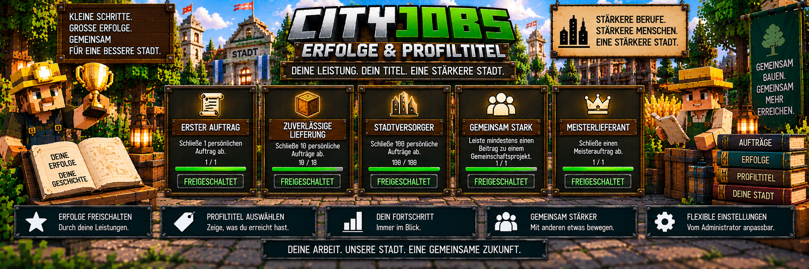

<link rel="stylesheet" href="style.css">



# 🏆 CityJobs – Erfolge & Profiltitel

CityJobs besitzt ein eigenes **Erfolgs- und Profiltitel-System**.

Spieler können durch ihre Arbeit verschiedene Meilensteine erreichen und dadurch Erfolge freischalten.

Freigeschaltete Erfolge können anschließend als **Profiltitel** verwendet werden.

So zeigt CityJobs nicht nur deinen aktuellen Beruf und Rang, sondern auch, was du während deiner Karriere bereits erreicht hast.

---

# 🏆 Die aktuellen Erfolge

CityJobs 1.0.0 enthält aktuell fünf Erfolge:

| Erfolg | Voraussetzung |
|---|---|
| 📜 Erster Auftrag | 1 persönlichen Auftrag abschließen |
| 📦 Zuverlässige Lieferung | 10 persönliche Aufträge abschließen |
| 🌆 Stadtversorger | 100 persönliche Aufträge abschließen |
| 🤝 Gemeinsam stark | mindestens einen Gemeinschaftsbeitrag leisten |
| 👑 Meisterlieferant | einen Meisterauftrag abschließen |

Jeder Erfolg steht für einen bestimmten Meilenstein innerhalb des CityJobs-Systems.

---

# 📜 Erster Auftrag

Der erste Erfolg lautet:

**Erster Auftrag**

Voraussetzung:

**1 persönlichen Auftrag erfolgreich abschließen**

Dieser Erfolg wird bereits am Anfang der CityJobs-Karriere freigeschaltet.

Der normale Ablauf:

```text
Beruf auswählen
        ↓
Berufs-NPC aufsuchen
        ↓
Auftrag annehmen
        ↓
Waren sammeln
        ↓
Auftrag abgeben
        ↓
🏆 Erster Auftrag
```

Damit wird der erste erfolgreich abgeschlossene persönliche Lieferauftrag ausgezeichnet.

---

# 📦 Zuverlässige Lieferung

Der nächste Meilenstein ist:

**Zuverlässige Lieferung**

Voraussetzung:

**10 persönliche Aufträge erfolgreich abschließen**

Dieser Erfolg zeigt, dass der Spieler bereits regelmäßig für seinen Beruf gearbeitet und mehrere Lieferungen abgeschlossen hat.

```text
Persönliche Aufträge:

1
2
3
4
5
6
7
8
9
10
↓
🏆 Zuverlässige Lieferung
```

---

# 🌆 Stadtversorger

Für besonders aktive Spieler gibt es den Erfolg:

**Stadtversorger**

Voraussetzung:

**100 persönliche Aufträge erfolgreich abschließen**

Dieser Erfolg ist ein langfristiger Meilenstein.

```text
100 persönliche Aufträge
        ↓
viele Waren geliefert
        ↓
Beruf weiterentwickelt
        ↓
🏆 Stadtversorger
```

Damit werden Spieler ausgezeichnet, die über längere Zeit aktiv am CityJobs-Wirtschaftssystem teilnehmen.

---

# 🤝 Gemeinsam stark

Nicht alle Erfolge drehen sich nur um persönliche Aufträge.

Der Erfolg:

**Gemeinsam stark**

wird freigeschaltet, sobald ein Spieler mindestens einen gültigen Beitrag zu einem Gemeinschaftsprojekt geleistet hat.

Voraussetzung:

**Mindestens 1 Gemeinschaftsbeitrag**

Beispiel:

```text
Gemeinschaftsprojekt
        ↓
passenden Beruf verwenden
        ↓
benötigte Waren beitragen
        ↓
Beitrag wird angenommen
        ↓
🏆 Gemeinsam stark
```

Damit wird die Zusammenarbeit mit anderen Spielern belohnt.

Mehr über Gemeinschaftsprojekte findest du unter:

**[Gemeinschaftsaufträge](cityjobs-gemeinschaft.md)**

---

# 👑 Meisterlieferant

Der Erfolg:

**Meisterlieferant**

richtet sich an besonders weit fortgeschrittene Spieler.

Voraussetzung:

**1 Meisterauftrag erfolgreich abschließen**

Meisteraufträge stehen Spielern mit dem entsprechenden höchsten Berufs-Rang zur Verfügung, sofern das System auf dem Server aktiviert ist.

```text
15.000 Berufs-XP
        ↓
👑 Meister
        ↓
Meisterauftrag erhalten
        ↓
Auftrag erfolgreich abschließen
        ↓
🏆 Meisterlieferant
```

---

# ⭐ Erfolge freischalten

Erfolge werden durch die entsprechenden Aktivitäten innerhalb von CityJobs freigeschaltet.

Der Spieler muss dafür keine speziellen Adminbefehle verwenden.

Beispiel:

```text
Auftrag abschließen
        ↓
CityJobs prüft Fortschritt
        ↓
Voraussetzung erreicht?
        ↓
JA
        ↓
🏆 Erfolg freigeschaltet
```

Der Fortschritt entsteht dadurch automatisch beim normalen Spielen.

---

# 📖 Erfolge im Berufsbuch

Die eigenen Erfolge können über das **Berufsbuch** angesehen werden.

Öffne es mit:

`/cityjobs`

Dort können Spieler ihre Karriere und freigeschalteten Erfolge verfolgen.

Mehr zum Berufsbuch findest du unter:

**[Berufsbuch](cityjobs-berufsbuch.md)**

---

# 🏷️ Profiltitel

Freigeschaltete Erfolge können als **Profiltitel** verwendet werden.

Damit kann ein Spieler einen erreichten Meilenstein für sein CityJobs-Profil auswählen.

Beispiel:

```text
SPIELERPROFIL

Aktiver Beruf:
⛏️ Bergarbeiter

Rang:
Experte

Profiltitel:
📦 Zuverlässige Lieferung
```

---

# 🔓 Welche Profiltitel stehen zur Verfügung?

Als Profiltitel können nur bereits freigeschaltete Erfolge verwendet werden.

Beispiel:

```text
Erster Auftrag
✔ freigeschaltet

Zuverlässige Lieferung
✔ freigeschaltet

Stadtversorger
✘ noch nicht freigeschaltet

Gemeinsam stark
✔ freigeschaltet

Meisterlieferant
✘ noch nicht freigeschaltet
```

In diesem Beispiel kann der Spieler zwischen:

- Erster Auftrag
- Zuverlässige Lieferung
- Gemeinsam stark

als Profiltitel wählen.

Die beiden noch nicht erreichten Erfolge stehen noch nicht als Titel zur Verfügung.

---

# 🔄 Profiltitel wechseln

Der ausgewählte Profiltitel ist nicht dauerhaft festgelegt.

Spieler können zwischen ihren bereits freigeschalteten Titeln wechseln.

Dadurch kann jeder Spieler selbst entscheiden, welchen seiner erreichten Meilensteine er aktuell verwenden möchte.

Beispiel:

```text
Bisheriger Titel:
📜 Erster Auftrag

↓ Titel wechseln ↓

Neuer Titel:
🤝 Gemeinsam stark
```

Der zugrunde liegende Erfolg bleibt natürlich weiterhin freigeschaltet.

---

# 👷 Erfolge sind nicht an einen einzigen Beruf gebunden

Die persönlichen Aufträge werden zwar mit dem jeweils aktiven Beruf abgeschlossen, die CityJobs-Erfolge bilden jedoch den übergreifenden Karrierefortschritt des Spielers ab.

Beispiel:

```text
Bergarbeiter:
4 persönliche Aufträge

Holzfäller:
3 persönliche Aufträge

Landwirt:
3 persönliche Aufträge

Gesamt:
10 persönliche Aufträge

↓
🏆 Zuverlässige Lieferung
```

Der Spieler kann dadurch verschiedene Berufe verwenden und trotzdem seine CityJobs-Meilensteine weiterentwickeln.

---

# 📈 Vom ersten Auftrag bis zum Stadtversorger

Die persönlichen Auftrags-Erfolge bilden eine kleine Fortschrittskette:

```text
1 Auftrag
   ↓
📜 Erster Auftrag

10 Aufträge
   ↓
📦 Zuverlässige Lieferung

100 Aufträge
   ↓
🌆 Stadtversorger
```

Dadurch gibt es sowohl einen frühen als auch einen langfristigen Meilenstein.

---

# 🤝 Gemeinsam spielen

Mit **Gemeinsam stark** besitzt CityJobs zusätzlich einen Erfolg, der nicht nur persönliche Aufträge berücksichtigt.

Der Spieler muss dafür an einem serverweiten Gemeinschaftsprojekt teilnehmen.

Damit werden auch Spieler ausgezeichnet, die gemeinsam mit anderen Berufen an den Zielen der Stadt arbeiten.

---

# 👑 Meister werden

Der Meisterlieferant ist eng mit dem höchsten Berufs-Rang verbunden.

Die Rangfolge lautet:

| Rang | Gesamt-XP |
|---|---:|
| Lehrling | 0 |
| Geselle | 500 |
| Facharbeiter | 2.000 |
| Experte | 6.000 |
| Meister | 15.000 |

Der Rang **Meister** allein schaltet den Erfolg Meisterlieferant noch nicht frei.

Der Spieler muss zusätzlich tatsächlich einen **Meisterauftrag erfolgreich abschließen**.

---

# ⚙️ Meisteraufträge können deaktiviert werden

Administratoren können das Meisterauftragssystem auf ihrem Server deaktivieren.

Standardmäßig ist es aktiviert.

Ist das System deaktiviert, werden keine entsprechenden Meisteraufträge angeboten.

Die Einstellung kann über die CityJobs-Verwaltung angepasst werden.

---

# ⚙️ Erfolgssystem aktivieren oder deaktivieren

Auch das komplette Erfolgssystem kann vom Administrator aktiviert oder deaktiviert werden.

Standardmäßig ist es:

**aktiviert**

Administratoren öffnen die Verwaltung mit:

`/cityjobs admin`

und anschließend:

**Einstellungen**

Dort kann das Erfolgssystem entsprechend konfiguriert werden.

---

# 💾 Erfolge bleiben gespeichert

Freigeschaltete Erfolge und Profiltitel gehören zu den gespeicherten CityJobs-Spielerdaten.

Dadurch bleiben sie auch nach einem Serverneustart erhalten.

Beispiel:

```text
Spieler besitzt:

✔ Erster Auftrag
✔ Zuverlässige Lieferung
✔ Gemeinsam stark

Ausgewählter Titel:
🤝 Gemeinsam stark

↓ Serverneustart ↓

Erfolge und Titel
bleiben gespeichert
```

Der Spieler muss seine bereits erreichten Erfolge also nicht erneut freischalten.

---

# 🔄 Berufswechsel löscht keine Erfolge

Ein Wechsel des aktiven Berufs löscht keine bereits erreichten CityJobs-Erfolge.

Beispiel:

```text
Aktiver Beruf:
⛏️ Bergarbeiter

Erfolge:
✔ Erster Auftrag
✔ Zuverlässige Lieferung
✔ Gemeinsam stark

↓ Wechsel ↓

Aktiver Beruf:
🌾 Landwirt

Erfolge:
✔ Erster Auftrag
✔ Zuverlässige Lieferung
✔ Gemeinsam stark
```

Die Erfolge gehören zur CityJobs-Karriere des Spielers und bleiben erhalten.

---

# 📊 Erfolge und Berufsfortschritt

Erfolge und Berufs-Ränge sind zwei unterschiedliche Systeme.

## Berufs-Ränge

Zeigen den Fortschritt eines einzelnen Berufs.

Beispiel:

```text
⛏️ Bergarbeiter
Experte
8.500 XP
```

## Erfolge

Zeigen besondere Meilensteine der gesamten CityJobs-Karriere.

Beispiel:

```text
🏆 Erfolge

✔ Erster Auftrag
✔ Zuverlässige Lieferung
✔ Gemeinsam stark
```

Beide Systeme ergänzen sich.

---

# 🏷️ Erfolge und Profiltitel

Das Prinzip ist einfach:

```text
CityJobs spielen
        ↓
Meilenstein erreichen
        ↓
🏆 Erfolg freischalten
        ↓
🏷️ Erfolg als Profiltitel verfügbar
        ↓
gewünschten Titel auswählen
```

Dadurch haben freigeschaltete Erfolge nicht nur einen Sammlerwert, sondern können auch für das eigene Profil verwendet werden.

---

# 🏆 Übersicht aller Erfolge

| Erfolg | Voraussetzung | Als Profiltitel |
|---|---|:---:|
| 📜 Erster Auftrag | 1 persönlichen Auftrag abschließen | ✔ |
| 📦 Zuverlässige Lieferung | 10 persönliche Aufträge abschließen | ✔ |
| 🌆 Stadtversorger | 100 persönliche Aufträge abschließen | ✔ |
| 🤝 Gemeinsam stark | mindestens 1 Gemeinschaftsbeitrag | ✔ |
| 👑 Meisterlieferant | 1 Meisterauftrag abschließen | ✔ |

---

# 💡 Kurz erklärt

Das Erfolgs- und Profiltitel-System funktioniert so:

```text
1. CityJobs spielen

2. persönliche Aufträge abschließen

3. Gemeinschaftsprojekte unterstützen

4. im Beruf aufsteigen

5. Meisteraufträge erledigen

6. Erfolge automatisch freischalten

7. Berufsbuch öffnen

8. freigeschaltete Erfolge ansehen

9. gewünschten Profiltitel auswählen

10. weitere Meilensteine erreichen
```

So begleitet das Erfolgssystem den Spieler vom ersten persönlichen Auftrag bis zu den höchsten Herausforderungen von CityJobs.

---

[← Zurück: Berufsbuch](cityjobs-berufsbuch.md) | [Weiter: Bauprojekte →](cityjobs-bauprojekte.md)
