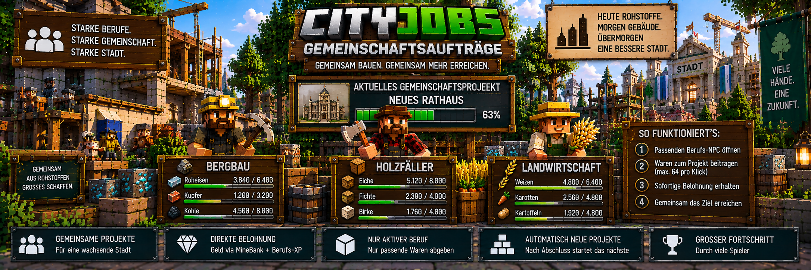

<link rel="stylesheet" href="style.css">



# 🤝 CityJobs – Gemeinschaftsaufträge

Gemeinschaftsaufträge sind serverweite Lieferprojekte, bei denen mehrere Spieler gemeinsam auf ein Ziel hinarbeiten.

Anders als bei persönlichen Aufträgen gehört ein Gemeinschaftsauftrag nicht nur einem einzelnen Spieler.

Stattdessen können Spieler der verschiedenen Berufe gemeinsam die benötigten Waren liefern.

Aktuell können sich beteiligen:

- ⛏️ **Bergarbeiter**
- 🪓 **Holzfäller**
- 🌾 **Landwirt**

Jeder Beitrag zählt zum gemeinsamen Fortschritt des Servers.

---

# 🌆 Ein gemeinsames Projekt

Ein Gemeinschaftsprojekt enthält Lieferziele für die verschiedenen Berufe.

Beispiel:

```text
GEMEINSCHAFTSPROJEKT

⛏️ Bergarbeiter
Roheisen
320 / 512

🪓 Holzfäller
Eichenstämme
410 / 512

🌾 Landwirt
Weizen
275 / 512
```

Alle Spieler arbeiten gemeinsam daran, die benötigten Mengen zu erreichen.

---

# 🔄 So funktioniert ein Gemeinschaftsauftrag

Der grundlegende Ablauf:

```text
passenden Berufs-NPC öffnen
        ↓
Gemeinschaftsprojekt ansehen
        ↓
passende Waren im Inventar haben
        ↓
Waren zum Projekt beitragen
        ↓
Geld über MineBank erhalten
        ↓
Berufs-XP erhalten
        ↓
gemeinsamer Fortschritt steigt
```

Die Belohnung erfolgt direkt für den jeweiligen Beitrag.

---

# 👷 Der aktive Beruf entscheidet

Ein Spieler kann nur Waren für seinen **aktuell aktiven Beruf** zum Gemeinschaftsprojekt beitragen.

Beispiel:

```text
Aktiver Beruf:
⛏️ Bergarbeiter

Erlaubt:
✔ Bergarbeiter-Waren beitragen

Nicht erlaubt:
✘ Holzfäller-Waren beitragen
✘ Landwirt-Waren beitragen
```

Möchte ein Spieler zu einem anderen Berufsbereich beitragen, muss er zunächst seinen aktiven Beruf wechseln.

Der Berufswechsel erfolgt über den Berufsberater.

---

# ⛏️ Bergarbeiter

Der Bergarbeiter trägt die für seinen Berufsbereich benötigten Rohstoffe bei.

Je nach erzeugtem Gemeinschaftsprojekt können entsprechende Bergbauwaren benötigt werden.

Beispiel:

```text
⛏️ BERGBAU

Roheisen
320 / 512
```

Der Spieler benötigt dafür den aktiven Beruf **Bergarbeiter**.

---

# 🪓 Holzfäller

Der Holzfäller liefert die für seinen Bereich verlangten Holzmaterialien.

Beispiel:

```text
🪓 HOLZFÄLLER

Eichenstämme
410 / 512
```

Nur Spieler mit aktivem Holzfäller-Beruf können entsprechende Beiträge leisten.

---

# 🌾 Landwirt

Der Landwirt liefert landwirtschaftliche Waren für das Gemeinschaftsprojekt.

Beispiel:

```text
🌾 LANDWIRT

Weizen
275 / 512
```

Auch hier muss der Landwirt der aktuell aktive Beruf des Spielers sein.

---

# 📦 Waren beitragen

Die benötigten Waren müssen sich im Inventar des Spielers befinden.

Beim Beitragen nimmt CityJobs nur so viele Waren, wie für das aktuelle Ziel tatsächlich noch benötigt werden.

Dadurch werden keine unnötigen Waren eingezogen.

---

# 📥 Maximal 64 Waren pro Klick

Pro Beitrag können maximal:

**64 Gegenstände**

auf einmal abgegeben werden.

Beispiel:

```text
Im Inventar:
128x Roheisen

Noch benötigt:
200x Roheisen

Beitrag:
64x Roheisen

Danach:
64x Roheisen verbleiben im Inventar
```

Der Spieler kann anschließend erneut beitragen.

---

# 🛡️ Keine Überlieferung

CityJobs nimmt niemals mehr Waren an, als für das jeweilige Ziel noch benötigt werden.

Beispiel:

```text
Noch benötigt:
20x Weizen

Spieler besitzt:
64x Weizen

CityJobs nimmt:
20x Weizen

Im Inventar bleiben:
44x Weizen
```

Dadurch gehen keine Waren verloren, nur weil das Gemeinschaftsziel fast abgeschlossen ist.

---

# 💰 Direkte Auszahlung

Bei Gemeinschaftsaufträgen muss nicht gewartet werden, bis das komplette Projekt abgeschlossen ist.

Ein gültiger Beitrag wird direkt belohnt.

Der Spieler erhält:

- 💰 Geld über MineBank
- ⭐ Berufs-XP
- 📈 Fortschritt für seinen aktiven Beruf

Der Beitrag erhöht gleichzeitig den gemeinsamen Projektfortschritt.

---

# 🏦 MineBank

Alle Geldzahlungen laufen über **MineBank**.

Für einen bezahlten Beitrag benötigt der Spieler deshalb ein gültiges Bankkonto.

Der Ablauf sieht vereinfacht so aus:

```text
Waren beitragen
        ↓
Beitrag wird geprüft
        ↓
Waren werden angenommen
        ↓
MineBank-Auszahlung
        ↓
Berufs-XP
        ↓
Gemeinschaftsfortschritt steigt
```

---

# ⭐ Berufs-XP

Gemeinschaftsbeiträge können zusätzlich Berufs-XP geben.

Die XP werden dem aktuell passenden Beruf gutgeschrieben.

Beispiel:

```text
Aktiver Beruf:
🌾 Landwirt

Beitrag:
Weizen

Belohnung:
💰 MineBank-Geld
⭐ Landwirt-XP
```

Der Fortschritt eines anderen Berufs wird dadurch nicht erhöht.

---

# ⚙️ Gemeinschafts-XP einstellen

Administratoren können festlegen, wie viele Berufs-XP Gemeinschaftsbeiträge bringen.

Standardmäßig gilt:

**1 Berufs-XP pro Gegenstand**

Der mögliche Einstellungsbereich liegt bei:

**0 bis 20 XP pro Gegenstand**

Bei `0` können Gemeinschaftsbeiträge ohne zusätzliche Berufs-XP betrieben werden.

---

# 📊 Standardgröße eines Gemeinschaftsziels

Standardmäßig verwendet CityJobs für Gemeinschaftsziele eine Menge von:

**512 Gegenständen pro Ware**

Administratoren können diesen Wert verändern.

Der mögliche Bereich liegt bei:

**64 bis 8.192 Gegenständen**

Damit kann das System sowohl für kleinere als auch für größere Server angepasst werden.

---

# 💵 Gemeinschaftsbonus

Für Gemeinschaftsbeiträge besitzt CityJobs außerdem einen eigenen Belohnungsbonus.

Standardmäßig beträgt dieser:

**10 %**

Administratoren können den Wert über die CityJobs-Einstellungen anpassen.

---

# ⚙️ Standard-Einstellungen

Für Gemeinschaftsprojekte gelten standardmäßig:

| Einstellung | Standard |
|---|---:|
| Gemeinschaftsaufträge | aktiviert |
| Menge pro Ware | 512 |
| Belohnungsbonus | 10 % |
| Berufs-XP pro Gegenstand | 1 |
| maximale Abgabe pro Klick | 64 |

Die Einstellungen können über die CityJobs-Administration angepasst werden.

---

# 🛠️ Gemeinschaftsaufträge verwalten

Administratoren öffnen die CityJobs-Verwaltung mit:

`/cityjobs admin`

Die entsprechenden Einstellungen befinden sich im Bereich:

**Einstellungen**

Dort kann das Gemeinschaftssystem unter anderem aktiviert oder deaktiviert werden.

---

# 🚫 Gemeinschaftsaufträge deaktivieren

Ein Server muss das Gemeinschaftssystem nicht verwenden.

Administratoren können Gemeinschaftsaufträge vollständig deaktivieren.

Die persönlichen Berufsaufträge können trotzdem weiterhin verwendet werden.

Dadurch kann jeder Server selbst entscheiden, welche CityJobs-Systeme eingesetzt werden sollen.

---

# 🏁 Wann ist ein Gemeinschaftsprojekt abgeschlossen?

Ein Gemeinschaftsprojekt ist abgeschlossen, sobald alle benötigten Ziele erfüllt wurden.

Beispiel:

```text
⛏️ Bergarbeiter
512 / 512 ✔

🪓 Holzfäller
512 / 512 ✔

🌾 Landwirt
512 / 512 ✔

----------------

GEMEINSCHAFTSPROJEKT
ABGESCHLOSSEN
```

Dabei zählt der gemeinsame Fortschritt aller beteiligten Spieler.

---

# 🔄 Automatisch neues Projekt

Nachdem ein Gemeinschaftsprojekt vollständig abgeschlossen wurde und die notwendigen Bankprüfungen erledigt sind, kann CityJobs automatisch ein neues Gemeinschaftsprojekt erzeugen.

Dadurch entsteht ein fortlaufender Kreislauf:

```text
Gemeinschaftsprojekt startet
        ↓
Spieler liefern Waren
        ↓
Ziele werden erreicht
        ↓
Projekt abgeschlossen
        ↓
offene Bankprüfungen werden berücksichtigt
        ↓
neues Gemeinschaftsprojekt
```

Der Server muss dadurch nicht nach jedem abgeschlossenen Gemeinschaftsauftrag manuell ein neues Projekt erstellen.

---

# 🏆 Erfolg „Gemeinsam stark“

Das Erfolgssystem von CityJobs ist ebenfalls mit den Gemeinschaftsaufträgen verbunden.

Wer mindestens einmal zu einem Gemeinschaftsprojekt beiträgt, kann den Erfolg:

**Gemeinsam stark**

freischalten.

Freigeschaltete Erfolge können anschließend auch für das Profiltitel-System relevant sein.

---

# 📖 Gemeinschaftsprojekt im Berufsbuch

Das CityJobs-Berufsbuch bietet ebenfalls Informationen zu den gemeinsamen Projekten.

Öffne das Berufsbuch mit:

`/cityjobs`

Zusätzlich kann es über den passenden Berufs-NPC erreicht werden.

So können Spieler ihren persönlichen Berufsfortschritt und die gemeinsamen Ziele der Stadt verfolgen.

---

# 🔐 Sichere Bankabwicklung

Auch Gemeinschaftsbeiträge verwenden die abgesicherte Bankabwicklung von CityJobs.

Bei einer Lieferung müssen Waren und Zahlung zusammen verarbeitet werden.

Falls der Zahlungsstatus nicht eindeutig bestimmt werden kann, kann CityJobs einen:

**Bankprüffall**

erstellen.

Dadurch soll verhindert werden, dass:

- Waren verloren gehen
- Zahlungen doppelt ausgeführt werden
- ein unklarer Vorgang einfach erneut eingereicht wird

---

# 🔍 Gemeinschafts-Bankprüfung

Administratoren können offene Fälle über:

`/cityjobs admin`

und anschließend:

**Bankprüfung**

kontrollieren.

Dort werden nicht nur persönliche Aufträge berücksichtigt.

Die Bankprüfung kann auch Fälle aus:

- persönlichen Aufträgen
- Gemeinschaftsbeiträgen
- Bauprojekten

enthalten.

Die weitere Entscheidung erfolgt nach Prüfung der entsprechenden Bankhistorie.

---

# 💾 Fortschritt bleibt gespeichert

Gemeinschaftsprojekte und ihr Fortschritt werden in den CityJobs-Weltdaten gespeichert.

Dadurch geht der Projektfortschritt nicht einfach verloren, wenn der Server neu gestartet wird.

Beispiel:

```text
Vor Serverneustart:

Roheisen
350 / 512

↓ Serverneustart ↓

Nach Serverneustart:

Roheisen
350 / 512
```

Die Spieler können anschließend weiter am bestehenden Projekt arbeiten.

---

# 🆚 Persönliche und Gemeinschaftsaufträge

Persönliche Aufträge und Gemeinschaftsaufträge verfolgen unterschiedliche Ziele.

| Persönliche Aufträge | Gemeinschaftsaufträge |
|---|---|
| gehören einem Spieler | gehören dem gesamten Server |
| drei aktuelle Angebote | gemeinsames Lieferziel |
| Auftrag wird angenommen | Waren werden direkt beigetragen |
| Waren werden gesammelt | mehrere Spieler liefern |
| Tageslimit vorhanden | gemeinsamer Fortschritt |
| Geld + Berufs-XP | Geld + Berufs-XP pro Beitrag |
| persönliche Lieferhistorie | serverweites Ziel |
| Groß- und Meisteraufträge möglich | neues Projekt nach Abschluss |

Beide Systeme können parallel verwendet werden.

---

# 🏗️ Unterschied zu Stadtbauprojekten

Gemeinschaftsaufträge dürfen nicht mit den großen Stadtbauprojekten verwechselt werden.

Bei einem Gemeinschaftsauftrag werden gemeinsame Lieferziele erfüllt.

Bei einem Stadtbauprojekt werden dagegen tatsächlich Gebäude in der Minecraft-Welt errichtet.

Beispiel:

```text
GEMEINSCHAFTSAUFTRAG

Waren liefern
        ↓
gemeinsames Ziel erreichen
        ↓
neues Gemeinschaftsprojekt


STADTBAUPROJEKT

Baumaterial liefern
        ↓
Baufortschritt erhöhen
        ↓
Gebäude entsteht in der Welt
```

Beide Systeme fördern die Zusammenarbeit zwischen den verschiedenen Berufen.

---

# 🌆 Gemeinsam für die Stadt

Gemeinschaftsaufträge sorgen dafür, dass die Berufe nicht vollständig voneinander getrennt arbeiten.

Stattdessen tragen:

```text
⛏️ Bergarbeiter
      +
🪓 Holzfäller
      +
🌾 Landwirte
      ↓
🤝 Gemeinschaft
      ↓
🌆 Fortschritt der Stadt
```

gemeinsam zu einem serverweiten Ziel bei.

Jeder Spieler kann mit seinem Beruf einen Teil zum Fortschritt beitragen.

---

# 💡 Kurz erklärt

So funktioniert ein Gemeinschaftsauftrag:

```text
1. Aktiven Beruf auswählen

2. Passenden Berufs-NPC aufsuchen

3. Gemeinschaftsprojekt öffnen

4. Benötigte Waren ansehen

5. Passende Waren sammeln

6. Waren zum Projekt beitragen

7. Maximal 64 Gegenstände pro Klick

8. Nur die noch benötigte Menge wird angenommen

9. Direkte MineBank-Auszahlung erhalten

10. Berufs-XP erhalten

11. Gemeinsamer Fortschritt steigt

12. Alle Ziele gemeinsam abschließen

13. Neues Gemeinschaftsprojekt startet automatisch
```

So verbindet CityJobs die einzelnen Berufe zu einer gemeinsamen Arbeitswelt, in der nicht nur der persönliche Fortschritt zählt, sondern auch die Entwicklung der gesamten Stadt.

---

[← Zurück: Aufträge](cityjobs-auftraege.md) | [Weiter: Berufsbuch →](cityjobs-berufsbuch.md)
