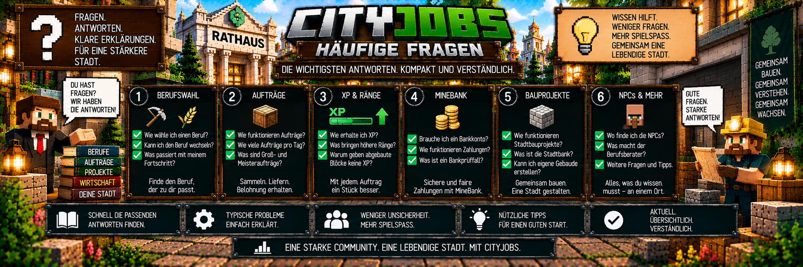

<link rel="stylesheet" href="style.css">



# ❓ CityJobs – Häufige Fragen

Hier findest du Antworten auf häufige Fragen zu **CityJobs 1.0.0**.

Die FAQ behandelt unter anderem:

- 👷 Berufe
- ⭐ Berufs-XP und Ränge
- 📦 persönliche Aufträge
- 🤝 Gemeinschaftsaufträge
- 🏦 MineBank / BankMod
- 🏗️ Stadtbauprojekte
- 🏠 eigene Gebäudevorlagen
- 🧑‍💼 Berufs-NPCs
- 🔍 Bankprüffälle
- 🛠️ Administration

---

# 👷 Welche Berufe gibt es?

CityJobs 1.0.0 besitzt aktuell drei Berufe:

### ⛏️ Bergarbeiter

Sammelt natürliche Erze und andere Bergbau-Ressourcen.

### 🪓 Holzfäller

Fällt natürlich gewachsene Bäume und sammelt Holz.

### 🌾 Landwirt

Erntet reife Feldfrüchte und andere landwirtschaftliche Produkte.

Weitere Berufe können in zukünftigen Versionen hinzukommen.

---

# 🧑‍💼 Wie wähle ich einen Beruf?

Die erste Berufswahl erfolgt über den:

**Berufsberater**

Interagiere mit dem Berufsberater und wähle anschließend den gewünschten Beruf aus.

Zur Auswahl stehen:

```text
Bergarbeiter
Holzfäller
Landwirt
```

---

# 🔄 Kann ich meinen Beruf später wechseln?

Ja.

Ein späterer Berufswechsel ist über den Berufsberater möglich.

Der Wechsel muss bestätigt werden.

Standardmäßig gilt anschließend beziehungsweise zwischen Berufswechseln ein Cooldown von:

**60 Minuten Serverlaufzeit**

Administratoren können diesen Wert verändern.

Bei:

```text
0 Minuten
```

ist der Wechsel-Cooldown deaktiviert.

---

# ⭐ Verliere ich beim Berufswechsel meine XP?

Nein.

CityJobs speichert den Fortschritt der einzelnen Berufe getrennt.

Beispiel:

```text
Bergarbeiter
8.000 XP

Holzfäller
2.500 XP

Landwirt
750 XP
```

Wenn du vom Bergarbeiter zum Holzfäller wechselst, bleiben deine Bergarbeiter-XP gespeichert.

Nur dein aktuell aktiver Beruf entwickelt sich durch normale Berufsarbeit und entsprechende Aufträge weiter.

---

# 📊 Welche Ränge gibt es?

Jeder Beruf besitzt fünf Ränge:

| Rang | Benötigte Berufs-XP |
|---|---:|
| Lehrling | 0 |
| Geselle | 500 |
| Facharbeiter | 2.000 |
| Experte | 6.000 |
| Meister | 15.000 |

Dein Rang steigt automatisch, sobald du genügend Berufs-XP gesammelt hast.

---

# ⭐ Wie bekomme ich Berufs-XP?

Berufs-XP kannst du unter anderem erhalten durch:

- normale Arbeit deines aktiven Berufs
- persönliche Aufträge
- Gemeinschaftsbeiträge
- Lieferungen für Stadtbauprojekte

Welche normale Tätigkeit XP gibt, hängt vom Beruf ab.

---

# ⛏️ Warum bekomme ich beim Abbauen keine XP?

Dafür kann es mehrere Gründe geben.

Prüfe zuerst:

### Ist Bergarbeiter dein aktiver Beruf?

Nur der aktuell aktive passende Beruf erhält Berufsfortschritt.

### Ist der Block für den Beruf gültig?

Nicht jeder abgebaute Block gibt Bergarbeiter-XP.

Normaler Stein gibt beispielsweise keine Bergarbeiter-XP.

### Wurde der Block vorher von einem Spieler gesetzt?

CityJobs besitzt einen Anti-Farm-Schutz.

Von Spielern gesetzte Blöcke können nicht einfach immer wieder gesetzt und abgebaut werden, um unbegrenzt Berufs-XP zu erzeugen.

### Bist du im Kreativmodus oder Zuschauermodus?

Im Kreativ- und Zuschauermodus wird keine normale Arbeits-XP vergeben.

---

# 🪓 Warum gibt mein selbst gepflanzter Baum keine normalen XP wie erwartet?

CityJobs versucht bei der Holzfäller-Arbeit natürliche beziehungsweise gültige Baumstämme zu erkennen.

Zusätzlich schützt das System vor einfachen Setzen-und-Abbauen-XP-Farmen.

Der Holzfäller soll durch echte Arbeit Fortschritt erhalten und nicht durch das wiederholte Abbauen derselben künstlich gesetzten Blöcke.

---

# 🌾 Warum gibt meine Pflanze keine XP?

Bei vielen landwirtschaftlichen Pflanzen muss die Pflanze vollständig reif sein.

Beispielsweise geben:

- reifer Weizen
- reife Kartoffeln
- reife Karotten
- reife Rote Bete
- reifer Kakao
- reife Netherwarzen

Berufs-XP.

Unreife Feldfrüchte geben keine normale Landwirt-XP.

---

# 💰 Bekomme ich nach jedem einzelnen Block Geld?

Nicht unbedingt.

Bei normaler Berufsarbeit sammelt CityJobs Arbeitsfortschritt.

Je nach Rang wird nach einer bestimmten Anzahl gültiger Arbeitsblöcke eine Auszahlung ausgelöst.

| Rang | Arbeitsblöcke pro Auszahlung |
|---|---:|
| Lehrling | 20 |
| Geselle | 40 |
| Facharbeiter | 60 |
| Experte | 80 |
| Meister | 100 |

Die Berufs-XP werden währenddessen weiter gesammelt.

---

# 📦 Wie funktionieren persönliche Aufträge?

Gehe zum NPC deines aktiven Berufs.

Dort werden dir aktuelle Auftragsangebote angezeigt.

Normalerweise stehen:

**3 aktuelle Angebote**

zur Verfügung.

Ein Auftrag kann beispielsweise verlangen:

```text
32x Roheisen
```

oder als gemischter Auftrag:

```text
32x Roheisen
+
16x Kohle
```

Du nimmst den Auftrag an, sammelst die benötigten Waren und kehrst anschließend zum Berufs-NPC zurück.

---

# 🎒 Wo müssen sich die Waren befinden?

Die benötigten Waren müssen sich bei der Abgabe im Spielerinventar befinden.

CityJobs prüft die benötigten Gegenstände und Mengen bei der Abgabe.

Für normale Auftragswaren werden gewöhnliche Gegenstände ohne zusätzliche besondere NBT-Daten erwartet.

---

# ❌ Kann ich einen angenommenen Auftrag abbrechen?

Ja.

Ein angenommener persönlicher Auftrag kann mit einer Bestätigung abgebrochen werden.

Beim normalen Abbrechen werden keine Auftragswaren aus deinem Inventar entfernt.

---

# 📅 Wie viele Aufträge kann ich pro Tag erledigen?

Standardmäßig können Spieler:

**3 persönliche Aufträge pro Minecraft-Tag**

abschließen.

Wichtig:

Dieses Limit gilt gemeinsam über alle Berufe.

Beispiel:

```text
2 Bergarbeiter-Aufträge
+
1 Holzfäller-Auftrag
=
3 Aufträge
```

Damit ist das Standard-Tageslimit erreicht.

Ein Berufswechsel setzt das Limit nicht zurück.

Administratoren können das Limit anpassen.

---

# 📦 Was sind Großaufträge?

Großaufträge sind größere Varianten normaler persönlicher Aufträge.

Standardmäßig beträgt die Chance:

**20 %**

Der Standard-Mengenfaktor beträgt:

**3**

Zusätzlich kann ein Preisbonus angewendet werden.

Standard:

**15 %**

Die Werte können vom Serveradministrator verändert werden.

---

# 👑 Was sind Meisteraufträge?

Meisteraufträge sind besondere Aufträge für Spieler mit dem Rang:

**Meister**

Sie können deutlich größere Liefermengen verlangen.

Standardmäßig ist das Meisterauftragssystem aktiviert.

Der Standard-Mengenfaktor beträgt:

**4**

Der zusätzliche Standardbonus beträgt:

**25 %**

---

# 🤝 Was sind Gemeinschaftsaufträge?

Gemeinschaftsaufträge sind serverweite Lieferprojekte.

Dabei arbeiten mehrere Spieler gemeinsam an größeren Lieferzielen.

Die Ziele können Materialien aus allen drei Berufen enthalten.

---

# 👷 Kann jeder alles zum Gemeinschaftsauftrag beitragen?

Nein.

Ein Spieler kann nur Waren beitragen, die zu seinem aktuell aktiven Beruf passen.

Beispiel:

Ein aktiver Bergarbeiter liefert Bergbau-Ressourcen.

Ein aktiver Holzfäller liefert passende Holz-Ressourcen.

Ein aktiver Landwirt liefert landwirtschaftliche Waren.

---

# 📦 Wie viel kann ich auf einmal zum Gemeinschaftsauftrag beitragen?

Pro Abgabe können maximal:

**64 Gegenstände**

beigetragen werden.

CityJobs nimmt außerdem nicht mehr Waren als für das entsprechende Ziel noch benötigt werden.

---

# 💰 Muss ich bis zum Ende des Gemeinschaftsprojekts auf mein Geld warten?

Nein.

Gültige Gemeinschaftsbeiträge werden direkt vergütet.

Du erhältst für deinen Beitrag:

- MineBank-Auszahlung
- Berufs-XP

Der Gesamtfortschritt des Gemeinschaftsprojekts steigt gleichzeitig weiter.

---

# 🏦 Brauche ich MineBank?

Ja.

**MineBank / BankMod ist eine erforderliche Abhängigkeit von CityJobs.**

CityJobs 1.0.0 benötigt mindestens:

**BankMod 1.0.0.1**

Die Bankanbindung wird für die Geldabwicklung von CityJobs verwendet.

---

# 💳 Brauche ich ein Bankkonto?

Für bezahlte CityJobs-Lieferungen benötigst du ein gültiges Bankkonto.

Ohne ein gültiges Konto kann die normale Auszahlung nicht durchgeführt werden.

Das betrifft unter anderem:

- persönliche Aufträge
- Gemeinschaftsbeiträge
- bezahlte Bauprojektlieferungen

---

# 💶 Warum bekomme ich kein Geld?

Prüfe zuerst:

### 1. Hast du ein gültiges Bankkonto?

Für bezahlte Lieferungen wird ein Bankkonto benötigt.

### 2. Ist MineBank / BankMod korrekt installiert?

CityJobs benötigt BankMod ab Version 1.0.0.1.

### 3. Läuft auf Client und Server die passende Mod-Konfiguration?

CityJobs muss auf Client und Server installiert sein.

### 4. Gibt es einen offenen Bankprüffall?

Bei einem unklaren Zahlungsstatus kann CityJobs den Vorgang zur Sicherheit sperren und einen Bankprüffall erzeugen.

In diesem Fall sollte ein Administrator die Bankprüfung kontrollieren.

---

# 🔍 Was ist ein Bankprüffall?

Ein Bankprüffall entsteht, wenn CityJobs nach einer Warenverarbeitung nicht sicher feststellen kann, ob eine Zahlung erfolgreich durchgeführt wurde.

Beispiel:

```text
Waren wurden entfernt
        ↓
Bankzahlung ausgelöst
        ↓
Zahlungsstatus unklar
        ↓
Bankprüffall
```

CityJobs zahlt in diesem Fall nicht einfach ein zweites Mal.

Dadurch werden Doppelzahlungen verhindert.

---

# 🛡️ Kann ich bei einem Bankfehler meine Waren verlieren?

CityJobs besitzt Schutzmechanismen für solche Situationen.

Wenn eine Zahlung eindeutig abgelehnt wurde, können bereits entfernte Waren entsprechend zurückgegeben werden.

Ist der Zahlungsstatus dagegen unklar, wird ein Bankprüffall erzeugt.

Ein Administrator kann anschließend kontrollieren, ob die Zahlung tatsächlich stattgefunden hat.

---

# 🔁 Warum kann ich meinen Auftrag nicht noch einmal abgeben?

Möglicherweise existiert ein offener Bankprüffall.

Solange nicht eindeutig geklärt ist, ob eine Zahlung bereits erfolgt ist, verhindert CityJobs eine einfache erneute Einreichung.

Das schützt die Serverwirtschaft vor Doppelzahlungen.

---

# 🧑‍💼 Was macht der Berufsberater?

Der Berufsberater ist die zentrale Anlaufstelle für die Berufswahl.

Dort kannst du:

- deinen ersten Beruf auswählen
- später deinen aktiven Beruf wechseln

Der Berufsberater bleibt ein zentraler Bestandteil des CityJobs-Systems.

---

# 👷 Welche anderen NPCs gibt es?

Zusätzlich zum Berufsberater gibt es aktuell:

- ⛏️ Bergbau-Vorarbeiter
- 🪓 Holzfäller
- 🌾 Landwirt

Diese NPCs gehören zu den jeweiligen Berufen.

Über sie werden unter anderem berufsspezifische Auftrags- und Lieferfunktionen erreicht.

---

# 👀 Warum kann ich einen NPC nicht benutzen?

Für die sichere NPC-Interaktion gelten einige Voraussetzungen.

Der Spieler muss unter anderem:

- am Leben sein
- darf kein Zuschauer sein
- sich innerhalb von ungefähr 6 Blöcken befinden

Eine NPC-Menüsitzung ist außerdem nur für begrenzte Zeit gültig.

Die Sitzungsdauer beträgt ungefähr:

**1 Minute**

---

# ⚔️ Kann man die CityJobs-NPCs töten?

Die CityJobs-NPCs sind für ihre Funktion geschützt.

Sie sind unter anderem:

- unverwundbar
- persistent
- unbeweglich
- gegen Knockback geschützt

Administratoren können CityJobs-NPCs über die vorgesehenen Adminfunktionen entfernen.

---

# 📖 Wie öffne ich mein Berufsbuch?

Verwende:

`/cityjobs`

Das Berufsbuch kann außerdem über die Berufs-NPCs erreicht werden.

---

# 📖 Was zeigt das Berufsbuch?

Das Berufsbuch enthält unter anderem:

- Berufsfortschritt
- Ränge
- abgeschlossene persönliche Aufträge
- verdientes Geld
- Lieferhistorie
- Erfolge
- Profiltitel
- aktuelles Stadtbauprojekt

Die Lieferhistorie speichert standardmäßig:

**50 Einträge**

Administratoren können den Wert zwischen:

**10 und 100**

einstellen.

---

# 🏆 Gibt es Erfolge?

Ja.

CityJobs 1.0.0 besitzt aktuell folgende Erfolge:

| Erfolg | Voraussetzung |
|---|---|
| Erster Auftrag | 1 persönlichen Auftrag abschließen |
| Zuverlässige Lieferung | 10 persönliche Aufträge abschließen |
| Stadtversorger | 100 persönliche Aufträge abschließen |
| Gemeinsam stark | mindestens einen Gemeinschaftsbeitrag leisten |
| Meisterlieferant | einen Meisterauftrag abschließen |

---

# 🏷️ Was sind Profiltitel?

Freigeschaltete CityJobs-Erfolge können als Profiltitel verwendet werden.

Damit kann ein Spieler einen seiner freigeschalteten Erfolge als persönlichen Titel auswählen.

Das Erfolgssystem kann vom Administrator deaktiviert werden.

---

# 🏗️ Was sind Stadtbauprojekte?

CityJobs besitzt große gemeinschaftliche Stadtbauprojekte.

Aktuell gehören dazu unter anderem:

- 🏛️ modernes Rathaus
- 🏦 moderne Stadtbank
- 🏠 eigene Gebäudevorlagen

Spieler liefern die benötigten Materialien über die entsprechenden Berufssysteme.

Das Gebäude entsteht anschließend schrittweise.

---

# 🏛️ Wie groß ist das Rathaus?

Das moderne CityJobs-Rathaus besitzt eine Größe von:

**35 × 27 × 17 Blöcken**

Das Projekt beginnt mit einer Baustelle und besitzt anschließend vier Bauphasen:

1. Fundament
2. Tragwerk
3. Fassade und Dach
4. Einrichtung und Vorplatz

---

# 🏦 Wie groß ist die Stadtbank?

Die moderne CityJobs-Stadtbank besitzt eine Größe von:

**33 × 29 × 12 Blöcken**

Sie enthält unter anderem:

- Schalterhalle
- Beratungsbereich
- Wartebereich
- Tresorbereich
- beleuchtete freie ATM-Nische

---

# 🏧 Wird automatisch ein MineBank-ATM gebaut?

Nein.

Die CityJobs-Stadtbank besitzt eine vorgesehene ATM-Nische.

Ein funktionierender MineBank-ATM wird jedoch nicht automatisch platziert.

Der Administrator kann die eigentliche Bankeinrichtung anschließend selbst ergänzen.

---

# 🧱 Können Spieler ein laufendes Bauprojekt zerstören?

Der Bereich eines aktiven, noch nicht fertiggestellten CityJobs-Bauprojekts ist gegen normale Blockänderungen geschützt.

Auch Explosionen werden entsprechend berücksichtigt.

Nach Fertigstellung kann ein Administrator beziehungsweise OP das Gebäude wieder bearbeiten.

---

# ⏸️ Kann ein Bauprojekt pausiert werden?

Ja.

Administratoren können ein laufendes Projekt pausieren und später wieder fortsetzen.

Der Baufortschritt wird gespeichert.

---

# 🔄 Bleibt der Baufortschritt nach einem Neustart erhalten?

Ja.

Die CityJobs-Bauprojekte sind auf eine restart-sichere Speicherung ausgelegt.

Ein Serverneustart soll deshalb nicht dazu führen, dass ein Projekt wieder von vorne beginnt.

---

# 🏙️ Kann ich mehrere Gebäude bauen?

Ja.

Nach Fertigstellung eines Projekts kann an einem freien Standort ein weiteres Projekt begonnen werden.

Abgeschlossene Projekte werden archiviert.

CityJobs kann bis zu:

**16 abgeschlossene Projekte**

im entsprechenden Archiv verwalten.

Projektbereiche dürfen sich nicht überschneiden.

---

# 🏠 Kann ich eigene Gebäude als Bauprojekt verwenden?

Ja.

Administratoren können eigene Gebäudestrukturen als CityJobs-Vorlage speichern.

Öffne:

`/cityjobs admin`

und anschließend:

**Bauprojekte → Eigenes Haus kopieren**

---

# 📐 Wie groß darf eine eigene Gebäudevorlage sein?

Für eigene Vorlagen gelten unter anderem folgende Grenzen:

```text
Maximale Größe:
48 × 32 × 48

Maximales Volumen:
32.768 Blöcke

Mindesthöhe:
2 Blöcke

Maximale Vorlagen:
24
```

---

# 📦 Warum kann mein eigenes Gebäude nicht gespeichert werden?

Prüfe unter anderem:

- Ist der komplette Bereich geladen?
- Befinden sich Flüssigkeiten im Gebäude?
- Gibt es BlockEntities wie Truhen oder Schilder?
- Ist die Struktur zu groß?
- Überschreitet das Volumen 32.768 Blöcke?
- Ist das Gebäude mindestens 2 Blöcke hoch?
- Kann für jeden verwendeten Block ein lieferbarer Gegenstand bestimmt werden?

CityJobs muss aus der Vorlage die benötigten Baumaterialien berechnen können.

---

# 🧱 Wie werden eigene Gebäude gebaut?

CityJobs analysiert die gespeicherte Struktur und ermittelt daraus die benötigten Materialien.

Anschließend wird die Vorlage automatisch in:

**4 Bauphasen**

aufgeteilt.

Die benötigten Ressourcen werden über die bestehenden Berufe geliefert.

---

# 👷 Gibt es einen Bauarbeiter-Beruf?

Nein.

CityJobs besitzt aktuell keinen Bauarbeiter-Beruf.

Die Materialien für Bauprojekte werden über die bereits vorhandenen passenden Berufe geliefert.

Zum Beispiel:

```text
Bergarbeiter
→ Stein- und Bergbau-Ressourcen

Holzfäller
→ Holzmaterialien

Landwirt
→ passende landwirtschaftliche Ressourcen
```

Ein zusätzlicher Bauarbeiter-Beruf ist dafür nicht erforderlich.

---

# 💻 Gibt es einen Jobcenter-PC?

Nein.

CityJobs setzt bewusst auf seine NPCs als zentrale Anlaufstellen.

Dazu gehören:

- Berufsberater
- Bergbau-Vorarbeiter
- Holzfäller
- Landwirt

Spieler verwenden zusätzlich ihr Berufsbuch.

Ein separates Jobcenter-PC-System ist nicht notwendig.

---

# 🛒 Brauche ich CityShops?

Nein.

CityShops ist für CityJobs **optional**.

CityJobs funktioniert auch ohne CityShops.

Wenn CityShops installiert ist, kann CityJobs bei Bauprojekten optional passende Marktpreise aus aktiven Admin-Ankaufshops berücksichtigen.

---

# 💰 Hat CityJobs eigene Preise?

Ja.

CityJobs besitzt eigene Grundpreise für seine Waren.

Administratoren können diese über:

`/cityjobs admin`

→ **Preise**

anpassen.

Die Preise werden intern in Cent pro Gegenstand gespeichert.

---

# 💵 Welchen Preisbereich kann der Admin einstellen?

Die CityJobs-Grundpreise können zwischen:

**1 und 100.000 Cent pro Gegenstand**

liegen.

---

# 🏦 Ersetzt CityJobs MineBank?

Nein.

CityJobs besitzt kein zweites eigenes Banksystem.

Die Rollen sind getrennt:

```text
CityJobs
→ Berufe, Aufträge, XP, Belohnungen und Projekte

MineBank / BankMod
→ Bankkonten und Geldzahlungen

CityShops
→ optionale Marktpreisquelle
```

---

# 👑 Wie öffne ich die Adminverwaltung?

Verwende:

`/cityjobs admin`

Die Adminverwaltung besitzt sieben Hauptbereiche:

1. Einstellungen
2. Preise
3. Spieler
4. NPCs
5. Bankprüfung
6. Bauprojekte
7. Diagnose

---

# 🔐 Wer darf die Adminverwaltung benutzen?

Die administrativen CityJobs-Funktionen benötigen:

**Berechtigungsstufe 2 beziehungsweise OP-Rechte**

Normale Spieler können die administrativen Einstellungen nicht verändern.

---

# 🩺 Gibt es eine Diagnose?

Ja.

Öffne:

`/cityjobs admin`

und wähle:

**Diagnose**

Dort können Administratoren verschiedene Informationen kontrollieren.

Dazu gehören beispielsweise:

- Online-Spieler
- aktive Berufe
- Ränge
- Berufs-XP
- aktive Aufträge
- offene Bankprüffälle
- geladene NPCs
- NPC-Positionen
- Projektstatus
- aktuelle Hindernisse
- archivierte Projekte
- laufende Bank-Nachrüstungen
- interne Datenversion

Die Diagnose ist schreibgeschützt.

---

# 🔄 Muss CityJobs auf Client und Server installiert sein?

Ja.

CityJobs ist eine **Client-und-Server-Mod**.

Auf Client und Server sollte dieselbe CityJobs-Version verwendet werden.

Für CityJobs 1.0.0 gelten:

```text
Minecraft:
1.20.1

Forge:
47.4.10 bis unter 48

Java:
17

CityJobs:
1.0.0

BankMod:
ab 1.0.0.1
```

---

# 📁 Wie heißt die CityJobs-Datei?

Für CityJobs 1.0.0 lautet die Mod-Datei:

```text
cityjobs-1.0.0-forge-1.20.1.jar
```

Sie gehört in den jeweiligen:

```text
mods
```

Ordner von Client und Server.

---

# ⚙️ Wo befindet sich die Serverkonfiguration?

Die CityJobs-Serverkonfiguration befindet sich unter:

```text
world/serverconfig/cityjobs-server.toml
```

Ein großer Teil der umfangreicheren Verwaltung kann zusätzlich direkt über:

`/cityjobs admin`

durchgeführt werden.

---

# 💾 Bleiben meine Daten nach einem Neustart erhalten?

Ja.

CityJobs speichert unter anderem:

- Berufe
- Berufs-XP
- Berufswechsel-Cooldowns
- persönliche Aufträge
- tägliche Auftragslimits
- Lieferhistorie
- Erfolge
- Bankprüffälle
- Anti-Farm-Blockpositionen
- Preise
- Einstellungen
- Gemeinschaftsprojekte
- Bauprojekte
- Baufortschritte
- eigene Gebäudevorlagen

Die gespeicherten CityJobs-Weltdaten verwenden intern den Namen:

`cityjobs`

---

# ❓ Mein Problem ist hier nicht aufgeführt

Prüfe zuerst die anderen Bereiche der CityJobs-Dokumentation.

Besonders hilfreich sind:

- [Installation](cityjobs-installation.md)
- [Berufe](cityjobs-berufe.md)
- [NPCs & Berufsberater](cityjobs-npcs.md)
- [Ränge & Berufs-XP](cityjobs-raenge-xp.md)
- [Aufträge](cityjobs-auftraege.md)
- [Gemeinschaftsaufträge](cityjobs-gemeinschaft.md)
- [Berufsbuch](cityjobs-berufsbuch.md)
- [Bauprojekte](cityjobs-bauprojekte.md)
- [Eigene Gebäudevorlagen](cityjobs-eigene-gebaeude.md)
- [Preise & Wirtschaft](cityjobs-preise.md)
- [MineBank-Integration](cityjobs-bankmod.md)
- [Adminverwaltung](cityjobs-admin.md)
- [Befehle](cityjobs-befehle.md)

---

# 💡 Die wichtigsten Antworten kurz zusammengefasst

```text
Welche Berufe gibt es?
→ Bergarbeiter, Holzfäller und Landwirt

Kann ich wechseln?
→ Ja, über den Berufsberater

Verliere ich meine XP?
→ Nein, jeder Beruf speichert seinen Fortschritt

Wie viele Ränge gibt es?
→ 5

Wie viele persönliche Aufträge pro Tag?
→ standardmäßig 3

Brauche ich MineBank?
→ Ja, BankMod ab 1.0.0.1

Brauche ich ein Bankkonto?
→ Für bezahlte Lieferungen ja

Brauche ich CityShops?
→ Nein, CityShops ist optional

Was ist ein Bankprüffall?
→ Schutz bei unklarem Zahlungsstatus

Gibt es Gemeinschaftsaufträge?
→ Ja

Gibt es Stadtbauprojekte?
→ Ja

Kann ich eigene Gebäude verwenden?
→ Ja, als eigene Gebäudevorlagen

Gibt es einen Bauarbeiter?
→ Nein

Gibt es einen Jobcenter-PC?
→ Nein, die NPCs bleiben zentral

Wie öffne ich mein Berufsbuch?
→ /cityjobs

Wie öffne ich die Adminverwaltung?
→ /cityjobs admin
```

Damit sollten die häufigsten Fragen zu CityJobs schnell beantwortet sein.

---

[← Zurück: Befehle](cityjobs-befehle.md) | [Weiter: Versionen & Changelog →](cityjobs-versionen.md)
