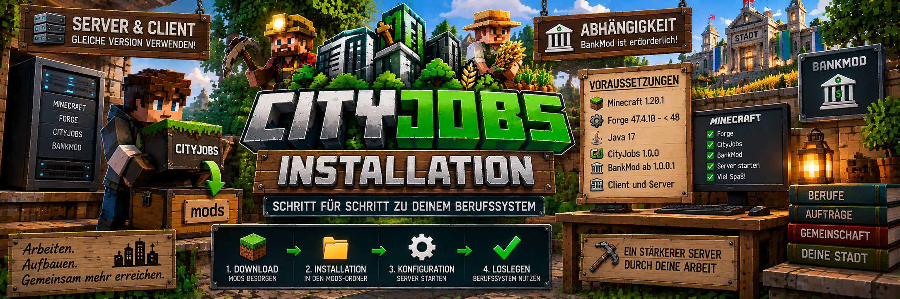

<link rel="stylesheet" href="style.css">



# 🔧 CityJobs – Installation

Auf dieser Seite erfährst du, wie du **CityJobs 1.0.0** auf deinem Minecraft-Server und bei den Spielern installierst.

CityJobs muss sowohl auf dem **Server** als auch auf dem **Client** installiert sein.

---

# 📋 Voraussetzungen

Für CityJobs werden folgende Versionen benötigt:

| Komponente | Version |
|---|---|
| Minecraft | **1.20.1** |
| Forge | **47.4.10 bis unter 48** |
| Java | **17** |
| CityJobs | **1.0.0** |
| BankMod | **ab 1.0.0.1** |

> ⚠️ **Wichtig:**  
> BankMod ist eine Pflichtabhängigkeit von CityJobs und muss ebenfalls installiert sein.

CityJobs verwendet BankMod unter anderem für die Auszahlung von Geldbelohnungen aus Aufträgen und Gemeinschaftsprojekten.

---

# 💻 Client und Server

CityJobs wird auf **Client und Server** benötigt.

Das bedeutet:

### Server

Im `mods`-Ordner des Servers müssen mindestens vorhanden sein:

```text
cityjobs-1.0.0-forge-1.20.1.jar
BankMod
