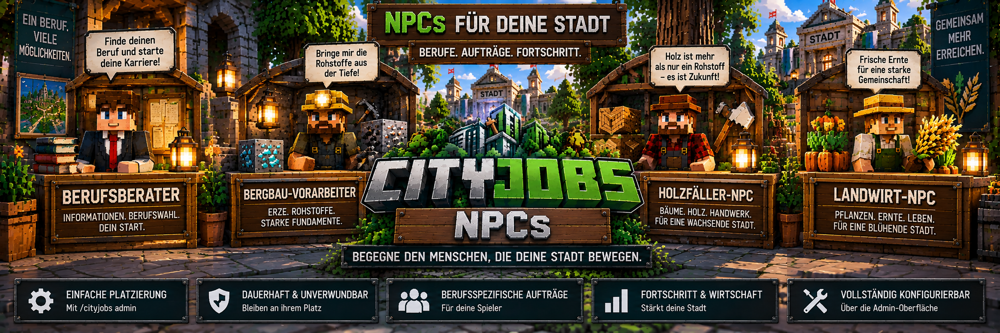

<link rel="stylesheet" href="style.css">



# 🧑‍💼 CityJobs – NPCs & Berufsberater

CityJobs verwendet eigene NPCs für die Berufswahl, Aufträge und verschiedene Funktionen des Berufssystems.

Aktuell gibt es vier feste NPC-Rollen:

| NPC | Aufgabe |
|---|---|
| 🧑‍💼 Berufsberater | Beruf auswählen oder wechseln und Berufsfortschritt ansehen |
| ⛏️ Bergbau-Vorarbeiter | Bergarbeiter-Aufträge, Berufsbuch und Gemeinschaftsprojekte |
| 🪓 Holzfäller-NPC | Holzfäller-Aufträge, Berufsbuch und Gemeinschaftsprojekte |
| 🌾 Landwirt-NPC | Landwirtschafts-Aufträge, Berufsbuch und Gemeinschaftsprojekte |

Die NPCs bilden einen zentralen Bestandteil von CityJobs.

Spieler wählen ihren Beruf beim Berufsberater und verwenden anschließend den passenden Berufs-NPC für ihre Arbeit und Aufträge.

---

# 🧑‍💼 Berufsberater

Der **Berufsberater** ist die erste Anlaufstelle für neue Spieler.

Über ihn können Spieler:

- einen Beruf auswählen
- ihren aktuellen Beruf ansehen
- den Beruf wechseln
- Berufs-XP ansehen
- den aktuellen Rang ansehen
- den Fortschritt bis zum nächsten Rang verfolgen

Der Berufsberater verwaltet keine normalen Lieferaufträge.

Dafür gibt es die jeweiligen Berufs-NPCs.

---

# 👷 Beruf auswählen

Um einen Beruf auszuwählen:

1. Berufsberater aufsuchen.
2. Den NPC mit der rechten Maustaste anklicken.
3. Gewünschten Beruf auswählen.
4. Auswahl bestätigen.
5. Anschließend den passenden Berufs-NPC aufsuchen.

Aktuell stehen folgende Berufe zur Verfügung:

- ⛏️ Bergarbeiter
- 🪓 Holzfäller
- 🌾 Landwirt

---

# 🔄 Beruf wechseln

Spieler können ihren aktiven Beruf später beim Berufsberater wechseln.

Ein Wechsel muss bestätigt werden.

Standardmäßig gilt danach eine Wechselpause von:

**60 Minuten Serverlaufzeit**

Administratoren können diese Zeit verändern oder auf `0` setzen.

Bei `0` ist keine Wechselpause aktiv.

---

## 💾 Berufsfortschritt bleibt erhalten

Beim Wechsel des Berufs werden die bisherigen Berufs-XP nicht gelöscht.

Beispiel:

```text
Aktiver Beruf:
⛏️ Bergarbeiter

Bergarbeiter:
8.500 XP

Holzfäller:
2.500 XP

Landwirt:
1.200 XP
```

Wechselt der Spieler zum Holzfäller, bleiben die 8.500 Bergarbeiter-XP gespeichert.

Kehrt er später zum Bergarbeiter zurück, kann er dort mit seinem bisherigen Fortschritt weitermachen.

---

# ⛏️ Bergbau-Vorarbeiter

Der **Bergbau-Vorarbeiter** ist der Berufs-NPC für Bergarbeiter.

Spieler mit aktivem Bergarbeiter-Beruf können dort unter anderem:

- persönliche Aufträge ansehen
- Aufträge annehmen
- Waren abgeben
- Gemeinschaftsprojekte öffnen
- das Berufsbuch erreichen
- zu passenden Stadtbauprojekten beitragen

Typische Bergarbeiter-Aufträge verlangen beispielsweise:

- Kohle
- Rohkupfer
- Roheisen
- Rohgold
- Redstone
- Lapislazuli
- Diamanten
- Smaragde

Bei Stadtbauprojekten können außerdem weitere Materialien benötigt werden.

---

# 🪓 Holzfäller-NPC

Der **Holzfäller-NPC** ist für Spieler mit aktivem Holzfäller-Beruf zuständig.

Über ihn können Holzfäller unter anderem:

- persönliche Aufträge ansehen
- Aufträge annehmen
- Holz abgeben
- Gemeinschaftsprojekte öffnen
- das Berufsbuch erreichen
- Materialien für Stadtbauprojekte liefern

Mögliche Aufträge verwenden verschiedene Holzarten wie:

- Eiche
- Birke
- Fichte
- Tropenholz
- Akazie
- Schwarzeiche
- Mangrove
- Kirschholz

---

# 🌾 Landwirt-NPC

Der **Landwirt-NPC** verwaltet die Aufträge des Landwirts.

Spieler mit aktivem Landwirt-Beruf können dort unter anderem:

- persönliche Aufträge ansehen
- Aufträge annehmen
- landwirtschaftliche Waren abgeben
- Gemeinschaftsprojekte öffnen
- das Berufsbuch erreichen

Mögliche Auftragswaren sind beispielsweise:

- Weizen
- Karotten
- Kartoffeln
- Rote Bete
- Kürbisse
- Melonen
- Beeren
- Pilze
- Kakaobohnen
- Netherwarzen
- Zuckerrohr
- Bambus
- Kakteen
- weitere passende landwirtschaftliche Erzeugnisse

---

# 📦 Aufträge über Berufs-NPCs

Normale Lieferaufträge werden bewusst über die Berufs-NPCs verwaltet.

Der Spieler muss den NPC seines **aktiven Berufs** verwenden.

Beispiel:

```text
Aktiver Beruf: Bergarbeiter
        ↓
Bergbau-Vorarbeiter
        ↓
Auftrag auswählen
        ↓
Auftrag annehmen
        ↓
Rohstoffe sammeln
        ↓
Bergbau-Vorarbeiter
        ↓
Waren abgeben
        ↓
Geld + Berufs-XP
```

Ein Bergarbeiter kann seine normalen Berufsaufträge also nicht beim Holzfäller- oder Landwirt-NPC abgeben.

---

# 🤝 Gemeinschaftsprojekte

Die Berufs-NPCs bieten außerdem Zugriff auf die **Gemeinschaftsprojekte**.

Dabei arbeiten mehrere Spieler und Berufe gemeinsam an serverweiten Lieferzielen.

Jeder Teil eines Gemeinschaftsprojekts gehört zu einem bestimmten Beruf.

Nur Spieler mit dem passenden aktiven Beruf können zu diesem Ziel beitragen.

Beispiel:

```text
GEMEINSCHAFTSPROJEKT

⛏️ Bergarbeiter
Roheisen: 350 / 512

🪓 Holzfäller
Eichenstämme: 420 / 512

🌾 Landwirt
Weizen: 280 / 512
```

Dadurch arbeiten die verschiedenen Berufsgruppen gemeinsam an einem Ziel.

---

# 🏗️ Stadtbauprojekte

Auch die großen Stadtbauprojekte sind mit den Berufs-NPCs verbunden.

Spieler liefern die benötigten Materialien über ihren jeweiligen Berufs-NPC.

Beispielsweise können Bergarbeiter und Holzfäller große Mengen der benötigten Baustoffe für ein Rathaus, eine Stadtbank oder ein eigenes Gebäudeprojekt liefern.

Die NPCs verbinden damit die normalen Berufe direkt mit dem Aufbau der Stadt.

---

# 📖 Berufsbuch

Das Berufsbuch kann über den passenden Berufs-NPC erreicht werden.

Alternativ kann jeder Spieler den Befehl

`/cityjobs`

verwenden.

Das Berufsbuch enthält unter anderem:

- abgeschlossene persönliche Aufträge
- verdientes Geld
- Lieferhistorie
- Erfolge
- Profiltitel
- aktuelles Stadtbauprojekt

---

# 🛡️ Eigenschaften der NPCs

CityJobs-NPCs wurden für den dauerhaften Einsatz auf einem Server entwickelt.

Sie:

- bleiben dauerhaft erhalten
- sind unverwundbar
- können nicht weggeschoben werden
- bewegen sich nicht von ihrem Platz
- schauen Spieler in ihrer Nähe an
- können von OPs wieder entfernt werden

Die Berufs-NPCs tragen außerdem passende Werkzeuge.

Beispielsweise:

```text
⛏️ Bergbau-Vorarbeiter → Spitzhacke
🪓 Holzfäller-NPC      → Axt
🌾 Landwirt-NPC        → Hacke
```

Dadurch können Spieler die verschiedenen NPCs leichter voneinander unterscheiden.

---

# 🔒 Sichere NPC-Interaktion

Ein geöffnetes CityJobs-NPC-Menü ist an die tatsächliche Interaktion mit dem NPC gebunden.

Der Spieler muss:

- am Leben sein
- darf sich nicht im Zuschauermodus befinden
- beim richtigen NPC bleiben
- höchstens etwa 6 Blöcke vom NPC entfernt sein

Eine NPC-Sitzung läuft außerdem nach ungefähr **einer Minute** ab.

Dadurch kann ein einmal geöffnetes Menü nicht unbegrenzt aus großer Entfernung weiterverwendet werden.

---

# 🛠️ NPCs als Administrator platzieren

Administratoren können CityJobs-NPCs über die Admin-Verwaltung platzieren.

Öffne:

`/cityjobs admin`

und wähle anschließend den Bereich:

**NPCs**

Dort können die verschiedenen NPC-Rollen an der aktuellen Position platziert werden.

---

# ⌨️ NPC-Befehle

NPCs können alternativ direkt über Befehle platziert werden.

## Berufsberater

`/cityjobs npc berufsberater`

Platziert einen Berufsberater an der Position des Administrators.

---

## Bergbau-Vorarbeiter

`/cityjobs npc bergarbeiter`

Platziert einen Bergbau-Vorarbeiter.

---

## Holzfäller-NPC

`/cityjobs npc holzfaeller`

Platziert einen Holzfäller-NPC.

---

## Landwirt-NPC

`/cityjobs npc landwirt`

Platziert einen Landwirt-NPC.

---

# 🗑️ NPC entfernen

Mit

`/cityjobs npc entfernen`

wird der nächste CityJobs-NPC innerhalb eines Umkreises von **4 Blöcken** entfernt.

Der Befehl benötigt entsprechende OP- beziehungsweise Administratorrechte.

---

# 🕰️ Ältere Kurzbefehle

CityJobs besitzt zusätzlich ältere Kurzbefehle für den Berufsberater.

## Berufsberater platzieren

`/cityjobs berater`

Platziert einen Berufsberater.

## Berufsberater entfernen

`/cityjobs entfernen`

Entfernt den nächsten Berufsberater innerhalb eines Umkreises von 4 Blöcken.

Für neue Einrichtungen empfiehlt sich die Verwendung der normalen NPC-Verwaltung über:

`/cityjobs admin`

oder

`/cityjobs npc ...`

---

# 🔑 Berechtigungen

Die Platzierung und Entfernung von CityJobs-NPCs ist für Administratoren vorgesehen.

Die entsprechenden Adminbefehle benötigen **Berechtigungsstufe 2 beziehungsweise OP-Rechte**.

Normale Spieler können die NPCs verwenden, aber nicht über diese Adminbefehle verwalten.

---

# 🔍 NPC-Diagnose

CityJobs 1.0.0 besitzt im Admin-Menü außerdem einen Diagnosebereich.

Öffne:

`/cityjobs admin`

und anschließend:

**Diagnose**

Dort können Administratoren unter anderem die geladenen CityJobs-NPCs überprüfen.

Angezeigt werden Informationen wie:

- NPC-Rolle
- Dimension
- Koordinaten
- Anzahl der vorhandenen NPC-Rollen

Die Diagnose ist **schreibgeschützt**.

Sie verändert keine NPC-, Spieler- oder Projektdaten.

---

# ❓ NPC-Menü öffnet sich nicht

Falls ein Berufs-NPC nicht reagiert oder das Menü nicht geöffnet werden kann, überprüfe:

1. Wurde der richtige NPC angeklickt?
2. Stehst du höchstens etwa 6 Blöcke entfernt?
3. Bist du im normalen Spielmodus und nicht im Zuschauermodus?
4. Ist für die gewünschte Funktion der richtige Beruf aktiv?
5. Ist die NPC-Sitzung möglicherweise bereits abgelaufen?

Bei älteren Welten kann ein Administrator den betroffenen NPC notfalls entfernen und anschließend neu platzieren.

Zum Entfernen:

`/cityjobs npc entfernen`

Danach kann der entsprechende NPC erneut gesetzt werden.

---

# 🌆 NPCs als Mittelpunkt von CityJobs

Die NPCs sollen auch weiterhin ein zentraler Bestandteil von CityJobs bleiben.

Die Spieler sollen ihre Berufe nicht ausschließlich über Befehle verwalten müssen.

Stattdessen bilden:

- Berufsberater
- Bergbau-Vorarbeiter
- Holzfäller-NPC
- Landwirt-NPC

die direkten Anlaufstellen für das Berufssystem.

Auch zukünftige Erweiterungen von CityJobs sollen möglichst auf diesem NPC-System aufbauen.

---

[← Zurück: Berufe](cityjobs-berufe.md) | [Weiter: Ränge & Berufs-XP →](cityjobs-raenge-xp.md)
