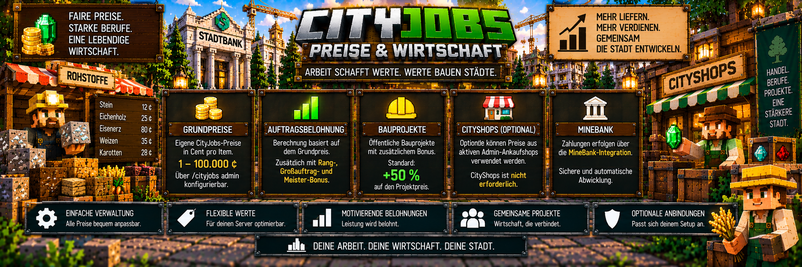

<link rel="stylesheet" href="style.css">



# 💰 CityJobs – Preise & Wirtschaft

CityJobs besitzt ein eigenes Preis- und Wirtschaftssystem für Aufträge, Lieferungen und Stadtbauprojekte.

Alle Geldbeträge werden **centgenau** berechnet und über **MineBank** ausgezahlt.

Administratoren können die Grundpreise der einzelnen Waren selbst festlegen und damit die CityJobs-Wirtschaft an den eigenen Server anpassen.

Zusätzlich können verschiedene Boni für:

- höhere Berufs-Ränge
- Großaufträge
- Meisteraufträge
- Gemeinschaftsaufträge
- Stadtbauprojekte

verwendet werden.

CityShops kann optional als zusätzliche Preisquelle für Bauprojekte verwendet werden.

---

# 💵 Grundpreise

CityJobs besitzt für seine Waren eigene **Grundpreise**.

Diese werden in:

**Cent pro Gegenstand**

gespeichert.

Beispiel:

```text
Ware:
Roheisen

Grundpreis:
80 Cent pro Item

Menge:
32

Grundwert:
32 × 80 Cent
```

Die tatsächliche Belohnung kann anschließend durch weitere Einstellungen und Boni beeinflusst werden.

---

# 🪙 Warum werden Preise in Cent gespeichert?

CityJobs arbeitet intern mit Cent-Beträgen.

Dadurch können Geldwerte exakt verarbeitet werden.

Beispiel:

```text
100 Cent = 1,00

250 Cent = 2,50

1.000 Cent = 10,00
```

Die eigentliche Auszahlung erfolgt anschließend über MineBank.

---

# 🛠️ Preise verwalten

Administratoren können die CityJobs-Grundpreise über das Admin-Menü verändern.

Öffne:

`/cityjobs admin`

und anschließend:

**Preise**

Dort können die Preise der unterstützten Waren angepasst werden.

---

# 📊 Erlaubter Preisbereich

Ein CityJobs-Grundpreis kann zwischen:

**1 und 100.000 Cent pro Gegenstand**

liegen.

Das entspricht:

```text
Minimum:
1 Cent

Maximum:
100.000 Cent
```

Dadurch kann die Wirtschaft sowohl für kleine als auch für sehr wertvolle Waren angepasst werden.

---

# ⛏️ Bergarbeiter-Preise

Für den Bergarbeiter können beispielsweise Preise für Waren wie:

- Kohle
- Rohkupfer
- Roheisen
- Rohgold
- Redstone
- Lapislazuli
- Diamanten
- Smaragde

festgelegt werden.

Die Preise bestimmen die wirtschaftliche Grundlage für entsprechende CityJobs-Lieferungen.

---

# 🪓 Holzfäller-Preise

Auch die Waren des Holzfällers besitzen eigene Grundpreise.

Dazu gehören beispielsweise:

- Eichenstämme
- Birkenstämme
- Fichtenstämme
- Tropenholzstämme
- Akazienstämme
- Schwarzeichenstämme
- Mangrovenstämme
- Kirschstämme

Damit können unterschiedliche Holzarten unterschiedliche wirtschaftliche Werte besitzen.

---

# 🌾 Landwirt-Preise

Für landwirtschaftliche Waren können ebenfalls eigene Grundpreise eingestellt werden.

Dazu gehören unter anderem:

- Weizen
- Karotten
- Kartoffeln
- Rote Bete
- Melonenscheiben
- Kürbisse
- Süßbeeren
- Leuchtbeeren
- getrockneter Seetang
- Pilze
- Kakaobohnen
- Netherwarzen
- Chorusfrüchte
- Zuckerrohr
- Bambus
- Kakteen

---

# 📦 Auftragsbelohnungen

Die Belohnung eines persönlichen Auftrags basiert auf den Preisen der verlangten Waren und den aktuellen CityJobs-Einstellungen.

Vereinfacht:

```text
Grundpreis der Ware
        ×
benötigte Menge
        ↓
Grundwert des Auftrags
        ↓
weitere CityJobs-Einstellungen
        ↓
mögliche Boni
        ↓
endgültige Belohnung
```

Dadurch können Server ihre Auftragswirtschaft sehr flexibel konfigurieren.

---

# 📈 Preisbonus durch höhere Ränge

CityJobs kann höhere Berufs-Ränge bei der Auftragsberechnung berücksichtigen.

Standardmäßig beträgt der:

**Preisbonus pro Rang: 20 %**

Administratoren können diesen Wert verändern.

Der mögliche Einstellungsbereich beträgt:

**0 bis 100 %**

---

# ⭐ Auftrags-XP pro Rang

Neben dem Preisbonus kann auch die Berufs-XP-Belohnung mit höheren Rängen wachsen.

Standardmäßig gilt:

**50 zusätzliche Auftrags-XP pro Rangstufe**

Der mögliche Einstellungsbereich beträgt:

**0 bis 1.000**

Diese Einstellung betrifft die XP-Belohnung und nicht direkt den Geldpreis.

---

# ⚙️ Allgemeine Belohnung

Administratoren können die allgemeine Auftragsbelohnung zusätzlich über einen Prozentwert beeinflussen.

Standard:

**100 %**

Möglicher Bereich:

**1 bis 1.000 %**

Beispiel:

```text
100 % = normaler Wert

150 % = höhere Belohnung

50 % = niedrigere Belohnung
```

Damit kann die gesamte CityJobs-Auftragswirtschaft an die gewünschte Serverökonomie angepasst werden.

---

# 📦 Auftragsmengen

Auch die erzeugten Auftragsmengen können über einen Prozentwert beeinflusst werden.

Standard:

**100 %**

Möglicher Bereich:

**25 bis 500 %**

Beispiel:

```text
100 % = normale Menge

200 % = größere Aufträge

50 % = kleinere Aufträge
```

Diese Einstellung beeinflusst neu erzeugte Angebote.

---

# 📦 Großaufträge

CityJobs kann zusätzlich **Großaufträge** erzeugen.

Diese verlangen größere Warenmengen und besitzen einen zusätzlichen Preisbonus.

Standardmäßig gelten:

| Einstellung | Standard |
|---|---:|
| Großauftrag-Chance | 20 % |
| Mengenfaktor | 3 |
| zusätzlicher Preisbonus | 15 % |

---

# 🎲 Großauftrag-Chance

Standardmäßig beträgt die Wahrscheinlichkeit für einen Großauftrag:

**20 %**

Administratoren können einen Wert zwischen:

**0 und 100 %**

einstellen.

Bei `0 %` werden keine Großaufträge erzeugt.

---

# 📦 Großauftrag-Mengenfaktor

Der Standard-Mengenfaktor beträgt:

**3**

Möglicher Bereich:

**2 bis 8**

Dadurch kann ein Großauftrag deutlich mehr Waren verlangen als ein normaler Auftrag.

---

# 💰 Großauftrag-Preisbonus

Großaufträge besitzen standardmäßig einen zusätzlichen Preisbonus von:

**15 %**

Der mögliche Einstellungsbereich beträgt:

**0 bis 100 %**

Damit wird die größere Liefermenge zusätzlich belohnt.

---

# 👑 Meisteraufträge

Für Spieler mit dem Rang **Meister** können besondere Meisteraufträge erzeugt werden.

Standardmäßig sind Meisteraufträge:

**aktiviert**

Die entsprechenden wirtschaftlichen Standardwerte sind:

| Einstellung | Standard |
|---|---:|
| Meister-Mengenfaktor | 4 |
| Meister-Bonus | 25 % |

---

# 📦 Meister-Mengenfaktor

Der Standardwert beträgt:

**4**

Möglicher Bereich:

**2 bis 8**

Meisteraufträge können dadurch deutlich größere Warenmengen verlangen.

---

# 💎 Meister-Bonus

Der zusätzliche Meisterauftrag-Bonus beträgt standardmäßig:

**25 %**

Damit erhalten die höchsten Berufs-Ränge besondere wirtschaftliche Auftragsmöglichkeiten.

---

# 🤝 Gemeinschaftsaufträge

Auch Gemeinschaftsaufträge besitzen eigene Wirtschaftseinstellungen.

Standardmäßig gelten:

| Einstellung | Standard |
|---|---:|
| Gemeinschaftsaufträge | aktiviert |
| Menge pro Ware | 512 |
| Gemeinschaftsbonus | 10 % |
| Berufs-XP pro Gegenstand | 1 |

Der Gemeinschaftsbonus beträgt damit standardmäßig:

**10 %**

---

# 💰 Direkte Bezahlung bei Gemeinschaftsbeiträgen

Spieler müssen nicht warten, bis das gesamte Gemeinschaftsprojekt abgeschlossen wurde.

Ein gültiger Beitrag kann direkt bezahlt werden.

Vereinfacht:

```text
Ware beitragen
        ↓
Menge wird geprüft
        ↓
Ware wird angenommen
        ↓
Preis wird berechnet
        ↓
MineBank-Auszahlung
        ↓
Berufs-XP
```

Dadurch lohnt sich jeder einzelne Beitrag zum Gemeinschaftsprojekt.

---

# 🏗️ Preise für Stadtbauprojekte

Stadtbauprojekte besitzen ein eigenes Preissystem.

Dazu gehören beispielsweise:

- Rathaus
- Stadtbank
- eigene Gebäudevorlagen

Die Spieler liefern die benötigten Materialien über ihre Berufs-NPCs und können dafür bezahlt werden.

---

# 💵 Bonus für öffentliche Bauprojekte

Öffentliche Stadtbauprojekte besitzen standardmäßig einen zusätzlichen Bonus von:

**+50 %**

auf den bestimmten Marktpreis.

Der Standardwert in der CityJobs-Konfiguration beträgt:

**50 %**

Administratoren können diesen Wert verändern.

Der mögliche Bereich beträgt:

**1 bis 500 %**

---

# 🏗️ Warum gibt es einen Projektbonus?

Große Stadtbauprojekte benötigen teilweise erhebliche Mengen an Rohstoffen.

Der zusätzliche Bonus macht diese Lieferungen wirtschaftlich attraktiver.

Das Prinzip:

```text
Material sammeln
        ↓
Marktwert bestimmen
        ↓
Projektbonus anwenden
        ↓
Material liefern
        ↓
MineBank-Auszahlung
        ↓
Stadtprojekt wächst
```

Dadurch werden Spieler für ihre Beteiligung an der gemeinsamen Stadtentwicklung belohnt.

---

# 🏪 Optionale CityShops-Integration

CityJobs kann optional mit **CityShops** zusammenarbeiten.

Ist CityShops installiert, kann CityJobs für Bauprojekte geeignete Preise aus CityShops berücksichtigen.

CityShops ist jedoch **keine Pflichtabhängigkeit** von CityJobs.

CityJobs funktioniert auch vollständig ohne CityShops.

---

# 🛒 Welche CityShops-Preise werden verwendet?

Für die optionale Preisermittlung werden nur passende:

**aktive Admin-Ankaufshops**

berücksichtigt.

Normale Spieler-Shops werden dafür nicht einfach als offizielle Marktpreisquelle verwendet.

Dadurch kann der Server über seine Admin-Shops beeinflussen, welche Marktpreise für CityJobs relevant sind.

---

# 🔄 CityJobs mit CityShops

Wenn CityShops verfügbar und eine geeignete Preisquelle vorhanden ist, kann die Preisermittlung vereinfacht so aussehen:

```text
Bauprojekt benötigt Ware
        ↓
CityJobs prüft Preisquelle
        ↓
passender aktiver
CityShops-Admin-Ankaufshop?
        ↓
JA
        ↓
geeigneten Marktpreis berücksichtigen
        ↓
Projektbonus
        ↓
MineBank-Auszahlung
```

Die genaue Auszahlung wird weiterhin durch CityJobs verarbeitet.

---

# 🚫 CityShops ist nicht erforderlich

Wenn CityShops nicht installiert ist, bleibt CityJobs funktionsfähig.

Dann verwendet CityJobs seine eigenen Preisgrundlagen.

```text
CityShops installiert?
        │
   ┌────┴────┐
   │         │
  JA        NEIN
   │         │
   ▼         ▼
optionale   CityJobs-
Preisquelle Grundpreise
   │         │
   └────┬────┘
        ▼
CityJobs-Berechnung
        ↓
MineBank-Auszahlung
```

Damit bleibt CityShops eine optionale Erweiterung.

---

# 🏦 MineBank

Während CityJobs die Preise und Belohnungen berechnet, übernimmt **MineBank** die eigentliche Geldabwicklung.

Alle CityJobs-Geldzahlungen laufen über die Bank-Schnittstelle.

MineBank ist deshalb im Gegensatz zu CityShops eine erforderliche Abhängigkeit.

Für CityJobs 1.0.0 wird mindestens benötigt:

**MineBank / BankMod ab Version 1.0.0.1**

---

# 💳 Bankkonto erforderlich

Für bezahlte CityJobs-Lieferungen benötigt der Spieler ein gültiges MineBank-Konto.

Ohne Bankkonto kann CityJobs die entsprechende Auszahlung nicht normal durchführen.

Dadurch werden CityJobs-Belohnungen direkt in das Bankensystem des Servers integriert.

---

# 🔐 Sichere Zahlungsabwicklung

CityJobs besitzt Schutzmechanismen für Situationen, in denen gleichzeitig:

- Waren entfernt
- Geld ausgezahlt

werden muss.

Das ist besonders wichtig bei:

- persönlichen Aufträgen
- Gemeinschaftsbeiträgen
- Bauprojektlieferungen

---

# ↩️ Eindeutig abgelehnte Zahlung

Wird eine Zahlung eindeutig abgelehnt, versucht CityJobs zu verhindern, dass der Spieler gleichzeitig seine Waren verliert.

Die entsprechende Lieferung kann sauber abgebrochen beziehungsweise die Ware zurückgegeben werden.

---

# ⚠️ Unklarer Zahlungsstatus

Kann nach einer Warenentnahme nicht eindeutig festgestellt werden, ob die Zahlung erfolgreich war, erzeugt CityJobs einen:

**Bankprüffall**

Der Spieler kann denselben Vorgang dann nicht einfach erneut einreichen.

Damit werden mögliche doppelte Auszahlungen verhindert.

---

# 🔍 Bankprüfung

Administratoren können offene Fälle über:

`/cityjobs admin`

und anschließend:

**Bankprüfung**

kontrollieren.

Die Bankprüfung kann Fälle aus verschiedenen CityJobs-Systemen enthalten:

- persönliche Aufträge
- Gemeinschaftsbeiträge
- Bauprojektlieferungen

Mehr zur MineBank-Anbindung findest du auf der nächsten Wirtschaftseite:

**[MineBank-Integration](cityjobs-bankmod.md)**

---

# 💾 Bereits angenommene Aufträge

Wenn ein Administrator Preise oder Einstellungen verändert, werden bereits angenommene persönliche Aufträge nicht nachträglich verändert.

CityJobs speichert beim Annehmen die wichtigen Auftragswerte.

Dazu gehören unter anderem:

- Ware
- Menge
- Belohnung
- Berufs-XP

Änderungen gelten deshalb hauptsächlich für **neu erzeugte Angebote**.

---

# 🔄 Beispiel

Ein Spieler nimmt einen Auftrag an:

```text
32x Roheisen

Belohnung:
gespeicherter Auftragswert
```

Danach ändert ein Administrator den Grundpreis von Roheisen.

Der bereits angenommene Auftrag behält trotzdem seine gespeicherten Werte.

Neue Aufträge können anschließend mit den neuen Einstellungen erzeugt werden.

---

# 🛠️ Preise über das Admin-Menü

Die zentrale Verwaltung erfolgt über:

`/cityjobs admin`

Dort gibt es den eigenen Bereich:

**Preise**

Dieser Bereich dient zur Verwaltung der CityJobs-Grundpreise.

Weitere wirtschaftliche Faktoren befinden sich unter:

**Einstellungen**

---

# ⚙️ Wichtige Wirtschaftseinstellungen

Eine Übersicht der wichtigsten Standardwerte:

| Einstellung | Standard |
|---|---:|
| allgemeine Belohnung | 100 % |
| Auftragsmenge | 100 % |
| Preisbonus pro Rang | 20 % |
| Auftrags-XP pro Rangstufe | 50 |
| Großauftrag-Chance | 20 % |
| Großauftrag-Mengenfaktor | 3 |
| Großauftrag-Bonus | 15 % |
| Meisteraufträge | aktiviert |
| Meister-Mengenfaktor | 4 |
| Meister-Bonus | 25 % |
| Gemeinschaftsbonus | 10 % |
| Projektbonus | +50 % |

Damit kann die Wirtschaft umfangreich an den eigenen Server angepasst werden.

---

# 📈 Änderungen vorsichtig vornehmen

Starke Preisänderungen können die gesamte Serverwirtschaft beeinflussen.

Vor größeren Änderungen sollte deshalb berücksichtigt werden:

- Wie leicht ist die Ware erhältlich?
- Wie viel davon können Spieler pro Stunde sammeln?
- Welche Preise verwendet der restliche Server?
- Wie hoch sind Auftragsmengen?
- Welche Rangboni sind aktiv?
- Welche Großauftrag-Boni sind aktiv?
- Welche Meister-Boni sind aktiv?
- Welche Projektboni sind aktiv?

Dadurch lassen sich extrem hohe oder zu niedrige Belohnungen vermeiden.

---

# 🌆 Zusammenspiel der Wirtschaft

Die CityJobs-Wirtschaft verbindet mehrere Systeme:

```text
⛏️🪓🌾
Spieler arbeiten
        ↓
📦 Waren entstehen
        ↓
CityJobs-Grundpreise
        ↓
📈 Rang / Auftrag / Bonus
        ↓
🏪 optional CityShops-Preisquelle
        ↓
🏗️ eventuell Projektbonus
        ↓
💰 endgültige Belohnung
        ↓
🏦 MineBank
```

Dadurch entsteht eine Verbindung zwischen Berufen, Aufträgen, Stadtentwicklung und der Serverwirtschaft.

---

# 💡 Kurz erklärt

Wenn du als Administrator die CityJobs-Wirtschaft einrichten möchtest:

```text
1. /cityjobs admin öffnen

2. Preise auswählen

3. Grundpreise der Waren festlegen

4. Einstellungen öffnen

5. allgemeine Belohnung einstellen

6. Auftragsmengen einstellen

7. Rangbonus festlegen

8. Großauftrag-Werte einstellen

9. Meisterauftrag-Werte einstellen

10. Gemeinschaftsbonus konfigurieren

11. Projektbonus konfigurieren

12. optional CityShops als Preisquelle verwenden

13. MineBank für alle Geldzahlungen verwenden

14. neue Aufträge testen

15. Preise bei Bedarf nachjustieren
```

So lässt sich CityJobs an sehr unterschiedliche Serverwirtschaften anpassen, ohne dass die grundlegenden Berufs- und Auftragssysteme verändert werden müssen.

---

[← Zurück: Eigene Gebäudevorlagen](cityjobs-eigene-gebaeude.md) | [Weiter: MineBank-Integration →](cityjobs-bankmod.md)
