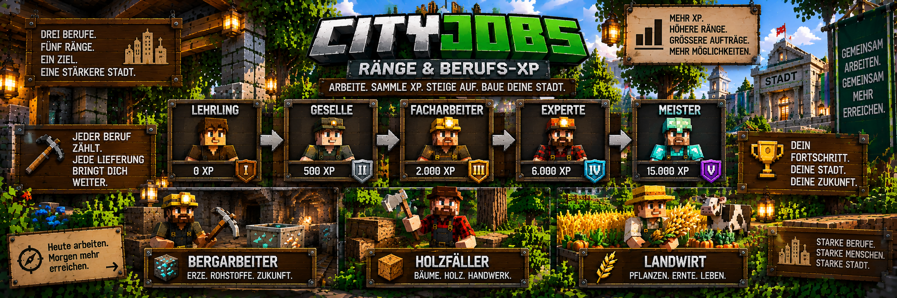

<link rel="stylesheet" href="style.css">



# ⭐ CityJobs – Ränge & Berufs-XP

In CityJobs besitzt jeder Beruf seinen eigenen Fortschritt.

Durch normale Arbeit und abgeschlossene Aufträge sammelst du **Berufs-XP** und steigst dadurch nach und nach in höhere Ränge auf.

Aktuell gibt es fünf Ränge:

| Stufe | Rang | Benötigte Gesamt-XP |
|---:|---|---:|
| 1 | Lehrling | 0 |
| 2 | Geselle | 500 |
| 3 | Facharbeiter | 2.000 |
| 4 | Experte | 6.000 |
| 5 | Meister | 15.000 |

Das Rangsystem gilt für alle drei aktuellen Berufe:

- ⛏️ Bergarbeiter
- 🪓 Holzfäller
- 🌾 Landwirt

---

# 🏆 Die fünf Ränge

## 🥉 Lehrling

**Benötigte Gesamt-XP: 0**

Jeder neue Berufsfortschritt beginnt als **Lehrling**.

Der Lehrling bildet die erste Stufe des jeweiligen Berufs.

### Arbeitsfortschritt

Beim Lehrling werden jeweils:

**20 gültige Arbeitsblöcke**

benötigt, bevor die gesammelten Arbeits-XP gutgeschrieben werden.

---

## 🥈 Geselle

**Benötigte Gesamt-XP: 500**

Mit insgesamt 500 Berufs-XP wird der Rang **Geselle** erreicht.

### Arbeitsfortschritt

Beim Gesellen werden jeweils:

**40 gültige Arbeitsblöcke**

benötigt, bevor die gesammelten Arbeits-XP gutgeschrieben werden.

---

## 🥇 Facharbeiter

**Benötigte Gesamt-XP: 2.000**

Mit insgesamt 2.000 Berufs-XP wird der Spieler zum **Facharbeiter**.

### Arbeitsfortschritt

Beim Facharbeiter werden jeweils:

**60 gültige Arbeitsblöcke**

benötigt, bevor die gesammelten Arbeits-XP gutgeschrieben werden.

---

## 💎 Experte

**Benötigte Gesamt-XP: 6.000**

Mit insgesamt 6.000 Berufs-XP wird der Rang **Experte** erreicht.

### Arbeitsfortschritt

Beim Experten werden jeweils:

**80 gültige Arbeitsblöcke**

benötigt, bevor die gesammelten Arbeits-XP gutgeschrieben werden.

---

## 👑 Meister

**Benötigte Gesamt-XP: 15.000**

Der **Meister** ist aktuell die höchste Berufsstufe in CityJobs.

### Arbeitsfortschritt

Beim Meister werden jeweils:

**100 gültige Arbeitsblöcke**

benötigt, bevor die gesammelten Arbeits-XP gutgeschrieben werden.

Der Meister kann außerdem Zugriff auf besondere Meisteraufträge erhalten, sofern diese auf dem Server aktiviert sind.

---

# 📊 Rangübersicht

| Rang | Gesamt-XP | Arbeitsblöcke pro Auszahlung |
|---|---:|---:|
| Lehrling | 0 | 20 |
| Geselle | 500 | 40 |
| Facharbeiter | 2.000 | 60 |
| Experte | 6.000 | 80 |
| Meister | 15.000 | 100 |

---

# ⚙️ Wie funktionieren Arbeits-XP?

Beim normalen Arbeiten werden die XP nicht nach jedem einzelnen Block sofort sichtbar gutgeschrieben.

Stattdessen sammelt CityJobs die erreichten XP zunächst intern.

Sobald die für deinen Rang notwendige Anzahl gültiger Arbeitsblöcke erreicht wurde, wird der gesammelte Fortschritt gutgeschrieben.

Beispiel:

```text
Rang: Lehrling

20 gültige Arbeitsblöcke
        ↓
gesammelte Arbeits-XP
        ↓
XP-Auszahlung
        ↓
Berufsfortschritt steigt
```

Wie viele XP dabei gesammelt werden, hängt davon ab, welche gültigen Blöcke oder Pflanzen bearbeitet wurden.

---

# ⛏️ Bergarbeiter-XP

Beim Bergarbeiter hängt die erhaltene XP-Menge vom abgebauten Erz ab.

Beispiele:

| Rohstoff | Berufs-XP |
|---|---:|
| Kohleerz | 1 |
| Eisenerz | 5 |
| Golderz | 8 |
| Diamanterz | 20 |
| Smaragderz | 25 |
| Antiker Schrott | 30 |

Seltenere und wertvollere Rohstoffe können dadurch mehr Berufs-XP bringen als gewöhnliche Erze.

Die vollständige Übersicht findest du unter:

**[Berufe](cityjobs-berufe.md)**

---

# 🪓 Holzfäller-XP

Beim Holzfäller hängt die XP-Menge von der abgebauten Holzart ab.

Beispiele:

| Holzart | Berufs-XP |
|---|---:|
| Eiche | 2 |
| Birke | 3 |
| Akazie | 4 |
| Mangrove | 5 |
| Kirschholz | 4 |

Dabei muss es sich um gültiges Holz handeln.

Natürlich gewachsene Bäume werden vom System entsprechend erkannt.

---

# 🌾 Landwirt-XP

Beim Landwirt hängt die XP-Menge von der geernteten Pflanze ab.

Beispiele:

| Pflanze | Berufs-XP |
|---|---:|
| Weizen | 2 |
| Kartoffeln | 3 |
| Karotten | 3 |
| Kakao | 4 |
| Netherwarzen | 5 |
| Kürbis | 4 |
| Melone | 4 |

Bei Pflanzen mit Wachstumsstufen müssen diese normalerweise vollständig reif sein.

Unreife Pflanzen geben keine normalen Berufs-XP.

---

# 📦 XP durch Aufträge

Berufs-XP können nicht nur durch normale Arbeit gesammelt werden.

Auch persönliche Lieferaufträge bringen Berufs-XP.

Der Ablauf sieht beispielsweise so aus:

```text
Auftrag beim Berufs-NPC annehmen
            ↓
benötigte Waren sammeln
            ↓
zum Berufs-NPC zurückkehren
            ↓
Auftrag abgeben
            ↓
BankMod-Auszahlung + Berufs-XP
```

Die erhaltenen Auftrags-XP zählen zum Fortschritt des aktuell verwendeten Berufs.

---

# 📈 Aufträge und höhere Ränge

Mit höheren Rängen entwickelt sich auch das Auftragssystem weiter.

Je nach Rang können sich unter anderem verändern:

- verfügbare Waren
- benötigte Mengen
- Auftrags-XP
- Stückpreise
- Großaufträge
- Meisteraufträge

Dadurch bleibt das Auftragssystem auch für weiter fortgeschrittene Spieler interessant.

---

# 📦 Großaufträge

CityJobs kann zusätzlich größere Aufträge erzeugen.

Diese benötigen mehr Waren als normale Aufträge.

Administratoren können unter anderem einstellen:

- Wahrscheinlichkeit für Großaufträge
- Mengenfaktor
- zusätzlichen Preisbonus

Die entsprechenden Einstellungen gelten für neu erzeugte Angebote.

Bereits angenommene Aufträge behalten ihre gespeicherten Werte.

---

# 👑 Meisteraufträge

Spieler mit dem Rang **Meister** können besondere Meisteraufträge erhalten.

Das Meisterauftragssystem kann vom Administrator aktiviert oder deaktiviert werden.

Meisteraufträge können mit größeren Mengen und zusätzlichen Belohnungen verbunden sein.

Damit erhält der höchste Rang zusätzliche Auftragsmöglichkeiten.

---

# 🤝 XP durch Gemeinschaftsprojekte

Auch Beiträge zu Gemeinschaftsprojekten können Berufs-XP bringen.

Dabei darf ein Spieler nur zu dem Bereich beitragen, der zu seinem **aktuell aktiven Beruf** gehört.

Beispiel:

```text
Aktiver Beruf:
⛏️ Bergarbeiter

Gemeinschaftsprojekt:
Roheisen benötigt

Spieler liefert Roheisen
        ↓
Ware wird angenommen
        ↓
BankMod-Auszahlung
        ↓
Berufs-XP
        ↓
Fortschritt für Bergarbeiter
```

Die Höhe der Gemeinschafts-XP kann vom Server eingestellt werden.

---

# 🏗️ XP durch Stadtbauprojekte

Auch Lieferungen für große Stadtbauprojekte können zum Berufssystem gehören.

Die Spieler liefern die benötigten Materialien über ihren passenden Berufs-NPC.

Dadurch verbinden sich:

- Berufe
- Wirtschaft
- Rohstoffbeschaffung
- Gemeinschaft
- Stadtentwicklung

miteinander.

---

# 🔄 Jeder Beruf hat eigenen Fortschritt

Die Berufs-XP werden für jeden Beruf **getrennt gespeichert**.

Beispiel:

```text
⛏️ Bergarbeiter
8.500 XP
Experte

🪓 Holzfäller
2.700 XP
Facharbeiter

🌾 Landwirt
650 XP
Geselle
```

Der Spieler besitzt damit nicht einen gemeinsamen CityJobs-Level.

Jeder Beruf hat seinen eigenen XP-Stand und seinen eigenen Rang.

---

# 🔁 Was passiert beim Berufswechsel?

Beim Berufswechsel wird der Fortschritt des alten Berufs **nicht gelöscht**.

Beispiel:

```text
Bergarbeiter
8.500 XP
Experte

↓ Wechsel zum Landwirt ↓

Landwirt
650 XP
Geselle
```

Die 8.500 Bergarbeiter-XP bleiben gespeichert.

Wenn der Spieler später wieder Bergarbeiter wird, beginnt er dort wieder mit seinem bereits erreichten Fortschritt.

---

# 🎯 Nur der aktive Beruf entwickelt sich weiter

Normale Arbeits-XP und berufsspezifische Aufträge zählen für den aktuell aktiven Beruf.

Ein Spieler kann also nicht gleichzeitig Bergarbeiter, Holzfäller und Landwirt leveln.

Möchte er einen anderen Beruf weiterentwickeln, muss er diesen zuerst aktivieren.

Der Wechsel erfolgt über den Berufsberater.

Mehr dazu findest du unter:

**[NPCs & Berufsberater](cityjobs-npcs.md)**

---

# 🎉 Rangaufstieg

Sobald genügend Gesamt-XP erreicht wurden, steigt der Spieler automatisch in den nächsten Rang auf.

CityJobs informiert den Spieler über den Rangaufstieg.

Dabei wird der Aufstieg zusätzlich durch einen Sound hervorgehoben.

Beispiel:

```text
1.950 XP
   ↓
Auftrag abgeschlossen
   ↓
+100 XP
   ↓
2.050 XP
   ↓
⭐ Neuer Rang: Facharbeiter
```

Überschüssige XP gehen dabei nicht verloren.

---

# 🛡️ Schutz vor XP-Farming

CityJobs besitzt verschiedene Mechanismen, damit Berufs-XP durch normale Arbeit verdient werden.

Selbst platzierte Blöcke können nicht einfach immer wieder gesetzt und abgebaut werden, um unbegrenzt XP zu erzeugen.

Das System speichert dafür entsprechende Blockpositionen einschließlich ihrer Dimension.

Diese Informationen bleiben über Serverneustarts erhalten.

---

# 🚫 Kreativ- und Zuschauermodus

Spieler im **Kreativmodus** oder **Zuschauermodus** erhalten keine normalen Arbeits-XP.

Damit können Berufsfortschritte nicht einfach über den Kreativmodus hochgelevelt werden.

---

# 🧑‍💼 Fortschritt ansehen

Spieler können ihren Berufsfortschritt über das CityJobs-System einsehen.

Dazu gehören unter anderem:

- aktiver Beruf
- aktueller Rang
- Berufs-XP
- Fortschritt des Berufs

Der Berufsberater dient dabei als zentrale Anlaufstelle für Berufswahl und Berufswechsel.

Zusätzlich bietet das Berufsbuch weitere Informationen zur eigenen Karriere.

---

# 🛠️ XP als Administrator verwalten

Administratoren können den Berufsfortschritt von Spielern über das CityJobs-Adminmenü verwalten.

Öffne:

`/cityjobs admin`

und anschließend den Bereich:

**Spieler**

Dort können Administratoren unter anderem:

- aktiven Beruf eines Online-Spielers ändern
- XP der verschiedenen Berufe ansehen
- Berufs-XP festlegen

XP-Werte können dabei nicht negativ gesetzt werden.

---

# ⚙️ Rang- und Auftragseinstellungen

Über die CityJobs-Verwaltung können verschiedene Werte angepasst werden, die den Fortschritt und die Aufträge beeinflussen.

Dazu gehören beispielsweise:

| Einstellung | Standard |
|---|---:|
| Aufträge pro Minecraft-Tag | 3 |
| Belohnung | 100 % |
| Auftragsmenge | 100 % |
| Berufswechsel-Cooldown | 60 Minuten |
| Preisbonus pro Rang | 20 % |
| Auftrags-XP pro Rangstufe | 50 |
| Großauftrag-Chance | 20 % |
| Großauftrag-Mengenfaktor | 3 |
| Großauftrag-Preisbonus | 15 % |
| Meisteraufträge | aktiviert |
| Meisterauftrag-Mengenfaktor | 4 |
| Meisterauftrag-Bonus | 25 % |

Änderungen an diesen Einstellungen wirken sich auf **neu erzeugte Angebote** aus.

Bereits angenommene Aufträge behalten ihre gespeicherten Werte.

---

# 🏁 Der Weg zum Meister

Der komplette Berufsfortschritt sieht damit so aus:

```text
👷 Lehrling
0 XP
   ↓
🛠️ Geselle
500 XP
   ↓
⚒️ Facharbeiter
2.000 XP
   ↓
💎 Experte
6.000 XP
   ↓
👑 Meister
15.000 XP
```

Jeder Beruf durchläuft diesen Fortschritt unabhängig.

Damit kann ein Spieler beispielsweise bereits Meister als Bergarbeiter sein, während er beim Landwirt noch als Lehrling beginnt.

---

[← Zurück: NPCs & Berufsberater](cityjobs-npcs.md) | [Weiter: Aufträge →](cityjobs-auftraege.md)
