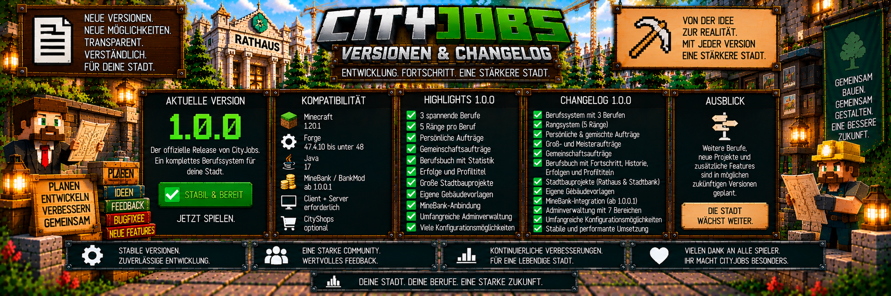

<link rel="stylesheet" href="style.css">



# 📋 CityJobs – Versionen & Changelog

Hier findest du Informationen zur aktuellen Version von **CityJobs** sowie eine Übersicht über die enthaltenen Funktionen.

Die aktuell dokumentierte Version ist:

# 🟢 CityJobs 1.0.0

CityJobs 1.0.0 ist ein umfangreiches Berufssystem für Minecraft-Server.

Spieler können Berufe ausüben, Berufs-XP sammeln, Ränge aufsteigen, persönliche Aufträge erledigen, gemeinsam an großen Lieferzielen arbeiten und Ressourcen für Stadtbauprojekte bereitstellen.

---

# ⚙️ Kompatibilität

CityJobs 1.0.0 ist für folgende Umgebung vorgesehen:

| Komponente | Version |
|---|---|
| Minecraft | 1.20.1 |
| Forge | 47.4.10 bis unter 48 |
| Java | 17 |
| CityJobs | 1.0.0 |
| MineBank / BankMod | ab 1.0.0.1 |
| CityShops | optional |

CityJobs wird auf:

**Client und Server**

benötigt.

Auf beiden Seiten sollte dieselbe CityJobs-Version installiert sein.

---

# 📦 Mod-Datei

Die Mod-Datei für CityJobs 1.0.0 lautet:

```text
cityjobs-1.0.0-forge-1.20.1.jar
```

Sie gehört auf Client und Server in den jeweiligen:

```text
mods
```

Ordner.

---

# 🏦 Erforderliche Abhängigkeit

CityJobs benötigt:

**MineBank / BankMod ab Version 1.0.0.1**

Die Bankanbindung wird für die Geldzahlungen innerhalb von CityJobs verwendet.

Dazu gehören unter anderem:

- persönliche Aufträge
- Gemeinschaftsbeiträge
- Bauprojektlieferungen
- sichere Zahlungsabwicklung
- Bankprüffälle

CityJobs besitzt kein zweites eigenes Banksystem.

---

# 🛒 Optionale CityShops-Integration

**CityShops ist optional.**

CityJobs funktioniert vollständig ohne CityShops.

Wenn CityShops installiert ist, kann CityJobs bei Stadtbauprojekten optional Preise aus aktiven Admin-Ankaufshops als Marktpreisquelle berücksichtigen.

CityShops ist deshalb keine erforderliche Abhängigkeit von CityJobs.

---

# 🎉 CityJobs 1.0.0

## 👷 Berufssystem

CityJobs 1.0.0 enthält drei spielbare Berufe:

- ⛏️ Bergarbeiter
- 🪓 Holzfäller
- 🌾 Landwirt

Jeder Beruf besitzt seinen eigenen Fortschritt.

Ein Spieler kann zwischen den Berufen wechseln, ohne den bereits erreichten Fortschritt der anderen Berufe zu verlieren.

---

# 🧑‍💼 Berufsberater

Der Berufsberater ist die zentrale Anlaufstelle für die Berufswahl.

Spieler können dort:

- ihren ersten Beruf auswählen
- später den aktiven Beruf wechseln

Der Berufsberater bleibt ein zentraler Bestandteil des CityJobs-Systems.

---

# 👷 Berufs-NPCs

Zusätzlich zum Berufsberater besitzt CityJobs eigene NPCs für die einzelnen Berufe.

Aktuell verfügbar:

- 🧑‍💼 Berufsberater
- ⛏️ Bergbau-Vorarbeiter
- 🪓 Holzfäller
- 🌾 Landwirt

Die Berufs-NPCs dienen unter anderem als zentrale Anlaufstellen für Aufträge und Lieferungen.

---

# 🛡️ Geschützte NPCs

CityJobs-NPCs sind für ihre Aufgaben geschützt.

Sie sind unter anderem:

- persistent
- unverwundbar
- unbeweglich
- gegen Knockback geschützt

Zusätzlich können sie Spieler in ihrer Nähe ansehen und passende Werkzeuge für ihre Berufsrolle halten.

---

# ⭐ Berufs-XP

Spieler erhalten Berufs-XP durch passende Tätigkeiten ihres aktiven Berufs.

Dazu gehören unter anderem:

```text
Bergarbeiter
→ gültige natürliche Bergbau-Ressourcen

Holzfäller
→ gültige natürlich gewachsene Bäume

Landwirt
→ reife Feldfrüchte und landwirtschaftliche Ressourcen
```

Zusätzliche Berufs-XP können durch Aufträge, Gemeinschaftsbeiträge und Bauprojektlieferungen verdient werden.

---

# 🏆 Fünf Berufs-Ränge

Jeder Beruf besitzt fünf Ränge:

| Rang | Benötigte XP |
|---|---:|
| Lehrling | 0 |
| Geselle | 500 |
| Facharbeiter | 2.000 |
| Experte | 6.000 |
| Meister | 15.000 |

Beim Erreichen eines neuen Ranges erhält der Spieler eine entsprechende Meldung und Rückmeldung im Spiel.

---

# 💼 Arbeitsfortschritt

Die normale Berufsarbeit verwendet abhängig vom Rang unterschiedliche Arbeitsintervalle.

| Rang | Arbeitsblöcke pro Auszahlung |
|---|---:|
| Lehrling | 20 |
| Geselle | 40 |
| Facharbeiter | 60 |
| Experte | 80 |
| Meister | 100 |

Berufs-XP wird während der Arbeit weiter gesammelt.

---

# 🛡️ Anti-Farm-System

CityJobs besitzt Schutzmechanismen gegen einfache XP-Farmen.

Von Spielern gesetzte Blöcke können nicht beliebig wieder gesetzt und abgebaut werden, um unbegrenzt Berufs-XP zu erhalten.

Die entsprechenden Positionen werden inklusive Dimension gespeichert.

Auch nach einem Serverneustart bleibt diese Erkennung erhalten.

---

# 🎮 Kreativ- und Zuschauermodus

Spieler im Kreativ- oder Zuschauermodus erhalten keine normale Arbeits-XP.

Dadurch wird verhindert, dass Berufsfortschritt über administrative oder nicht reguläre Spielmodi erzeugt wird.

---

# 📦 Persönliche Aufträge

Jeder Beruf besitzt persönliche Aufträge.

Beim Berufs-NPC stehen normalerweise:

**3 aktuelle Angebote**

zur Verfügung.

Aufträge können einzelne Waren oder gemischte Lieferungen aus zwei Waren verlangen.

---

# 📈 Rangabhängige Aufträge

Mit höheren Berufs-Rängen können sich unter anderem verändern:

- Waren
- Liefermengen
- Berufs-XP
- Belohnungen

Dadurch entwickelt sich das Auftragssystem gemeinsam mit dem Berufsfortschritt des Spielers.

---

# 📅 Tägliches Auftragslimit

Standardmäßig können Spieler:

**3 persönliche Aufträge pro Minecraft-Tag**

abschließen.

Das Limit gilt gemeinsam über alle Berufe.

Administratoren können den Wert zwischen:

**1 und 100**

einstellen.

---

# 📦 Großaufträge

CityJobs besitzt größere Varianten normaler Aufträge.

Standardmäßig gilt:

```text
Chance:
20 %

Mengenfaktor:
3

Preisbonus:
15 %
```

Die Werte können vom Administrator angepasst werden.

---

# 👑 Meisteraufträge

Spieler mit dem Rang:

**Meister**

können besondere Meisteraufträge erhalten.

Standardmäßig:

```text
Meisteraufträge:
aktiviert

Mengenfaktor:
4

zusätzlicher Bonus:
25 %
```

---

# 🤝 Gemeinschaftsaufträge

CityJobs 1.0.0 enthält serverweite Gemeinschaftsaufträge.

Dabei arbeiten Spieler verschiedener Berufe gemeinsam an großen Lieferzielen.

Nur Waren des aktuell aktiven passenden Berufs können beigetragen werden.

---

# 📦 Gemeinschaftslieferungen

Pro Abgabe können maximal:

**64 Gegenstände**

beigetragen werden.

CityJobs nimmt niemals mehr Waren als für das jeweilige Ziel noch benötigt werden.

---

# 💰 Direkte Gemeinschaftsbelohnung

Spieler müssen nicht warten, bis das komplette Gemeinschaftsprojekt abgeschlossen wurde.

Ein gültiger Beitrag kann direkt:

- Bankbelohnung
- Berufs-XP

geben.

Der Gesamtfortschritt steigt gleichzeitig weiter.

---

# 📖 Berufsbuch

Spieler können ihr persönliches Berufsbuch öffnen mit:

`/cityjobs`

Das Berufsbuch enthält unter anderem:

- aktiven Beruf
- Berufsfortschritt
- Ränge
- abgeschlossene Aufträge
- verdientes Geld
- Lieferhistorie
- Erfolge
- Profiltitel
- aktuelles Stadtbauprojekt

---

# 📜 Lieferhistorie

CityJobs speichert eine persönliche Lieferhistorie.

Ein Eintrag kann unter anderem enthalten:

- Gegenstand
- Menge
- Beruf
- Geld
- Berufs-XP
- Datum in UTC

Standardmäßig werden:

**50 Einträge**

gespeichert.

Der Administrator kann den Wert zwischen:

**10 und 100**

einstellen.

---

# 🏅 Erfolge

CityJobs 1.0.0 besitzt ein Erfolgssystem.

Aktuell enthalten:

| Erfolg | Voraussetzung |
|---|---|
| Erster Auftrag | 1 persönlichen Auftrag abschließen |
| Zuverlässige Lieferung | 10 persönliche Aufträge abschließen |
| Stadtversorger | 100 persönliche Aufträge abschließen |
| Gemeinsam stark | mindestens einen Gemeinschaftsbeitrag leisten |
| Meisterlieferant | einen Meisterauftrag abschließen |

---

# 🏷️ Profiltitel

Freigeschaltete Erfolge können als persönliche Profiltitel verwendet werden.

Spieler können einen freigeschalteten Titel auswählen und später wechseln.

Das Erfolgssystem kann vom Administrator deaktiviert werden.

---

# 🏗️ Stadtbauprojekte

CityJobs 1.0.0 besitzt ein umfangreiches Stadtbauprojekt-System.

Spieler liefern gemeinsam Ressourcen, während die Stadt Schritt für Schritt wächst.

Enthalten sind unter anderem:

- 🏛️ modernes Rathaus
- 🏦 moderne Stadtbank
- 🏠 eigene Gebäudevorlagen

---

# 🏛️ Modernes Rathaus

Das CityJobs-Rathaus besitzt eine Größe von:

**35 × 27 × 17 Blöcken**

Der Bau beginnt mit einer Baustelle und entwickelt sich anschließend über vier Bauphasen.

### Bauphasen

1. Fundament
2. Tragwerk
3. Fassade und Dach
4. Einrichtung und Vorplatz

---

# 🏦 Moderne Stadtbank

Die CityJobs-Stadtbank besitzt eine Größe von:

**33 × 29 × 12 Blöcken**

Sie enthält unter anderem:

- Schalterhalle
- Beratungsbereich
- Wartebereich
- Tresorbereich
- beleuchtete freie ATM-Nische

Ein funktionierender MineBank-ATM wird nicht automatisch platziert.

---

# 🔄 Nachrüstung älterer Stadtbanken

Bereits abgeschlossene ältere CityJobs-Stadtbanken können mit einem neueren Innenraum nachgerüstet werden.

CityJobs berücksichtigt dabei problematische beziehungsweise belegte Positionen, damit vorhandene Inhalte möglichst geschützt bleiben.

Der Fortschritt einer laufenden Nachrüstung wird gespeichert.

---

# 🏠 Eigene Gebäudevorlagen

Administratoren können eigene Gebäude kopieren und als CityJobs-Projekt speichern.

Dafür steht im Admin-Menü unter:

**Bauprojekte**

die Funktion:

**Eigenes Haus kopieren**

zur Verfügung.

---

# 📐 Grenzen eigener Gebäude

Für eigene Gebäudevorlagen gelten unter anderem:

```text
Maximale Größe:
48 × 32 × 48

Maximales Volumen:
32.768 Blöcke

Mindesthöhe:
2 Blöcke

Maximale Vorlagen:
24
```

---

# 🧱 Automatische Materialermittlung

CityJobs analysiert eine gespeicherte Gebäudestruktur.

Die benötigten Materialien werden automatisch aus den verwendeten Blöcken ermittelt.

Jeder verwendete Baublock muss deshalb einem lieferbaren Gegenstand zugeordnet werden können.

---

# 🏗️ Vier automatische Bauphasen

Eigene Gebäudevorlagen werden automatisch in:

**4 Bauphasen**

aufgeteilt.

Dadurch können auch eigene Servergebäude schrittweise als gemeinschaftliche Stadtprojekte gebaut werden.

---

# 🧭 Vier Ausrichtungen

Bauprojekte können in vier horizontalen Ausrichtungen platziert werden.

Vor dem endgültigen Start steht eine Vorschau zur Verfügung.

Dadurch kann der Administrator Position und Ausrichtung kontrollieren.

---

# 🟧 Hinderniserkennung

CityJobs kontrolliert während der Bauprojekte mögliche Hindernisse.

Problematische Positionen können für Administratoren markiert werden.

Ein OP kann das entsprechende Hindernis anschließend prüfen und gegebenenfalls entfernen.

---

# ⏸️ Pause und Fortsetzen

Laufende Stadtbauprojekte können pausiert und später fortgesetzt werden.

Der Baufortschritt wird gespeichert.

Dadurch überstehen Projekte auch Serverneustarts.

---

# 🛡️ Projektschutz

Unfertige aktive Bauprojektbereiche werden vor normalen Blockänderungen geschützt.

Auch Explosionen werden entsprechend berücksichtigt.

Nach Abschluss des Gebäudes kann ein OP das fertige Bauwerk wieder bearbeiten.

---

# 🏙️ Mehrere Stadtgebäude

Nach Abschluss eines Projekts kann an einem freien Standort ein weiteres Gebäude gestartet werden.

CityJobs kann bis zu:

**16 abgeschlossene Projekte**

archivieren.

Projektbereiche dürfen sich nicht überschneiden.

---

# 💰 Eigenes Preissystem

CityJobs besitzt eigene Grundpreise für Waren.

Diese werden intern in:

**Cent pro Gegenstand**

gespeichert.

Der mögliche Preisbereich beträgt:

**1 bis 100.000 Cent**

---

# 🛒 Optionale Marktpreise über CityShops

Wenn CityShops installiert ist, kann CityJobs bei Bauprojekten optional Preise aus aktiven:

**Admin-Ankaufshops**

berücksichtigen.

CityShops bleibt dabei vollständig optional.

---

# 🏦 MineBank-Integration

Alle CityJobs-Geldzahlungen werden über MineBank / BankMod abgewickelt.

CityJobs berechnet die Belohnung.

MineBank führt die eigentliche Zahlung aus.

```text
CityJobs
        ↓
Belohnung berechnen
        ↓
MineBank / BankMod
        ↓
Zahlung durchführen
        ↓
CityJobs
        ↓
Ergebnis kontrollieren
```

---

# 🔐 Sichere Zahlungsabwicklung

CityJobs besitzt Schutzmechanismen gegen:

- Warenverlust
- doppelte Zahlungen
- mehrfaches Einreichen
- unklare Zahlungszustände

Bei eindeutig fehlgeschlagenen Zahlungen können Waren entsprechend zurückgegeben werden.

---

# 🔍 Bankprüffälle

Ist der Zahlungsstatus nach einer Warenverarbeitung nicht eindeutig, kann CityJobs einen:

**Bankprüffall**

erzeugen.

Dieser verhindert, dass derselbe Vorgang einfach erneut eingereicht wird.

Ein Administrator kann anschließend die Bankhistorie kontrollieren und den Fall korrekt auflösen.

---

# 🛠️ Adminverwaltung

CityJobs 1.0.0 besitzt eine umfangreiche Ingame-Adminverwaltung.

Öffne:

`/cityjobs admin`

Das Menü besitzt sieben Hauptbereiche:

1. ⚙️ Einstellungen
2. 💰 Preise
3. 👤 Spieler
4. 🧑‍💼 NPCs
5. 🔍 Bankprüfung
6. 🏗️ Bauprojekte
7. 🩺 Diagnose

---

# 🩺 Diagnose

Die Diagnose bietet Administratoren einen schreibgeschützten Überblick über wichtige CityJobs-Daten.

Dazu gehören unter anderem:

- Online-Spieler
- aktive Berufe
- Ränge
- Berufs-XP
- aktive Aufträge
- täglicher Auftragsstand
- offene Bankprüffälle
- geladene NPCs
- NPC-Rollen und Positionen
- aktive Projekthindernisse
- archivierte Projekte
- laufende Bank-Nachrüstungen
- interne Datenversion

---

# 💾 Persistente Weltdaten

CityJobs speichert seine wichtigen Daten dauerhaft.

Dazu gehören unter anderem:

- Berufe
- Berufs-XP
- Wechsel-Cooldowns
- persönliche Aufträge
- Tageslimits
- Lieferhistorie
- Erfolge
- Bankprüffälle
- Anti-Farm-Blockpositionen
- Einstellungen
- Preise
- Gemeinschaftsprojekte
- Bauprojekte
- Baufortschritte
- eigene Gebäudevorlagen

Die interne SavedData verwendet den Namen:

`cityjobs`

---

# 📁 Serverkonfiguration

Die CityJobs-Serverkonfiguration befindet sich unter:

```text
world/serverconfig/cityjobs-server.toml
```

Viele zusätzliche Einstellungen können direkt über die Ingame-Adminverwaltung angepasst werden.

---

# 📋 Changelog – CityJobs 1.0.0

## ✨ Berufe

- Bergarbeiter
- Holzfäller
- Landwirt
- separater Fortschritt pro Beruf
- Berufswechsel über Berufsberater
- konfigurierbarer Wechsel-Cooldown
- Fortschritt bleibt beim Wechsel erhalten

## ⭐ Fortschritt

- fünf Berufs-Ränge
- Berufs-XP
- rangabhängige Arbeitsintervalle
- Rangaufstiegs-Meldungen
- Anti-Farm-System
- keine normale Arbeits-XP im Kreativ- oder Zuschauermodus

## 🧑‍💼 NPCs

- Berufsberater
- Bergbau-Vorarbeiter
- Holzfäller-NPC
- Landwirt-NPC
- geschützte und persistente NPCs
- sichere NPC-Menüinteraktion

## 📦 Persönliche Aufträge

- drei aktuelle Angebote
- Einzelwaren-Aufträge
- gemischte Aufträge
- tägliches Auftragslimit
- Großaufträge
- Meisteraufträge
- Abbrechen mit Bestätigung
- gespeicherte Auftragswerte

## 🤝 Gemeinschaftsaufträge

- serverweite Lieferziele
- Materialien aus allen drei Berufen
- aktive Berufsprüfung
- maximal 64 Gegenstände pro Beitrag
- keine Überlieferung über das Ziel hinaus
- direkte Bankbelohnung
- direkte Berufs-XP
- automatisch neue Gemeinschaftsprojekte

## 📖 Berufsbuch

- `/cityjobs`
- Berufsübersicht
- Rang und XP
- abgeschlossene Aufträge
- verdientes Geld
- Lieferhistorie
- Erfolge
- Profiltitel
- aktuelles Stadtprojekt

## 🏆 Erfolge & Titel

- Erster Auftrag
- Zuverlässige Lieferung
- Stadtversorger
- Gemeinsam stark
- Meisterlieferant
- freigeschaltete Erfolge als Profiltitel
- Erfolgssystem administrativ deaktivierbar

## 🏗️ Stadtbauprojekte

- modernes Rathaus
- moderne Stadtbank
- mehrere Bauphasen
- Ressourcenlieferungen durch vorhandene Berufe
- Bauvorschau
- vier horizontale Ausrichtungen
- Hinderniserkennung
- Pause und Fortsetzen
- restart-sicherer Fortschritt
- Projektschutz
- mehrere nacheinander mögliche Gebäude
- Archiv abgeschlossener Projekte

## 🏠 Eigene Gebäudevorlagen

- eigene Gebäude kopieren
- zwei Eckpunkte zur Auswahl
- automatische Materialermittlung
- automatische Aufteilung in vier Bauphasen
- bis zu 24 Vorlagen
- maximale Größe 48 × 32 × 48
- maximales Volumen 32.768 Blöcke

## 💰 Wirtschaft

- eigene CityJobs-Grundpreise
- centgenaue Berechnung
- konfigurierbare Belohnungen
- rangabhängige Boni
- Großauftrag-Boni
- Meisterauftrag-Boni
- Gemeinschaftsbonus
- Projektbonus
- optionale CityShops-Marktpreise

## 🏦 MineBank / BankMod

- BankMod ab 1.0.0.1 erforderlich
- Auszahlung persönlicher Aufträge
- Auszahlung von Gemeinschaftsbeiträgen
- Auszahlung von Bauprojektlieferungen
- Prüfung des Zahlungsstatus
- Schutz vor Warenverlust
- Schutz vor Doppelzahlungen
- Bankprüffälle bei unklarem Status

## 🛠️ Administration

- zentrale Adminverwaltung
- Einstellungen
- Preise
- Spielerverwaltung
- NPC-Verwaltung
- Bankprüfung
- Bauprojektverwaltung
- Diagnose

## 💾 Speicherung

- Berufsfortschritt
- Aufträge
- Tageslimits
- Historie
- Erfolge
- Bankprüffälle
- Anti-Farm-Daten
- Einstellungen
- Preise
- Gemeinschaftsprojekte
- Bauprojekte
- Gebäudevorlagen

---

# 🚧 Zukünftige Entwicklung

CityJobs soll auch nach Version 1.0.0 weiter ausgebaut werden.

Mögliche zukünftige Bereiche sind unter anderem:

- weitere Berufe
- zusätzliche Stadtbauprojekte
- weitere Gemeinschaftsaufgaben
- zusätzliche Erfolge und Profiltitel
- erweiterte Berufsstatistiken
- Spezialisierungen innerhalb von Berufen
- zusätzliche Aufgaben für Berufs-NPCs
- weitere Verwaltungs- und Diagnosefunktionen
- optionale Integration mit weiteren CityMods
- CityJobs-API für zukünftige Erweiterungen

Diese Punkte sind mögliche zukünftige Erweiterungen und nicht automatisch Bestandteil von CityJobs 1.0.0.

---

# 🚫 Nicht geplant

Einige Systeme werden bewusst nicht als eigenes CityJobs-System aufgebaut.

### Kein eigener Bauarbeiter-Beruf

Die vorhandenen Berufe liefern bereits die benötigten Materialien für Stadtbauprojekte.

### Kein Jobcenter-PC

Die NPCs sollen die zentralen Anlaufstellen für die Berufe bleiben.

### Kein zweites Banksystem

MineBank / BankMod übernimmt die Bankfunktionen.

### CityRegion und CityShops bleiben optional

CityJobs soll nicht zwingend von weiteren CityMods abhängig werden.

---

# 📌 Aktueller Stand

```text
CityJobs
Version: 1.0.0

Minecraft:
1.20.1

Forge:
47.4.10 bis unter 48

Java:
17

MineBank / BankMod:
ab 1.0.0.1

Installation:
Client + Server

CityShops:
optional
```

Damit ist **CityJobs 1.0.0** die aktuell dokumentierte Version dieser Wiki.

---

[← Zurück: Häufige Fragen](cityjobs-haeufige-fragen.md) | [Zurück zu CityJobs →](cityjobs.md)
