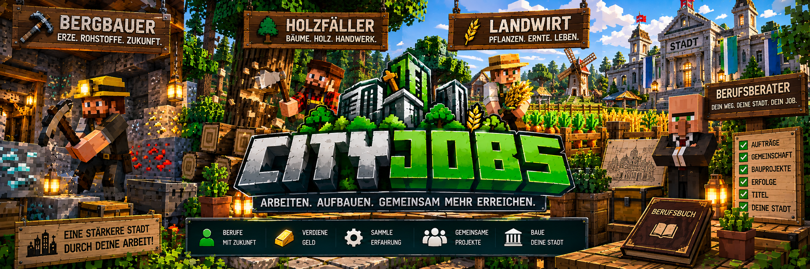

<link rel="stylesheet" href="style.css">

# CityJobs

**CityJobs** erweitert Minecraft-Server um ein umfangreiches städtisches Berufssystem.

Spieler können einen Beruf wählen, durch ihre tägliche Arbeit Berufs-XP sammeln, im Rang aufsteigen, bezahlte Aufträge erledigen und gemeinsam an großen städtischen Projekten arbeiten.

CityJobs verbindet Berufe, Wirtschaft und Stadtentwicklung zu einem gemeinsamen System.

---

## 📌 Aktuelle Version

**CityJobs 1.0.0**

- Minecraft **1.20.1**
- Forge **47.4.10 bis unter 48**
- Java **17**
- BankMod **ab 1.0.0.1 erforderlich**
- Installation auf **Client und Server**
- Optionale Integration mit **CityShops**

---

# 📚 Dokumentation

## 🔧 [Installation](cityjobs-installation.md)

Installation von CityJobs und den benötigten Abhängigkeiten auf Client und Server.

---

## 👷 [Berufe](cityjobs-berufe.md)

Alles über die drei verfügbaren Berufe:

- ⛏️ Bergarbeiter
- 🪓 Holzfäller
- 🌾 Landwirt

Erfahre, welche Rohstoffe zu welchem Beruf gehören und wodurch Berufs-XP gesammelt werden.

---

## 🧑‍💼 [NPCs & Berufsberater](cityjobs-npcs.md)

CityJobs verwendet eigene NPCs für die Berufswahl und Aufträge.

Dazu gehören:

- Berufsberater
- Bergbau-Vorarbeiter
- Holzfäller
- Landwirt

Der Berufsberater ermöglicht die Auswahl und den Wechsel des Berufs. Die Berufs-NPCs verwalten unter anderem Aufträge und Gemeinschaftsprojekte.

---

## ⭐ [Ränge & Berufs-XP](cityjobs-raenge-xp.md)

Jeder Beruf besitzt seinen eigenen Fortschritt.

Es gibt fünf Ränge:

1. Lehrling
2. Geselle
3. Facharbeiter
4. Experte
5. Meister

Hier findest du alle XP-Grenzen, Arbeitsfortschritte und Informationen zum Anti-Farm-Schutz.

---

## 📦 [Aufträge](cityjobs-auftraege.md)

Spieler können beim NPC ihres aktiven Berufs bezahlte Lieferaufträge annehmen.

Neben normalen Aufträgen gibt es:

- gemischte Aufträge
- Großaufträge
- Meisteraufträge
- rangabhängige Belohnungen
- Berufs-XP
- BankMod-Auszahlungen

---

## 🤝 [Gemeinschaftsaufträge](cityjobs-gemeinschaft.md)

Gemeinschaftsaufträge sind serverweite Lieferprojekte.

Bergarbeiter, Holzfäller und Landwirte arbeiten gemeinsam an einem großen Ziel und liefern jeweils die Rohstoffe ihres eigenen Berufs.

Beiträge werden direkt vergütet und geben Berufs-XP.

---

## 📖 [Berufsbuch](cityjobs-berufsbuch.md)

Mit

`/cityjobs`

kann jeder Spieler sein persönliches Berufsbuch öffnen.

Dort findest du unter anderem:

- abgeschlossene Aufträge
- verdientes Geld
- Lieferhistorie
- Berufsfortschritt
- Erfolge
- Profiltitel
- aktuelle Stadtbauprojekte

---

## 🏆 [Erfolge & Titel](cityjobs-erfolge-titel.md)

CityJobs besitzt ein eigenes Erfolgssystem.

Durch Aufträge, Gemeinschaftsprojekte und besondere Leistungen können Erfolge freigeschaltet werden.

Freigeschaltete Erfolge können anschließend als Profiltitel verwendet werden.

---

## 🏗️ [Städtische Bauprojekte](cityjobs-bauprojekte.md)

Gemeinsam eine echte Stadt aufbauen.

Spieler liefern die benötigten Rohstoffe über ihre Berufs-NPCs. Anschließend entsteht das Gebäude Schritt für Schritt.

CityJobs enthält unter anderem:

- modernes Rathaus
- moderne Stadtbank
- mehrere Bauabschnitte
- Fortschrittsanzeige
- persönliche Beitragsstatistik
- Hinderniserkennung
- Projektpause und Fortsetzung
- Schutz des aktiven Baugebiets

---

## 🏠 [Eigene Gebäudevorlagen](cityjobs-eigene-gebaeude.md)

Serverbetreiber können eigene Gebäude als CityJobs-Bauprojekt speichern.

CityJobs analysiert das Gebäude und erstellt daraus automatisch ein gemeinschaftliches Bauprojekt mit mehreren Bauabschnitten und den benötigten Materialien.

Mehrere fertiggestellte Projekte können archiviert werden.

---

## 💰 [Preise & CityShops](cityjobs-preise.md)

CityJobs besitzt eigene Grundpreise für Auftrags- und Baumaterialien.

Administratoren können diese Preise selbst einstellen.

Wenn CityShops installiert ist, kann CityJobs für Bauprojekte optional Preise aus aktiven Admin-Ankaufshops als Marktpreisreferenz verwenden.

**CityShops ist keine Pflichtabhängigkeit.**

---

## 🏦 [BankMod & Zahlungen](cityjobs-bankmod.md)

Alle Geldbelohnungen werden über BankMod ausgezahlt.

CityJobs besitzt zusätzliche Sicherheitsmechanismen gegen:

- doppelte Auszahlungen
- Warenverlust
- unklare Bankbuchungen

Bei einer unklaren Zahlung wird automatisch ein Bankprüffall erstellt, den ein Administrator kontrollieren kann.

---

## 🛠️ [Admin-Verwaltung](cityjobs-admin.md)

Über

`/cityjobs admin`

erhalten Administratoren Zugriff auf die CityJobs-Verwaltung.

Dazu gehören:

- Einstellungen
- Preise
- Spielerverwaltung
- NPC-Verwaltung
- Bankprüfung
- Bauprojekte
- Diagnose

---

## ⌨️ [Befehle](cityjobs-befehle.md)

Übersicht aller Spieler- und Administratorbefehle von CityJobs.

Dazu gehören Befehle für:

- Berufsbuch
- Admin-Verwaltung
- Beruf setzen
- NPCs
- Bankprüfungen

---

## ❓ [Häufige Fragen](cityjobs-haeufige-fragen.md)

Probleme mit CityJobs?

Hier findest du Hilfe zu häufigen Fragen und Problemen rund um:

- Installation
- NPCs
- Berufe
- Berufs-XP
- Aufträge
- Zahlungen
- Bauprojekte

---

## 📝 [Versionen & Changelog](cityjobs-versionen.md)

Alle wichtigen Änderungen und Neuerungen der verschiedenen CityJobs-Versionen.

---

# 🌆 Das bietet CityJobs

CityJobs ist mehr als ein einfaches Jobsystem.

### 👷 Drei Berufe

Wähle zwischen Bergarbeiter, Holzfäller und Landwirt.

### ⭐ Eigenes Fortschrittssystem

Jeder Beruf besitzt eigene XP und fünf Ränge vom Lehrling bis zum Meister.

### 📦 Bezahlte Aufträge

Erledige Lieferaufträge und erhalte Geld sowie Berufs-XP.

### 🤝 Gemeinsam arbeiten

Trage mit anderen Spielern zu serverweiten Gemeinschaftsprojekten bei.

### 🏗️ Gemeinsam die Stadt bauen

Liefere Rohstoffe für große Stadtbauprojekte und beobachte, wie die Gebäude Abschnitt für Abschnitt entstehen.

### 🏆 Erfolge & Profiltitel

Schalte Erfolge frei und zeige ausgewählte Titel in deinem Berufsprofil.

### 📖 Berufsbuch

Behalte Lieferungen, Fortschritt, Erfolge und Stadtprojekte im Blick.

### 🏦 Sichere Bankzahlungen

Alle Geldbelohnungen werden über BankMod verarbeitet und durch zusätzliche Prüfmechanismen abgesichert.

### 🛠️ Umfangreiche Administration

Serverbetreiber können Preise, Aufträge, Spieler, NPCs, Bauprojekte und zahlreiche weitere Einstellungen verwalten.

---

# 🔗 CityMods

CityJobs gehört zur CityMods-Reihe und kann zusammen mit anderen CityMods eingesetzt werden.

Die einzelnen Mods bleiben dabei möglichst eigenständig.

**CityShops** kann optional als Preisreferenz für bestimmte CityJobs-Bauprojekte verwendet werden.

---

# 🚧 Zukunft von CityJobs

Für zukünftige Versionen sind weitere Ideen geplant.

Dazu gehören unter anderem:

- weitere Berufe
- Arbeitgeber und städtische Betriebe
- Arbeitsgebiete
- Tages- und Wochenaufgaben
- Berufsspezialisierungen
- Meister- und Prestige-Fortschritt
- erweiterte Berufsstatistiken
- Ranglisten
- Arbeitsverträge über NPCs
- weitere Stadtbauprojekte
- größere Gemeinschaftsprojekte
- erweiterte Gebäudevorlagen
- weitere Erfolge und Titel
- optionale CityRegion-Integration
- erweiterte optionale CityShops-Integration
- CityJobs API
- zusätzliche Admin- und Diagnosewerkzeuge

Die vorhandenen **Berufsberater und Berufs-NPCs bleiben dabei ein zentraler Bestandteil von CityJobs.**

---

[← Zurück zur CityMods Wiki](index.md) | [Weiter: Installation →](cityjobs-installation.md)
