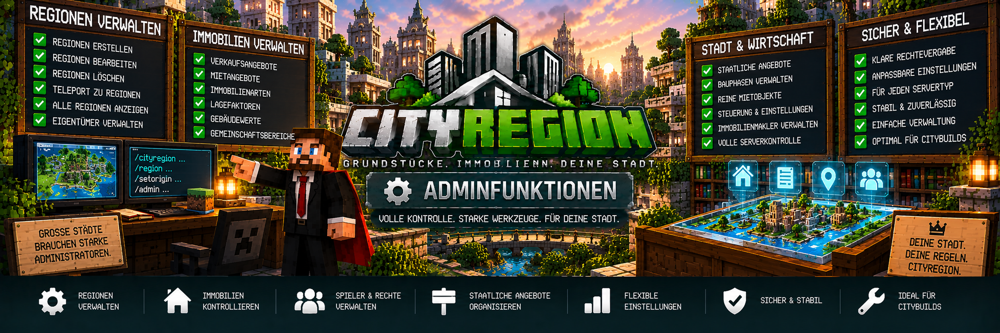

<link rel="stylesheet" href="style.css">



# 🛠️ Adminfunktionen

CityRegion bietet Administratoren umfangreiche Werkzeuge zur Verwaltung von Regionen, Grundstücken und Immobilien.

Damit können Admins unter anderem neue Regionen erstellen, Eigentümer verwalten, staatliche Verkaufs- und Mietangebote einrichten, Immobilienwerte festlegen und den Immobilienmakler verwalten.

Die Adminfunktionen bilden damit die Grundlage für die zentrale Verwaltung einer CityRegion-Stadt.

---

## 🧭 Übersicht

Administratoren können unter anderem:

- Hauptregionen erstellen
- alle Regionen anzeigen
- zu Regionen teleportieren
- Eigentümer zuweisen
- Eigentümer entfernen
- staatliche Verkaufsangebote verwalten
- staatliche Mietangebote verwalten
- Immobilienarten festlegen
- Lagefaktoren festlegen
- Gebäudewerte festlegen
- Gemeinschaftsbereiche verwalten
- Bauphasen verwalten
- reine Mietobjekte festlegen
- Immobilienmakler erstellen und verwalten
- Grundstücksschilder verwalten
- belegte Grundstücksschilder nach Bestätigung entfernen

Damit lassen sich sowohl kleine Grundstückssysteme als auch größere Städte verwalten.

---

# 🗺️ Regionen erstellen

Administratoren können neue Hauptregionen erstellen.

Dafür wird zunächst eine Auswahl festgelegt.

## Erste Position setzen

```text
/cityregion pos1
```

## Zweite Position setzen

```text
/cityregion pos2
```

Anschließend kann die Auswahl überprüft werden:

```text
/cityregion selection
```

Optional kann die Auswahl grafisch dargestellt werden:

```text
/cityregion preview
```

Danach kann die Region erstellt werden:

```text
/cityregion create <Name>
```

Beispiel:

```text
/cityregion create Stadtvilla-01
```

---

# 📐 Maximale Regionsgröße

Eine einzelne CityRegion darf maximal:

```text
500.000 Blöcke
```

umfassen.

CityRegion schützt außerdem vor ungültigen Überschneidungen zwischen Regionen.

Unterregionen können innerhalb einer vorhandenen Hauptregion erstellt werden.

---

# 🏢 Hauptregionen und Unterregionen

CityRegion unterstützt:

```text
Hauptregion
└── Unterregion
```

Damit können beispielsweise große Gebäude in mehrere einzelne Immobilien aufgeteilt werden.

Beispiel:

```text
Wohnhaus-A
├── Wohnung-01
├── Wohnung-02
├── Wohnung-03
├── Wohnung-04
└── Treppenhaus
```

Jede Wohnung kann dadurch getrennt verwaltet werden.

---

# 🔎 Region überprüfen

Informationen zur Region am aktuellen Standort können mit:

```text
/cityregion info
```

angezeigt werden.

Das ist besonders hilfreich bei mehreren verschachtelten Regionen.

CityRegion verwendet bei solchen Bereichen die kleinste passende Region.

---

# 👁️ Regionsvorschau

Vor dem Erstellen einer Region kann die aktuelle Auswahl grafisch kontrolliert werden:

```text
/cityregion preview
```

Dadurch kann geprüft werden, ob:

- die richtige Fläche ausgewählt wurde
- die Höhe stimmt
- die Region innerhalb der gewünschten Hauptregion liegt
- keine falschen Bereiche eingeschlossen wurden

---

# 📋 Alle Regionen anzeigen

Administratoren können alle vorhandenen CityRegion-Regionen über die Adminverwaltung einsehen.

Das ist besonders auf größeren Servern hilfreich.

Eine Region kann dort beispielsweise anhand ihres Namens gefunden werden.

Mögliche Informationen sind unter anderem:

- Regionsname
- Eigentümer
- Status
- Immobilienart
- Mietstatus
- Gebäudezuordnung

---

# 📍 Zu Regionen teleportieren

Administratoren können über die Regionsverwaltung zu vorhandenen Immobilien teleportieren.

Dadurch muss ein Grundstück nicht manuell in der Welt gesucht werden.

Beispiel:

```text
Adminverwaltung
      ↓
Region auswählen
      ↓
Teleport
      ↓
Region überprüfen
```

Das erleichtert die Verwaltung größerer Städte erheblich.

---

# 👑 Eigentümer zuweisen

Administratoren können einer Immobilie einen Eigentümer zuweisen.

Das kann beispielsweise notwendig sein, wenn:

- ein Grundstück manuell vergeben werden soll
- ein Eigentümer korrigiert werden muss
- eine bestehende Immobilie einem Spieler zugeordnet werden soll
- ein administrativer Eingriff notwendig ist

Nach der Zuweisung wird der entsprechende Spieler als Eigentümer der Region geführt.

---

# ❌ Eigentümer entfernen

Administratoren können einen vorhandenen Eigentümer auch wieder entfernen.

Das kann beispielsweise verwendet werden, wenn:

- eine Immobilie wieder staatlich werden soll
- eine falsche Zuordnung korrigiert werden muss
- ein Grundstück administrativ zurückgenommen wird

Dabei sollte immer geprüft werden, ob aktive Mietverträge oder andere laufende Vorgänge bestehen.

---

# 🏛️ Staatliche Immobilien

Administratoren können staatliche Immobilien verwalten.

Eine staatliche Immobilie kann beispielsweise:

- verkauft
- vermietet
- versteigert
- als reine Mietimmobilie geführt

werden.

Einnahmen aus staatlichen CityRegion-Angeboten werden über MineBank an die Staatskasse übertragen.

---

# 💰 Staatliche Verkaufsangebote

Admins können Grundstücke als staatliche Verkaufsangebote bereitstellen.

Ein Spieler kann eine solche Immobilie anschließend über das zugehörige Grundstücksschild erwerben.

Der Ablauf:

```text
Staatliche Immobilie
        ↓
Verkaufsangebot
        ↓
Spieler bestätigt Kauf
        ↓
MineBank-Zahlung
        ↓
Staatskasse erhält Geld
        ↓
Spieler wird Eigentümer
```

---

# 🔑 Staatliche Mietangebote

Staatliche Immobilien können ebenfalls vermietet werden.

Beispiele:

- Wohnungen
- Gewerbeflächen
- Lager
- Häuser
- öffentliche Mietobjekte

Bei staatlichen Mietangeboten gehen die entsprechenden Einnahmen über MineBank an die Staatskasse.

Nach dem Mietende kann die Immobilie wieder freigegeben und erneut vermietet werden.

---

# 🔒 Reine Mietobjekte

Administratoren können Immobilien so einstellen, dass sie ausschließlich vermietet werden.

Dadurch kann verhindert werden, dass bestimmte Immobilien dauerhaft verkauft werden.

Das eignet sich besonders für:

- staatliche Wohnungen
- Apartments
- Gewerbemietflächen
- besondere Serverimmobilien

Beispiel:

```text
Stadtwohnung-01
Status: Nur Vermietung
```

Die Immobilie bleibt dadurch dauerhaft Teil des Mietsystems.

---

# 🏷️ Immobilienarten

Administratoren können Immobilien einer bestimmten Art zuordnen.

CityRegion unterstützt:

```text
Wohnen
Gewerbe
Industrie
Lager
Bauland
Gemeinschaftsfläche
```

Dadurch können Immobilien entsprechend ihrer vorgesehenen Nutzung organisiert werden.

---

# 🏠 Wohnen

Die Immobilienart **Wohnen** eignet sich beispielsweise für:

- Häuser
- Wohnungen
- Apartments
- Wohnanlagen

---

# 🏪 Gewerbe

Die Immobilienart **Gewerbe** eignet sich beispielsweise für:

- Geschäfte
- Restaurants
- Büros
- Werkstätten
- Firmengebäude

Gewerbeimmobilien können zusätzlich einer CityShops-Firma beziehungsweise Filiale zugeordnet werden.

CityShops bleibt dabei eine separate Mod und ist keine Pflichtabhängigkeit von CityRegion.

---

# 🏭 Industrie

Die Immobilienart **Industrie** kann für:

- Fabriken
- Produktionshallen
- Industrieanlagen
- große Betriebsgelände

verwendet werden.

---

# 📦 Lager

Die Immobilienart **Lager** eignet sich beispielsweise für:

- Lagerhallen
- Warenlager
- Firmenlager
- Logistikflächen

---

# 🏗️ Bauland

Unbebaute Grundstücke können als **Bauland** gekennzeichnet werden.

Dadurch können Grundstücke bereits verwaltet und verkauft werden, bevor ein Gebäude darauf errichtet wurde.

---

# 👥 Gemeinschaftsfläche

Gemeinschaftsflächen sind Bereiche, die von mehreren Bewohnern beziehungsweise Nutzern verwendet werden.

Beispiele:

- Treppenhäuser
- Eingangsbereiche
- Flure
- Innenhöfe
- Gemeinschaftsräume

---

# 🚪 Gemeinschaftsbereiche verwalten

Eine Region kann als Gemeinschaftsbereich markiert werden.

Dafür steht:

```text
/cityregion common true
```

zur Verfügung.

Zum Entfernen:

```text
/cityregion common false
```

Dadurch können beispielsweise Mieter eines Gebäudes gemeinsame Türen verwenden, ohne vollständige Rechte für die gesamte Hauptregion zu besitzen.

---

# 📍 Lagefaktor

Administratoren können den Lagefaktor einer Immobilie festlegen.

Damit kann berücksichtigt werden, dass Immobilien je nach Standort unterschiedlich bewertet werden.

Beispiel:

```text
Innenstadt
→ höherer Lagefaktor

Wohngebiet
→ normaler Lagefaktor

Stadtrand
→ niedrigerer Lagefaktor
```

Der Lagefaktor kann in die Immobilienbewertung einfließen.

---

# 🏢 Gebäudewert

Neben dem Grundstück kann ein Administrator einen Gebäudewert hinterlegen.

Dadurch kann berücksichtigt werden, ob sich auf einem Grundstück beispielsweise:

- ein kleines Haus
- eine große Villa
- ein Mehrfamilienhaus
- eine Fabrik
- ein großes Gewerbegebäude

befindet.

Grundstück und Gebäude können dadurch gemeinsam für die Immobilienbewertung berücksichtigt werden.

---

# 📈 Richtwert

Aus den vorhandenen Immobilieninformationen kann CityRegion einen Richtwert für die Immobilie darstellen.

Dieser dient als Orientierung.

Der Richtwert muss nicht identisch mit dem tatsächlichen Verkaufs-, Miet- oder Auktionspreis sein.

---

# 🏗️ Bauphasen

Administratoren können den Bauzustand einer Immobilie verwalten.

Damit können Grundstücke beispielsweise entsprechend ihrer aktuellen Entwicklung eingeordnet werden.

Das ist besonders für:

- Bauland
- Bauprojekte
- noch nicht fertiggestellte Immobilien
- fertiggestellte Gebäude

hilfreich.

Die Bauphase kann auch im Real Estate OS dargestellt werden.

---

# 🏢 Gebäude verwalten

Große Hauptregionen können als Gebäude organisiert werden.

Beispiel:

```text
Wohnhaus-A
├── Wohnung-01
├── Wohnung-02
├── Wohnung-03
└── Wohnung-04
```

Für die Gebäudezuordnung kann innerhalb einer entsprechenden Region:

```text
/cityregion building <Gebäudename>
```

verwendet werden.

Beispiel:

```text
/cityregion building Wohnhaus-A
```

---

# 🏘️ Wohnungen verwalten

Wohnungen werden als Unterregionen innerhalb eines größeren Gebäudes angelegt.

Dadurch können Administratoren größere Immobilien in mehrere getrennte Bereiche aufteilen.

Jede Wohnung kann anschließend unabhängig:

- verkauft
- vermietet
- verwaltet
- mit Mitgliedern versehen

werden.

---

# 💾 Ursprungszustand festlegen

Administratoren beziehungsweise berechtigte Eigentümer können den Ursprungszustand einer Immobilie speichern.

Dafür steht:

```text
/cityregion setorigin
```

zur Verfügung.

Dieser Zustand wird später bei einer entsprechenden automatischen Rücksetzung wiederhergestellt.

---

# 🔄 Ursprungszustand und Mietobjekte

Der Ursprungszustand ist besonders für Mietobjekte wichtig.

Beispiel:

```text
Wohnung fertig einrichten
        ↓
/cityregion setorigin
        ↓
Wohnung vermieten
        ↓
Mieter verändert Wohnung
        ↓
Mietvertrag endet
        ↓
Gegenstände sichern
        ↓
Ursprungszustand wiederherstellen
```

Dadurch kann dieselbe Immobilie immer wieder neu vermietet werden.

---

# 📦 Abhollager

Persönliche Gegenstände werden vor einer entsprechenden automatischen Rücksetzung gesichert.

Die Gegenstände landen im Abhollager des betroffenen Spielers.

Spieler können dieses über den Immobilienmakler oder mit:

```text
/cityregion returns
```

öffnen.

Ist das Inventar voll, bleiben übrige Gegenstände gespeichert.

---

# 🪧 Grundstücksschilder verwalten

Administratoren können CityRegion-Grundstücksschilder verwalten.

Diese Schilder können für:

- Verkaufsangebote
- Mietangebote

verwendet werden.

Die Schilder aktualisieren ihren Status automatisch.

Beispielsweise:

```text
FREI
```

```text
VERKAUFT
```

oder:

```text
VERMIETET
```

---

# 🛡️ Schutz der Grundstücksschilder

Normale Spieler können registrierte Grundstücksschilder nicht einfach abbauen.

Dadurch bleiben Verkaufs- und Mietangebote geschützt.

Administratoren beziehungsweise OPs besitzen zusätzliche Möglichkeiten zur Entfernung.

---

# ⚠️ Belegte Schilder entfernen

Ein freies Grundstücksschild kann von einem entsprechend berechtigten Administrator entfernt werden.

Bei einem Schild einer:

- verkauften Immobilie
- vermieteten Immobilie
- anderweitig belegten Immobilie

verlangt CityRegion zunächst eine Bestätigung.

Dadurch wird verhindert, dass ein wichtiges Grundstücksschild versehentlich entfernt wird.

---

# 🧑‍💼 Immobilienmakler verwalten

Administratoren können den CityRegion-Immobilienmakler verwalten.

Dabei kann:

- ein bestehender Villager als Makler registriert werden
- ein eigener Makler-NPC erstellt werden
- ein vorhandener Makler entfernt werden

Der Immobilienmakler dient Spielern als zentrale Anlaufstelle für das Immobiliensystem.

---

# 👔 Schutz des Makler-NPCs

Der CityRegion-Immobilienmakler ist für den dauerhaften Einsatz vorgesehen.

Er ist:

- unbeweglich
- unverwundbar
- gegen Rückstoß geschützt

Dadurch bleibt der NPC an seinem vorgesehenen Standort.

---

# 💻 Real Estate OS

Der Immobilienmakler und der Immobilien-PC ermöglichen Zugriff auf das **Real Estate OS**.

Dort können unter anderem angezeigt werden:

- verfügbare Immobilien
- eigene Immobilien
- gemietete Immobilien
- Gebäude
- Wohnungen
- Mietverträge
- Immobilienwerte
- Markttrends
- Auktionen
- Mieteinnahmen
- Grundstückslizenzen

---

# 🔨 Auktionen verwalten

CityRegion unterstützt Immobilienauktionen.

Eigentümer beziehungsweise berechtigte Administratoren können Auktionen starten.

Dabei werden unter anderem:

- Startgebot
- Laufzeit
- aktuelle Gebote
- Höchstbietender

verwaltet.

Wird eine Auktion abgebrochen, erhält der aktuelle Höchstbietende sein gebundenes Geld zurück.

---

# 🏛️ Staatliche Auktionen

Bei staatlichen Auktionen geht der erfolgreiche Auktionsbetrag an die MineBank-Staatskasse.

Nach dem erfolgreichen Auktionsende wird der Höchstbietende automatisch Eigentümer der Immobilie.

---

# 💳 MineBank

CityRegion benötigt **MineBank 1.0.2 oder neuer**.

MineBank übernimmt die finanzielle Abwicklung für unter anderem:

- Grundstückskäufe
- private Verkäufe
- staatliche Verkäufe
- Mietzahlungen
- Kautionen
- Mietverlängerungen
- Auktionen
- Grundstückslizenzen
- Zahlungen an die Staatskasse

Dadurch muss CityRegion kein eigenes separates Geldsystem bereitstellen.

---

# 🪪 Grundstückslizenzen

CityRegion unterstützt Grundstückslizenzen mit unterschiedlichen Besitzgrenzen.

Verfügbare Lizenzgrößen sind:

```text
2 Grundstücke
5 Grundstücke
10 Grundstücke
```

Damit kann die maximale Anzahl der Immobilien eines Spielers gesteuert werden.

Die Verwaltung erfolgt über das Immobilienmakler-System.

---

# 🏪 CityShops-Zuordnung

Eine Gewerbeimmobilie kann optional einer CityShops-Firma beziehungsweise Filiale zugeordnet werden.

Dadurch können Server, die beide Mods verwenden, Gewerbeimmobilien mit Unternehmen verbinden.

CityShops bleibt jedoch unabhängig.

> CityShops ist **keine Pflichtabhängigkeit** von CityRegion.

---

# 👥 Eigentümer und Mitglieder

Eigentümer können Mitglieder zu ihren Regionen hinzufügen und deren Rechte verwalten.

Die Rechte können getrennt vergeben werden für:

- Bauen und Abbauen
- Behälter
- Türen, Falltüren und Tore

Administratoren können bei Problemen die entsprechende Region und ihre Zuordnungen überprüfen.

---

# 🔑 Mietverträge kontrollieren

Administratoren können bestehende Mietverhältnisse verwalten.

Dabei sind unter anderem folgende Informationen relevant:

- Mieter
- Vermieter
- Mietpreis
- Mietbeginn
- Mietende
- verbleibende Mietdauer
- Kaution
- automatische Verlängerung

Ein Eigentümer beziehungsweise Administrator kann einen Mietvertrag bei Bedarf beenden.

---

# 🛑 Vor administrativen Änderungen prüfen

Bevor ein Administrator größere Änderungen an einer Immobilie durchführt, sollte geprüft werden, ob aktive Vorgänge bestehen.

Dazu gehören insbesondere:

- aktiver Mietvertrag
- laufende Auktion
- vorhandener Eigentümer
- vorhandene Unterregionen
- registrierte Grundstücksschilder

Dadurch können widersprüchliche Zustände vermieden werden.

---

# 🔎 `/cityregion info` verwenden

Bei Problemen ist:

```text
/cityregion info
```

eines der wichtigsten Werkzeuge.

Damit kann innerhalb einer Immobilie geprüft werden, welche Region aktuell erkannt wird.

Das ist besonders bei:

- Gebäuden
- Wohnungen
- Unterregionen
- mehreren angrenzenden Grundstücken

hilfreich.

---

# 👁️ Auswahl vor Erstellung prüfen

Vor der Erstellung einer neuen Region empfiehlt sich:

```text
/cityregion selection
```

und anschließend:

```text
/cityregion preview
```

Dadurch kann die Auswahl kontrolliert werden, bevor sie dauerhaft gespeichert wird.

---

# 🏙️ Beispiel: Neues Wohnhaus einrichten

Ein Administrator möchte ein Mehrfamilienhaus einrichten.

## 1. Hauptregion auswählen

```text
/cityregion pos1
/cityregion pos2
/cityregion selection
/cityregion preview
```

## 2. Hauptregion erstellen

```text
/cityregion create Wohnhaus-A
```

## 3. Gebäude benennen

```text
/cityregion building Wohnhaus-A
```

## 4. Wohnungen erstellen

Für jede Wohnung wird eine eigene Unterregion ausgewählt und erstellt.

Beispiel:

```text
/cityregion pos1
/cityregion pos2
/cityregion preview
/cityregion create Wohnung-01
```

Anschließend:

```text
/cityregion building Wohnhaus-A
```

Dieser Vorgang wird für weitere Wohnungen wiederholt.

## 5. Gemeinschaftsbereich erstellen

Treppenhaus beziehungsweise Eingangsbereich als entsprechende Region anlegen und anschließend:

```text
/cityregion common true
```

## 6. Wohnungen einrichten

Jede Wohnung vollständig vorbereiten.

## 7. Ursprungszustand speichern

Innerhalb der jeweiligen Wohnung:

```text
/cityregion setorigin
```

## 8. Mietangebote einrichten

Anschließend können die einzelnen Wohnungen über Grundstücksschilder zur Vermietung angeboten werden.

Damit ist das Gebäude für mehrere getrennte Mietverhältnisse vorbereitet.

---

# 🏪 Beispiel: Staatliche Gewerbefläche

Eine Stadt möchte eine Gewerbefläche vermieten.

Der Administrator kann:

1. Region erstellen
2. Immobilienart auf Gewerbe festlegen
3. Lagefaktor und Gebäudewert verwalten
4. die Immobilie als staatliches Objekt führen
5. bei Bedarf nur Vermietung erlauben
6. Ursprungszustand speichern
7. Mietangebot erstellen

Die Mietzahlung geht anschließend über MineBank an die Staatskasse.

---

# 🏡 Beispiel: Staatliches Grundstück verkaufen

Eine neue Immobilie soll vom Staat verkauft werden.

Der Ablauf:

```text
Region erstellen
      ↓
Immobilieninformationen festlegen
      ↓
Verkaufsangebot einrichten
      ↓
Grundstücksschild registrieren
      ↓
Spieler bestätigt Kauf
      ↓
MineBank-Zahlung
      ↓
Staatskasse erhält Geld
      ↓
Spieler wird Eigentümer
```

---

# ❗ Häufige Probleme

## Die falsche Region wird bearbeitet

Stelle dich innerhalb der gewünschten Region und verwende:

```text
/cityregion info
```

Bei verschachtelten Regionen wird die kleinste passende Region verwendet.

---

## Region kann nicht erstellt werden

Prüfe:

- wurden `pos1` und `pos2` gesetzt?
- überschneidet sich die Region ungültig mit einer anderen Region?
- liegt eine geplante Unterregion vollständig innerhalb der Hauptregion?
- überschreitet die Region die maximale Größe von 500.000 Blöcken?

Verwende vor dem Erstellen:

```text
/cityregion selection
/cityregion preview
```

---

## Staatlicher Verkauf funktioniert nicht

Prüfe:

- existiert die Region?
- wurde das Angebot korrekt eingerichtet?
- ist das Grundstück noch verfügbar?
- besitzt der Spieler genügend MineBank-Guthaben?
- ist MineBank korrekt geladen?

---

## Staatlicher Rückkauf funktioniert nicht

Beim Rückkauf einer Immobilie durch den Staat muss die Staatskasse über genügend Geld verfügen.

Ist nicht genügend Guthaben vorhanden, kann der staatliche Rückkauf nicht abgeschlossen werden.

---

## Mietobjekt wird nicht wieder frei

Prüfe:

- ist der Mietvertrag tatsächlich beendet?
- wurde die Rücksetzung verarbeitet?
- existiert ein Ursprungszustand?
- ist das Grundstücksschild noch korrekt mit der Region verbunden?

---

## Makler funktioniert nicht

Prüfe:

- wurde der NPC korrekt als Immobilienmakler registriert?
- existiert CityRegion auf Client und Server?
- ist MineBank 1.0.2 oder neuer installiert?
- wurde der richtige NPC verwendet?

---

## Grundstücksschild lässt sich nicht entfernen

Registrierte Schilder sind geschützt.

Bei belegten beziehungsweise aktiven Schildern benötigt ein Administrator zusätzlich die vorgesehene Bestätigung.

---

# 🛡️ Empfehlung für Administratoren

Vor größeren Änderungen an einer CityRegion empfiehlt sich grundsätzlich:

```text
1. /cityregion info
2. Region und Eigentümer prüfen
3. Mietstatus prüfen
4. Auktionsstatus prüfen
5. Grundstücksschild prüfen
6. Änderung durchführen
7. Region erneut kontrollieren
```

Damit können versehentliche Änderungen an der falschen Immobilie vermieden werden.

---

# ✅ Zusammenfassung

Die CityRegion-Adminfunktionen ermöglichen die zentrale Verwaltung des gesamten Immobiliensystems.

Administratoren können unter anderem:

- Regionen erstellen und überprüfen
- alle Regionen verwalten
- zu Immobilien teleportieren
- Eigentümer zuweisen und entfernen
- staatliche Verkaufsangebote erstellen
- staatliche Mietangebote erstellen
- Immobilienarten festlegen
- Lagefaktoren verwalten
- Gebäudewerte verwalten
- Bauphasen verwalten
- Gemeinschaftsbereiche festlegen
- reine Mietobjekte verwalten
- Gebäude und Wohnungen organisieren
- Ursprungszustände vorbereiten
- Grundstücksschilder verwalten
- Immobilienmakler verwalten
- Auktionen überwachen
- MineBank-Staatszahlungen verwenden

Damit besitzt CityRegion die notwendigen Verwaltungswerkzeuge für umfangreiche Grundstücks- und Immobiliensysteme auf Minecraft-Servern.

---

[← Zurück: Grundstücksschilder](cityregion-schilder.md) | [Weiter: Befehle →](cityregion-befehle.md)
