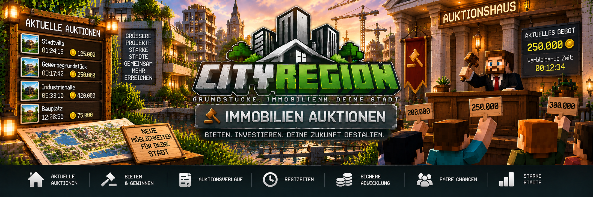

<link rel="stylesheet" href="style.css">



# 🔨 Immobilienauktionen

Mit CityRegion können Grundstücke und Immobilien über ein integriertes Auktionssystem versteigert werden.

Eigentümer und Administratoren können Auktionen starten, einen Startpreis und eine Laufzeit festlegen und Spieler können anschließend Gebote auf die Immobilie abgeben.

Nach dem Ende einer erfolgreichen Auktion wird die Immobilie automatisch an den Höchstbietenden übertragen.

Alle Zahlungen werden über **MineBank** abgewickelt.

---

## 🏠 Welche Immobilien können versteigert werden?

Eine bestehende CityRegion kann als Auktion angeboten werden.

Das eignet sich beispielsweise für:

- Häuser
- Wohnungen
- Gewerbeimmobilien
- Lagerhallen
- Industriegrundstücke
- Bauland
- staatliche Grundstücke
- private Immobilien

Dabei bleibt die Immobilie während der Auktion weiterhin eindeutig mit ihrer CityRegion verknüpft.

---

# 🔨 Auktion starten

Eine Auktion kann vom Eigentümer beziehungsweise von einem berechtigten Administrator gestartet werden.

Beim Start werden mindestens folgende Informationen festgelegt:

- zu versteigernde Immobilie
- Startgebot
- Laufzeit der Auktion

Nach dem Start können Spieler auf die Immobilie bieten.

---

## 💰 Startgebot

Das Startgebot legt fest, mit welchem Mindestbetrag die Auktion beginnt.

Beispiel:

```text
Immobilie: Stadtvilla
Startgebot: 100.000
```

Ein Spieler muss mindestens den für die Auktion erforderlichen Betrag bieten.

---

## ⏱️ Laufzeit

Jede Auktion besitzt eine festgelegte Laufzeit.

Während dieser Zeit können Spieler neue Gebote abgeben.

Im Auktionssystem können unter anderem angezeigt werden:

```text
Immobilie: Stadtvilla
Startgebot: 100.000
Aktuelles Gebot: 150.000
Höchstbietender: Spieler123
Verbleibende Zeit: 02:14:35
```

Nach Ablauf der Zeit endet die Auktion automatisch.

---

# 💰 Auf eine Immobilie bieten

Spieler können während einer laufenden Auktion ein Gebot abgeben.

CityRegion prüft dabei unter anderem:

- läuft die Auktion noch?
- ist das Gebot hoch genug?
- besitzt der Spieler genügend Guthaben?
- kann die Zahlung über MineBank gebunden werden?

Nur gültige Gebote werden akzeptiert.

---

# 🏦 Gebote und MineBank

Das Auktionssystem verwendet MineBank für die finanzielle Abwicklung.

Wird ein gültiges Gebot abgegeben, wird der entsprechende Betrag für die Auktion gebunden.

Dadurch kann der Höchstbietende das Geld nicht gleichzeitig anderweitig verwenden und anschließend die Auktion ohne ausreichende Deckung gewinnen.

---

## 🔄 Spieler wird überboten

Wird ein Spieler von einem höheren Gebot überboten, bleibt sein Geld nicht dauerhaft gebunden.

Der vorher gebundene Betrag wird dem überbotenen Spieler wieder zurückgegeben.

Beispiel:

```text
Spieler A bietet: 100.000
        ↓
100.000 werden gebunden

Spieler B bietet: 125.000
        ↓
125.000 werden für Spieler B gebunden
        ↓
Spieler A erhält seine 100.000 zurück
```

Damit bleibt immer nur das aktuelle Höchstgebot für die laufende Auktion gebunden.

---

# 👑 Höchstbietender

Der Spieler mit dem aktuell höchsten gültigen Gebot ist der Höchstbietende.

Bis zum Ende der Auktion kann dieser Spieler jedoch noch von einem anderen Spieler überboten werden.

Erst nach Ablauf der Auktionszeit steht der Gewinner endgültig fest.

---

# ⏰ Ende einer Auktion

Nach Ablauf der festgelegten Laufzeit wertet CityRegion die Auktion automatisch aus.

Gibt es ein gültiges Höchstgebot:

1. die Auktion endet
2. der Höchstbietende wird ermittelt
3. die gebundene Zahlung wird abgeschlossen
4. der Verkäufer erhält das Geld
5. der Gewinner wird neuer Eigentümer
6. die Region wird aktualisiert
7. die Auktion wird beendet

Die Eigentumsübertragung erfolgt damit automatisch.

---

# 👤 Private Auktionen

Bei einer privaten Auktion gehört die Immobilie bereits einem Spieler.

Nach einer erfolgreichen Auktion:

```text
Höchstbietender
      ↓
   MineBank
      ↓
bisheriger Eigentümer
```

Der bisherige Eigentümer erhält den erfolgreichen Auktionsbetrag.

Anschließend wird der Höchstbietende neuer Eigentümer der Immobilie.

---

# 🏛️ Staatliche Auktionen

Auch staatliche Immobilien können über Auktionen angeboten werden.

Bei einer erfolgreichen staatlichen Auktion geht das Geld nicht an einen privaten Verkäufer.

Stattdessen wird der Betrag an die **MineBank-Staatskasse** übertragen.

```text
Höchstbietender
      ↓
   MineBank
      ↓
 Staatskasse
```

Anschließend wird der Gewinner Eigentümer der Immobilie.

---

# 🏠 Was passiert mit der Immobilie?

Bei einer erfolgreichen Auktion wird die bestehende Immobilie an den Gewinner übertragen.

Gebäude und vorhandene Inhalte bleiben bei einer normalen Eigentumsübertragung bestehen.

Das bedeutet:

> Eine erfolgreiche Auktion setzt die Immobilie nicht automatisch auf ihren Ursprungszustand zurück.

Der neue Eigentümer übernimmt die bestehende Immobilie.

---

# ❌ Auktion abbrechen

Eine laufende Auktion kann von einer entsprechend berechtigten Person abgebrochen werden.

Wird eine Auktion abgebrochen:

- findet kein Eigentümerwechsel statt
- die Immobilie bleibt beim bisherigen Eigentümer
- ein bereits gebundener Höchstbetrag wird zurückgegeben
- die Auktion wird beendet

Dadurch verliert ein Spieler sein gebundenes Geld nicht, wenn die Auktion vorzeitig abgebrochen wird.

---

# 💳 Geld bei abgebrochener Auktion

Existiert zum Zeitpunkt des Abbruchs bereits ein Höchstgebot, wird der gebundene Betrag an den entsprechenden Spieler zurückgegeben.

Beispiel:

```text
Aktuelles Höchstgebot: 175.000
Höchstbietender: Spieler123

Auktion wird abgebrochen
        ↓
Spieler123 erhält 175.000 zurück
```

Die Immobilie bleibt beim bisherigen Eigentümer.

---

# 🏷️ Immobilieninformationen

Eine Auktion kann mit den vorhandenen Immobilieninformationen von CityRegion kombiniert werden.

Spieler können dadurch vor einem Gebot wichtige Informationen zur Immobilie prüfen.

Dazu können unter anderem gehören:

- Immobilienname
- Immobilienart
- Grundstücksgröße
- Eigentümer
- Richtwert
- letzter Verkaufspreis
- Markttrend
- Gebäude
- Wohnungen
- Mietstatus

Dadurch kann ein Spieler die Immobilie vor einem Gebot besser einschätzen.

---

# 💻 Auktionen im Real Estate OS

Das **Real Estate OS** kann laufende Immobilienauktionen anzeigen.

Spieler können dadurch zentral nach Immobilien suchen, die aktuell versteigert werden.

Zu einer Auktion können beispielsweise folgende Informationen angezeigt werden:

```text
Stadtvilla

Immobilienart:      Wohnen
Startgebot:         100.000
Aktuelles Gebot:    175.000
Höchstbietender:    Spieler123
Restzeit:           01:42:18
```

Dadurch müssen Spieler nicht jedes Grundstück einzeln in der Welt suchen.

---

# 🧑‍💼 Immobilienmakler

Der Immobilienmakler bietet ebenfalls Zugriff auf das Real Estate OS.

Dadurch können Spieler:

- Immobilien suchen
- laufende Auktionen finden
- Immobilieninformationen prüfen
- Immobilien besichtigen
- eigene Immobilien verwalten

Eine interessante Auktionsimmobilie kann dadurch zunächst angesehen werden, bevor ein Gebot abgegeben wird.

---

# 🔎 Immobilie besichtigen

Vor einem größeren Gebot kann eine Immobilie über die vorhandenen CityRegion-Funktionen besichtigt werden.

Dadurch kann der Spieler das Grundstück beziehungsweise Gebäude prüfen und anschließend entscheiden, ob er an der Auktion teilnehmen möchte.

---

# 📈 Immobilienwert und Auktionen

Der vorhandene Immobilienwert kann als Orientierung dienen.

Beispiel:

```text
Richtwert:            250.000
Letzter Verkauf:      235.000
Startgebot:           175.000
Aktuelles Gebot:      220.000
Markttrend:           steigend
```

Der Richtwert bestimmt jedoch nicht automatisch, wie hoch das endgültige Auktionsgebot sein muss.

Der tatsächliche Verkaufspreis entsteht durch die abgegebenen Gebote.

---

# 🏢 Wohnungen versteigern

Auch eine Wohnung kann als eigenständige Unterregion verwaltet werden.

Wenn die entsprechende Immobilie für einen Eigentumswechsel vorgesehen ist, kann sie unabhängig vom restlichen Gebäude behandelt werden.

Beispiel:

```text
Wohnhaus-A
├── Wohnung-01
├── Wohnung-02 → Auktion
├── Wohnung-03
└── Wohnung-04
```

Die Hauptregion des Gebäudes bleibt dabei bestehen.

---

# 🏪 Gewerbeimmobilien versteigern

Auktionen können ebenfalls für Gewerbeimmobilien interessant sein.

Beispiele:

- Ladenflächen
- Firmengebäude
- Bürogebäude
- Lagerhallen
- Industrieanlagen
- Baugrundstücke

Vor dem Start sollte geprüft werden, ob bestehende Zuordnungen oder Nutzungen der Immobilie berücksichtigt werden müssen.

---

# 🛑 Aktive Vermietung

Eine Immobilie mit einer aktiven Vermietung sollte nicht einfach gleichzeitig in einen widersprüchlichen Eigentumsprozess gebracht werden.

Vor entsprechenden Verwaltungsaktionen sollte daher geprüft werden, ob noch ein aktiver Mietvertrag besteht.

Informationen zur Region können mit:

```text
/cityregion info
```

geprüft werden.

Weitere Informationen stehen im Real Estate OS zur Verfügung.

---

# 🏛️ Rückgabe an den Staat und Auktionen

Eine Immobilie kann nicht gleichzeitig sinnvoll zurückgegeben und versteigert werden.

Besteht eine laufende Auktion, muss diese zuerst beendet beziehungsweise abgebrochen werden, bevor die Immobilie an den Staat zurückgegeben werden kann.

Die Rückgabe an den Staat erfolgt über:

```text
/cityregion returnstate
```

---

# 🔒 Sichere Auktionsabwicklung

Das Auktionssystem schützt die finanzielle Abwicklung dadurch, dass:

- nur gültige Gebote akzeptiert werden
- das Geld des Höchstbietenden gebunden wird
- überbotene Spieler ihr Geld zurückerhalten
- bei einem Abbruch das gebundene Geld zurückgegeben wird
- der Eigentümerwechsel erst nach erfolgreichem Auktionsende erfolgt

Dadurch werden Immobilie und Zahlung gemeinsam abgewickelt.

---

# 📊 Beispiel einer kompletten Auktion

Angenommen, folgende Immobilie soll versteigert werden:

```text
Name:             Stadtvilla
Immobilienart:    Wohnen
Richtwert:        300.000
Startgebot:       200.000
```

### Erstes Gebot

```text
Spieler A: 200.000
```

Spieler A ist jetzt Höchstbietender.

Der entsprechende Betrag wird für die Auktion gebunden.

### Zweites Gebot

```text
Spieler B: 225.000
```

Spieler B wird neuer Höchstbietender.

Spieler A erhält seinen gebundenen Betrag zurück.

### Drittes Gebot

```text
Spieler C: 250.000
```

Spieler C ist jetzt Höchstbietender.

Spieler B erhält sein vorheriges Gebot zurück.

### Auktionsende

Nach Ablauf der Zeit:

```text
Gewinner:       Spieler C
Endpreis:       250.000
```

CityRegion schließt die Zahlung ab und überträgt die Immobilie an Spieler C.

---

# ❗ Häufige Probleme

## Mein Gebot wird nicht angenommen

Prüfe:

- läuft die Auktion noch?
- ist dein Gebot hoch genug?
- besitzt du genügend MineBank-Guthaben?
- ist die Immobilie weiterhin in der Auktion?

---

## Mein Geld ist nach einem Gebot nicht verfügbar

Das aktuelle Höchstgebot wird während der Auktion gebunden.

Wirst du überboten, wird der vorher gebundene Betrag wieder zurückgegeben.

Gewinnst du die Auktion, wird das gebundene Geld für den Immobilienkauf verwendet.

---

## Ich wurde überboten

Das ist normal.

Ein anderer Spieler hat ein höheres gültiges Gebot abgegeben.

Dein zuvor gebundener Betrag wird wieder freigegeben beziehungsweise zurückgezahlt.

---

## Auktion wurde abgebrochen

Bei einer abgebrochenen Auktion findet kein Eigentümerwechsel statt.

Ein vorhandenes gebundenes Höchstgebot wird an den entsprechenden Spieler zurückgegeben.

---

## Gewinner erhält die Immobilie nicht

Prüfe als Administrator:

- ist die Auktion tatsächlich beendet?
- wurde ein gültiges Höchstgebot gespeichert?
- konnte die MineBank-Zahlung abgeschlossen werden?
- existiert die Region weiterhin?
- bestehen widersprüchliche Zustände wie eine aktive Vermietung?

---

# 💡 Beispiel: Verwendung im Serveralltag

Eine Stadt kann Auktionen beispielsweise für besondere Immobilien einsetzen:

```text
Normale Grundstücke
→ direkter Verkauf

Wohnungen
→ Verkauf oder Vermietung

seltene Stadtvilla
→ Auktion

große Gewerbefläche
→ Auktion

staatliches Sondergrundstück
→ staatliche Auktion
```

Dadurch können besonders gefragte Immobilien über Gebote an Spieler vergeben werden.

---

[← Zurück: Immobilienarten & Immobilienwerte](cityregion-immobilienwerte.md) | [Weiter: Mitglieder & Rechte →](cityregion-mitglieder-rechte.md)
