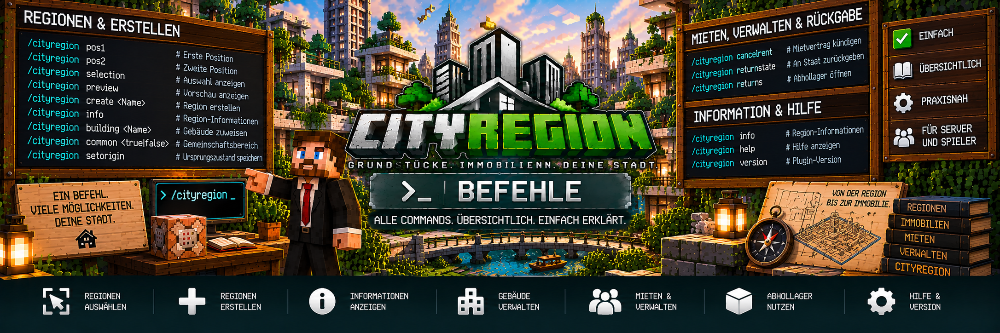

<link rel="stylesheet" href="style.css">



# ⌨️ Befehle

Auf dieser Seite findest du eine Übersicht der wichtigsten **CityRegion-Befehle**.

Die Befehle werden unter anderem zum Erstellen und Prüfen von Regionen, zur Verwaltung von Gebäuden und Gemeinschaftsbereichen sowie für Mietverträge, Rückgaben und das Abhollager verwendet.

> 💡 **Hinweis:**  
> Einige Befehle sind ausschließlich für Administratoren beziehungsweise entsprechend berechtigte Spieler vorgesehen.

---

# 🧭 Regionsauswahl

Bevor eine neue Region erstellt werden kann, müssen zwei Positionen ausgewählt werden.

Diese beiden Punkte bilden die gegenüberliegenden Ecken der späteren Region.

---

## 📍 Erste Position setzen

```text
/cityregion pos1
```

Setzt die erste Position der aktuellen Regionsauswahl.

Stelle dich dafür an die gewünschte erste Ecke der Region und führe den Befehl aus.

---

## 📍 Zweite Position setzen

```text
/cityregion pos2
```

Setzt die zweite Position der aktuellen Regionsauswahl.

Zusammen mit `pos1` wird daraus die vollständige quaderförmige Auswahl.

Beispiel:

```text
Position 1
┌───────────────────────┐
│                       │
│    zukünftige Region  │
│                       │
└───────────────────────┘
                  Position 2
```

---

# 📐 Auswahl überprüfen

Nach dem Setzen von `pos1` und `pos2` kann die aktuelle Auswahl überprüft werden.

```text
/cityregion selection
```

Damit können die Informationen zur aktuellen Regionsauswahl angezeigt werden.

Das sollte vor dem endgültigen Erstellen einer Region verwendet werden.

---

# 👁️ Regionsvorschau

```text
/cityregion preview
```

Zeigt eine Vorschau der aktuellen Auswahl.

Dadurch kann vor dem Erstellen kontrolliert werden, ob die Region korrekt ausgewählt wurde.

Das ist besonders hilfreich bei:

- großen Grundstücken
- Gebäuden
- Wohnungen
- Unterregionen
- eng nebeneinanderliegenden Grundstücken

---

# ➕ Region erstellen

Nachdem beide Positionen korrekt gesetzt wurden, kann eine neue Region erstellt werden.

```text
/cityregion create <Name>
```

Beispiel:

```text
/cityregion create Stadtvilla-01
```

Der angegebene Name dient zur Identifikation der Region.

---

## 🏠 Beispiel

```text
/cityregion pos1
/cityregion pos2
/cityregion selection
/cityregion preview
/cityregion create Haus-01
```

Damit wird aus der vorher ausgewählten Fläche die Region:

```text
Haus-01
```

---

# 📏 Maximale Regionsgröße

Eine CityRegion darf maximal:

```text
500.000 Blöcke
```

umfassen.

Wird diese Grenze überschritten, kann die Region nicht normal erstellt werden.

Außerdem schützt CityRegion vor ungültigen Überschneidungen mit bestehenden Regionen.

---

# 🔎 Regionsinformationen

```text
/cityregion info
```

Zeigt Informationen zur Region an der aktuellen Position.

Dieser Befehl ist besonders wichtig, wenn mehrere Regionen oder Unterregionen vorhanden sind.

Je nach Region können beispielsweise Informationen zu folgenden Bereichen relevant sein:

- Regionsname
- Eigentümer
- Mieter
- Immobilienstatus
- Immobilienart
- Gebäude
- Unterregion
- Mietstatus

---

# 🧭 Kleinste passende Region

Bei verschachtelten Regionen verwendet CityRegion die kleinste passende Region.

Beispiel:

```text
Wohnhaus-A
└── Wohnung-01
```

Stehst du innerhalb von `Wohnung-01`, wird diese Unterregion erkannt.

Mit:

```text
/cityregion info
```

kann kontrolliert werden, welche Region aktuell verwendet wird.

---

# 🏢 Gebäude zuweisen

```text
/cityregion building <Gebäudename>
```

Weist die aktuelle Region einem Gebäude zu beziehungsweise setzt den entsprechenden Gebäudenamen.

Beispiel:

```text
/cityregion building Wohnhaus-A
```

Das ist besonders für Gebäude mit mehreren Unterregionen beziehungsweise Wohnungen nützlich.

---

## 🏘️ Beispiel für ein Gebäude

```text
Wohnhaus-A
├── Wohnung-01
├── Wohnung-02
├── Wohnung-03
└── Wohnung-04
```

Die einzelnen Wohnungen können als Unterregionen verwaltet und dem Gebäude zugeordnet werden.

---

# 👥 Gemeinschaftsbereich aktivieren

```text
/cityregion common true
```

Markiert die aktuelle Region als Gemeinschaftsbereich.

Das eignet sich beispielsweise für:

- Treppenhäuser
- Eingangsbereiche
- Flure
- Innenhöfe
- Gemeinschaftsräume

---

# ❌ Gemeinschaftsbereich deaktivieren

```text
/cityregion common false
```

Entfernt den Gemeinschaftsstatus der aktuellen Region.

---

## 🚪 Warum Gemeinschaftsbereiche?

In einem Mehrfamilienhaus sollen Bewohner beispielsweise das gemeinsame Treppenhaus verwenden können, ohne vollständige Rechte für die gesamte Hauptregion zu erhalten.

Beispiel:

```text
Wohnhaus-A
│
├── Treppenhaus → Gemeinschaftsbereich
├── Wohnung-01
├── Wohnung-02
└── Wohnung-03
```

---

# 💾 Ursprungszustand speichern

```text
/cityregion setorigin
```

Speichert den aktuellen Zustand der Region als Ursprungszustand.

Dieser Zustand kann später bei einer automatischen Rücksetzung wiederhergestellt werden.

Das ist besonders wichtig für Mietobjekte.

---

## 🏠 Beispiel

Eine Wohnung wird vollständig eingerichtet:

```text
Wohnung-01

✓ Wände
✓ Boden
✓ Türen
✓ Küche
✓ Beleuchtung
✓ Grundausstattung
```

Danach:

```text
/cityregion setorigin
```

CityRegion kann diesen Zustand später wiederherstellen.

---

# ⚠️ Vor `setorigin`

Bevor:

```text
/cityregion setorigin
```

verwendet wird, sollte die Region sorgfältig geprüft werden.

Kontrolliere insbesondere:

- richtige Region ausgewählt?
- Gebäude vollständig?
- Einrichtung vollständig?
- keine unerwünschten Blöcke vorhanden?
- keine persönlichen Gegenstände in der Vorlage?

Der gespeicherte Zustand wird später für Rücksetzungen verwendet.

---

# ❌ Mietvertrag kündigen

```text
/cityregion cancelrent
```

Mit diesem Befehl kann ein Spieler seinen eigenen Mietvertrag vorzeitig beenden.

Dabei gilt:

- der Mietvertrag wird beendet
- Mietrechte werden entfernt
- bereits gezahlte normale Miete wird nicht zurückerstattet
- eine vorhandene Kaution kann entsprechend dem Mietsystem behandelt werden
- die Immobilie kann anschließend zurückgesetzt werden
- das Grundstück kann wieder verfügbar werden

---

# 🔄 Automatische Verlängerung

CityRegion unterstützt auch die automatische Verlängerung von Mietverträgen.

Diese gehört zur Mietverwaltung und muss nicht über einen separaten allgemeinen Regionsbefehl durchgeführt werden.

Bei aktivierter automatischer Verlängerung kann die nächste Mietperiode entsprechend dem Mietsystem verlängert werden, sofern die notwendige Zahlung durchgeführt werden kann.

---

# 🏛️ Immobilie an den Staat zurückgeben

```text
/cityregion returnstate
```

Gibt eine eigene Immobilie an den Staat zurück.

Dabei kann CityRegion unter anderem:

- den Eigentümer entfernen
- persönliche Gegenstände sichern
- den Ursprungszustand wiederherstellen
- die Region wieder staatlich machen
- das Grundstücksangebot aktualisieren

---

## 💰 Staatlicher Rückkauf

Beim Rückkauf durch den Staat muss die Staatskasse über ausreichend Guthaben verfügen.

Ist nicht genügend Geld vorhanden, kann der staatliche Rückkauf nicht erfolgreich abgeschlossen werden.

---

# 📦 Abhollager öffnen

```text
/cityregion returns
```

Öffnet beziehungsweise ermöglicht den Zugriff auf das persönliche CityRegion-Abhollager.

Dort befinden sich Gegenstände, die CityRegion vor einer entsprechenden Regionsrücksetzung gesichert hat.

---

## 🎒 Volles Inventar

Ist das Spielerinventar beim Abholen voll, gehen übrige Gegenstände nicht verloren.

Sie bleiben im Abhollager gespeichert und können später erneut abgeholt werden.

---

# 🧑‍💼 Abhollager beim Makler

Das Abhollager kann zusätzlich über den CityRegion-Immobilienmakler erreicht werden.

Damit gibt es zwei Möglichkeiten:

```text
Immobilienmakler
      ↓
Abhollager
```

oder:

```text
/cityregion returns
```

---

# 🏠 Typischer Ablauf: Region erstellen

Für eine neue Region kann der Ablauf beispielsweise so aussehen:

```text
/cityregion pos1
        ↓
/cityregion pos2
        ↓
/cityregion selection
        ↓
/cityregion preview
        ↓
/cityregion create <Name>
        ↓
/cityregion info
```

Damit kann die Region zuerst ausgewählt, kontrolliert, erstellt und anschließend überprüft werden.

---

# 🏢 Typischer Ablauf: Mietwohnung vorbereiten

Eine neue Mietwohnung kann beispielsweise folgendermaßen vorbereitet werden:

```text
/cityregion pos1
/cityregion pos2
/cityregion selection
/cityregion preview
/cityregion create Wohnung-01
```

Anschließend kann die Wohnung einem Gebäude zugeordnet werden:

```text
/cityregion building Wohnhaus-A
```

Danach wird die Wohnung vollständig eingerichtet.

Zum Schluss:

```text
/cityregion setorigin
```

Jetzt besitzt die Wohnung einen gespeicherten Ursprungszustand für spätere Rücksetzungen.

---

# 👥 Typischer Ablauf: Gemeinschaftsbereich

Ein Treppenhaus soll von mehreren Bewohnern verwendet werden.

Region erstellen:

```text
/cityregion pos1
/cityregion pos2
/cityregion create Treppenhaus
```

Anschließend:

```text
/cityregion common true
```

Damit wird die entsprechende Region als Gemeinschaftsbereich geführt.

---

# 🔎 Wichtiger Diagnosebefehl

Wenn etwas nicht funktioniert, sollte zuerst:

```text
/cityregion info
```

verwendet werden.

Damit kann geprüft werden, welche Region an der aktuellen Position erkannt wird.

Das hilft besonders bei:

- falschen Grundstücksrechten
- Wohnungen
- Unterregionen
- Grundstücksschildern
- Vermietungen
- Gebäuden
- Gemeinschaftsbereichen

---

# 📋 Befehlsübersicht

| Befehl | Funktion |
|---|---|
| `/cityregion pos1` | Erste Position der Regionsauswahl setzen |
| `/cityregion pos2` | Zweite Position der Regionsauswahl setzen |
| `/cityregion selection` | Aktuelle Auswahl überprüfen |
| `/cityregion preview` | Regionsauswahl anzeigen |
| `/cityregion create <Name>` | Neue Region erstellen |
| `/cityregion info` | Informationen zur aktuellen Region anzeigen |
| `/cityregion building <Name>` | Region einem Gebäude zuordnen |
| `/cityregion common true` | Gemeinschaftsbereich aktivieren |
| `/cityregion common false` | Gemeinschaftsbereich deaktivieren |
| `/cityregion setorigin` | Ursprungszustand der Region speichern |
| `/cityregion cancelrent` | Eigenen Mietvertrag kündigen |
| `/cityregion returnstate` | Eigene Immobilie an den Staat zurückgeben |
| `/cityregion returns` | Persönliches Abhollager öffnen |

---

# 👑 Adminbefehle

Einige Befehle zur Regionsverwaltung sind für Administratoren beziehungsweise entsprechend berechtigte Spieler vorgesehen.

Dazu gehören insbesondere Funktionen wie:

```text
/cityregion pos1
/cityregion pos2
/cityregion selection
/cityregion preview
/cityregion create <Name>
```

sowie weitere Verwaltungsfunktionen innerhalb des CityRegion-Adminsystems.

Normale Spieler benötigen diese Befehle für den normalen Kauf oder die normale Miete einer Immobilie nicht.

---

# 👤 Spielerbefehle

Für normale Spieler sind insbesondere folgende Befehle relevant:

```text
/cityregion info
/cityregion cancelrent
/cityregion returnstate
/cityregion returns
```

Welche Funktionen tatsächlich verwendet werden können, hängt von der jeweiligen Immobilie und den vorhandenen Rechten ab.

---

# 🏦 MineBank

Die eigentliche Zahlungsabwicklung erfolgt über **MineBank 1.0.2 oder neuer**.

CityRegion verwendet MineBank unter anderem für:

- Grundstückskäufe
- Grundstücksverkäufe
- Mietzahlungen
- Kautionen
- Mietverlängerungen
- Auktionen
- Grundstückslizenzen
- Staatskasse

Dafür sind keine separaten CityRegion-Geldbefehle notwendig.

---

# 🪧 Grundstücksschilder

Käufe und Vermietungen werden hauptsächlich über die CityRegion-Grundstücksschilder beziehungsweise die entsprechenden Immobilienoberflächen durchgeführt.

Beispiel:

```text
[Grundstück]
Verkauf
250000
```

oder:

```text
[Grundstück]
Miete
1000
7
```

Daher benötigt ein normaler Spieler keinen speziellen Kaufbefehl für ein Grundstück.

---

# 💻 Real Estate OS

Viele Immobilienfunktionen sind außerdem direkt über das **Real Estate OS** erreichbar.

Dazu gehören unter anderem:

- Immobilien suchen
- eigene Immobilien anzeigen
- Mietobjekte anzeigen
- Gebäude und Wohnungen anzeigen
- Mietverträge prüfen
- Immobilienwerte ansehen
- Auktionen ansehen
- Grundstückslizenzen verwalten

CityRegion kombiniert dadurch Befehle mit Menüs und direkter Interaktion in der Welt.

---

# ❗ Häufige Probleme

## `/cityregion create` funktioniert nicht

Prüfe:

- wurde `pos1` gesetzt?
- wurde `pos2` gesetzt?
- ist die Auswahl gültig?
- überschreitet die Region 500.000 Blöcke?
- überschneidet sich die Region ungültig mit einer vorhandenen Region?
- besitzt du die notwendigen Rechte?

Prüfe vorher:

```text
/cityregion selection
```

und:

```text
/cityregion preview
```

---

## `/cityregion info` zeigt eine andere Region

Bei Unterregionen verwendet CityRegion die kleinste passende Region.

Beispiel:

```text
Wohnhaus-A
└── Wohnung-01
```

Innerhalb von `Wohnung-01` wird die Wohnungsregion erkannt.

---

## `/cityregion setorigin` funktioniert nicht

Prüfe:

- stehst du in der richtigen Region?
- besitzt du die notwendigen Rechte?
- besteht aktuell eine aktive Vermietung?

Der Ursprungszustand sollte nicht während einer laufenden Vermietung durch den aktuellen Zustand des Mieters ersetzt werden.

---

## `/cityregion cancelrent` funktioniert nicht

Prüfe:

- besitzt du aktuell einen Mietvertrag?
- stehst du beziehungsweise arbeitest du mit der richtigen Immobilie?
- ist der Mietvertrag noch aktiv?

---

## `/cityregion returnstate` funktioniert nicht

Prüfe:

- bist du Eigentümer der Immobilie?
- kann die Immobilie aktuell zurückgegeben werden?
- bestehen widersprüchliche aktive Vorgänge?
- besitzt die Staatskasse genügend Geld für einen notwendigen staatlichen Rückkauf?

---

## `/cityregion returns` ist leer

Das Abhollager enthält nur Gegenstände, die CityRegion zuvor bei einer entsprechenden Rücksetzung gesichert hat.

Sind keine Gegenstände gespeichert, bleibt das Abhollager leer.

---

# 💡 Empfehlung für Administratoren

Bei der Regionsverwaltung empfiehlt sich grundsätzlich dieser Ablauf:

```text
1. /cityregion pos1
2. /cityregion pos2
3. /cityregion selection
4. /cityregion preview
5. /cityregion create <Name>
6. /cityregion info
```

Damit wird die Region vor und nach der Erstellung kontrolliert.

Bei bestehenden Regionen sollte vor Änderungen grundsätzlich:

```text
/cityregion info
```

verwendet werden.

---

# ✅ Kurzreferenz

```text
REGION AUSWÄHLEN
/cityregion pos1
/cityregion pos2

AUSWAHL PRÜFEN
/cityregion selection
/cityregion preview

REGION ERSTELLEN
/cityregion create <Name>

REGION PRÜFEN
/cityregion info

GEBÄUDE
/cityregion building <Name>

GEMEINSCHAFTSBEREICH
/cityregion common true
/cityregion common false

URSPRUNGSZUSTAND
/cityregion setorigin

MIETVERTRAG KÜNDIGEN
/cityregion cancelrent

AN STAAT ZURÜCKGEBEN
/cityregion returnstate

ABHOLLAGER
/cityregion returns
```

---

[← Zurück: Adminfunktionen](cityregion-admin.md) | [Weiter: Häufige Fragen →](cityregion-haeufige-fragen.md)
