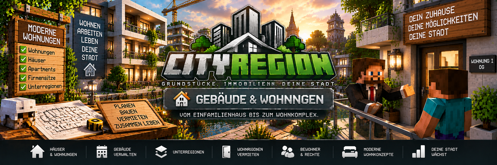

<link rel="stylesheet" href="style.css">



# 🏢 Gebäude & Wohnungen

Mit CityRegion können große Grundstücke als Gebäude verwaltet und in mehrere Wohnungen oder andere Bereiche unterteilt werden.

Dafür wird eine **Hauptregion** für das gesamte Gebäude verwendet. Einzelne Wohnungen werden als **Unterregionen** innerhalb dieser Hauptregion angelegt.

So können beispielsweise Mehrfamilienhäuser, Wohnblöcke oder größere Immobilien mit mehreren getrennten Mietbereichen umgesetzt werden.

---

## 🏠 Aufbau eines Gebäudes

Ein Gebäude besteht normalerweise aus einer großen Hauptregion und mehreren Unterregionen.

Beispiel:

```text
Wohnhaus-A
├── Wohnung-01
├── Wohnung-02
├── Wohnung-03
├── Wohnung-04
└── Gemeinschaftsbereich
```

Die Hauptregion umfasst das gesamte Gebäude.

Die einzelnen Wohnungen befinden sich vollständig innerhalb dieser Region.

---

## 🗺️ Hauptregion erstellen

Zuerst wird das gesamte Gebäude als Hauptregion angelegt.

### Erste Ecke setzen

```text
/cityregion pos1
```

### Zweite Ecke setzen

```text
/cityregion pos2
```

Falls nötig, kann die Auswahl anschließend erweitert werden.

Beispiel:

```text
/cityregion expand 1 15
```

Danach sollte die Auswahl geprüft werden:

```text
/cityregion selection
```

Optional kann die grafische Vorschau verwendet werden:

```text
/cityregion preview
```

Anschließend wird die Region erstellt:

```text
/cityregion create Wohnhaus-A
```

Damit existiert die Hauptregion des Gebäudes.

---

# 🏢 Gebäude benennen

Eine Region kann einem Gebäude zugeordnet beziehungsweise mit einem Gebäudenamen versehen werden.

Stelle dich innerhalb der entsprechenden Region und verwende:

```text
/cityregion building <Gebäudename>
```

Beispiel:

```text
/cityregion building Wohnhaus-A
```

Der Gebäudename kann anschließend für die Verwaltung der zugehörigen Wohnungen verwendet werden.

---

# 🚪 Wohnungen erstellen

Wohnungen werden als Unterregionen innerhalb der Hauptregion erstellt.

Jede Wohnung erhält dadurch eine eigene Region.

Das ermöglicht:

- getrennte Mieter
- getrennte Mietverträge
- eigene Mitglieder
- eigene Rechte
- eigene Mietangebote
- getrennte Verwaltung einzelner Wohnungen

---

## 📍 Wohnung auswählen

Stelle dich an die erste Ecke der Wohnung:

```text
/cityregion pos1
```

Anschließend an die gegenüberliegende Ecke:

```text
/cityregion pos2
```

Falls nur die Bodenfläche ausgewählt wurde, kann die Höhe anschließend erweitert werden.

Beispiel:

```text
/cityregion expand 0 4
```

---

## 📐 Auswahl prüfen

Vor dem Erstellen sollte die Wohnung kontrolliert werden:

```text
/cityregion selection
```

Zusätzlich kann die Auswahl grafisch angezeigt werden:

```text
/cityregion preview
```

Bei einer geplanten Unterregion wird die Vorschau entsprechend als Unterregion dargestellt.

---

## 🏠 Wohnung als Unterregion erstellen

Wenn sich die Auswahl vollständig innerhalb der Hauptregion befindet:

```text
/cityregion create Wohnung-01
```

CityRegion erkennt, dass sich die neue Region innerhalb der bestehenden Hauptregion befindet.

Die Wohnung wird dadurch als Unterregion angelegt.

---

## 🏷️ Wohnung dem Gebäude zuordnen

Stelle dich anschließend innerhalb der Wohnung und verwende:

```text
/cityregion building Wohnhaus-A
```

Damit kann die Wohnung dem entsprechenden Gebäude zugeordnet werden.

Für weitere Wohnungen wird der Vorgang wiederholt.

Beispiel:

```text
Wohnhaus-A
├── Wohnung-01
├── Wohnung-02
├── Wohnung-03
└── Wohnung-04
```

---

# 🧱 Außenwände, Boden und Decke

Bei Wohnungen kann es sinnvoll sein, die eigentliche Unterregion nur auf den bewohnbaren Innenbereich zu begrenzen.

Tragende Gebäudeteile können dadurch weiterhin zur Hauptregion gehören.

Dazu gehören beispielsweise:

- Außenwände
- tragende Wände
- Geschossdecken
- Boden
- Dach
- Treppenhaus
- technische Bereiche

Dadurch kann verhindert werden, dass ein Mieter wichtige Teile des gesamten Gebäudes verändert.

---

## 💡 Beispiel

Statt die komplette Gebäudewand in die Wohnung aufzunehmen:

```text
██████████████
█            █
█  Wohnung   █
█            █
██████████████
```

kann nur der Innenbereich als Wohnungsregion verwendet werden.

Die Gebäudestruktur bleibt dadurch Teil der übergeordneten Hauptregion.

---

# 🏘️ Mehrere Wohnungen

Innerhalb einer großen Hauptregion können mehrere Wohnungen erstellt werden.

Beispiel:

```text
Wohnhaus-A

Erdgeschoss
├── Wohnung-01
└── Wohnung-02

1. Obergeschoss
├── Wohnung-03
└── Wohnung-04

2. Obergeschoss
├── Wohnung-05
└── Wohnung-06
```

Jede Wohnung kann anschließend unabhängig verwaltet und vermietet werden.

---

# 🚶 Gemeinschaftsbereiche

Nicht jeder Bereich eines Gebäudes sollte zu einer einzelnen Wohnung gehören.

Typische Gemeinschaftsbereiche sind:

- Treppenhäuser
- Eingangsbereiche
- Flure
- Aufzüge
- Kellerzugänge
- Innenhöfe
- Gemeinschaftsräume

CityRegion unterstützt Gemeinschaftsbereiche innerhalb von Gebäuden.

---

## 🏷️ Gemeinschaftsbereich festlegen

Administratoren können eine Region als Gemeinschaftsbereich markieren:

```text
/cityregion common true
```

Zum Entfernen:

```text
/cityregion common false
```

---

## 🚪 Türen in Gemeinschaftsbereichen

Mieter eines Gebäudes können gemeinsame Türen verwenden, ohne vollständige Rechte für die gesamte Hauptregion erhalten zu müssen.

Dadurch kann beispielsweise ein Mieter:

```text
Hauseingang
     ↓
Treppenhaus
     ↓
Wohnung
```

benutzen, ohne automatisch Bau- oder Behälterrechte für das gesamte Gebäude zu besitzen.

---

# 🔑 Wohnungen vermieten

Eine Wohnung kann wie eine normale CityRegion vermietet werden.

Das Mietschild wird innerhalb oder unmittelbar neben der Wohnungsregion platziert.

Beispiel:

```text
[Grundstück]
Miete
1000
7
```

Dabei bedeutet:

```text
1000 = Mietpreis
7    = Mietdauer in Tagen
```

Anschließend registriert der Eigentümer das Schild mit Rechtsklick.

---

## 💰 Kaution festlegen

Für eine Wohnung kann zusätzlich eine Mietkaution festgelegt werden.

Stelle dich innerhalb der Wohnung und verwende:

```text
/cityregion deposit <Betrag>
```

Beispiel:

```text
/cityregion deposit 500
```

---

## 🔄 Automatische Verlängerung

Soll der Mietvertrag automatisch verlängert werden können:

```text
/cityregion autorenew true
```

Zum Deaktivieren:

```text
/cityregion autorenew false
```

Die Verlängerung funktioniert nur, wenn die erforderliche Zahlung über MineBank durchgeführt werden kann.

---

# 👤 Mieter einer Wohnung

Wird eine Wohnung vermietet, erhält der Mieter die Rechte für die entsprechende Wohnungsregion.

Er erhält dadurch nicht automatisch die vollständige Kontrolle über das gesamte Gebäude.

Das ist besonders wichtig bei Mehrfamilienhäusern.

Beispiel:

```text
Wohnhaus-A
│
├── Wohnung-01 → Spieler A
├── Wohnung-02 → Spieler B
├── Wohnung-03 → Spieler C
└── Wohnung-04 → frei
```

Jeder Mieter kontrolliert seine eigene Wohnung.

---

# 🧭 Kleinste passende Region

Wenn sich mehrere Regionen an derselben Position befinden, verwendet CityRegion die **kleinste passende Region**.

Das ist für Gebäude und Wohnungen besonders wichtig.

Beispiel:

```text
Hauptregion: Wohnhaus-A
└── Unterregion: Wohnung-01
```

Steht ein Spieler innerhalb von `Wohnung-01`, gelten dort die Rechte der Wohnungsregion.

Dadurch können Wohnungen unabhängig von der Hauptregion verwaltet werden.

---

# 👥 Mitglieder einer Wohnung

Auch für einzelne Wohnungen können Mitglieder verwaltet werden.

Der Eigentümer kann dadurch beispielsweise:

- Mitbewohner hinzufügen
- Familienmitglieder hinzufügen
- anderen Spielern Zugriff geben
- einzelne Rechte vergeben

Die Rechte können getrennt verwaltet werden für:

- Bauen und Abbauen
- Behälter
- Türen, Falltüren und Tore

Die genaue Verwaltung wird auf der Seite **Mitglieder & Rechte** erklärt.

---

# 🏷️ Immobilienart festlegen

Administratoren können einer Immobilie eine bestimmte Art zuweisen.

Verfügbare Immobilienarten sind:

```text
Wohnen
Gewerbe
Industrie
Lager
Bauland
Gemeinschaftsfläche
```

Für Wohnhäuser und Wohnungen kann entsprechend die Immobilienart **Wohnen** verwendet werden.

---

# 🏗️ Bauphase

Für Immobilien kann zusätzlich eine Bauphase beziehungsweise ein entsprechender Zustand verwaltet werden.

Dadurch kann beispielsweise unterschieden werden, ob eine Immobilie noch als Bauprojekt geführt oder bereits genutzt wird.

Diese Informationen können auch im Real Estate OS dargestellt werden.

---

# 💻 Gebäude im Real Estate OS

Das Real Estate OS kann Informationen über Gebäude und Wohnungen anzeigen.

Dazu gehören unter anderem:

- Gebäude
- zugehörige Wohnungen
- freie Wohnungen
- belegte Wohnungen
- Eigentümer
- Mieter
- Mietverträge
- Immobilienstatus
- Immobilienwerte
- Mieteinnahmen

Dadurch können größere Wohnanlagen zentral verwaltet werden.

---

# 🧑‍💼 Immobilienmakler

Auch über den Immobilienmakler können Immobilien gesucht und verwaltet werden.

Spieler können dort unter anderem:

- verfügbare Immobilien suchen
- eigene Immobilien anzeigen
- gemietete Immobilien anzeigen
- Immobilien besichtigen
- das Real Estate OS öffnen

Dadurch können auch Wohnungen innerhalb größerer Gebäude leichter gefunden werden.

---

# 🔄 Mietende einer Wohnung

Nach dem Ende eines Mietvertrags:

- verliert der Mieter seine Regionsrechte
- wird der gespeicherte Ursprungszustand wiederhergestellt
- werden persönliche Gegenstände vorher gesichert
- landen gesicherte Gegenstände im Abhollager
- wird eine vorhandene Kaution entsprechend zurückgegeben
- wird das Mietschild wieder freigeschaltet
- kann die Wohnung erneut vermietet werden

Dadurch können Wohnungen mehrfach hintereinander vermietet werden.

---

# 📦 Ursprungszustand einer Wohnung

Vor der ersten Vermietung sollte die Wohnung vollständig eingerichtet sein.

Anschließend kann der gewünschte Ausgangszustand gespeichert werden:

```text
/cityregion setorigin
```

Dieser Zustand kann nach einem Mietende wiederhergestellt werden.

> ⚠️ Der Ursprungszustand sollte erst festgelegt werden, wenn die Wohnung so eingerichtet ist, wie sie nach jeder Vermietung wieder aussehen soll.

Während einer aktiven Vermietung kann der Ursprung nicht neu gesetzt werden.

---

# 📦 Gegenstände des Mieters

Bevor eine Wohnung zurückgesetzt wird, sichert CityRegion persönliche Gegenstände aus Behältern.

Diese Gegenstände werden nicht einfach gelöscht.

Sie werden in das Abhollager des Spielers übertragen.

Das Abhollager kann über den Immobilienmakler oder mit folgendem Befehl geöffnet werden:

```text
/cityregion returns
```

---

# 🏬 Gewerbeflächen in Gebäuden

Das Gebäudesystem kann nicht nur für Wohnungen verwendet werden.

Unterregionen können beispielsweise auch sein:

- Geschäfte
- Büros
- Lagerflächen
- Firmenräume
- Werkstätten

Eine entsprechende Unterregion kann als **Gewerbe** gekennzeichnet werden.

CityRegion unterstützt außerdem die Zuordnung von Gewerbeimmobilien zu einer CityShops-Firma beziehungsweise Filiale.

CityShops bleibt dabei ein separates System und ist keine Pflichtabhängigkeit für CityRegion.

---

# 🏙️ Beispiel: Gemischtes Gebäude

Ein größeres Gebäude könnte beispielsweise folgendermaßen aufgebaut sein:

```text
CityTower

Erdgeschoss
├── Shop-01
├── Shop-02
└── Gemeinschaftseingang

1. Obergeschoss
├── Wohnung-01
└── Wohnung-02

2. Obergeschoss
├── Wohnung-03
└── Wohnung-04

3. Obergeschoss
├── Büro-01
└── Büro-02
```

Damit können innerhalb einer einzigen Hauptregion unterschiedliche Immobilienbereiche verwaltet werden.

---

# ℹ️ Region überprüfen

Informationen zur Region am aktuellen Standort können mit folgendem Befehl angezeigt werden:

```text
/cityregion info
```

Das ist besonders bei mehreren übereinander oder ineinander liegenden Regionen hilfreich.

---

# ❗ Häufige Probleme

## Wohnung wird nicht als Unterregion erstellt

Prüfe:

- befindet sich die Auswahl vollständig innerhalb der Hauptregion?
- ist die Hauptregion bereits erstellt?
- bist du Eigentümer der Hauptregion oder Administrator?
- überschneidet sich die Auswahl ungültig mit einer anderen Unterregion?

Die Auswahl kann vorher mit:

```text
/cityregion preview
```

kontrolliert werden.

---

## Mieter kann das Treppenhaus nicht benutzen

Prüfe, ob der entsprechende Bereich als Gemeinschaftsbereich eingerichtet wurde.

Administratoren können dies innerhalb der Region aktivieren:

```text
/cityregion common true
```

---

## Mieter kann Teile einer anderen Wohnung verändern

Prüfe die Grenzen der beiden Unterregionen.

Mit:

```text
/cityregion preview
```

kann die aktuelle Auswahl vor dem Erstellen kontrolliert werden.

Die Wohnungsregionen sollten sauber voneinander getrennt sein.

---

## Wohnung kann nicht vermietet werden

Prüfe:

- wurde die Wohnungsregion erstellt?
- ist das Mietschild innerhalb oder direkt neben der richtigen Unterregion?
- wurde das Schild registriert?
- besteht bereits ein Mietvertrag?
- wurde die richtige Region erkannt?

Verwende innerhalb der Wohnung:

```text
/cityregion info
```

---

# 💡 Beispiel: Wohnhaus mit zwei Wohnungen

## 1. Hauptregion erstellen

```text
/cityregion pos1
/cityregion pos2
/cityregion selection
/cityregion preview
/cityregion create Wohnhaus-A
```

## 2. Gebäude benennen

```text
/cityregion building Wohnhaus-A
```

## 3. Wohnung 1 auswählen

```text
/cityregion pos1
/cityregion pos2
/cityregion expand 0 4
/cityregion preview
/cityregion create Wohnung-01
```

## 4. Wohnung dem Gebäude zuordnen

```text
/cityregion building Wohnhaus-A
```

## 5. Wohnung 2 erstellen

Die zweite Wohnung wird auf dieselbe Weise ausgewählt und erstellt:

```text
/cityregion pos1
/cityregion pos2
/cityregion expand 0 4
/cityregion preview
/cityregion create Wohnung-02
```

Anschließend:

```text
/cityregion building Wohnhaus-A
```

## 6. Gemeinschaftsbereich erstellen

Treppenhaus oder Eingangsbereich als eigene Region anlegen und anschließend:

```text
/cityregion common true
```

## 7. Wohnungen zur Miete anbieten

Beispiel für Wohnung 1:

```text
[Grundstück]
Miete
1000
7
```

Beispiel für Wohnung 2:

```text
[Grundstück]
Miete
1250
7
```

Die Schilder anschließend jeweils registrieren.

Damit besitzt das Gebäude zwei getrennt vermietbare Wohnungen.

---

[← Zurück: Vermietung & Mietverträge](cityregion-vermietung.md) | [Weiter: Immobilienarten & Immobilienwerte →](cityregion-immobilienwerte.md)
