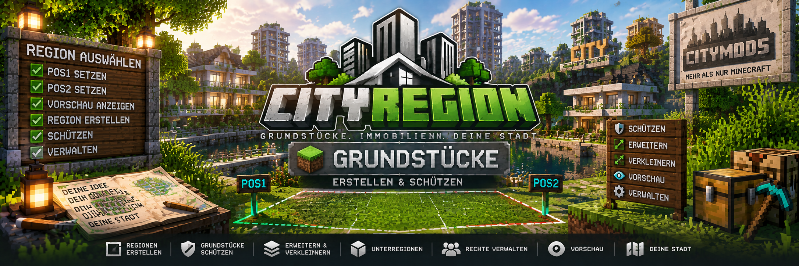

<link rel="stylesheet" href="style.css">



# 🗺️ Grundstücke erstellen & schützen

Mit CityRegion können geschützte Grundstücke und Unterregionen direkt in der Minecraft-Welt erstellt werden.

Regionen werden über zwei Auswahlpunkte festgelegt. Die Auswahl kann anschließend erweitert, verkleinert und vor dem Erstellen grafisch angezeigt werden.

---

## 🏠 Hauptregionen und Unterregionen

CityRegion unterscheidet zwischen **Hauptregionen** und **Unterregionen**.

### Hauptregion

Eine Hauptregion ist ein eigenständiges Grundstück.

Neue Hauptregionen dürfen nur von Administratoren erstellt werden.

Beispiele:

- Grundstück
- Hausgrundstück
- Firmengelände
- Industriegrundstück
- großes Wohngebäude
- Lagergelände

### Unterregion

Eine Unterregion befindet sich vollständig innerhalb einer bestehenden Region.

Eigentümer können innerhalb ihres eigenen Grundstücks selbst Unterregionen erstellen.

Unterregionen eignen sich beispielsweise für:

- Wohnungen
- Hotelzimmer
- Ladenflächen
- Lagerabteile
- Büros
- einzelne Bauparzellen

Bei überlappenden Regionen verwendet CityRegion die **kleinste passende Region**.

Dadurch kann beispielsweise eine Wohnung eigene Rechte besitzen, obwohl sie innerhalb eines größeren Gebäudes liegt.

---

## 📍 Grundstück auswählen

Eine Region wird mit zwei Punkten ausgewählt.

Stelle dich zuerst an die erste Ecke der gewünschten Region:

```text
/cityregion pos1
```

Gehe anschließend zur gegenüberliegenden Ecke und verwende:

```text
/cityregion pos2
```

Beide Befehle verwenden die aktuelle Fußposition des Spielers.

> Eine Auswahl ist noch keine gespeicherte Region.
>
> Erst mit `/cityregion create <Name>` wird aus der Auswahl eine richtige CityRegion.

---

## 📐 Auswahl überprüfen

Nachdem beide Punkte gesetzt wurden, kann die aktuelle Auswahl überprüft werden:

```text
/cityregion selection
```

Der Befehl zeigt unter anderem:

- Breite
- Höhe
- Tiefe
- gesamte Blockanzahl

So kann bereits vor dem Erstellen geprüft werden, ob die Region die gewünschte Größe besitzt.

---

## 👁️ Grafische Vorschau

Die ausgewählte Region kann direkt in der Welt angezeigt werden:

```text
/cityregion preview
```

Die Vorschau verwendet unterschiedliche Markierungen:

- **Goldene Kanten:** geplante Hauptregion
- **Türkise Kanten:** geplante Unterregion
- **Rote Partikel:** Ecken der Auswahl

Mit einer erneuten Eingabe von:

```text
/cityregion preview
```

wird die Vorschau wieder ausgeschaltet.

Die Vorschau wird außerdem nach **30 Sekunden automatisch beendet**.

---

## ↕️ Auswahl vertikal erweitern

Die Auswahl kann nach unten und oben erweitert werden, ohne dass man sich zu den entsprechenden Höhen bewegen muss.

```text
/cityregion expand <unten> <oben>
```

Beispiel:

```text
/cityregion expand 1 5
```

Dadurch wird die aktuelle Auswahl:

- 1 Block nach unten
- 5 Blöcke nach oben

erweitert.

Das ist besonders praktisch für Häuser, Wohnungen und andere mehrstöckige Gebäude.

---

## 🌍 Komplette Welthöhe auswählen

Eine Auswahl kann automatisch über die vollständige Bauhöhe der aktuellen Dimension erweitert werden:

```text
/cityregion expand vertical
```

CityRegion verwendet dabei automatisch die minimale und maximale Bauhöhe der aktuellen Dimension.

> ⚠️ **Achtung:**  
> Bei einer großen Grundfläche kann die vollständige Welthöhe dazu führen, dass das maximale Regionslimit von 500.000 Blöcken überschritten wird.

---

## ↔️ Auswahl horizontal erweitern

Eine bestehende Auswahl kann auch horizontal erweitert werden.

### Norden

```text
/cityregion expand north <Blöcke>
```

### Süden

```text
/cityregion expand south <Blöcke>
```

### Osten

```text
/cityregion expand east <Blöcke>
```

### Westen

```text
/cityregion expand west <Blöcke>
```

Beispiel:

```text
/cityregion expand north 10
```

Die Auswahl wird dadurch um 10 Blöcke nach Norden erweitert.

---

## 📏 Auswahl verkleinern

Eine Auswahl kann ebenfalls wieder verkleinert werden.

### Norden

```text
/cityregion contract north <Blöcke>
```

### Süden

```text
/cityregion contract south <Blöcke>
```

### Osten

```text
/cityregion contract east <Blöcke>
```

### Westen

```text
/cityregion contract west <Blöcke>
```

Eine Verkleinerung, durch welche die Auswahl vollständig umgekehrt würde, wird von CityRegion abgelehnt.

Nach einer Änderung kann die Größe erneut geprüft werden:

```text
/cityregion selection
```

---

## 🌎 WorldEdit-Auswahl verwenden

Ist **WorldEdit** installiert, kann eine vorhandene WorldEdit-Auswahl übernommen werden.

Erstelle zunächst wie gewohnt deine Auswahl mit WorldEdit.

Anschließend:

```text
/cityregion worldedit
```

CityRegion übernimmt die vorhandene Auswahl.

Kann die WorldEdit-Auswahl nicht gelesen werden, können weiterhin die integrierten Befehle verwendet werden:

```text
/cityregion pos1
/cityregion pos2
```

> WorldEdit ist optional und wird für CityRegion nicht zwingend benötigt.

---

## 🏗️ Hauptregion erstellen

Administratoren können aus einer vorhandenen Auswahl eine neue Hauptregion erstellen.

### Schritt 1 – Erste Ecke

```text
/cityregion pos1
```

### Schritt 2 – Zweite Ecke

```text
/cityregion pos2
```

### Schritt 3 – Auswahl prüfen

```text
/cityregion selection
```

Optional:

```text
/cityregion preview
```

### Schritt 4 – Region erstellen

```text
/cityregion create <Name>
```

Beispiel:

```text
/cityregion create Stadtgrund-01
```

Die Region ist anschließend gespeichert.

---

## 🏢 Unterregion erstellen

Eigentümer können innerhalb ihres eigenen Grundstücks Unterregionen erstellen.

Die Unterregion muss vollständig innerhalb der übergeordneten Region liegen.

Beispielsweise kann innerhalb eines Wohnhauses eine Wohnung erstellt werden.

### Erste Ecke setzen

```text
/cityregion pos1
```

### Zweite Ecke setzen

```text
/cityregion pos2
```

### Höhe festlegen

Beispiel für eine Wohnung mit fünf Blöcken Innenhöhe:

```text
/cityregion expand 0 4
```

### Auswahl prüfen

```text
/cityregion selection
/cityregion preview
```

### Unterregion erstellen

```text
/cityregion create Wohnung-01
```

Die Wohnung ist anschließend eine eigene Unterregion innerhalb des Grundstücks.

---

## 🧱 Außenwände bei Wohnungen

Bei Wohnungen kann es sinnvoll sein, tragende Außenwände, Boden und Decke **nicht** in die Wohnungs-Unterregion aufzunehmen.

Dadurch können Mieter die eigentliche Gebäudestruktur nicht verändern.

Beispiel:

```text
Hauptregion
└── Wohnhaus
    ├── Wohnung-01
    ├── Wohnung-02
    ├── Wohnung-03
    └── Gemeinschaftsbereich
```

Die einzelnen Wohnungen können eigene Rechte besitzen, während wichtige Gebäudeteile weiterhin über die Hauptregion geschützt bleiben.

---

## 📦 Maximale Regionsgröße

Eine einzelne CityRegion darf maximal:

```text
500.000 Blöcke
```

umfassen.

Die Berechnung erfolgt nach:

```text
Breite × Höhe × Tiefe
```

Beispiel:

```text
50 × 20 × 50 = 50.000 Blöcke
```

Diese Region liegt innerhalb des erlaubten Limits.

CityRegion warnt bei einer zu großen Auswahl und verhindert deren Erstellung.

---

## 🛡️ Grundstücksschutz

Eine erstellte CityRegion schützt das Grundstück vor nicht berechtigten Spielern.

Der Regionsschutz umfasst unter anderem:

- Bauen
- Blöcke abbauen
- Behälter verwenden
- Türen verwenden
- Falltüren verwenden
- Tore verwenden

Eigentümer können anderen Spielern gezielt Rechte geben.

Administratoren können den Regionsschutz umgehen.

Die Verwaltung der Mitglieder und ihrer einzelnen Rechte wird auf der Seite **Mitglieder & Rechte** genauer erklärt.

---

## 👥 Eigentümer und Mieter

CityRegion unterscheidet zwischen Eigentümern und Mietern.

### Eigentümer

Der Eigentümer kontrolliert die Region dauerhaft.

Er kann – abhängig von der jeweiligen Region – unter anderem:

- Unterregionen erstellen
- Mitglieder verwalten
- Rechte vergeben
- Grundstücke verkaufen
- Grundstücke vermieten
- Gebäude zuordnen
- Einstellungen der eigenen Immobilie verwalten

### Mieter

Ein Mieter erhält die Regionsrechte für die vereinbarte Mietdauer.

Nach dem Ende der Miete:

- verliert der Mieter seine Regionsrechte
- kann der gespeicherte Ursprungszustand wiederhergestellt werden
- werden gesicherte Gegenstände in das Abhollager übertragen

---

## ℹ️ Informationen zu einer Region anzeigen

Um Informationen über die Region am aktuellen Standort anzuzeigen:

```text
/cityregion info
```

Der Spieler muss dafür innerhalb der entsprechenden Region stehen.

---

## ❗ Häufige Probleme

### „Du stehst in keiner CityRegion“

Eine Auswahl ist noch keine gespeicherte Region.

Nach:

```text
/cityregion pos1
/cityregion pos2
```

muss die Region noch erstellt werden:

```text
/cityregion create <Name>
```

---

### Die Auswahl ist nach `expand vertical` zu groß

Die vollständige Welthöhe kann bei größeren Grundstücken schnell das Limit von 500.000 Blöcken überschreiten.

Verwende stattdessen eine gezielte Erweiterung.

Beispiel:

```text
/cityregion expand 1 5
```

---

### Die Vorschau wird nicht angezeigt

Prüfe:

- wurden `pos1` und `pos2` gesetzt?
- wurde `/cityregion preview` ausgeführt?
- sind Partikel in den Minecraft-Einstellungen aktiviert?

Die Vorschau wird nach 30 Sekunden automatisch beendet.

---

### Unterregion kann nicht erstellt werden

Prüfe:

- befindet sich die Auswahl vollständig innerhalb deiner Hauptregion?
- bist du Eigentümer der Hauptregion?
- überschneidet sich die Auswahl ungültig mit einer anderen Region?
- überschreitet die Auswahl das Regionslimit?

---

## 💡 Beispiel: Grundstück komplett erstellen

Eine einfache neue Hauptregion kann beispielsweise so erstellt werden:

```text
/cityregion pos1
/cityregion pos2
/cityregion expand 1 5
/cityregion selection
/cityregion preview
/cityregion create MeinGrundstück
```

Damit wurde:

1. die erste Ecke gesetzt
2. die zweite Ecke gesetzt
3. die Auswahl nach unten und oben erweitert
4. die Größe kontrolliert
5. die Vorschau angezeigt
6. die Region gespeichert

---

[← Zurück: Installation](cityregion-installation.md) | [Weiter: Kaufen & Verkaufen →](cityregion-kaufen-verkaufen.md)
