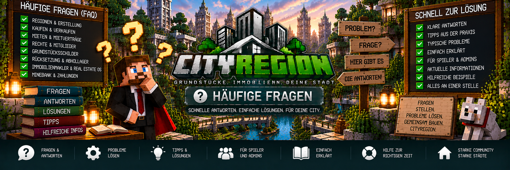

<link rel="stylesheet" href="style.css">



# ❓ Häufige Fragen

Hier findest du Antworten auf häufige Fragen und Probleme rund um **CityRegion**.

Die FAQ behandelt unter anderem:

- Regionen und Grundstücke
- Kaufen und Verkaufen
- Vermietung und Mietverträge
- Gebäude und Wohnungen
- Mitglieder und Rechte
- Grundstücksschilder
- Immobilienmakler und Real Estate OS
- Rücksetzung und Abhollager
- Auktionen
- MineBank

---

# 🧭 Regionen & Grundstücke

## Wie erstelle ich eine neue Region?

Zuerst werden zwei Positionen festgelegt:

```text
/cityregion pos1
/cityregion pos2
```

Danach solltest du die Auswahl überprüfen:

```text
/cityregion selection
```

Optional kannst du die Auswahl anzeigen:

```text
/cityregion preview
```

Anschließend wird die Region erstellt:

```text
/cityregion create <Name>
```

Beispiel:

```text
/cityregion create Stadtvilla-01
```

---

## Wie groß darf eine Region sein?

Eine CityRegion darf maximal:

```text
500.000 Blöcke
```

umfassen.

Wird diese Grenze überschritten, kann die Region nicht normal erstellt werden.

---

## Können sich Regionen überschneiden?

Ungültige Überschneidungen zwischen unabhängigen Regionen werden verhindert.

CityRegion unterstützt jedoch **Unterregionen** innerhalb einer Hauptregion.

Dadurch können beispielsweise Wohnungen innerhalb eines Wohnhauses erstellt werden.

```text
Wohnhaus-A
├── Wohnung-01
├── Wohnung-02
├── Wohnung-03
└── Wohnung-04
```

---

## Wie sehe ich, in welcher Region ich stehe?

Verwende:

```text
/cityregion info
```

Damit kannst du die aktuell erkannte Region überprüfen.

Das ist besonders bei Hauptregionen und Unterregionen hilfreich.

---

## Warum wird eine Wohnung statt des gesamten Gebäudes erkannt?

CityRegion verwendet bei verschachtelten Regionen die **kleinste passende Region**.

Beispiel:

```text
Wohnhaus-A
└── Wohnung-01
```

Stehst du innerhalb von `Wohnung-01`, wird die Wohnungsregion verwendet.

Das ist beabsichtigt.

---

# 🏠 Kaufen & Verkaufen

## Wie kaufe ich ein Grundstück?

Grundstücke können über ein registriertes CityRegion-Grundstücksschild angeboten werden.

Ein Verkaufsschild kann beispielsweise so beginnen:

```text
[Grundstück]
Verkauf
250000
```

Beim Kauf erhält der Spieler eine anklickbare Bestätigung im Chat.

Erst nach der Bestätigung und einer erfolgreichen MineBank-Zahlung wird die Immobilie übertragen.

---

## Kann ich ein Grundstück versehentlich kaufen?

CityRegion verwendet für Grundstückskäufe eine zusätzliche Kaufbestätigung.

Dadurch wird die Immobilie nicht sofort durch einen einzelnen versehentlichen Klick gekauft.

---

## Wohin geht das Geld beim Kauf?

Das hängt vom Verkäufer ab.

### Privater Verkauf

```text
Käufer
  ↓
MineBank
  ↓
bisheriger Eigentümer
```

### Staatlicher Verkauf

```text
Käufer
  ↓
MineBank
  ↓
Staatskasse
```

---

## Bleibt das Gebäude bei einem privaten Verkauf erhalten?

Ja.

Bei einem normalen privaten Eigentümerwechsel bleiben Gebäude und vorhandene Inhalte bestehen.

Die Immobilie wird bei einem normalen Spieler-zu-Spieler-Verkauf nicht automatisch auf den Ursprungszustand zurückgesetzt.

---

## Kann ich meine Immobilie wieder an den Staat zurückgeben?

Ja.

Verwende:

```text
/cityregion returnstate
```

Beim staatlichen Rückkauf muss die Staatskasse über ausreichend Geld verfügen.

---

## Warum funktioniert die Rückgabe an den Staat nicht?

Prüfe:

- bist du Eigentümer der Immobilie?
- kann die Immobilie aktuell zurückgegeben werden?
- läuft noch eine Auktion?
- besteht ein widersprüchlicher aktiver Vorgang?
- besitzt die Staatskasse genügend Guthaben für den Rückkauf?

---

# 🔑 Vermietung & Mietverträge

## Wie kann eine Immobilie vermietet werden?

CityRegion unterstützt Grundstücksschilder für Mietangebote.

Beispiel:

```text
[Grundstück]
Miete
1000
7
```

Damit kann eine Immobilie für den vorgesehenen Preis und Zeitraum angeboten werden.

---

## Unterstützt CityRegion Kautionen?

Ja.

Bei einem Mietangebot kann optional eine Kaution verwendet werden.

Die Kaution wird zusammen mit dem Mietvertrag verwaltet und kann nach einem ordnungsgemäßen Mietende entsprechend zurückgegeben werden.

---

## Kann ein Mietvertrag verlängert werden?

Ja.

Ein bestehender Mietvertrag kann verlängert werden.

Die zusätzliche Mietdauer wird an den bestehenden Vertrag angehängt.

---

## Gibt es automatische Mietverlängerungen?

Ja.

CityRegion unterstützt eine automatische Verlängerung.

Ist sie aktiviert, kann die nächste Mietperiode automatisch verlängert werden, sofern die erforderliche Zahlung durchgeführt werden kann.

---

## Werde ich vor dem Mietende gewarnt?

Ja.

CityRegion kann den Mieter ab:

```text
3 verbleibenden Tagen
```

vor dem bevorstehenden Mietende warnen.

---

## Wie kündige ich meinen Mietvertrag?

Verwende:

```text
/cityregion cancelrent
```

Damit kann der eigene Mietvertrag vorzeitig beendet werden.

---

## Bekomme ich meine bereits gezahlte Miete zurück?

Bei einer vorzeitigen Kündigung wird die bereits gezahlte normale Miete nicht zurückerstattet.

Eine vorhandene Kaution kann entsprechend dem Mietsystem behandelt beziehungsweise zurückgegeben werden.

---

## Was passiert nach dem Mietende?

Je nach Immobilie kann CityRegion:

1. den Mietvertrag beenden
2. die Mietrechte entfernen
3. persönliche Gegenstände sichern
4. die Region zurücksetzen
5. den Ursprungszustand wiederherstellen
6. das Grundstück wieder freigeben
7. das Grundstücksschild aktualisieren

Dadurch kann die Immobilie anschließend erneut vermietet werden.

---

# 🏢 Gebäude & Wohnungen

## Kann ich mehrere Wohnungen in einem Gebäude erstellen?

Ja.

Ein großes Gebäude kann als Hauptregion angelegt werden.

Die einzelnen Wohnungen werden anschließend als Unterregionen erstellt.

Beispiel:

```text
Wohnhaus-A
├── Wohnung-01
├── Wohnung-02
├── Wohnung-03
└── Wohnung-04
```

---

## Können Wohnungen getrennt vermietet werden?

Ja.

Jede Wohnung kann als eigene Unterregion geführt und unabhängig vermietet werden.

Dadurch können unterschiedliche Mieter im selben Gebäude wohnen.

---

## Kann jede Wohnung einen eigenen Ursprungszustand haben?

Ja.

Da die Wohnungen eigene Unterregionen sind, können sie getrennt behandelt werden.

Innerhalb der entsprechenden Wohnung kann:

```text
/cityregion setorigin
```

verwendet werden.

---

## Wird beim Mietende das ganze Gebäude zurückgesetzt?

Nicht wenn die Wohnung als eigene Unterregion eingerichtet wurde.

Dann kann die entsprechende Wohnungsregion getrennt behandelt werden.

Beispiel:

```text
Wohnhaus-A
├── Wohnung-01
├── Wohnung-02 ← Mietvertrag endet
└── Wohnung-03
```

In diesem Fall muss nicht das gesamte Wohnhaus zurückgesetzt werden.

---

## Was ist ein Gemeinschaftsbereich?

Gemeinschaftsbereiche sind Flächen, die von mehreren Bewohnern verwendet werden können.

Beispiele:

- Treppenhäuser
- Flure
- Eingänge
- Innenhöfe
- Gemeinschaftsräume

Eine Region kann mit:

```text
/cityregion common true
```

als Gemeinschaftsbereich markiert werden.

---

# 👥 Mitglieder & Rechte

## Kann ich andere Spieler zu meinem Grundstück hinzufügen?

Ja.

Eigentümer können andere Spieler als Mitglieder ihrer Region hinzufügen.

Die Verwaltung erfolgt über die entsprechende Mitgliederverwaltung.

---

## Bekommt ein Mitglied automatisch alle Rechte?

Nein.

Die Rechte können getrennt verwaltet werden.

Dazu gehören:

- Bauen und Abbauen
- Behälter
- Türen, Falltüren und Tore

---

## Ein Mitglied kann nicht bauen. Warum?

Prüfe, ob das Recht für:

```text
Bauen & Abbauen
```

aktiviert wurde.

Nur Mitglied zu sein reicht nicht automatisch für Baurechte.

---

## Ein Mitglied kann keine Kisten öffnen. Warum?

Prüfe das **Behälterrecht**.

Beispiel:

```text
Bauen & Abbauen: ❌
Behälter:        ❌
Türen:           ✅
```

In diesem Fall darf der Spieler zwar Türen verwenden, aber keine geschützten Behälter öffnen.

---

## Kann ein Spieler nur Türen benutzen?

Ja.

Beispielsweise:

```text
Bauen & Abbauen: ❌
Behälter:        ❌
Türen:           ✅
```

Damit kann der Spieler die vorgesehenen Zugänge verwenden, ohne Bau- oder Behälterrechte zu erhalten.

---

## Können Wohnungen eigene Mitglieder haben?

Ja.

Da Wohnungen als eigene Unterregionen verwaltet werden können, können auch deren Mitglieder und Rechte getrennt behandelt werden.

---

# 🪧 Grundstücksschilder

## Wie erstelle ich ein Verkaufsschild?

Ein Verkaufsschild kann beispielsweise so vorbereitet werden:

```text
[Grundstück]
Verkauf
250000
```

Das Schild wird anschließend mit der entsprechenden CityRegion verbunden.

---

## Wie erstelle ich ein Mietschild?

Beispiel:

```text
[Grundstück]
Miete
1000
7
```

Damit wird die entsprechende Immobilie zur Vermietung angeboten.

---

## Aktualisieren sich die Schilder automatisch?

Ja.

CityRegion kann den Status registrierter Grundstücksschilder automatisch aktualisieren.

Beispiele:

```text
FREI
```

```text
VERKAUFT
```

```text
VERMIETET
```

Nach einem Mietende kann das Schild wieder den freien Status anzeigen.

---

## Warum kann ich ein Grundstücksschild nicht abbauen?

Registrierte CityRegion-Grundstücksschilder sind gegen unbefugtes Abbauen geschützt.

Normale Spieler können sie deshalb nicht einfach entfernen.

---

## Können Admins Grundstücksschilder entfernen?

Ja.

Bei freien Schildern können entsprechend berechtigte Administratoren beziehungsweise OPs das Schild entfernen.

Bei verkauften, vermieteten oder anderweitig belegten Immobilien verlangt CityRegion eine zusätzliche Bestätigung.

---

## Was passiert, wenn ein Admin die Entfernung abbricht?

Ein abgebrochener Entfernungsvorgang soll den registrierten Schildtext nicht dauerhaft zerstören.

Das Schild bleibt mit der Immobilie verbunden und kann seinen korrekten Status weiterhin anzeigen.

---

# 📦 Rücksetzung & Abhollager

## Was ist der Ursprungszustand?

Der Ursprungszustand ist der gespeicherte Zustand einer Immobilie, der bei einer entsprechenden Rücksetzung wiederhergestellt werden kann.

Er wird mit:

```text
/cityregion setorigin
```

gespeichert.

---

## Wann sollte ich den Ursprungszustand speichern?

Am besten nachdem die Immobilie vollständig fertiggestellt und eingerichtet wurde.

Beispielsweise:

```text
Wohnung fertig bauen
        ↓
Einrichtung fertigstellen
        ↓
/cityregion info
        ↓
/cityregion setorigin
        ↓
Wohnung vermieten
```

---

## Was passiert mit meinen Gegenständen bei einer Rücksetzung?

Persönliche Gegenstände aus den vorgesehenen Behältern werden vor der entsprechenden Rücksetzung gesichert.

Sie landen anschließend im CityRegion-Abhollager.

---

## Wie öffne ich das Abhollager?

Verwende:

```text
/cityregion returns
```

Alternativ kann das Abhollager über den Immobilienmakler erreicht werden.

---

## Was passiert, wenn mein Inventar voll ist?

Nicht entnommene Gegenstände bleiben im Abhollager gespeichert.

Du kannst später erneut:

```text
/cityregion returns
```

verwenden und die restlichen Gegenstände abholen.

---

## Muss ich online sein, wenn eine Immobilie zurückgesetzt wird?

Das Abhollager ist dafür vorgesehen, gerettete Gegenstände zu speichern, bis sie später abgeholt werden.

Die Gegenstände müssen deshalb nicht direkt beim Rücksetzungszeitpunkt ins Spielerinventar gelegt werden.

---

# 🧑‍💼 Immobilienmakler

## Was macht der Immobilienmakler?

Der Immobilienmakler ist die zentrale Anlaufstelle für viele CityRegion-Immobilienfunktionen.

Spieler können dort unter anderem:

- Immobilien suchen
- eigene Immobilien anzeigen
- gemietete Immobilien anzeigen
- Immobilien besichtigen
- das Real Estate OS verwenden
- Grundstückslizenzen verwalten
- auf das Abhollager zugreifen

---

## Kann ein bestehender Villager zum Makler werden?

Ja.

Administratoren können einen vorhandenen Villager als CityRegion-Immobilienmakler registrieren.

---

## Kann CityRegion einen eigenen Makler erstellen?

Ja.

Administratoren können einen eigenen Immobilienmakler-NPC erstellen und bei Bedarf wieder entfernen.

---

## Kann der Makler weglaufen?

Der CityRegion-Makler ist für einen festen Standort vorgesehen.

Er ist:

- unbeweglich
- unverwundbar
- gegen Rückstoß geschützt

---

# 💻 Real Estate OS

## Was ist das Real Estate OS?

Das Real Estate OS ist die zentrale Immobilienoberfläche von CityRegion.

Dort können unter anderem folgende Bereiche angezeigt werden:

- verfügbare Immobilien
- eigene Immobilien
- gemietete Immobilien
- Gebäude und Wohnungen
- Mietverträge
- Immobilienwerte
- Markttrends
- Auktionen
- Mieteinnahmen
- Grundstückslizenzen

---

## Kann ich Immobilien vor dem Kauf besichtigen?

Ja.

CityRegion besitzt eine Besichtigungsfunktion.

Dadurch können Spieler zu einer Immobilie gelangen und sie sich ansehen, bevor sie kaufen, mieten oder bei einer Auktion bieten.

---

## Kann ich zu meinen eigenen Immobilien teleportieren?

CityRegion ermöglicht über die Immobilienverwaltung den Zugriff auf beziehungsweise das Aufsuchen eigener Immobilien.

Das ist besonders praktisch, wenn ein Spieler mehrere Grundstücke besitzt.

---

## Gibt es eine Immobilienkarte?

Ja.

Das Real Estate OS besitzt eine statusbasierte Immobilienkarte.

Dadurch können Immobilien und deren Status übersichtlich dargestellt werden.

---

# 📈 Immobilienwerte

## Wie wird der Immobilienwert bestimmt?

CityRegion kann verschiedene Informationen einer Immobilie berücksichtigen.

Dazu gehören unter anderem:

- Grundstücksfläche
- Lagefaktor
- Gebäudewert
- letzter Verkaufspreis

Daraus können entsprechende Immobilieninformationen beziehungsweise Richtwerte dargestellt werden.

---

## Was bedeutet der Markttrend?

Der Markttrend zeigt die vorhandene Entwicklung einer Immobilie an.

Mögliche Anzeigen sind beispielsweise:

```text
↑ steigend
↓ fallend
→ stabil
```

---

## Muss ich eine Immobilie zum Richtwert verkaufen?

Nein.

Der Richtwert dient als Orientierung.

Der tatsächliche Verkaufs- oder Auktionspreis kann davon abweichen.

---

# 🔨 Auktionen

## Unterstützt CityRegion Immobilienauktionen?

Ja.

Eigentümer beziehungsweise berechtigte Administratoren können Immobilienauktionen starten.

Dabei können unter anderem:

- Startgebot
- Laufzeit
- Gebote
- Höchstbietender

verwaltet werden.

---

## Was passiert mit meinem Geld beim Bieten?

Bei einem gültigen Höchstgebot wird der entsprechende Betrag für die Auktion gebunden.

Dadurch kann das Geld nicht gleichzeitig anderweitig ausgegeben werden.

---

## Was passiert, wenn ich überboten werde?

Wird ein Spieler überboten, wird sein vorher gebundener Betrag wieder zurückgegeben.

Beispiel:

```text
Spieler A bietet 100.000
        ↓
Spieler B bietet 125.000
        ↓
Spieler A erhält 100.000 zurück
```

---

## Was passiert am Ende einer Auktion?

Nach dem erfolgreichen Auktionsende wird der Höchstbietende neuer Eigentümer der Immobilie.

Bei einer privaten Auktion erhält der bisherige Eigentümer den erfolgreichen Betrag.

Bei einer staatlichen Auktion geht der Betrag an die Staatskasse.

---

## Was passiert, wenn eine Auktion abgebrochen wird?

Es findet kein Eigentümerwechsel statt.

Ein bereits gebundener Höchstbetrag wird dem entsprechenden Spieler zurückgegeben.

---

# 🏦 MineBank

## Braucht CityRegion MineBank?

Ja.

CityRegion benötigt:

```text
MineBank 1.0.2 oder neuer
```

MineBank ist eine Pflichtabhängigkeit.

---

## Muss MineBank auf Client und Server installiert sein?

Bei einer normalen modded Forge-Installation sollten die benötigten Mods entsprechend der vorgesehenen Installation auf Client und Server vorhanden sein.

Achte darauf, dass die benötigten Versionen zusammenpassen.

---

## Wofür verwendet CityRegion MineBank?

MineBank wird unter anderem verwendet für:

- Grundstückskäufe
- Grundstücksverkäufe
- Mietzahlungen
- Kautionen
- Mietverlängerungen
- Auktionen
- Grundstückslizenzen
- Staatskasse

---

## Hat CityRegion ein eigenes Banksystem?

Nein.

CityRegion verwendet MineBank für die finanziellen Funktionen.

Dadurch muss CityRegion kein zweites unabhängiges Banksystem bereitstellen.

---

# 🪪 Grundstückslizenzen

## Gibt es eine Begrenzung für Grundstücke?

CityRegion unterstützt Grundstückslizenzen.

Die vorhandenen Lizenzgrößen sind:

```text
2 Grundstücke
5 Grundstücke
10 Grundstücke
```

Damit kann gesteuert werden, wie viele Immobilien ein Spieler besitzen kann.

---

## Wo werden Grundstückslizenzen verwaltet?

Die Grundstückslizenzen werden über das Immobilienmakler-System verwaltet.

---

# 🏷️ Immobilienarten

## Welche Immobilienarten gibt es?

CityRegion unterstützt:

```text
Wohnen
Gewerbe
Industrie
Lager
Bauland
Gemeinschaftsfläche
```

Administratoren können Immobilien entsprechend einordnen.

---

## Kann eine Immobilie nur vermietet werden?

Ja.

Administratoren können Immobilien als reine Mietobjekte führen.

Das eignet sich beispielsweise für staatliche Wohnungen oder Gewerbeflächen, die dauerhaft im Besitz des Staates bleiben sollen.

---

# 🏪 CityShops

## Brauche ich CityShops für CityRegion?

Nein.

**CityShops ist keine Pflichtabhängigkeit von CityRegion.**

CityRegion funktioniert unabhängig von CityShops.

---

## Können CityRegion und CityShops zusammen verwendet werden?

Ja.

Gewerbeimmobilien können optional einer CityShops-Firma beziehungsweise Filiale zugeordnet werden.

Dadurch können beide Mods auf einem Server zusammenarbeiten, bleiben aber eigenständige Mods.

---

# 🛠️ Administratoren

## Können Admins alle Regionen sehen?

Administratoren können die vorhandenen Regionen über die entsprechende CityRegion-Verwaltung einsehen.

Sie können außerdem zu Regionen teleportieren und diese verwalten.

---

## Können Admins Eigentümer ändern?

Ja.

Administratoren können Eigentümer zuweisen beziehungsweise entfernen.

Dadurch können fehlerhafte oder administrative Grundstückszuordnungen korrigiert werden.

---

## Können Admins staatliche Immobilien erstellen?

Ja.

Administratoren können Immobilien als staatliche Angebote verwalten und diese beispielsweise:

- verkaufen
- vermieten
- versteigern

---

## Können Admins Lagefaktor und Gebäudewert festlegen?

Ja.

Diese Informationen können für die Immobilienbewertung verwendet werden.

---

# 🛑 Typische Probleme

## Ich kann in meinem Grundstück nicht bauen

Prüfe:

```text
/cityregion info
```

Kontrolliere anschließend:

- bist du tatsächlich Eigentümer?
- bist du Mitglied der richtigen Region?
- besitzt du das Baurecht?
- stehst du vielleicht in einer Unterregion?

---

## Ich kann keine Tür öffnen

Prüfe:

- besitzt du das Türrecht?
- bist du Eigentümer, Mieter oder berechtigtes Mitglied?
- handelt es sich um einen Gemeinschaftsbereich?
- wird die richtige Region erkannt?

Verwende:

```text
/cityregion info
```

---

## Ich kann keine Kiste öffnen

Prüfe das Behälterrecht der entsprechenden Region.

Ein Spieler kann Türrechte besitzen, ohne automatisch Behälterrechte zu haben.

---

## Meine Wohnung wird nicht zurückgesetzt

Prüfe:

- existiert ein gespeicherter Ursprungszustand?
- ist der Mietvertrag wirklich beendet?
- wird die richtige Unterregion erkannt?
- wurde die Rücksetzung vollständig verarbeitet?

---

## Meine Gegenstände sind verschwunden

Prüfe zuerst das Abhollager:

```text
/cityregion returns
```

Bei einer entsprechenden Regionsrücksetzung können persönliche Gegenstände dort gesichert worden sein.

---

## Mein Grundstücksschild zeigt einen falschen Status

Prüfe:

- existiert die zugehörige Region?
- ist das Schild noch korrekt registriert?
- ist der Kauf beziehungsweise Mietvertrag vollständig verarbeitet?
- ist die Immobilie tatsächlich frei, verkauft oder vermietet?

---

## Der Immobilienmakler reagiert nicht

Prüfe:

- wurde der NPC korrekt als Makler registriert?
- ist CityRegion korrekt geladen?
- ist MineBank 1.0.2 oder neuer vorhanden?
- befindet sich der Spieler beim richtigen Makler?

---

## Meine Immobilie erscheint nicht im Real Estate OS

Prüfe:

- existiert die Region noch?
- wurde sie korrekt eingerichtet?
- besitzt sie den erwarteten Status?
- handelt es sich um ein aktives Verkaufs-, Miet- oder anderes Immobilienangebot?

---

## Mein Kauf funktioniert nicht

Prüfe:

- ist die Immobilie noch verfügbar?
- besitzt du genügend MineBank-Guthaben?
- wurde die Kaufbestätigung durchgeführt?
- besitzt du eine ausreichende Grundstückslizenz?
- ist MineBank korrekt geladen?

---

## Meine Miete funktioniert nicht

Prüfe:

- ist die Immobilie frei?
- läuft bereits ein Mietvertrag?
- besitzt du genügend MineBank-Guthaben?
- sind Mietpreis und Mietdauer gültig?

---

# 🔧 Erste Schritte bei Problemen

Wenn eine CityRegion-Funktion nicht wie erwartet funktioniert, solltest du zuerst die Region überprüfen.

Verwende:

```text
/cityregion info
```

Bei Problemen mit einer neuen Auswahl:

```text
/cityregion selection
```

und:

```text
/cityregion preview
```

Bei verlorenen beziehungsweise gesicherten Gegenständen:

```text
/cityregion returns
```

Damit lassen sich viele Probleme bereits eingrenzen.

---

# 📋 Wichtige Befehle

| Befehl | Funktion |
|---|---|
| `/cityregion pos1` | Erste Auswahlposition setzen |
| `/cityregion pos2` | Zweite Auswahlposition setzen |
| `/cityregion selection` | Auswahl überprüfen |
| `/cityregion preview` | Regionsvorschau anzeigen |
| `/cityregion create <Name>` | Region erstellen |
| `/cityregion info` | Aktuelle Region überprüfen |
| `/cityregion building <Name>` | Gebäudezuordnung festlegen |
| `/cityregion common true` | Gemeinschaftsbereich aktivieren |
| `/cityregion common false` | Gemeinschaftsbereich deaktivieren |
| `/cityregion setorigin` | Ursprungszustand speichern |
| `/cityregion cancelrent` | Eigenen Mietvertrag kündigen |
| `/cityregion returnstate` | Immobilie an den Staat zurückgeben |
| `/cityregion returns` | Abhollager öffnen |

Eine ausführlichere Erklärung findest du unter:

[Befehle](cityregion-befehle.md)

---

# 📚 Weitere Hilfe

Weitere Informationen findest du in den einzelnen CityRegion-Anleitungen:

- [Installation](cityregion-installation.md)
- [Grundstücke erstellen & schützen](cityregion-grundstuecke.md)
- [Kaufen & Verkaufen](cityregion-kaufen-verkaufen.md)
- [Vermietung & Mietverträge](cityregion-vermietung.md)
- [Gebäude & Wohnungen](cityregion-gebaeude-wohnungen.md)
- [Immobilienarten & Immobilienwerte](cityregion-immobilienwerte.md)
- [Immobilienauktionen](cityregion-auktionen.md)
- [Mitglieder & Rechte](cityregion-mitglieder-rechte.md)
- [Makler & Real Estate OS](cityregion-real-estate-os.md)
- [Rücksetzung & Abhollager](cityregion-ruecksetzung.md)
- [Grundstücksschilder](cityregion-schilder.md)
- [Adminfunktionen](cityregion-admin.md)
- [Befehle](cityregion-befehle.md)

---

# ✅ Noch einmal kurz zusammengefasst

Wenn du ein Problem hast, sind diese drei Befehle besonders hilfreich:

```text
REGION PRÜFEN
/cityregion info

AUSWAHL PRÜFEN
/cityregion selection
/cityregion preview

GESICHERTE GEGENSTÄNDE
/cityregion returns
```

Bei Kauf-, Miet- oder Auktionsproblemen sollte zusätzlich geprüft werden, ob **MineBank 1.0.2 oder neuer** korrekt installiert ist und ausreichend Guthaben vorhanden ist.

---

[← Zurück: Befehle](cityregion-befehle.md) | [Weiter: Versionen & Changelog →](cityregion-versionen.md)
