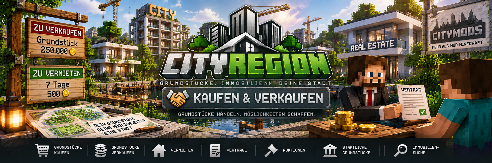

<link rel="stylesheet" href="style.css">



# 💰 Grundstücke kaufen & verkaufen

Mit CityRegion können Grundstücke direkt in der Minecraft-Welt gekauft und verkauft werden.

Dabei wird zwischen **staatlichen Grundstücken** und **privaten Grundstücken** unterschieden.

Alle Zahlungen werden über **MineBank** abgewickelt.

---

## 🏠 Grundstücke kaufen

Grundstücke können über registrierte Grundstücksschilder zum Verkauf angeboten werden.

Ein verfügbares Grundstück besitzt ein Verkaufsschild mit:

```text
[Grundstück]
Verkauf
10000

```

Dabei gilt:

- Zeile 1: `[Grundstück]`
- Zeile 2: `Verkauf`
- Zeile 3: Kaufpreis
- Zeile 4: leer

Nach der Registrierung wird das Schild automatisch von CityRegion verwaltet.

---

## 🛒 Grundstück kaufen

Um ein Grundstück zu kaufen, klickt der Spieler auf das registrierte Verkaufsschild.

CityRegion zeigt anschließend eine Kaufbestätigung im Chat an.

Der Spieler bestätigt den Kauf über:

```text
[Kaufen]
```

Erst nach der Bestätigung wird der Kauf durchgeführt.

Dadurch wird verhindert, dass ein Grundstück versehentlich durch einen einfachen Klick gekauft wird.

---

## 💳 Bezahlung über MineBank

Grundstückskäufe werden über **MineBank** bezahlt.

Der Käufer benötigt ausreichend Guthaben für den vollständigen Kaufpreis.

Reicht das Guthaben nicht aus, kann der Kauf nicht abgeschlossen werden.

---

## 🏛️ Staatliche Grundstücke

Grundstücke können vom Staat angeboten werden.

Wird ein staatliches Grundstück gekauft:

1. der Spieler bestätigt den Kauf
2. MineBank prüft das Guthaben
3. der Kaufpreis wird abgebucht
4. das Geld geht an die MineBank-Staatskasse
5. der Käufer wird Eigentümer der Region
6. der Grundstücksstatus wird aktualisiert
7. das Grundstücksschild wird automatisch angepasst

Staatliche Grundstücksverkäufe erzeugen somit Einnahmen für die Staatskasse.

---

## 👤 Private Grundstücke

Auch bereits gekaufte Grundstücke können später wieder privat verkauft werden.

Bei einem privaten Verkauf wird der Kaufpreis nicht an die Staatskasse überwiesen.

Das Geld wird direkt zwischen Käufer und bisherigem Eigentümer übertragen.

Der neue Käufer übernimmt anschließend die Immobilie.

---

## 🪧 Grundstück zum Verkauf anbieten

Ein Grundstück wird über ein Verkaufsschild angeboten.

Das Schild muss:

- innerhalb der Region
- oder unmittelbar neben der Region

platziert werden.

Beschrifte das Schild mit:

```text
[Grundstück]
Verkauf
<Kaufpreis>

```

Beispiel:

```text
[Grundstück]
Verkauf
25000

```

Anschließend muss das Schild vom Eigentümer oder einem Administrator mit **Rechtsklick registriert** werden.

---

## 🔒 Schutz der Grundstücksschilder

Registrierte CityRegion-Grundstücksschilder sind geschützt.

Normale Spieler können ein registriertes Grundstücksschild nicht einfach abbauen.

Dadurch können Verkaufsangebote nicht ohne Berechtigung entfernt oder manipuliert werden.

---

## 🔄 Eigentümerwechsel

Nach einem erfolgreichen privaten Grundstückskauf wird die Immobilie dem neuen Eigentümer übertragen.

Die Gebäude und Inhalte der Region bleiben dabei bestehen.

Das bedeutet:

> Ein privater Grundstücksverkauf setzt die Immobilie nicht automatisch auf ihren ursprünglichen Zustand zurück.

Der Käufer übernimmt die Immobilie mit dem bestehenden Gebäude beziehungsweise Grundstückszustand.

---

## 🏦 Staatliche und private Geldflüsse

CityRegion unterscheidet zwischen staatlichen und privaten Zahlungen.

### Staatlicher Verkauf

```text
Käufer
   ↓
MineBank
   ↓
Staatskasse
```

### Privater Verkauf

```text
Käufer
   ↓
MineBank
   ↓
bisheriger Eigentümer
```

Dadurch bleiben staatliche und private Immobiliengeschäfte voneinander getrennt.

---

# 🏛️ Grundstück an den Staat zurückgeben

Ein Eigentümer kann sein Grundstück wieder an den Staat zurückgeben.

Dafür muss der Eigentümer innerhalb seiner Region stehen.

Verwende:

```text
/cityregion returnstate
```

CityRegion verlangt anschließend eine Bestätigung.

---

## 💰 Rückkaufpreis des Staates

Bei einer erfolgreichen Rückgabe zahlt die Staatskasse:

```text
70 % des ursprünglichen Kaufpreises
```

an den Eigentümer zurück.

Beispiel:

```text
Ursprünglicher Kaufpreis: 100.000
Rückzahlung durch Staat:   70.000
```

Die restlichen 30 % werden nicht zurückgezahlt.

---

## 🏦 Staatskasse muss genügend Geld besitzen

Der Staat kann ein Grundstück nur zurückkaufen, wenn genügend Geld in der MineBank-Staatskasse vorhanden ist.

Reicht das Guthaben nicht aus, wird die Rückgabe vollständig abgelehnt.

Das Grundstück bleibt dann weiterhin im Besitz des Spielers.

---

## 🔄 Was passiert bei der Rückgabe?

Nach einer erfolgreichen Rückgabe an den Staat:

- erhält der Eigentümer 70 % des ursprünglichen Kaufpreises
- wird die Region wieder staatlich
- wird der gespeicherte Ursprungszustand wiederhergestellt
- bleibt das Verkaufsschild erhalten
- wird das staatliche Verkaufsangebot wieder aktiviert
- werden gesicherte Gegenstände ins Abhollager übertragen

Dadurch kann das Grundstück anschließend erneut von einem anderen Spieler gekauft werden.

---

## 📦 Gegenstände bei der Rückgabe

Bevor der ursprüngliche Zustand einer Region wiederhergestellt wird, sichert CityRegion persönliche Gegenstände aus Behältern.

Diese Gegenstände werden in das **Abhollager** übertragen.

Der ehemalige Eigentümer kann sie später über den Immobilienmakler oder mit folgendem Befehl abrufen:

```text
/cityregion returns
```

Die genaue Funktionsweise wird auf der Seite **Rücksetzung & Abhollager** erklärt.

---

## ❌ Wann kann ein Grundstück nicht zurückgegeben werden?

Eine Rückgabe an den Staat kann unter anderem verhindert werden, wenn:

- der Spieler nicht Eigentümer der Region ist
- der Spieler nicht in der entsprechenden Region steht
- eine aktive Vermietung besteht
- eine laufende Auktion besteht
- die Staatskasse die 70-%-Rückzahlung nicht finanzieren kann

Eine aktive Miete muss zuerst beendet werden.

Eine laufende Auktion muss ebenfalls zuerst abgebrochen werden.

---

# 💵 Staatliche Einnahmen

Nicht nur Grundstücksverkäufe können Geld in die Staatskasse bringen.

Zu den staatlichen Einnahmen von CityRegion gehören:

- Verkauf staatlicher Grundstücke
- Miete staatlicher Grundstücke
- Verlängerung staatlicher Mietverträge
- Grundstückslizenzen

Private Verkäufe und private Mieten werden dagegen direkt zwischen den beteiligten Spielern abgewickelt.

---

## ℹ️ Grundstück prüfen

Wenn du Informationen zur Region anzeigen möchtest, in der du gerade stehst:

```text
/cityregion info
```

Damit können Informationen zur aktuellen CityRegion angezeigt werden.

---

## ❗ Häufige Probleme

### Das Verkaufsschild wird nicht erkannt

Prüfe:

- steht das Schild innerhalb oder unmittelbar neben der Region?
- wurde die Region bereits mit `/cityregion create <Name>` erstellt?
- wurde das Schild richtig beschriftet?
- wurde das Schild anschließend vom Eigentümer oder Administrator mit Rechtsklick registriert?

Das Schild muss folgendem Aufbau entsprechen:

```text
[Grundstück]
Verkauf
10000

```

---

### „Das Schild muss in oder direkt an einer Region stehen“

Prüfe zunächst:

```text
/cityregion info
```

Damit kannst du kontrollieren, ob an der aktuellen Position tatsächlich eine CityRegion vorhanden ist.

Platziere das Schild anschließend innerhalb der Region oder direkt an ihrer Grenze.

---

### Grundstück kann nicht gekauft werden

Prüfe:

- besitzt der Käufer genügend MineBank-Guthaben?
- ist das Grundstück tatsächlich zum Verkauf freigegeben?
- wurde das Verkaufsschild korrekt registriert?
- wurde der Kauf im Chat bestätigt?

---

### Rückgabe an den Staat funktioniert nicht

Prüfe:

- bist du Eigentümer des Grundstücks?
- stehst du innerhalb der Region?
- besteht noch eine aktive Vermietung?
- läuft noch eine Auktion?
- besitzt die Staatskasse genügend Guthaben für die Rückzahlung?

Die Rückgabe erfolgt mit:

```text
/cityregion returnstate
```

---

## 💡 Beispiel: Staatliches Grundstück kaufen

Ein staatliches Grundstück besitzt beispielsweise folgendes Schild:

```text
[Grundstück]
Verkauf
50000

```

Der Spieler:

1. klickt auf das Grundstücksschild
2. erhält die Kaufbestätigung im Chat
3. klickt auf `[Kaufen]`
4. MineBank prüft das Guthaben
5. 50.000 werden abgebucht
6. das Geld geht an die Staatskasse
7. der Spieler wird Eigentümer
8. das Grundstücksschild wird automatisch aktualisiert

---

## 💡 Beispiel: Grundstück später an den Staat zurückgeben

Der Eigentümer stellt sich in sein Grundstück und verwendet:

```text
/cityregion returnstate
```

Nach der Bestätigung prüft CityRegion die Staatskasse.

Wurde das Grundstück ursprünglich für:

```text
50.000
```

gekauft, beträgt die Rückzahlung:

```text
35.000
```

Anschließend wird das Grundstück wieder staatlich, der Ursprungszustand wird wiederhergestellt und das Grundstück kann erneut angeboten werden.

---

[← Zurück: Grundstücke erstellen & schützen](cityregion-grundstuecke.md) | [Weiter: Vermietung & Mietverträge →](cityregion-vermietung.md)
