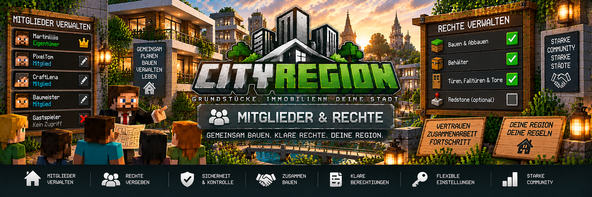

<link rel="stylesheet" href="style.css">



# 👥 Mitglieder & Rechte

Mit CityRegion können Grundstückseigentümer anderen Spielern Zugriff auf ihre Immobilien geben.

Dabei müssen Mitglieder nicht automatisch alle Rechte erhalten. Der Eigentümer kann getrennt festlegen, ob ein Spieler:

- bauen und abbauen darf
- Behälter verwenden darf
- Türen, Falltüren und Tore verwenden darf

Dadurch können Grundstücke, Häuser, Wohnungen und Gewerbeimmobilien gemeinsam genutzt werden, ohne jedem Spieler vollständige Kontrolle über die Region zu geben.

---

## 👑 Eigentümer einer Region

Der Eigentümer besitzt die vollständige Kontrolle über seine Immobilie.

Je nach Region kann er unter anderem:

- Mitglieder hinzufügen
- Mitglieder entfernen
- Rechte einzelner Mitglieder verwalten
- Unterregionen erstellen
- Wohnungen verwalten
- Grundstücke verkaufen
- Grundstücke vermieten
- Mietangebote verwalten
- Immobilieninformationen einsehen

Mitglieder sind dagegen nur zusätzliche berechtigte Spieler.

> Ein Mitglied wird durch das Hinzufügen **nicht zum Eigentümer** der Immobilie.

---

# 👥 Mitglieder hinzufügen

Eigentümer können andere Spieler als Mitglieder ihrer Region hinzufügen.

Die Mitgliederverwaltung erfolgt über das dafür vorgesehene CityRegion-Menü.

Stelle dich dafür in die Region, deren Mitglieder du verwalten möchtest.

Dort können Spieler hinzugefügt und ihre einzelnen Rechte festgelegt werden.

---

## 🏠 Beispiel

Ein Grundstück gehört:

```text
Eigentümer:
Martiniiiis
```

Der Eigentümer kann beispielsweise folgende Spieler hinzufügen:

```text
Martiniiiis        → Eigentümer
PixelTom           → Mitglied
CraftLena          → Mitglied
Baumeister         → Mitglied
```

Ein Spieler, der nicht als Eigentümer, Mieter oder berechtigtes Mitglied eingetragen ist, besitzt keinen normalen Zugriff auf die geschützten Funktionen der Region.

---

# 🔐 Einzelne Berechtigungen

CityRegion trennt die wichtigsten Grundstücksrechte voneinander.

Dadurch kann für jedes Mitglied entschieden werden, welche Funktionen erlaubt sind.

Die wichtigsten Rechte sind:

| Recht | Funktion |
|---|---|
| Bauen & Abbauen | Blöcke setzen und entfernen |
| Behälter | Kisten und andere geschützte Behälter verwenden |
| Türen | Türen, Falltüren und Tore verwenden |

---

# ⛏️ Bauen & Abbauen

Mit diesem Recht darf ein Mitglied innerhalb der entsprechenden Region Blöcke verändern.

Dazu gehören:

- Blöcke setzen
- Blöcke abbauen
- Gebäude verändern
- Grundstück gestalten

Ohne dieses Recht bleibt die Region vor baulichen Veränderungen durch das Mitglied geschützt.

---

## 💡 Beispiel

Ein Freund soll beim Bau eines Hauses helfen.

Dann kann er beispielsweise erhalten:

```text
Bauen & Abbauen: ✅
Behälter:        ❌
Türen:           ✅
```

Damit kann der Spieler beim Bau helfen und Türen benutzen, aber nicht auf geschützte Behälter zugreifen.

---

# 📦 Behälter

Das Behälterrecht erlaubt einem Mitglied den Zugriff auf geschützte Behälter innerhalb der Region.

Dazu können beispielsweise gehören:

- Kisten
- Fässer
- andere geschützte Inventare

Ohne dieses Recht kann ein Mitglied nicht einfach auf die entsprechenden geschützten Behälter zugreifen.

---

## 💡 Beispiel für ein Lager

Ein Spieler soll Waren aus einem Lager holen dürfen, aber das Gebäude nicht verändern.

Dann können seine Rechte beispielsweise so aussehen:

```text
Bauen & Abbauen: ❌
Behälter:        ✅
Türen:           ✅
```

Der Spieler kann das Lager betreten und die vorgesehenen Behälter verwenden, aber keine Blöcke abbauen oder setzen.

---

# 🚪 Türen, Falltüren & Tore

Das Türrecht erlaubt die Verwendung geschützter Zugänge.

Dazu gehören unter anderem:

- Türen
- Falltüren
- Tore

Damit kann ein Spieler Zugang zu einer Immobilie erhalten, ohne gleichzeitig Bau- oder Behälterrechte zu besitzen.

---

## 💡 Beispiel für einen Besucher

Ein Spieler soll ein Gebäude betreten können, aber sonst keine weiteren Rechte erhalten.

Dann könnte die Einstellung so aussehen:

```text
Bauen & Abbauen: ❌
Behälter:        ❌
Türen:           ✅
```

Damit kann der Spieler die vorgesehenen Zugänge verwenden, aber nichts verändern oder aus Behältern nehmen.

---

# 🏠 Rechte gelten für die jeweilige Region

Mitgliedschaften und Rechte beziehen sich auf die jeweilige CityRegion.

Das ist besonders bei Hauptregionen und Unterregionen wichtig.

Beispiel:

```text
Wohnhaus-A
├── Wohnung-01
├── Wohnung-02
├── Wohnung-03
└── Gemeinschaftsbereich
```

Ein Spieler kann beispielsweise Rechte für `Wohnung-01` besitzen, ohne automatisch dieselben Rechte für `Wohnung-02` zu erhalten.

---

# 🧭 Kleinste passende Region

Wenn sich ein Spieler innerhalb einer Unterregion befindet, verwendet CityRegion die kleinste passende Region.

Beispiel:

```text
Hauptregion
└── Wohnung-01
```

Innerhalb von `Wohnung-01` gelten die Rechte der Wohnungsregion.

Dadurch können Unterregionen unabhängig von der übergeordneten Hauptregion verwaltet werden.

Das ist besonders wichtig für:

- Wohnungen
- Büros
- Ladenflächen
- Lagerbereiche
- Hotelzimmer
- andere getrennte Bereiche

---

# 🏢 Mitglieder in Wohnungen

Auch einzelne Wohnungen können eigene Mitglieder besitzen.

Beispiel:

```text
Wohnung-01

Eigentümer/Mieter:
Spieler A

Mitglieder:
├── Spieler B
└── Spieler C
```

Dadurch können beispielsweise Mitbewohner Zugriff auf eine Wohnung erhalten.

Die Rechte können auch hier getrennt festgelegt werden.

---

# 🏠 Mitbewohner

Das Mitgliedersystem eignet sich besonders für gemeinsam genutzte Immobilien.

Ein Bewohner kann beispielsweise seinem Mitbewohner folgende Rechte geben:

```text
Bauen & Abbauen: ✅
Behälter:        ✅
Türen:           ✅
```

Ein anderer Spieler kann dagegen nur Zugang zum Gebäude erhalten:

```text
Bauen & Abbauen: ❌
Behälter:        ❌
Türen:           ✅
```

So können unterschiedliche Zugriffsarten innerhalb derselben Immobilie eingerichtet werden.

---

# 🏪 Mitglieder in Gewerbeimmobilien

Das Rechtesystem kann ebenfalls für Gewerbeimmobilien verwendet werden.

Beispiel:

```text
Supermarkt

Eigentümer:
Spieler A

Mitarbeiter 1:
Bauen & Abbauen: ❌
Behälter:        ✅
Türen:           ✅

Mitarbeiter 2:
Bauen & Abbauen: ✅
Behälter:        ✅
Türen:           ✅
```

Dadurch kann ein Grundstückseigentümer festlegen, welche Spieler welche Bereiche seiner Immobilie verwenden dürfen.

---

# 🏭 Lager und Firmenbereiche

Bei Lager- oder Industrieimmobilien können getrennte Rechte besonders hilfreich sein.

Beispiel:

```text
Lagerhalle

Lagerarbeiter:
Bauen & Abbauen: ❌
Behälter:        ✅
Türen:           ✅

Bauleiter:
Bauen & Abbauen: ✅
Behälter:        ❌
Türen:           ✅
```

So muss nicht jeder Mitarbeiter vollständige Grundstücksrechte besitzen.

---

# 🚶 Gemeinschaftsbereiche

In größeren Gebäuden können Bereiche als Gemeinschaftsflächen eingerichtet werden.

Typische Beispiele:

- Hauseingänge
- Treppenhäuser
- Flure
- Innenhöfe
- Gemeinschaftsräume

Eine entsprechende Region kann als Gemeinschaftsbereich markiert werden:

```text
/cityregion common true
```

Zum Entfernen:

```text
/cityregion common false
```

Mieter können dadurch gemeinsame Türen verwenden, ohne vollständige Rechte für die gesamte Hauptregion zu benötigen.

---

# 🔑 Eigentümer, Mieter und Mitglieder

CityRegion unterscheidet verschiedene Arten von Zugriff.

## Eigentümer

Der Eigentümer kontrolliert die Immobilie dauerhaft.

Er kann Mitglieder und weitere Einstellungen seiner Region verwalten.

## Mieter

Ein Mieter erhält die vorgesehenen Rechte für die Dauer seines Mietvertrags.

Nach dem Mietende verliert er diese Rechte wieder.

## Mitglieder

Mitglieder werden vom Eigentümer beziehungsweise innerhalb der dafür vorgesehenen Verwaltung hinzugefügt.

Sie erhalten nur die Rechte, die ihnen für die Region zugewiesen wurden.

---

# ⏳ Rechte während einer Vermietung

Bei einer vermieteten Immobilie besitzt der Mieter die entsprechenden Rechte für die Dauer des Mietvertrags.

Nach dem Ende der Miete:

- endet der Mietvertrag
- verliert der Mieter seine Mietrechte
- kann die Region zurückgesetzt werden
- werden persönliche Gegenstände vorher gesichert
- wird die Immobilie wieder für eine neue Vermietung freigegeben

Dadurch bleiben Mietrechte nicht dauerhaft bestehen.

---

# 🏢 Hauptregion und Wohnung getrennt verwalten

Ein großes Wohngebäude kann beispielsweise so aufgebaut sein:

```text
Wohnhaus-A
│
├── Hauptregion
│   └── Eigentümer des Gebäudes
│
├── Wohnung-01
│   ├── Mieter A
│   └── Mitglied A2
│
├── Wohnung-02
│   ├── Mieter B
│   └── Mitglied B2
│
└── Gemeinschaftsbereich
```

Die Bewohner der einzelnen Wohnungen erhalten dadurch nicht automatisch Zugriff auf andere Wohnungen.

---

# 🛡️ Schutz vor nicht berechtigten Spielern

Spieler ohne passende Rechte können geschützte Aktionen innerhalb einer CityRegion nicht einfach durchführen.

Der Regionsschutz verhindert unter anderem unberechtigten Zugriff auf:

- Bauen
- Abbauen
- Behälter
- Türen
- Falltüren
- Tore

Dadurch bleibt eine Immobilie auch auf größeren Multiplayer-Servern geschützt.

---

# 🛠️ Administratoren

Administratoren können CityRegion für Verwaltungszwecke unabhängig von normalen Spielerrechten verwalten.

Dadurch können sie beispielsweise bei Problemen:

- Regionen prüfen
- Eigentümer verwalten
- Mietverhältnisse kontrollieren
- Regionen bearbeiten
- fehlerhafte Zustände korrigieren

Normale Spieler erhalten dadurch jedoch keine zusätzlichen Rechte.

---

# ℹ️ Region überprüfen

Bevor Mitglieder oder Rechte verwaltet werden, sollte geprüft werden, ob man sich in der richtigen Region befindet.

Verwende:

```text
/cityregion info
```

Das ist besonders bei Gebäuden mit mehreren Unterregionen wichtig.

Beispiel:

```text
Wohnhaus-A
└── Wohnung-01
```

Stehst du innerhalb der Wohnung, sollte CityRegion die entsprechende Unterregion erkennen.

---

# 💻 Mitgliederverwaltung

Für Eigentümer steht eine eigene Mitgliederverwaltung zur Verfügung.

Dort können die Mitglieder der jeweiligen Immobilie verwaltet werden.

Typische Funktionen sind:

- Mitglieder anzeigen
- Spieler hinzufügen
- Spieler entfernen
- Baurecht verwalten
- Behälterrecht verwalten
- Türrecht verwalten

Dadurch müssen die einzelnen Rechte nicht pauschal an jeden Spieler vergeben werden.

---

# ➕ Mitglied hinzufügen

Beim Hinzufügen eines Spielers sollte anschließend geprüft werden, welche Rechte dieser tatsächlich benötigt.

Beispiel:

```text
Neues Mitglied:
Spieler123

Bauen & Abbauen: ❌
Behälter:        ❌
Türen:           ✅
```

Damit erhält der Spieler zunächst nur Zugang zu Türen und Toren.

Weitere Rechte können anschließend bei Bedarf aktiviert werden.

---

# ❌ Mitglied entfernen

Wird ein Spieler nicht mehr benötigt, kann er über die Mitgliederverwaltung wieder aus der Region entfernt werden.

Nach dem Entfernen besitzt er die zuvor über diese Mitgliedschaft vergebenen Regionsrechte nicht mehr.

Das ist beispielsweise sinnvoll bei:

- ausgezogenen Mitbewohnern
- ehemaligen Helfern
- nicht mehr berechtigten Spielern
- ehemaligen Mitarbeitern eines Grundstücks

---

# 🔄 Rechte ändern

Die Rechte eines bestehenden Mitglieds können angepasst werden.

Beispiel:

### Vorher

```text
Spieler123

Bauen & Abbauen: ❌
Behälter:        ❌
Türen:           ✅
```

### Nachher

```text
Spieler123

Bauen & Abbauen: ✅
Behälter:        ✅
Türen:           ✅
```

Dadurch kann der Zugriff erweitert werden, ohne den Spieler neu hinzufügen zu müssen.

Genauso können einzelne Rechte wieder entzogen werden.

---

# 🔐 Nur notwendige Rechte vergeben

Es ist sinnvoll, Mitgliedern nur die Rechte zu geben, die sie tatsächlich benötigen.

Beispiel:

| Spieler | Bauen | Behälter | Türen |
|---|:---:|:---:|:---:|
| Mitbewohner | ✅ | ✅ | ✅ |
| Besucher | ❌ | ❌ | ✅ |
| Lagerarbeiter | ❌ | ✅ | ✅ |
| Bauhelfer | ✅ | ❌ | ✅ |

Dadurch kann ein Grundstück gemeinsam genutzt werden, ohne jedem Spieler vollständige Kontrolle zu geben.

---

# 🏙️ Beispiel: Mehrfamilienhaus

Ein Wohnhaus könnte beispielsweise folgendermaßen verwaltet werden:

```text
Wohnhaus-A
│
├── Wohnung-01
│   ├── Mieter: Spieler A
│   └── Mitglied: Spieler B
│
├── Wohnung-02
│   └── Mieter: Spieler C
│
├── Wohnung-03
│   ├── Mieter: Spieler D
│   ├── Mitglied: Spieler E
│   └── Mitglied: Spieler F
│
└── Treppenhaus
    └── Gemeinschaftsbereich
```

Spieler B besitzt dadurch nur die für `Wohnung-01` vergebenen Rechte.

Spieler E und F besitzen nur Rechte für `Wohnung-03`.

Die anderen Wohnungen bleiben geschützt.

---

# 🏪 Beispiel: Geschäft mit Mitarbeitern

Eine Gewerbeimmobilie könnte so verwaltet werden:

```text
CityMarkt

Eigentümer:
Martiniiiis

Filialleiter:
Bauen & Abbauen: ✅
Behälter:        ✅
Türen:           ✅

Verkäufer:
Bauen & Abbauen: ❌
Behälter:        ✅
Türen:           ✅

Reinigung:
Bauen & Abbauen: ❌
Behälter:        ❌
Türen:           ✅
```

Dadurch lassen sich verschiedene Zugriffsstufen auf die Immobilie umsetzen.

---

# ❗ Häufige Probleme

## Mitglied kann nicht bauen

Prüfe, ob für den Spieler das Recht **Bauen & Abbauen** aktiviert wurde.

Nur Mitglied zu sein bedeutet nicht automatisch, dass alle Rechte freigeschaltet sind.

---

## Mitglied kann keine Kiste öffnen

Prüfe das **Behälterrecht** des Spielers.

Beispiel:

```text
Behälter: ❌
```

In diesem Fall besitzt der Spieler keinen entsprechenden Zugriff.

---

## Mitglied kann eine Tür nicht öffnen

Prüfe das Recht für:

```text
Türen, Falltüren & Tore
```

Das Türrecht kann unabhängig von Bau- und Behälterrechten vergeben werden.

---

## Spieler besitzt Rechte in der falschen Region

Prüfe mit:

```text
/cityregion info
```

welche Region an der aktuellen Position erkannt wird.

Bei Unterregionen verwendet CityRegion die kleinste passende Region.

---

## Mitbewohner kommt ins Haus, aber nicht in seine Wohnung

Prüfe:

- wurde die Wohnung als eigene Unterregion erstellt?
- ist der Spieler in der richtigen Region berechtigt?
- besitzt er das benötigte Türrecht?
- wurde ein gemeinsamer Eingangsbereich korrekt eingerichtet?

---

## Spieler soll nur Türen benutzen

Vergib beispielsweise:

```text
Bauen & Abbauen: ❌
Behälter:        ❌
Türen:           ✅
```

Damit erhält der Spieler Zugang, ohne Gebäude oder Lager verändern zu können.

---

# 💡 Beispiel: Mitglied einrichten

Angenommen, ein Freund soll in deinem Haus wohnen dürfen.

### 1. Richtige Region prüfen

Stelle dich in das Grundstück und verwende:

```text
/cityregion info
```

### 2. Mitgliederverwaltung öffnen

Öffne die CityRegion-Mitgliederverwaltung für das Grundstück.

### 3. Spieler hinzufügen

Füge den gewünschten Spieler als Mitglied hinzu.

### 4. Rechte festlegen

Für einen vollständigen Mitbewohner beispielsweise:

```text
Bauen & Abbauen: ✅
Behälter:        ✅
Türen:           ✅
```

Für einen Spieler, der das Haus nur betreten darf:

```text
Bauen & Abbauen: ❌
Behälter:        ❌
Türen:           ✅
```

### 5. Rechte testen

Der Spieler sollte anschließend nur die Aktionen durchführen können, für die er die entsprechenden Rechte erhalten hat.

Damit kann der Zugriff auf ein Grundstück gezielt und sicher verwaltet werden.

---

[← Zurück: Immobilienauktionen](cityregion-auktionen.md) | [Weiter: Makler & Real Estate OS →](cityregion-real-estate-os.md)
