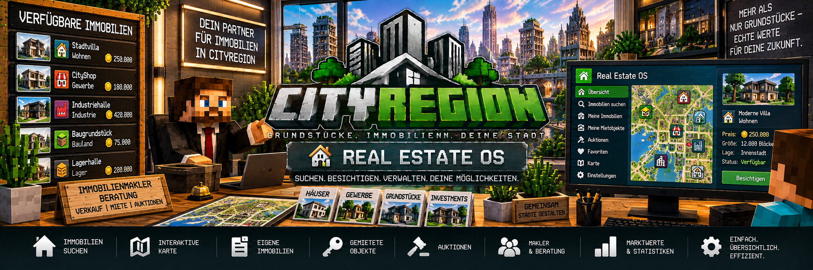

<link rel="stylesheet" href="style.css">



# 🧑‍💼 Makler & Real Estate OS

CityRegion besitzt einen eigenen **Immobilienmakler** und das **Real Estate OS**.

Damit können Spieler Immobilien zentral suchen, besichtigen und verwalten, ohne jedes Grundstück einzeln in der Welt finden zu müssen.

Das Real Estate OS zeigt unter anderem verfügbare Immobilien, eigene Grundstücke, Mietobjekte, Immobilienwerte, Gebäude, Wohnungen, Mietverträge und Auktionen.

---

## 🧑‍💼 Immobilienmakler

Der Immobilienmakler dient als zentrale Anlaufstelle für das CityRegion-Immobiliensystem.

Über ihn können Spieler unter anderem:

- verfügbare Immobilien suchen
- eigene Immobilien anzeigen
- gemietete Immobilien anzeigen
- Immobilien besichtigen
- Grundstückslizenzen verwalten
- das Abhollager öffnen
- das Real Estate OS verwenden

Damit können viele wichtige CityRegion-Funktionen an einem zentralen Ort erreicht werden.

---

# 👔 Makler-NPC

CityRegion besitzt einen eigenen Immobilienmakler-NPC.

Der Makler verwendet einen passenden Anzug-Skin und ist für die dauerhafte Verwendung als Immobilienmakler vorgesehen.

Der NPC ist:

- unbeweglich
- unverwundbar
- gegen Rückstoß geschützt

Dadurch bleibt der Makler an seinem vorgesehenen Standort.

---

# 👤 Vorhandenen Villager als Makler verwenden

Administratoren können einen bereits vorhandenen Villager als Immobilienmakler registrieren.

Dadurch kann beispielsweise ein bereits gebautes Immobilienbüro mit einem bestehenden NPC ausgestattet werden.

Nach der Registrierung stehen die CityRegion-Maklerfunktionen über diesen NPC zur Verfügung.

---

# ➕ Eigenen Immobilienmakler erstellen

Administratoren können außerdem einen eigenen Makler-NPC für CityRegion erstellen.

Damit kann beispielsweise in einem Rathaus oder Immobilienbüro eine zentrale Anlaufstelle eingerichtet werden.

Beispiel:

```text
Rathaus
└── Immobilienbüro
    ├── Immobilienmakler
    └── Immobilien-PC
```

Der Makler kann bei Bedarf auch wieder entfernt werden.

---

# 💻 Real Estate OS

Das **Real Estate OS** ist die zentrale Immobilienverwaltung von CityRegion.

Es bündelt viele Informationen und Funktionen in einer gemeinsamen Benutzeroberfläche.

Spieler können dort unter anderem auf folgende Bereiche zugreifen:

- verfügbare Immobilien
- eigene Immobilien
- gemietete Immobilien
- Immobilieninformationen
- Gebäude und Wohnungen
- Mietverträge
- Immobilienwerte
- Marktinformationen
- Auktionen
- Mieteinnahmen
- Grundstückslizenzen

---

# 🔎 Verfügbare Immobilien suchen

Im Real Estate OS können Spieler nach verfügbaren Immobilien suchen.

Dadurch können Grundstücke gefunden werden, die aktuell:

- zum Verkauf stehen
- zur Miete angeboten werden
- versteigert werden

Je nach Immobilie können weitere Informationen angezeigt werden.

Beispiel:

```text
Stadtvilla

Immobilienart: Wohnen
Status:        Verfügbar
Preis:         250.000
Größe:         12.000 Blöcke
```

---

# 🏠 Eigene Immobilien

Spieler können im Real Estate OS ihre eigenen Immobilien anzeigen.

Dadurch erhält ein Eigentümer eine zentrale Übersicht über seine Grundstücke.

Je nach Immobilie können beispielsweise Informationen angezeigt werden zu:

- Name der Region
- Immobilienart
- Grundstücksgröße
- Status
- Gebäuden
- Wohnungen
- Mietverhältnissen
- Immobilienwert
- Markttrend

Das ist besonders praktisch für Spieler, die mehrere Immobilien besitzen.

---

# 🔑 Gemietete Immobilien

Auch aktuell gemietete Immobilien können separat angezeigt werden.

Ein Mieter kann dadurch seine laufenden Mietverträge leichter verwalten.

Dazu können unter anderem gehören:

- gemietete Immobilie
- Vermieter
- verbleibende Mietdauer
- Mietpreis
- Kaution
- automatische Verlängerung

Dadurch muss der Spieler nicht jedes Mietschild einzeln aufsuchen, um seine Immobilien im Blick zu behalten.

---

# ⏳ Mietverträge

Das Real Estate OS kann Informationen zu laufenden Mietverträgen anzeigen.

Dazu gehören beispielsweise:

```text
Immobilie:       Wohnung-01
Mieter:          Spieler123
Mietpreis:       1.000
Restlaufzeit:    5 Tage
Kaution:         500
Auto-Verlängerung: Aktiv
```

CityRegion warnt Mieter außerdem ab **3 verbleibenden Tagen** vor dem bevorstehenden Mietende.

---

# 🔄 Mietvertrag verlängern

Ein bestehender Mietvertrag kann verlängert werden.

Die zusätzliche Mietperiode wird nach erfolgreicher Zahlung an den bestehenden Vertrag angehängt.

Ist die automatische Verlängerung aktiviert, kann CityRegion die nächste Mietperiode automatisch verlängern, sofern die notwendige Zahlung durchgeführt werden kann.

---

# ❌ Mietvertrag kündigen

Ein Mieter kann seinen eigenen Mietvertrag vorzeitig beenden.

Dafür steht weiterhin der Befehl:

```text
/cityregion cancelrent
```

zur Verfügung.

Die bereits bezahlte normale Miete wird bei einer vorzeitigen Kündigung nicht zurückerstattet.

Eine vorhandene Kaution kann entsprechend dem Mietsystem zurückgegeben werden.

---

# 🏢 Gebäude & Wohnungen

Das Real Estate OS unterstützt auch größere Gebäude mit mehreren Wohnungen.

Beispiel:

```text
Wohnhaus-A
├── Wohnung-01 → vermietet
├── Wohnung-02 → frei
├── Wohnung-03 → vermietet
└── Wohnung-04 → frei
```

Dadurch können Eigentümer sehen:

- welche Wohnungen existieren
- welche Wohnungen frei sind
- welche Wohnungen vermietet sind
- welche Mieter eingetragen sind
- welche Mietverträge laufen

---

# 💰 Mieteinnahmen

Vermieter können ihre Immobilien und Mieteinnahmen zentral verwalten.

Dadurch lässt sich nachvollziehen, welche Immobilien aktuell vermietet sind und welche Einnahmen durch die Vermietung entstehen.

Bei privaten Immobilien gehen Mietzahlungen über MineBank an den Eigentümer.

Bei staatlichen Immobilien gehen die entsprechenden Einnahmen an die Staatskasse.

---

# 🏷️ Immobilienarten

Im Real Estate OS können die vorhandenen Immobilienarten dargestellt werden.

CityRegion unterstützt:

```text
Wohnen
Gewerbe
Industrie
Lager
Bauland
Gemeinschaftsfläche
```

Dadurch lassen sich unterschiedliche Immobilien leichter voneinander unterscheiden.

---

# 📈 Immobilienwerte

Das Real Estate OS zeigt außerdem Informationen zur Bewertung einer Immobilie.

Dazu können gehören:

- Grundstücksfläche
- Lagefaktor
- Gebäudewert
- Richtwert
- letzter Verkaufspreis
- Markttrend

Beispiel:

```text
Immobilie:          Stadtvilla
Immobilienart:      Wohnen
Richtwert:          275.000
Letzter Verkauf:    250.000
Markttrend:         steigend
```

---

# 📊 Marktinformationen

CityRegion kann vorhandene Immobilien- und Verkaufsinformationen für die Marktübersicht verwenden.

Dadurch können Spieler sehen, wie sich eine Immobilie beziehungsweise ihre vorhandenen Marktdaten entwickelt haben.

Mögliche Trendanzeigen sind:

```text
↑ steigend
↓ fallend
→ stabil
```

Der Richtwert ist dabei eine Orientierung und muss nicht mit dem tatsächlichen Verkaufs- oder Auktionspreis übereinstimmen.

---

# 🔨 Auktionen

Laufende Immobilienauktionen können ebenfalls über das Real Estate OS verwaltet beziehungsweise angezeigt werden.

Zu einer Auktion können beispielsweise folgende Informationen gehören:

- Immobilie
- Startgebot
- aktuelles Höchstgebot
- Höchstbietender
- verbleibende Zeit

Beispiel:

```text
Industriehalle

Startgebot:        300.000
Aktuelles Gebot:   420.000
Restzeit:          02:35:18
```

Dadurch können Spieler laufende Auktionen zentral finden.

---

# 👀 Immobilien besichtigen

CityRegion besitzt eine Besichtigungsfunktion.

Spieler können sich zu verfügbaren Immobilien teleportieren lassen, um sie vor einem Kauf, einer Miete oder einem Gebot anzusehen.

Dadurch kann ein Spieler eine Immobilie zuerst direkt in der Welt prüfen.

Beispiel:

```text
Real Estate OS
      ↓
Immobilie auswählen
      ↓
Besichtigung
      ↓
Teleport zur Immobilie
```

---

# 🏠 Teleport zu eigenen Immobilien

Spieler können über die Immobilienverwaltung auch zu ihren eigenen Grundstücken gelangen.

Das ist besonders praktisch, wenn ein Spieler mehrere Immobilien an verschiedenen Orten besitzt.

Beispiel:

```text
Meine Immobilien

Wohnhaus-A
Lagerhalle-02
Gewerbe-05
Wohnung-12
```

Die gewünschte Immobilie kann ausgewählt und anschließend aufgesucht werden.

---

# 🗺️ Immobilienkarte

Das Real Estate OS besitzt eine statusbasierte Immobilienkarte.

Dadurch können Immobilien übersichtlich dargestellt werden.

Die Karte hilft dabei, unterschiedliche Grundstücke und deren Status schneller zu erkennen.

Sie ergänzt die normalen Listen innerhalb des Real Estate OS.

---

# 📜 Scrollbare Immobilienlisten

Bei vielen Grundstücken können die Immobilienlisten gescrollt werden.

Dadurch bleibt das Real Estate OS auch auf Servern mit einer größeren Anzahl an Immobilien nutzbar.

Das ist besonders wichtig für:

- große Städte
- viele Mietwohnungen
- zahlreiche Gewerbeimmobilien
- größere Immobilienserver

---

# 🪪 Grundstückslizenzen

CityRegion verwendet Grundstückslizenzen, um die Anzahl der Immobilien zu verwalten, die ein Spieler besitzen kann.

Verfügbare Lizenzgrößen sind:

```text
2 Grundstücke
5 Grundstücke
10 Grundstücke
```

Die Lizenzen können über das Immobilienmakler-System verwaltet werden.

Dadurch kann ein Server kontrollieren, wie viele Immobilien ein Spieler gleichzeitig besitzen darf.

---

# 💳 Grundstückslizenzen & MineBank

Der Kauf beziehungsweise die finanzielle Abwicklung der Grundstückslizenzen erfolgt über MineBank.

Einnahmen aus entsprechenden staatlichen CityRegion-Funktionen können an die Staatskasse gehen.

---

# 📦 Abhollager

Der Immobilienmakler bietet außerdem Zugriff auf das CityRegion-Abhollager.

Dort landen persönliche Gegenstände, die CityRegion vor einer automatischen Regionsrücksetzung gesichert hat.

Das kann beispielsweise passieren:

- nach dem Ende einer Vermietung
- bei der Rückgabe einer Immobilie an den Staat

Die Gegenstände werden dadurch nicht einfach gelöscht.

---

# 📦 Gegenstände abholen

Das Abhollager kann über den Immobilienmakler geöffnet werden.

Zusätzlich steht der Befehl:

```text
/cityregion returns
```

zur Verfügung.

Ist das Spielerinventar voll, bleiben nicht entnommene Gegenstände weiterhin im Abhollager gespeichert.

---

# 🖥️ Immobilien-PC

Neben dem Immobilienmakler besitzt CityRegion einen eigenen **Immobilien-PC**.

Über diesen PC kann ebenfalls auf das Real Estate OS zugegriffen werden.

Dadurch können Serverbetreiber beispielsweise ein richtiges Immobilienbüro bauen.

Beispiel:

```text
IMMOBILIENBÜRO

┌───────────────────────────┐
│                           │
│  🧑‍💼 Immobilienmakler    │
│                           │
│  💻 Immobilien-PC         │
│                           │
└───────────────────────────┘
```

Spieler können dort ihre Immobilienverwaltung direkt innerhalb des Gebäudes öffnen.

---

# 🏛️ Beispiel: Immobilienbüro im Rathaus

Ein Server könnte das System beispielsweise so verwenden:

```text
Rathaus
│
└── Immobilienamt
    │
    ├── Immobilienmakler
    │
    ├── Immobilien-PC
    │
    └── Real Estate OS
```

Spieler können dort:

1. Immobilien suchen
2. verfügbare Grundstücke ansehen
3. Besichtigungen starten
4. eigene Immobilien verwalten
5. Mietverträge prüfen
6. Auktionen ansehen
7. Grundstückslizenzen verwalten
8. Gegenstände aus dem Abhollager holen

---

# 🏪 Gewerbeimmobilien

Auch Gewerbeimmobilien können über das Real Estate OS verwaltet werden.

Dazu gehören beispielsweise:

- Geschäfte
- Büros
- Lager
- Firmengebäude
- Industriehallen

CityRegion kann Gewerbeimmobilien außerdem optional einer CityShops-Firma beziehungsweise Filiale zuordnen.

CityShops bleibt dabei eine separate Mod und ist für CityRegion nicht erforderlich.

---

# 🏦 MineBank

CityRegion verwendet **MineBank 1.0.2 oder neuer** für seine finanziellen Funktionen.

Dazu gehören unter anderem:

- Grundstückskäufe
- Grundstücksverkäufe
- Mietzahlungen
- Mietverlängerungen
- Kautionen
- Auktionen
- staatliche Einnahmen
- Grundstückslizenzen

MineBank ist deshalb eine Pflichtabhängigkeit von CityRegion.

---

# 👑 Funktionen für Eigentümer

Das Real Estate OS ist nicht nur für die Immobiliensuche gedacht.

Eigentümer können damit auch ihre bestehenden Immobilien verwalten.

Dazu gehören je nach Immobilie unter anderem:

- eigene Grundstücke anzeigen
- Gebäude und Wohnungen prüfen
- Mietstatus kontrollieren
- Mieteinnahmen ansehen
- Immobilieninformationen anzeigen
- Marktwerte prüfen
- laufende Auktionen kontrollieren

---

# 🔑 Funktionen für Mieter

Mieter können ebenfalls wichtige Informationen zentral einsehen.

Dazu gehören:

- gemietete Immobilien
- verbleibende Mietdauer
- Mietinformationen
- automatische Verlängerung
- Immobilieninformationen

Dadurch behält ein Spieler auch bei mehreren Mietobjekten den Überblick.

---

# 🛠️ Funktionen für Administratoren

Administratoren besitzen zusätzliche Möglichkeiten zur Verwaltung des Immobiliensystems.

Dazu gehören unter anderem:

- alle Regionen anzeigen
- zu Regionen teleportieren
- Eigentümer zuweisen
- Eigentümer entfernen
- staatliche Verkaufsangebote verwalten
- staatliche Mietangebote verwalten
- Immobilienarten festlegen
- Lagefaktoren festlegen
- Gebäudewerte festlegen
- Gemeinschaftsbereiche verwalten
- Bauphasen verwalten
- reine Mietobjekte festlegen
- Immobilienmakler verwalten

Damit kann das gesamte Immobilienangebot eines Servers zentral organisiert werden.

---

# 📋 Beispiel einer Immobilienübersicht

Eine Immobilie könnte im Real Estate OS beispielsweise folgendermaßen dargestellt werden:

```text
STADTVILLA

Status:              Verfügbar
Immobilienart:       Wohnen
Größe:               12.000 Blöcke
Kaufpreis:           250.000
Richtwert:           265.000
Letzter Verkauf:     240.000
Markttrend:          steigend

[Besichtigen]
```

Eine Mietwohnung könnte beispielsweise so aussehen:

```text
WOHNUNG-05

Gebäude:             Wohnhaus-A
Status:              Vermietet
Mieter:              Spieler123
Miete:               1.000
Restlaufzeit:        6 Tage
Kaution:             500
Auto-Verlängerung:   Aktiv
```

---

# ❗ Häufige Probleme

## Immobilienmakler reagiert nicht

Prüfe:

- wurde der NPC korrekt als Immobilienmakler registriert?
- ist CityRegion korrekt geladen?
- ist MineBank 1.0.2 oder neuer installiert?
- befindet sich der Spieler in ausreichender Nähe zum Makler?

---

## Immobilie erscheint nicht in der Suche

Prüfe:

- wurde die Region korrekt erstellt?
- besitzt die Immobilie ein aktives Angebot?
- ist das Verkaufs- beziehungsweise Mietschild korrekt registriert?
- ist die Immobilie bereits verkauft oder vermietet?

---

## Meine Immobilie wird nicht angezeigt

Prüfe zunächst innerhalb der Region:

```text
/cityregion info
```

Damit kann kontrolliert werden, ob die richtige Region und der richtige Eigentümer erkannt werden.

---

## Besichtigung funktioniert nicht

Prüfe:

- existiert die Region noch?
- ist die Immobilie weiterhin verfügbar?
- besitzt die Immobilie eine gültige Position?
- wurde die Immobilie korrekt im CityRegion-System gespeichert?

---

## Abhollager ist leer

Das Abhollager enthält nur Gegenstände, die CityRegion bei einer entsprechenden Regionsrücksetzung gesichert hat.

Wurden keine persönlichen Gegenstände gesichert, bleibt das Abhollager leer.

---

## Immobilien-PC öffnet sich nicht

Prüfe:

- ist CityRegion auf Client und Server installiert?
- verwendet der Client dieselbe benötigte Mod-Version?
- ist MineBank vorhanden?
- wurde der Immobilien-PC korrekt platziert?

---

# 💡 Beispiel: Immobilie suchen und besichtigen

Ein Spieler möchte ein neues Haus kaufen.

### 1. Immobilienmakler aufsuchen

Der Spieler geht zum Immobilienbüro und verwendet den Immobilienmakler.

### 2. Real Estate OS öffnen

Im Makler-Menü wird das Real Estate OS geöffnet.

### 3. Verfügbare Immobilien ansehen

Der Spieler sucht nach einem verfügbaren Wohnobjekt.

Beispiel:

```text
Stadtvilla
Wohnen
250.000
Verfügbar
```

### 4. Immobilieninformationen prüfen

Der Spieler kontrolliert:

- Kaufpreis
- Größe
- Immobilienart
- Richtwert
- Markttrend

### 5. Besichtigung starten

Über die Besichtigungsfunktion wird der Spieler zur Immobilie gebracht.

### 6. Immobilie prüfen

Das Haus kann direkt in der Welt angesehen werden.

### 7. Kauf durchführen

Gefällt die Immobilie, kann anschließend das zugehörige Grundstücksangebot verwendet werden.

Damit verbindet CityRegion die zentrale Immobiliensuche mit den Grundstücken in der eigentlichen Minecraft-Welt.

---

[← Zurück: Mitglieder & Rechte](cityregion-mitglieder-rechte.md) | [Weiter: Rücksetzung & Abhollager →](cityregion-ruecksetzung.md)
