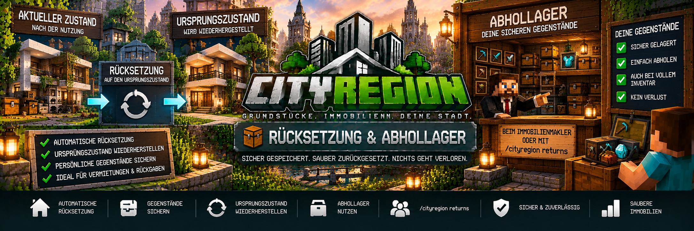

<link rel="stylesheet" href="style.css">



# 📦 Rücksetzung & Abhollager

CityRegion besitzt ein eigenes System zur **automatischen Rücksetzung von Immobilien**.

Damit können Grundstücke, Wohnungen und andere Immobilien nach einer Vermietung oder Rückgabe an den Staat wieder in ihren gespeicherten Ursprungszustand versetzt werden.

Persönliche Gegenstände der Spieler werden dabei vor der Rücksetzung gesichert und in das **Abhollager** übertragen.

Dadurch können Immobilien mehrfach verwendet werden, ohne dass persönliche Gegenstände verloren gehen.

---

## 🔄 Wie funktioniert die Rücksetzung?

Für eine CityRegion kann ein bestimmter Zustand als **Ursprungszustand** gespeichert werden.

Dieser Zustand dient später als Vorlage für die Wiederherstellung.

Der Ablauf sieht vereinfacht so aus:

```text
Ursprungszustand speichern
        ↓
Immobilie wird genutzt
        ↓
Spieler verändert die Immobilie
        ↓
Miete oder Besitz endet
        ↓
Persönliche Gegenstände sichern
        ↓
Region zurücksetzen
        ↓
Ursprungszustand wiederherstellen
```

Danach kann die Immobilie erneut verwendet, vermietet oder angeboten werden.

---

# 🏠 Ursprungszustand

Der Ursprungszustand beschreibt, wie eine Immobilie nach einer automatischen Rücksetzung wieder aussehen soll.

Beispielsweise kann eine vollständig eingerichtete Mietwohnung gespeichert werden:

```text
Wohnung-01

✓ Wände fertig
✓ Boden fertig
✓ Beleuchtung vorhanden
✓ Küche eingebaut
✓ Türen vorhanden
✓ Grundausstattung vorhanden
```

Ein Mieter kann die Wohnung anschließend während seiner Mietzeit nutzen.

Nach dem Mietende kann CityRegion wieder den gespeicherten Ausgangszustand herstellen.

---

# 💾 Ursprungszustand speichern

Stelle dich innerhalb der gewünschten Region und verwende:

```text
/cityregion setorigin
```

Damit wird der aktuelle Zustand der Region als neuer Ursprungszustand gespeichert.

> ⚠️ **Wichtig:**  
> Verwende `/cityregion setorigin` erst, wenn die Immobilie vollständig so eingerichtet ist, wie sie später nach einer Rücksetzung wieder aussehen soll.

---

# 🏗️ Wann sollte der Ursprung gespeichert werden?

Der Ursprungszustand sollte beispielsweise gespeichert werden:

- nach Fertigstellung eines Hauses
- nach Einrichtung einer Mietwohnung
- nach Fertigstellung einer Gewerbefläche
- nach Einrichtung eines Lagers
- bevor eine Immobilie erstmals vermietet wird
- bevor ein Grundstück für automatische Rücksetzungen verwendet wird

Dadurch besitzt CityRegion einen sauberen Ausgangszustand.

---

# ⚠️ Ursprung während einer Vermietung

Während eine aktive Vermietung besteht, sollte beziehungsweise kann der Ursprungszustand nicht einfach durch den aktuellen Zustand des Mieters ersetzt werden.

Dadurch wird verhindert, dass Veränderungen eines Mieters versehentlich dauerhaft als neuer Ausgangszustand gespeichert werden.

Der Ursprung sollte vom Eigentümer beziehungsweise Administrator verwaltet werden, wenn die Immobilie frei ist.

---

# 🔑 Rücksetzung nach Mietende

Eine wichtige Verwendung des Systems ist die Vermietung.

Nach dem Ende eines Mietvertrags kann CityRegion die Immobilie automatisch zurücksetzen.

Dabei passiert grundsätzlich:

1. der Mietvertrag endet
2. der Mieter verliert seine Regionsrechte
3. persönliche Gegenstände werden gesichert
4. der Ursprungszustand wird wiederhergestellt
5. gesicherte Gegenstände landen im Abhollager
6. das Mietobjekt wird wieder freigegeben
7. das Grundstücksschild wird aktualisiert
8. die Immobilie kann erneut vermietet werden

---

## 🏢 Beispiel einer Mietwohnung

Vor der Vermietung:

```text
Wohnung-01

Bett
Küche
Tische
Beleuchtung
Dekoration
```

Während der Mietzeit verändert der Spieler beispielsweise die Einrichtung und lagert eigene Gegenstände in Behältern.

Nach dem Mietende:

```text
Mietvertrag beendet
        ↓
Spielergegenstände sichern
        ↓
Wohnung zurücksetzen
        ↓
Ursprüngliche Einrichtung wiederherstellen
        ↓
Wohnung wieder verfügbar
```

Der nächste Mieter erhält dadurch wieder die vorgesehene Ausgangswohnung.

---

# 🏛️ Rücksetzung bei Rückgabe an den Staat

Die automatische Rücksetzung wird auch verwendet, wenn eine Immobilie an den Staat zurückgegeben wird.

Die Rückgabe erfolgt über:

```text
/cityregion returnstate
```

Nach einer erfolgreichen Rückgabe:

- wird die Region wieder staatlich
- wird der gespeicherte Ursprungszustand wiederhergestellt
- werden persönliche Gegenstände vorher gesichert
- landen gesicherte Gegenstände im Abhollager
- wird das staatliche Angebot wieder verfügbar
- kann die Immobilie erneut vergeben werden

---

# 📦 Persönliche Gegenstände sichern

Bevor CityRegion eine Region zurücksetzt, werden persönliche Gegenstände aus den vorgesehenen Behältern gesichert.

Dadurch sollen Gegenstände eines Spielers nicht einfach verschwinden, wenn die Immobilie auf ihren ursprünglichen Zustand zurückgesetzt wird.

Der Ablauf:

```text
Region soll zurückgesetzt werden
        ↓
Behälter prüfen
        ↓
Spielergegenstände sichern
        ↓
Gegenstände ins Abhollager übertragen
        ↓
Region zurücksetzen
```

---

# 🧰 Abhollager

Das **Abhollager** ist der sichere Aufbewahrungsort für Gegenstände, die CityRegion vor einer Regionsrücksetzung gerettet hat.

Dort können beispielsweise Gegenstände landen, die bei:

- einem Mietende
- einer Rückgabe an den Staat
- einer automatischen Wiederherstellung

aus der Immobilie gesichert wurden.

---

# 🧑‍💼 Abhollager beim Immobilienmakler

Spieler können ihr Abhollager über den **CityRegion-Immobilienmakler** erreichen.

Der Makler dient damit nicht nur zur Immobiliensuche und Verwaltung, sondern auch zur Rückgabe gesicherter Gegenstände.

Beispiel:

```text
Immobilienmakler
      ↓
Abhollager
      ↓
Gesicherte Gegenstände
      ↓
Spieler nimmt Gegenstände zurück
```

---

# ⌨️ Abhollager per Befehl

Zusätzlich kann das Abhollager mit folgendem Befehl geöffnet werden:

```text
/cityregion returns
```

Damit können vorhandene gesicherte Gegenstände abgeholt werden.

---

# 🎒 Inventar ist voll

Ist das Spielerinventar beim Abholen voll, gehen die übrigen Gegenstände nicht verloren.

Nicht entnommene Gegenstände bleiben im Abhollager gespeichert.

Der Spieler kann sie später erneut abholen.

Beispiel:

```text
Abhollager:
64 Eisen
32 Diamanten
64 Stein
20 Redstone

Spielerinventar voll
        ↓
Nur verfügbare Gegenstände entnehmen
        ↓
Rest bleibt gespeichert
```

Dadurch müssen Spieler ihr Inventar nicht vollständig leeren, bevor sie das Abhollager öffnen.

---

# 🔒 Gegenstände bleiben gespeichert

Das Abhollager ist dafür vorgesehen, gerettete Gegenstände dauerhaft aufzubewahren, bis der Spieler sie entnimmt.

Dadurch kann ein Spieler beispielsweise:

1. Mietwohnung verlieren
2. Gegenstände werden gesichert
3. Spieler ist gerade nicht online
4. Spieler kommt später wieder
5. Abhollager öffnen
6. Gegenstände abholen

Die Rücksetzung einer Immobilie ist dadurch nicht davon abhängig, ob der betroffene Spieler gerade online ist.

---

# 🏘️ Rücksetzung von Wohnungen

Das Rücksetzungssystem eignet sich besonders für Wohnungen.

Beispiel:

```text
Wohnhaus-A
├── Wohnung-01 → Ursprungszustand A
├── Wohnung-02 → Ursprungszustand B
├── Wohnung-03 → Ursprungszustand C
└── Wohnung-04 → Ursprungszustand D
```

Jede Wohnung ist eine eigene Unterregion.

Dadurch kann eine einzelne Wohnung zurückgesetzt werden, ohne das gesamte Gebäude zurücksetzen zu müssen.

---

# 🏢 Hauptregion bleibt bestehen

Bei einer Wohnung innerhalb eines größeren Gebäudes wird die entsprechende Unterregion verwaltet.

Beispiel:

```text
Wohnhaus-A
│
├── Treppenhaus
├── Wohnung-01
├── Wohnung-02
└── Wohnung-03
```

Endet nur der Mietvertrag von `Wohnung-02`, muss nicht automatisch das komplette `Wohnhaus-A` zurückgesetzt werden.

Die Wohnungsregion kann getrennt behandelt werden.

---

# 🏪 Gewerbeimmobilien

Auch Gewerbeimmobilien können einen gespeicherten Ursprungszustand besitzen.

Das eignet sich beispielsweise für:

- Ladenflächen
- Büros
- Werkstätten
- Lager
- Firmenräume

Eine vermietete Gewerbefläche kann nach Vertragsende wieder in den vorgesehenen Ausgangszustand versetzt werden.

---

# 📦 Lagerflächen

Bei Lagerimmobilien ist die Gegenstandssicherung besonders wichtig.

Befinden sich persönliche Gegenstände des Mieters in den vorgesehenen Behältern, werden diese vor der Rücksetzung gesichert.

Dadurch kann die Lagerregion anschließend zurückgesetzt werden, ohne die gesicherten Waren einfach zu löschen.

---

# 🏗️ Gebäude nach der Rücksetzung

Der gespeicherte Ursprungszustand kann unter anderem die bauliche Struktur einer Region wiederherstellen.

Dadurch können Veränderungen während einer Nutzung wieder entfernt werden.

Beispiel:

### Ursprünglich

```text
Weiße Wand
Holzboden
Küche
2 Türen
```

### Während der Nutzung

```text
Rote Wand
Steinboden
zusätzliche Blöcke
veränderte Einrichtung
```

### Nach Rücksetzung

```text
Weiße Wand
Holzboden
Küche
2 Türen
```

Die Immobilie entspricht anschließend wieder dem gespeicherten Ausgangszustand.

---

# 🧱 Warum ist das System nützlich?

Ohne automatische Rücksetzung müsste ein Vermieter eine Immobilie nach jedem Mieter manuell kontrollieren und reparieren.

Mit CityRegion kann der Ablauf automatisiert werden:

```text
Mieter zieht ein
      ↓
Mieter nutzt Immobilie
      ↓
Mietvertrag endet
      ↓
Gegenstände sichern
      ↓
Automatisch zurücksetzen
      ↓
Nächster Mieter
```

Das ist besonders hilfreich auf größeren Multiplayer- und Citybuild-Servern.

---

# 🪧 Grundstücksschilder nach der Rücksetzung

Nach einer entsprechenden Rücksetzung kann das vorhandene Grundstücksschild automatisch wieder den aktuellen Status der Immobilie anzeigen.

Bei einer Mietimmobilie kann sie anschließend wieder als frei angezeigt werden.

Bei einer Rückgabe an den Staat kann das staatliche Angebot wieder verfügbar werden.

Dadurch muss nicht jedes Schild nach einer Rücksetzung neu erstellt werden.

---

# 🏠 Beispiel: Kompletter Lebenszyklus einer Mietwohnung

## 1. Wohnung bauen

Der Eigentümer richtet die Wohnung vollständig ein.

```text
Wohnung-01
```

## 2. Ursprungszustand speichern

Innerhalb der Wohnung:

```text
/cityregion setorigin
```

## 3. Wohnung vermieten

Beispiel für das Mietschild:

```text
[Grundstück]
Miete
1000
7
```

Der Eigentümer registriert das Schild.

## 4. Spieler mietet die Wohnung

Der Mietvertrag beginnt.

Der Spieler erhält die vorgesehenen Regionsrechte.

## 5. Spieler nutzt die Wohnung

Der Mieter:

- verändert die Einrichtung
- verwendet Behälter
- lagert persönliche Gegenstände
- nutzt die Wohnung

## 6. Mietvertrag endet

CityRegion erkennt das Ende des Mietvertrags.

## 7. Gegenstände sichern

Persönliche Gegenstände werden aus den vorgesehenen Behältern gesichert.

## 8. Region zurücksetzen

CityRegion stellt den gespeicherten Ursprungszustand wieder her.

## 9. Gegenstände ins Abhollager

Die gesicherten Gegenstände werden dem Abhollager des ehemaligen Mieters hinzugefügt.

## 10. Wohnung wieder freigeben

Die Wohnung kann erneut vermietet werden.

---

# 📦 Beispiel: Gegenstände später abholen

Der ehemalige Mieter öffnet sein Abhollager:

```text
/cityregion returns
```

Dort befinden sich beispielsweise:

```text
64 Eisenbarren
12 Diamanten
32 Redstone
1 Diamantspitzhacke
18 Brot
```

Der Spieler kann die Gegenstände wieder entnehmen.

Ist sein Inventar voll, bleiben die übrigen Gegenstände für später gespeichert.

---

# 🏛️ Beispiel: Grundstück an Staat zurückgeben

Ein Eigentümer besitzt ein Grundstück und möchte es zurückgeben.

Innerhalb der Region verwendet er:

```text
/cityregion returnstate
```

Nach erfolgreicher Bestätigung:

```text
Eigentümer gibt Grundstück zurück
        ↓
CityRegion sichert persönliche Gegenstände
        ↓
Ursprungszustand wird wiederhergestellt
        ↓
Gegenstände landen im Abhollager
        ↓
Region wird wieder staatlich
        ↓
Grundstück kann erneut angeboten werden
```

---

# ⚠️ Vor `/cityregion setorigin`

Bevor ein neuer Ursprungszustand gespeichert wird, sollte die Immobilie sorgfältig kontrolliert werden.

Prüfe insbesondere:

- sind alle gewünschten Gebäudeteile vorhanden?
- ist die Einrichtung vollständig?
- befinden sich keine unerwünschten Blöcke in der Region?
- befinden sich keine persönlichen Gegenstände in der Vorlage?
- ist die richtige Region ausgewählt?

Denn genau dieser Zustand soll später wiederhergestellt werden.

---

# 🔎 Richtige Region prüfen

Vor dem Speichern des Ursprungszustands kann die aktuelle Region überprüft werden:

```text
/cityregion info
```

Das ist besonders bei Unterregionen wichtig.

Beispiel:

```text
Wohnhaus-A
└── Wohnung-01
```

Stelle sicher, dass CityRegion tatsächlich `Wohnung-01` erkennt, bevor deren Ursprungszustand gespeichert wird.

---

# 🛡️ Keine Gegenstände absichtlich löschen

Das Abhollager dient dazu, persönliche Gegenstände vor der automatischen Rücksetzung zu schützen.

Dadurch sollen Spieler nicht ihre gelagerten Gegenstände verlieren, nur weil ein Mietvertrag endet oder eine entsprechende Immobilie zurückgesetzt wird.

---

# 💻 Verbindung zum Real Estate OS

Das Rücksetzungs- und Abhollagersystem ergänzt das Real Estate OS.

Über das Immobiliensystem können Spieler ihre Immobilien und Mietverträge verwalten, während das Abhollager gerettete Gegenstände aufbewahrt.

Dadurch arbeiten mehrere CityRegion-Systeme zusammen:

```text
Real Estate OS
      │
      ├── Immobilien
      ├── Mietverträge
      ├── Wohnungen
      └── Immobilienverwaltung

Immobilienmakler
      │
      └── Abhollager
             │
             └── gerettete Gegenstände
```

---

# ❗ Häufige Probleme

## Meine Immobilie wurde nicht zurückgesetzt

Prüfe:

- existiert ein gespeicherter Ursprungszustand?
- ist der Mietvertrag tatsächlich beendet?
- handelt es sich um die richtige Region?
- wurde die entsprechende Rücksetzung ausgelöst?

Die Region kann mit:

```text
/cityregion info
```

kontrolliert werden.

---

## `/cityregion setorigin` funktioniert nicht

Prüfe:

- stehst du innerhalb der richtigen Region?
- besitzt du die erforderlichen Rechte?
- besteht aktuell eine aktive Vermietung?

Während einer aktiven Vermietung kann der Ursprungszustand nicht einfach neu gesetzt werden.

---

## Meine Gegenstände sind nach dem Mietende nicht mehr in der Wohnung

Das kann korrekt sein.

Vor der Rücksetzung können persönliche Gegenstände in das Abhollager übertragen werden.

Öffne:

```text
/cityregion returns
```

oder verwende das Abhollager beim Immobilienmakler.

---

## Mein Inventar war voll

Nicht entnommene Gegenstände bleiben im Abhollager gespeichert.

Leere etwas Platz im Inventar und öffne anschließend erneut:

```text
/cityregion returns
```

---

## Die falsche Wohnung wurde zurückgesetzt

Bei Gebäuden mit Unterregionen sollte geprüft werden, welche Region an der entsprechenden Position erkannt wird.

Verwende:

```text
/cityregion info
```

CityRegion verwendet bei verschachtelten Regionen die kleinste passende Region.

---

## Das Mietschild zeigt noch den alten Status

Nach einem ordnungsgemäßen Mietende und der entsprechenden Verarbeitung sollte das registrierte Grundstücksschild aktualisiert werden.

Prüfe:

- ist der Mietvertrag tatsächlich beendet?
- ist das Schild noch mit der richtigen Region verbunden?
- existiert die Region weiterhin korrekt?

---

# 💡 Empfohlener Ablauf für Vermieter

Für neue Mietimmobilien empfiehlt sich folgender Ablauf:

```text
1. Region erstellen
        ↓
2. Immobilie vollständig bauen
        ↓
3. Einrichtung fertigstellen
        ↓
4. /cityregion info prüfen
        ↓
5. /cityregion setorigin
        ↓
6. Mietpreis und Kaution festlegen
        ↓
7. Mietschild erstellen
        ↓
8. Immobilie vermieten
```

So besitzt CityRegion von Anfang an einen sauberen Zustand für spätere Rücksetzungen.

---

# ✅ Zusammenfassung

Das CityRegion-Rücksetzungssystem sorgt dafür, dass wiederverwendbare Immobilien sauber verwaltet werden können.

Es bietet:

- gespeicherte Ursprungszustände
- automatische Wiederherstellung
- Rücksetzung nach Mietende
- Rücksetzung bei Rückgabe an den Staat
- Sicherung persönlicher Gegenstände
- eigenes Abhollager
- Zugriff über den Immobilienmakler
- Zugriff über `/cityregion returns`
- Speicherung verbleibender Gegenstände bei vollem Inventar
- getrennte Rücksetzung einzelner Unterregionen

Damit können Wohnungen, Häuser und andere Immobilien immer wieder neu vergeben werden, ohne dass persönliche Gegenstände der vorherigen Nutzer einfach verloren gehen.

---

[← Zurück: Makler & Real Estate OS](cityregion-real-estate-os.md) | [Weiter: Grundstücksschilder →](cityregion-schilder.md)
