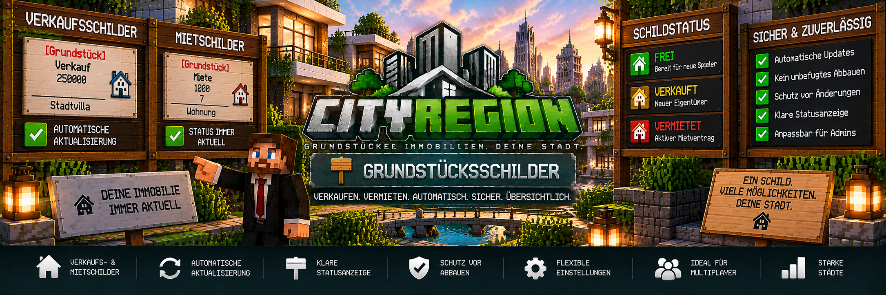

<link rel="stylesheet" href="style.css">



# 🪧 Grundstücksschilder

Mit den **Grundstücksschildern** von CityRegion können Immobilien direkt in der Minecraft-Welt zum Verkauf oder zur Vermietung angeboten werden.

Die Schilder sind mit einer CityRegion verbunden und zeigen automatisch den aktuellen Status der Immobilie an.

Damit können Spieler direkt am Grundstück erkennen, ob eine Immobilie:

- zum Verkauf steht
- zur Vermietung angeboten wird
- bereits verkauft wurde
- aktuell vermietet ist
- wieder verfügbar geworden ist

Die Schilder aktualisieren sich automatisch, wenn sich der Status der zugehörigen Immobilie ändert.

---

## 🏠 Grundstücksschilder

Ein Grundstücksschild gehört immer zu einer bestimmten CityRegion.

Dadurch kann das Schild Informationen über die zugehörige Immobilie anzeigen und für Kauf- beziehungsweise Mietvorgänge verwendet werden.

Typische Einsatzmöglichkeiten sind:

- Häuser
- Wohnungen
- Gewerbeimmobilien
- Lager
- Industriegrundstücke
- Bauland
- staatliche Immobilien
- private Immobilien

---

# 💰 Verkaufsschilder

Mit einem Verkaufsschild kann eine Immobilie zum Kauf angeboten werden.

Ein Verkaufsschild wird mit folgendem Grundaufbau erstellt:

```text
[Grundstück]
Verkauf
25000
```

Dabei steht:

```text
[Grundstück] → CityRegion-Grundstücksschild
Verkauf      → Verkaufsangebot
25000        → Verkaufspreis
```

Der Preis wird über das CityRegion- und MineBank-System verarbeitet.

---

## 🏡 Beispiel für ein Verkaufsschild

Ein Grundstück soll für `125000` angeboten werden:

```text
[Grundstück]
Verkauf
125000
```

Nach der Registrierung des Schildes verbindet CityRegion das Verkaufsangebot mit der entsprechenden Region.

Das Schild kann anschließend automatisch weitere Informationen zur Immobilie beziehungsweise zum aktuellen Status darstellen.

---

# 🏛️ Staatliche Verkaufsschilder

Administratoren können staatliche Immobilien zum Verkauf anbieten.

Bei einem erfolgreichen staatlichen Verkauf geht das Geld über MineBank an die **Staatskasse**.

Der Ablauf:

```text
Spieler
   ↓
Grundstücksschild
   ↓
Kauf bestätigen
   ↓
MineBank
   ↓
Staatskasse
   ↓
Spieler wird Eigentümer
```

Nach dem erfolgreichen Kauf wird der Status des Grundstücksschildes automatisch aktualisiert.

---

# 👤 Private Verkäufe

Auch bereits im Besitz eines Spielers befindliche Immobilien können weiterverkauft werden.

Bei einem privaten Verkauf erhält der bisherige Eigentümer den Verkaufspreis.

```text
Käufer
   ↓
MineBank
   ↓
Verkäufer
   ↓
Eigentümerwechsel
```

Gebäude und vorhandene Inhalte bleiben bei einem normalen privaten Eigentümerwechsel bestehen.

Die Immobilie wird dabei nicht automatisch auf ihren Ursprungszustand zurückgesetzt.

---

# 💬 Kaufbestätigung

Ein Grundstück wird nicht sofort durch einen versehentlichen Klick gekauft.

CityRegion verwendet für Grundstückskäufe eine **anklickbare Bestätigung im Chat**.

Der Spieler erhält zunächst Informationen zum Kauf und muss den Vorgang anschließend bestätigen.

Dadurch wird verhindert, dass eine teure Immobilie versehentlich gekauft wird.

Beispiel:

```text
Grundstück: Stadtvilla
Preis:      250.000

[Kauf bestätigen]
```

Erst nach der erfolgreichen Bestätigung und MineBank-Zahlung wird der Eigentümerwechsel durchgeführt.

---

# 🏦 MineBank beim Grundstückskauf

CityRegion verwendet **MineBank 1.0.2 oder neuer** für die Zahlungsabwicklung.

Vor einem Kauf wird geprüft, ob der Spieler über ausreichend Guthaben verfügt.

Nur wenn die Zahlung erfolgreich durchgeführt werden kann, wird die Immobilie übertragen.

Dadurch werden:

```text
Zahlung
+
Eigentümerwechsel
```

gemeinsam verarbeitet.

---

# 🔑 Mietschilder

Neben Verkaufsschildern können Grundstücksschilder auch für Mietangebote verwendet werden.

Ein Mietangebot enthält einen Mietpreis und eine Mietdauer.

Beispiel:

```text
[Grundstück]
Miete
1000
7
```

Dabei bedeutet:

```text
[Grundstück] → CityRegion-Grundstücksschild
Miete        → Mietangebot
1000         → Mietpreis
7            → Mietdauer
```

Die festgelegte Dauer bestimmt, wie lange der Mietvertrag läuft.

---

# 🏢 Beispiel für eine Mietwohnung

Eine Wohnung soll für einen festgelegten Zeitraum vermietet werden.

Das Schild könnte beispielsweise so vorbereitet werden:

```text
[Grundstück]
Miete
1500
7
```

Nach erfolgreicher Registrierung gehört das Schild zur entsprechenden Wohnungsregion.

Ein Spieler kann das Mietangebot anschließend verwenden.

---

# 💳 Mietzahlung

Die Mietzahlung wird über MineBank abgewickelt.

Bei einer privaten Immobilie geht die Zahlung an den Vermieter.

Bei einer staatlichen Immobilie geht die entsprechende Zahlung an die Staatskasse.

Beispiel:

```text
Private Vermietung

Mieter
  ↓
MineBank
  ↓
Vermieter
```

Bei einer staatlichen Immobilie:

```text
Mieter
  ↓
MineBank
  ↓
Staatskasse
```

---

# 💰 Kaution

CityRegion unterstützt bei Mietverträgen optional eine **Kaution**.

Dadurch kann ein Vermieter neben dem eigentlichen Mietpreis eine zusätzliche Kaution festlegen.

Die Kaution gehört zum Mietvertrag und kann nach einem ordnungsgemäßen Mietende entsprechend dem Mietsystem zurückgegeben werden.

Die bereits bezahlte normale Miete wird bei einer vorzeitigen Kündigung dagegen nicht zurückerstattet.

---

# ⏳ Mietdauer

Die Mietdauer wird zusammen mit dem Mietangebot gespeichert.

Nach dem erfolgreichen Abschluss des Mietvertrags kennt CityRegion:

- Mietbeginn
- Mietende
- verbleibende Mietdauer
- Mietpreis
- gegebenenfalls Kaution
- automatische Verlängerung

Ab **3 verbleibenden Tagen** kann CityRegion den Mieter vor dem bevorstehenden Mietende warnen.

---

# 🔄 Mietvertrag verlängern

Ein bestehender Mietvertrag kann verlängert werden.

Dabei wird die zusätzliche Mietdauer an den vorhandenen Vertrag angehängt.

Wenn die automatische Verlängerung aktiviert wurde, kann CityRegion die nächste Mietperiode automatisch verlängern, sofern die erforderliche Zahlung durchgeführt werden kann.

---

# ❌ Mietvertrag vorzeitig beenden

Ein Mieter kann seinen eigenen Mietvertrag vorzeitig beenden.

Dafür steht:

```text
/cityregion cancelrent
```

zur Verfügung.

Bei einer vorzeitigen Kündigung:

- endet der Mietvertrag
- verliert der Mieter seine Mietrechte
- die normale bereits gezahlte Miete wird nicht zurückerstattet
- eine vorhandene Kaution kann entsprechend dem Mietsystem zurückgegeben werden
- die Immobilie kann zurückgesetzt werden
- das Grundstücksschild wird wieder aktualisiert

---

# 🔄 Automatische Schildaktualisierung

Ein wichtiger Bestandteil der CityRegion-Grundstücksschilder ist die automatische Aktualisierung.

Das Schild passt sich an den aktuellen Zustand der Immobilie an.

Beispielsweise:

```text
FREI
 ↓
VERKAUFT
```

oder:

```text
FREI
 ↓
VERMIETET
 ↓
FREI
```

Dadurch muss ein Schild nicht nach jedem Eigentümer- oder Mieterwechsel manuell neu erstellt werden.

---

# 🟢 Freie Immobilie

Ist eine Immobilie verfügbar, kann das Grundstücksschild entsprechend als frei beziehungsweise verfügbar angezeigt werden.

Beispiel:

```text
[Grundstück]

Stadtvilla

VERKAUF
250.000

FREI
```

Der genaue Inhalt wird durch das CityRegion-System automatisch aktualisiert.

---

# 🟡 Verkaufte Immobilie

Wurde eine Immobilie erfolgreich verkauft, ändert sich der Status.

Beispiel:

```text
[Grundstück]

Stadtvilla

VERKAUFT
```

Dadurch erkennen Spieler direkt, dass die Immobilie nicht mehr als freies staatliches Verkaufsangebot verfügbar ist.

---

# 🔴 Vermietete Immobilie

Bei einem aktiven Mietvertrag kann das Schild entsprechend anzeigen, dass die Immobilie aktuell vermietet ist.

Beispiel:

```text
[Grundstück]

Wohnung-01

VERMIETET
```

Nach dem Ende des Mietvertrags kann das Schild automatisch wieder auf den verfügbaren Mietstatus wechseln.

---

# 🔁 Immobilie wird wieder frei

Endet eine Vermietung ordnungsgemäß, kann CityRegion:

1. den Mietvertrag beenden
2. die Mietrechte entfernen
3. persönliche Gegenstände sichern
4. die Region zurücksetzen
5. das Mietobjekt wieder freigeben
6. das Grundstücksschild aktualisieren

Dadurch kann dieselbe Immobilie anschließend erneut vermietet werden.

---

# 🏛️ Rückgabe an den Staat

Gibt ein Eigentümer seine Immobilie an den Staat zurück, wird auch das Grundstücksschild entsprechend aktualisiert.

Die Rückgabe erfolgt über:

```text
/cityregion returnstate
```

Nach erfolgreicher Rückgabe kann:

- der Ursprungszustand wiederhergestellt werden
- persönlicher Besitz gesichert werden
- die Region wieder staatlich werden
- das staatliche Angebot wieder verfügbar werden
- das Grundstücksschild wieder den freien Status anzeigen

---

# 🛡️ Schutz der Grundstücksschilder

Registrierte CityRegion-Grundstücksschilder sind gegen unbefugtes Abbauen geschützt.

Normale Spieler können ein aktives Grundstücksschild nicht einfach zerstören.

Dadurch können Verkaufs- oder Mietangebote nicht von anderen Spielern entfernt werden.

Das ist besonders wichtig auf öffentlichen Multiplayer-Servern.

---

# 👑 OPs und Administratoren

Administratoren beziehungsweise OPs besitzen zusätzliche Möglichkeiten zur Verwaltung von Grundstücksschildern.

Ein freies Grundstücksschild kann von einem entsprechend berechtigten Administrator entfernt werden.

Bei Schildern, die zu einer:

- verkauften Immobilie
- vermieteten Immobilie
- anderweitig belegten Immobilie

gehören, verwendet CityRegion eine zusätzliche Bestätigung.

Dadurch wird verhindert, dass ein aktives Schild versehentlich entfernt wird.

---

# ⚠️ Bestätigung beim Entfernen

Soll ein belegtes Grundstücksschild durch einen Administrator entfernt werden, verlangt CityRegion zunächst eine Bestätigung.

Der Ablauf:

```text
Administrator versucht Schild zu entfernen
        ↓
CityRegion erkennt aktives/belegtes Schild
        ↓
Bestätigung wird angefordert
        ↓
Administrator bestätigt
        ↓
Schild wird entfernt
```

Wird die Bestätigung abgebrochen, bleibt das Schild erhalten.

---

# 🛡️ Abgebrochener Schildabbau

CityRegion schützt die Schildanzeige auch dann, wenn ein Administrator einen begonnenen Entfernungsvorgang nicht bestätigt.

Ein abgebrochener Linksklick beziehungsweise eine nicht bestätigte Entfernung soll den Schildtext nicht dauerhaft löschen.

Das Schild bleibt weiterhin mit seiner Immobilie verbunden und kann seinen korrekten Status anzeigen.

---

# 🔗 Verbindung zwischen Schild und Region

Ein Grundstücksschild wird mit der zugehörigen CityRegion verbunden.

Dadurch kennt das Schild die Immobilie, zu der es gehört.

Diese Verbindung ermöglicht unter anderem:

- automatische Statusanzeige
- Kaufangebote
- Mietangebote
- Eigentümerwechsel
- Mietstatus
- automatische Wiederfreigabe
- Schutz des Schildes

---

# 🏠 Hauptregionen und Unterregionen

Grundstücksschilder können auch für Unterregionen verwendet werden.

Das ist besonders wichtig bei Gebäuden mit mehreren Wohnungen.

Beispiel:

```text
Wohnhaus-A
│
├── Wohnung-01 → eigenes Mietschild
├── Wohnung-02 → eigenes Mietschild
├── Wohnung-03 → eigenes Mietschild
└── Wohnung-04 → eigenes Mietschild
```

Jede Wohnung kann dadurch unabhängig von den anderen Wohnungen angeboten werden.

---

# 🏢 Mehrfamilienhäuser

Bei einem größeren Wohngebäude kann jede Wohnung als eigene Unterregion angelegt werden.

Beispiel:

```text
WOHNHAUS-A

Wohnung-01
Miete: 1.000
Status: VERMIETET

Wohnung-02
Miete: 1.250
Status: FREI

Wohnung-03
Miete: 900
Status: FREI
```

Die einzelnen Grundstücksschilder aktualisieren sich entsprechend dem Zustand der jeweiligen Wohnung.

---

# 🏪 Gewerbeimmobilien

Grundstücksschilder können ebenfalls für Gewerbeimmobilien verwendet werden.

Beispiele:

- Ladenflächen
- Büros
- Werkstätten
- Lagerhallen
- Firmengebäude
- Industrieflächen

Eine Gewerbeimmobilie kann dadurch direkt vor Ort verkauft oder vermietet werden.

---

# 🏗️ Bauland

Auch unbebaute Grundstücke können über Grundstücksschilder angeboten werden.

Beispiel:

```text
[Grundstück]
Verkauf
75000
```

Damit können Spieler beispielsweise ein freies Baugrundstück erwerben und anschließend selbst bebauen.

---

# 🏷️ Immobilieninformationen

CityRegion kann zusätzliche Informationen zur Immobilie verwalten.

Dazu gehören unter anderem:

- Immobilienname
- Immobilienart
- Eigentümer
- Mieter
- Grundstücksgröße
- Lagefaktor
- Gebäudewert
- Richtwert
- Markttrend
- Bauphase

Das Grundstücksschild konzentriert sich auf die für das jeweilige Angebot wichtigen Informationen.

Ausführlichere Daten können über das **Real Estate OS** eingesehen werden.

---

# 💻 Verbindung zum Real Estate OS

Grundstücksschilder und das Real Estate OS arbeiten mit denselben CityRegion-Immobilien.

Dadurch kann ein Spieler eine Immobilie beispielsweise zuerst über den Immobilienmakler finden und anschließend direkt vor Ort das Grundstücksschild verwenden.

Beispiel:

```text
Real Estate OS
      ↓
Immobilie suchen
      ↓
Besichtigung
      ↓
Grundstück ansehen
      ↓
Grundstücksschild
      ↓
Kaufen / Mieten
```

---

# 🧑‍💼 Verbindung zum Immobilienmakler

Der Immobilienmakler dient als zentrale Such- und Verwaltungsstelle.

Grundstücksschilder bilden dagegen die direkte Verbindung zur Immobilie in der Minecraft-Welt.

Damit ergänzen sich beide Systeme:

```text
IMMOBILIENMAKLER
Zentrale Suche & Verwaltung

        +

GRUNDSTÜCKSSCHILDER
Direkte Interaktion am Grundstück
```

---

# 🔎 Region vor dem Schild prüfen

Vor dem Erstellen beziehungsweise Registrieren eines Grundstücksschildes sollte geprüft werden, ob die richtige CityRegion erkannt wird.

Verwende:

```text
/cityregion info
```

Das ist besonders bei mehreren Unterregionen wichtig.

Beispiel:

```text
Wohnhaus-A
└── Wohnung-02
```

Das Schild für `Wohnung-02` muss mit der richtigen Unterregion verbunden werden.

---

# 📋 Beispiel: Grundstück verkaufen

Ein Grundstück soll für `250000` verkauft werden.

## 1. Region prüfen

Stelle dich in die entsprechende Region:

```text
/cityregion info
```

## 2. Verkaufsschild vorbereiten

```text
[Grundstück]
Verkauf
250000
```

## 3. Schild registrieren

Das Schild wird der entsprechenden CityRegion zugeordnet.

## 4. Käufer verwendet das Schild

Der Spieler erhält die Kaufinformationen und die Bestätigung.

## 5. MineBank prüft die Zahlung

Ist ausreichend Guthaben vorhanden, kann der Kauf abgeschlossen werden.

## 6. Eigentümerwechsel

Der Käufer wird neuer Eigentümer.

## 7. Schild aktualisiert sich

Das Grundstücksschild zeigt anschließend den neuen Zustand der Immobilie.

---

# 📋 Beispiel: Wohnung vermieten

Eine Wohnung soll für `1000` für den vorgesehenen Mietzeitraum angeboten werden.

## 1. Wohnungsregion prüfen

```text
/cityregion info
```

## 2. Ursprungszustand vorbereiten

Vor der ersten Vermietung sollte die Wohnung vollständig eingerichtet sein.

Anschließend:

```text
/cityregion setorigin
```

## 3. Mietschild erstellen

```text
[Grundstück]
Miete
1000
7
```

## 4. Spieler mietet die Wohnung

Die Zahlung wird über MineBank durchgeführt und der Mietvertrag beginnt.

## 5. Schild zeigt Vermietung

Der Status wird automatisch angepasst.

## 6. Mietvertrag endet

Nach dem Mietende kann CityRegion:

- persönliche Gegenstände sichern
- die Wohnung zurücksetzen
- das Mietobjekt freigeben
- das Schild aktualisieren

## 7. Wohnung erneut anbieten

Das bestehende Schild kann wieder den freien Mietstatus anzeigen.

---

# ❗ Häufige Probleme

## Das Schild wird nicht als Grundstücksschild erkannt

Prüfe:

- wurde `[Grundstück]` korrekt geschrieben?
- befindet sich das Schild bei der richtigen CityRegion?
- wurde die Region korrekt erstellt?
- besitzt du die notwendigen Rechte?
- ist CityRegion korrekt geladen?

---

## Das Verkaufsschild funktioniert nicht

Prüfe:

- existiert die zugehörige Region?
- ist die Immobilie überhaupt zum Verkauf freigegeben?
- ist der Preis gültig?
- besitzt der Käufer genügend MineBank-Guthaben?
- ist die Immobilie bereits verkauft?

---

## Das Mietschild funktioniert nicht

Prüfe:

- ist die Immobilie zur Vermietung freigegeben?
- existiert bereits ein aktiver Mietvertrag?
- sind Mietpreis und Mietdauer gültig?
- besitzt der Spieler genügend MineBank-Guthaben?
- ist die richtige Region mit dem Schild verbunden?

---

## Das Schild zeigt noch „VERMIETET“

Prüfe:

- ist der Mietvertrag tatsächlich beendet?
- wurde das Mietende vollständig verarbeitet?
- ist die Region wieder freigegeben?
- ist das Schild noch korrekt mit der Region verbunden?

Nach einem ordnungsgemäßen Mietende sollte das Schild wieder aktualisiert werden.

---

## Spieler können das Schild nicht abbauen

Das ist beabsichtigt.

Registrierte Grundstücksschilder sind gegen unbefugtes Entfernen geschützt.

Dadurch können Spieler Verkaufs- und Mietangebote anderer Grundstücke nicht zerstören.

---

## Als OP kann ich ein belegtes Schild nicht sofort entfernen

Das ist ebenfalls beabsichtigt.

Bei verkauften, vermieteten oder anderweitig belegten Grundstücksschildern verlangt CityRegion eine zusätzliche Bestätigung.

Damit wird ein versehentliches Entfernen verhindert.

---

## Nach abgebrochener Entfernung war der Schildtext kurz verändert

CityRegion stellt sicher, dass ein nicht bestätigter Entfernungsvorgang das registrierte Schild nicht dauerhaft unbrauchbar macht.

Die Verbindung zur Region und die Statusanzeige bleiben erhalten beziehungsweise werden wieder aktualisiert.

---

# 🏙️ Beispiel für eine Immobilienstraße

Eine Serverstadt könnte Grundstücksschilder beispielsweise so einsetzen:

```text
HAUPTSTRASSE

Haus 1
[Grundstück]
VERKAUF
125.000

Haus 2
[Grundstück]
VERKAUFT

Wohnhaus A
├── Wohnung 1 → VERMIETET
├── Wohnung 2 → FREI
└── Wohnung 3 → FREI

Gewerbe 1
[Grundstück]
MIETE
2.500

Bauland 1
[Grundstück]
VERKAUF
75.000
```

Dadurch erkennen Spieler direkt in der Spielwelt, welche Immobilien aktuell verfügbar sind.

---

# ✅ Zusammenfassung

Die CityRegion-Grundstücksschilder verbinden das Immobiliensystem direkt mit der Minecraft-Welt.

Sie bieten:

- Verkaufsschilder
- Mietschilder
- staatliche Immobilienangebote
- private Immobilienangebote
- MineBank-Zahlungen
- Kaufbestätigung
- automatische Statusaktualisierung
- Anzeige von frei, verkauft und vermietet
- automatische Wiederfreigabe nach Mietende
- Unterstützung für Haupt- und Unterregionen
- Schutz vor unbefugtem Abbauen
- zusätzliche Bestätigung für Administratoren
- automatische Aktualisierung nach Eigentümer- oder Mietänderungen

Damit können Spieler direkt an einer Immobilie erkennen, ob sie verfügbar ist und sie dort kaufen beziehungsweise mieten.

---

[← Zurück: Rücksetzung & Abhollager](cityregion-ruecksetzung.md) | [Weiter: Adminfunktionen →](cityregion-admin.md)
