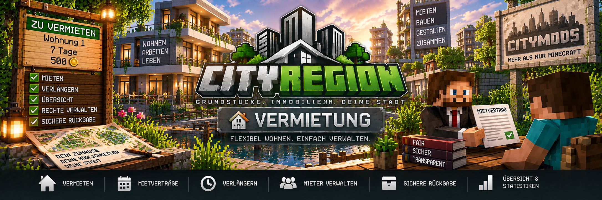

<link rel="stylesheet" href="style.css">



# 🔑 Vermietung & Mietverträge

Mit CityRegion können Grundstücke, Wohnungen und andere Immobilien zeitlich begrenzt vermietet werden.

Eigentümer bestimmen Mietpreis und Mietdauer. Zusätzlich können eine Kaution und die automatische Verlängerung eingerichtet werden.

Alle Zahlungen werden über **MineBank** abgewickelt.

---

## 🏠 Immobilien vermieten

Ein Eigentümer kann seine Region über ein registriertes Grundstücksschild zur Miete anbieten.

Das Mietschild wird folgendermaßen beschriftet:

```text
[Grundstück]
Miete
500
7
```

Dabei gilt:

- Zeile 1: `[Grundstück]`
- Zeile 2: `Miete`
- Zeile 3: Mietpreis
- Zeile 4: Mietdauer in Tagen

Die erlaubte Mietdauer beträgt:

```text
1 bis 365 Tage
```

Anschließend muss der Eigentümer das Schild mit **Rechtsklick registrieren**.

---

## 📍 Position des Mietschilds

Das Grundstücksschild muss:

- innerhalb der zugehörigen Region
- oder unmittelbar neben der Region

platziert werden.

CityRegion verbindet das registrierte Schild anschließend mit der entsprechenden Immobilie.

---

## 🔒 Schutz des Mietschilds

Registrierte Grundstücksschilder sind geschützt.

Normale Spieler können sie nicht einfach abbauen.

Während einer aktiven Vermietung wird das Schild automatisch von CityRegion aktualisiert und zeigt die verbleibende Mietdauer an.

---

# 🧑‍💼 Immobilie mieten

Ein Spieler kann eine angebotene Immobilie über das Mietschild mieten.

Dazu:

1. Mietschild anklicken
2. Mietinformationen prüfen
3. `[Mieten]` im Chat auswählen
4. MineBank prüft das Guthaben
5. Mietpreis und gegebenenfalls Kaution werden abgebucht
6. der Mietvertrag wird gestartet
7. der Spieler erhält die entsprechenden Regionsrechte

Während der Mietdauer kontrolliert der Mieter die gemietete Region entsprechend den vorgesehenen Rechten.

---

## 💳 Zahlung über MineBank

Mietzahlungen werden über **MineBank** abgewickelt.

Bei einer privaten Immobilie geht die Miete direkt an den Eigentümer.

Bei einer staatlichen Immobilie geht die Zahlung an die MineBank-Staatskasse.

### Private Vermietung

```text
Mieter
   ↓
MineBank
   ↓
Eigentümer
```

### Staatliche Vermietung

```text
Mieter
   ↓
MineBank
   ↓
Staatskasse
```

---

# 💰 Mietkaution

Eigentümer können zusätzlich zum Mietpreis eine Kaution festlegen.

Stelle dich dafür innerhalb der Region auf und verwende:

```text
/cityregion deposit <Betrag>
```

Beispiel:

```text
/cityregion deposit 500
```

Beim Beginn des Mietvertrags wird die Kaution zusätzlich zur ersten Miete eingezogen.

---

## 💵 Beispiel mit Kaution

Angenommen, eine Wohnung kostet:

```text
Miete:     1.000
Kaution:     500
```

Beim Abschluss des Mietvertrags werden insgesamt:

```text
1.500
```

vom Konto des Mieters benötigt.

Die Kaution wird getrennt von der normalen Mietzahlung behandelt.

---

## ↩️ Kaution zurückerhalten

Bei regulärem Mietende oder Kündigung wird die Kaution zurückgezahlt.

Die normale bereits bezahlte Miete wird dadurch nicht rückgängig gemacht.

---

# 🔄 Automatische Verlängerung

Für eine Region kann die automatische Verlängerung aktiviert werden.

Aktivieren:

```text
/cityregion autorenew true
```

Deaktivieren:

```text
/cityregion autorenew false
```

Ist die automatische Verlängerung aktiv und das Konto ausreichend gedeckt, wird die nächste Mietperiode bezahlt und an den bestehenden Mietvertrag angehängt.

---

## 💳 Nicht genügend Guthaben

Für eine automatische Verlängerung muss ausreichend Guthaben vorhanden sein.

Kann die nächste Mietperiode nicht bezahlt werden, kann die automatische Verlängerung nicht erfolgreich durchgeführt werden.

---

# ➕ Mietvertrag manuell verlängern

Der aktuelle Mieter kann seinen Mietvertrag auch manuell verlängern.

Dazu klickt der Mieter erneut auf das zugehörige Mietschild.

CityRegion bietet anschließend im Chat die Möglichkeit zur Verlängerung an.

Nach erfolgreicher Zahlung wird die zusätzliche Mietperiode an den bestehenden Vertrag angehängt.

---

# ⏳ Verbleibende Mietdauer

Während einer aktiven Vermietung zeigt CityRegion die verbleibende Mietzeit auf dem Grundstücksschild an.

Dadurch kann direkt am Grundstück erkannt werden, wie lange der aktuelle Mietvertrag noch läuft.

---

# 🚪 Als Mieter kündigen

Ein Mieter kann seinen eigenen Mietvertrag vorzeitig beenden.

Dazu muss er folgenden Befehl verwenden:

```text
/cityregion cancelrent
```

Nach der Kündigung endet die Kontrolle des Mieters über die Region.

Die bereits bezahlte normale Miete wird nicht zurückerstattet.

Eine vorhandene Kaution wird entsprechend dem Mietsystem zurückgezahlt.

---

# 🏠 Als Eigentümer Miete beenden

Der Eigentümer kann eine aktive Vermietung ebenfalls beenden.

Dafür muss der Eigentümer innerhalb der vermieteten Region stehen.

Verwende:

```text
/cityregion endrent
```

Administratoren können diese Funktion ebenfalls verwenden.

---

# 🔄 Was passiert nach dem Mietende?

Nach dem Ende eines Mietvertrags führt CityRegion mehrere Schritte automatisch durch.

- der Mieter verliert seine Regionsrechte
- der gespeicherte Ursprungszustand wird wiederhergestellt
- persönliche Gegenstände aus Behältern werden gesichert
- gesicherte Gegenstände werden ins Abhollager übertragen
- eine vorhandene Kaution wird zurückgezahlt
- das Mietschild wird wieder freigeschaltet
- die Immobilie kann erneut vermietet werden

Dadurch kann dieselbe Immobilie nach einem Mietvertrag wieder in ihrem vorgesehenen Ausgangszustand angeboten werden.

---

# 📦 Ursprungszustand der Immobilie

CityRegion speichert beim Erstellen einer Region einen Ursprungszustand.

Dieser Zustand kann nach dem Mietende wiederhergestellt werden.

Ein Eigentümer kann den aktuellen Zustand seiner Immobilie als neuen Ursprung festlegen:

```text
/cityregion setorigin
```

> ⚠️ Der Ursprungszustand sollte erst gespeichert werden, wenn die Immobilie vollständig eingerichtet ist.

Der Befehl kann nicht verwendet werden, während eine aktive Vermietung besteht.

---

# 📦 Gegenstände des Mieters

Bevor CityRegion die Immobilie zurücksetzt, werden Gegenstände aus Behältern gesichert.

Dadurch sollen persönliche Gegenstände des Mieters nicht durch die Wiederherstellung verloren gehen.

Die gesicherten Gegenstände landen im **Abhollager**.

Der Spieler kann dieses über den Immobilienmakler oder mit folgendem Befehl öffnen:

```text
/cityregion returns
```

Die Rücksetzung und das Abhollager werden auf der entsprechenden Dokumentationsseite genauer erklärt.

---

# 🏢 Wohnungen vermieten

Unterregionen eignen sich besonders gut für Mietwohnungen.

Ein Eigentümer eines größeren Grundstücks kann beispielsweise mehrere Wohnungen als getrennte Unterregionen erstellen:

```text
Wohnhaus-A
├── Wohnung-01
├── Wohnung-02
├── Wohnung-03
└── Wohnung-04
```

Jede Wohnung kann anschließend unabhängig vermietet werden.

Dadurch können in einem einzigen Gebäude mehrere getrennte Mietobjekte betrieben werden.

---

## 🏗️ Wohnung erstellen

Eine Wohnung wird wie eine normale Unterregion ausgewählt.

Beispiel:

```text
/cityregion pos1
/cityregion pos2
/cityregion expand 0 4
/cityregion selection
/cityregion preview
/cityregion create Wohnung-01
```

Anschließend kann die Wohnung optional einem Gebäude zugeordnet werden:

```text
/cityregion building Wohnhaus-A
```

---

## 💰 Kaution für die Wohnung festlegen

Stelle dich in die Wohnung und verwende beispielsweise:

```text
/cityregion deposit 500
```

---

## 🔄 Automatische Verlängerung erlauben

Innerhalb der Wohnung:

```text
/cityregion autorenew true
```

Anschließend kann das Mietschild erstellt und registriert werden.

---

# 🏛️ Staatliche Mietobjekte

Auch staatliche Grundstücke können vermietet werden.

Bei staatlichen Mietobjekten gehen folgende Zahlungen an die MineBank-Staatskasse:

- normale Mietzahlungen
- Verlängerungen staatlicher Mietverträge

Private Mietzahlungen gehen dagegen direkt an den jeweiligen Eigentümer.

---

# 👤 Rechte während der Miete

Ein Mieter erhält für die Dauer des Mietvertrags die Kontrolle über die gemietete Region.

Bei Unterregionen verwendet CityRegion die kleinste passende Region.

Dadurch kann beispielsweise eine gemietete Wohnung eigene Rechte besitzen, obwohl sie innerhalb eines größeren Wohngebäudes liegt.

Nach dem Mietende werden die Mietrechte wieder entfernt.

---

# 🪧 Mietschild nach dem Mietende

Nach dem Ende des Mietvertrags wird das zugehörige Mietschild wieder freigeschaltet.

Die Immobilie kann anschließend erneut angeboten und von einem anderen Spieler gemietet werden.

Dadurch muss für jeden neuen Mieter nicht erneut ein komplett neues Grundstück angelegt werden.

---

# ℹ️ Mietobjekt überprüfen

Informationen zur Region am aktuellen Standort können mit folgendem Befehl angezeigt werden:

```text
/cityregion info
```

Damit kann geprüft werden, ob man sich tatsächlich innerhalb der gewünschten Region beziehungsweise Wohnung befindet.

---

# ❗ Häufige Probleme

## Das Mietschild wird nicht erkannt

Prüfe:

- wurde die Region bereits erstellt?
- steht das Schild innerhalb oder direkt neben der Region?
- wurde das Schild korrekt beschriftet?
- wurde das Schild vom Eigentümer mit Rechtsklick registriert?

Der Aufbau muss beispielsweise so aussehen:

```text
[Grundstück]
Miete
500
7
```

---

## „Das Schild muss in oder direkt an einer Region stehen“

Prüfe zunächst mit:

```text
/cityregion info
```

ob sich das Schild tatsächlich innerhalb oder unmittelbar neben einer bestehenden Region befindet.

Bei Wohnungen sollte zusätzlich geprüft werden, ob die Unterregion wirklich erstellt wurde.

---

## Mieter kann die Immobilie nicht mieten

Prüfe:

- besitzt der Spieler genügend MineBank-Guthaben?
- ist das Mietschild korrekt registriert?
- ist die Immobilie aktuell frei?
- liegt der Mietpreis innerhalb der verfügbaren Kontodeckung?
- wird zusätzlich eine Kaution verlangt?

---

## Automatische Verlängerung funktioniert nicht

Prüfe:

- ist die automatische Verlängerung aktiviert?
- besitzt der Mieter genügend MineBank-Guthaben?
- besteht der Mietvertrag noch?
- ist die Region weiterhin korrekt mit dem Mietangebot verbunden?

Aktivieren:

```text
/cityregion autorenew true
```

---

## Eigentümer kann die Miete nicht beenden

Der Eigentümer muss sich innerhalb der vermieteten Region befinden.

Verwende dort:

```text
/cityregion endrent
```

---

# 💡 Beispiel: Wohnung komplett zur Miete anbieten

### 1. Wohnung auswählen

```text
/cityregion pos1
/cityregion pos2
```

### 2. Höhe festlegen

```text
/cityregion expand 0 4
```

### 3. Auswahl prüfen

```text
/cityregion selection
/cityregion preview
```

### 4. Wohnung erstellen

```text
/cityregion create Wohnung-01
```

### 5. Gebäude zuordnen

```text
/cityregion building Wohnhaus-A
```

### 6. Kaution festlegen

```text
/cityregion deposit 500
```

### 7. Automatische Verlängerung aktivieren

```text
/cityregion autorenew true
```

### 8. Mietschild erstellen

```text
[Grundstück]
Miete
1000
7
```

### 9. Schild registrieren

Als Eigentümer das Schild mit **Rechtsklick** registrieren.

Die Wohnung kann anschließend von einem Spieler gemietet werden.

---

[← Zurück: Kaufen & Verkaufen](cityregion-kaufen-verkaufen.md) | [Weiter: Gebäude & Wohnungen →](cityregion-gebaeude-wohnungen.md)
