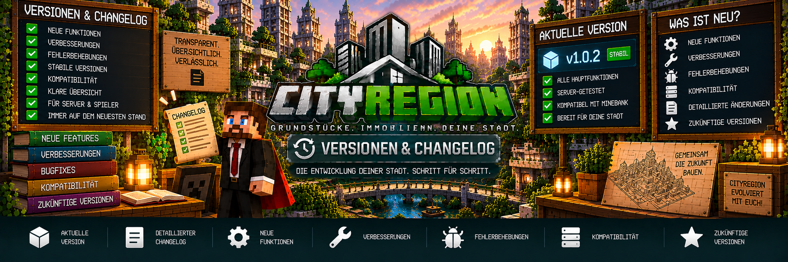

<link rel="stylesheet" href="style.css">



# 📋 Versionen & Changelog

Auf dieser Seite findest du eine Übersicht über die veröffentlichten **CityRegion-Versionen** und die wichtigsten Änderungen.

CityRegion wird kontinuierlich weiterentwickelt. Neue Funktionen, Verbesserungen und Fehlerbehebungen werden hier dokumentiert.

---

# 🆕 Aktuelle Version

## CityRegion 2.0.0

**Minecraft:** 1.20.1  
**Modloader:** Forge  
**Forge-Version:** 47.4.10  
**Abhängigkeit:** MineBank 1.0.2 oder neuer  
**Installation:** Client und Server

CityRegion ist ein umfangreiches Grundstücks- und Immobiliensystem für Minecraft-Server.

Die aktuelle Version bietet nicht nur einfachen Regionsschutz, sondern ein vollständiges Immobiliensystem mit Grundstücken, Wohnungen, Vermietung, Auktionen, Immobilienwerten und dem Real Estate OS.

---

# 🏙️ Grundstücke & Regionen

CityRegion unterstützt quaderförmige Regionen für Grundstücke und Immobilien.

Enthalten sind:

- Hauptregionen
- Unterregionen
- eigene Regionsauswahl mit `pos1` und `pos2`
- optionale WorldEdit-Auswahl
- maximal 500.000 Blöcke pro Region
- Schutz vor ungültigen Überschneidungen
- Unterstützung mehrerer Dimensionen
- automatische Speicherung der Regionen
- Schutz nach Serverneustarts

Regionen können unter anderem für:

- Grundstücke
- Häuser
- Wohnungen
- Gewerbeflächen
- Lager
- Industrieflächen
- Bauland
- Gemeinschaftsbereiche

verwendet werden.

---

# 🛡️ Regionsschutz

CityRegion schützt Immobilien vor unberechtigten Spielern.

Geschützt werden unter anderem:

- Blöcke abbauen
- Blöcke platzieren
- Behälter öffnen
- Türen verwenden

Eigentümer können anderen Spielern gezielt Zugriff auf ihre Immobilie geben.

---

# 👥 Mitglieder & Rechte

Eigentümer können Mitglieder zu ihren Immobilien hinzufügen.

Die Rechte können getrennt vergeben werden für:

- Bauen und Abbauen
- Behälter
- Türen, Falltüren und Tore

Dadurch muss ein Mitglied nicht automatisch vollständigen Zugriff auf die gesamte Immobilie erhalten.

---

# 💰 Kaufen & Verkaufen

Grundstücke können über CityRegion verkauft werden.

Unterstützt werden:

- staatliche Grundstücksverkäufe
- private Grundstücksverkäufe
- anklickbare Kaufbestätigung
- MineBank-Zahlungen
- automatische Eigentümerwechsel
- Weiterverkauf von Immobilien
- Rückgabe an den Staat

Bei staatlichen Verkäufen geht das Geld an die MineBank-Staatskasse.

Bei privaten Verkäufen erhält der vorherige Eigentümer das Geld.

---

# 🏛️ Rückgabe an den Staat

Eigentümer können Immobilien wieder an den Staat zurückgeben.

Dafür steht:

```text
/cityregion returnstate
```

zur Verfügung.

Der staatliche Rückkauf erfolgt zu einem reduzierten Rückkaufpreis.

Der Rückkauf kann nur durchgeführt werden, wenn die Staatskasse über ausreichend Guthaben verfügt.

Bei einer entsprechenden Rückgabe kann die Immobilie anschließend wieder in ihren gespeicherten Ursprungszustand versetzt werden.

---

# 🔑 Vermietung

CityRegion besitzt ein vollständiges Mietsystem.

Unterstützt werden:

- Mietangebote über Grundstücksschilder
- zeitlich begrenzte Mietverträge
- Mietpreis
- Mietdauer
- optionale Kaution
- gespeicherter Vertragsbeginn
- gespeichertes Vertragsende
- Anzeige der verbleibenden Mietdauer
- Mietverlängerung
- automatische Verlängerung
- vorzeitige Kündigung
- Beendigung durch Eigentümer oder Administratoren

Ab drei verbleibenden Tagen kann der Mieter vor dem bevorstehenden Mietende gewarnt werden.

---

# ❌ Vorzeitige Kündigung

Mieter können ihren eigenen Mietvertrag mit:

```text
/cityregion cancelrent
```

vorzeitig beenden.

Die bereits gezahlte normale Miete wird bei einer vorzeitigen Kündigung nicht zurückerstattet.

Eine vorhandene Kaution kann entsprechend dem Mietsystem zurückgegeben werden.

---

# 🏢 Gebäude & Wohnungen

CityRegion unterstützt größere Gebäude mit mehreren einzelnen Immobilien.

Beispiel:

```text
Wohnhaus-A
├── Wohnung-01
├── Wohnung-02
├── Wohnung-03
└── Wohnung-04
```

Eine Hauptregion kann dabei das gesamte Gebäude darstellen.

Die einzelnen Wohnungen werden als Unterregionen verwaltet.

Dadurch können Wohnungen unabhängig voneinander:

- verkauft
- vermietet
- verwaltet
- zurückgesetzt

werden.

---

# 🚪 Gemeinschaftsbereiche

Gebäude können gemeinsame Bereiche besitzen.

Beispiele:

- Treppenhäuser
- Eingangsbereiche
- Flure
- Innenhöfe
- Gemeinschaftsräume

Eine entsprechende Region kann als Gemeinschaftsbereich festgelegt werden.

Dadurch können Bewohner beispielsweise gemeinsame Türen verwenden, ohne vollständige Rechte für die gesamte Hauptregion zu besitzen.

---

# 🏷️ Immobilienarten

Administratoren können Immobilien einer bestimmten Nutzung zuordnen.

CityRegion unterstützt:

```text
Wohnen
Gewerbe
Industrie
Lager
Bauland
Gemeinschaftsfläche
```

Dadurch können Immobilien übersichtlich nach ihrer vorgesehenen Verwendung organisiert werden.

---

# 🏗️ Bauphasen

CityRegion unterstützt Bauphasen für Immobilien.

Damit können Grundstücke und Gebäude entsprechend ihrem aktuellen Entwicklungsstand verwaltet werden.

Das eignet sich beispielsweise für:

- Bauland
- laufende Bauprojekte
- noch nicht fertiggestellte Immobilien
- fertiggestellte Gebäude

Die Bauphase kann auch innerhalb des Immobiliensystems dargestellt werden.

---

# 📈 Immobilienwerte

CityRegion besitzt ein eigenes System für Immobilienwerte.

Berücksichtigt werden können unter anderem:

- Grundstücksfläche
- Lagefaktor
- offizieller Gebäudewert
- letzter Verkaufspreis

Daraus kann ein Richtwert für eine Immobilie berechnet beziehungsweise angezeigt werden.

---

# 📊 Markttrend

CityRegion speichert Informationen zur Wertentwicklung einer Immobilie.

Der Markttrend kann beispielsweise anzeigen:

```text
↑ steigend
↓ fallend
→ stabil
```

Dadurch erhalten Spieler zusätzliche Informationen über die Entwicklung einer Immobilie.

---

# 🔨 Immobilienauktionen

CityRegion unterstützt Auktionen für Immobilien.

Eine Auktion kann unter anderem besitzen:

- Startgebot
- Laufzeit
- aktuelles Höchstgebot
- aktuellen Höchstbietenden

Spieler können während der Laufzeit Gebote abgeben.

---

# 💰 Gebundenes Auktionsgeld

Wird ein Spieler Höchstbietender, wird der entsprechende Betrag für die Auktion gebunden.

Wird der Spieler anschließend überboten, erhält er sein vorher gebundenes Geld zurück.

Beispiel:

```text
Spieler A bietet 100.000
        ↓
Spieler B bietet 125.000
        ↓
Spieler A erhält 100.000 zurück
```

---

# 🏆 Auktionsende

Nach einem erfolgreichen Auktionsende wird der Höchstbietende automatisch Eigentümer der Immobilie.

Bei einer privaten Auktion erhält der Verkäufer das Geld.

Bei einer staatlichen Auktion geht das Geld an die Staatskasse.

Auktionen können außerdem abgebrochen werden.

Ein bereits gebundener Betrag wird dabei entsprechend zurückgegeben.

---

# 🧑‍💼 Immobilienmakler

CityRegion besitzt einen eigenen Immobilienmakler.

Administratoren können:

- einen vorhandenen Villager als Makler registrieren
- einen eigenen Makler-NPC erstellen
- einen Makler wieder entfernen

Der Makler ist:

- unbeweglich
- unverwundbar
- gegen Rückstoß geschützt

Dadurch kann er dauerhaft als zentrale Anlaufstelle für das Immobiliensystem verwendet werden.

---

# 💻 Real Estate OS

Der Immobilienmakler bietet Zugriff auf das **Real Estate OS**.

Dort können Spieler unter anderem:

- verfügbare Immobilien suchen
- eigene Immobilien anzeigen
- gemietete Immobilien anzeigen
- Immobilien besichtigen
- zu eigenen Immobilien gelangen
- Mietverträge verwalten
- Immobilienwerte ansehen
- Markttrends ansehen
- Gebäude und Wohnungen verwalten
- Mieteinnahmen ansehen
- Auktionen ansehen
- Grundstückslizenzen verwalten

---

# 🗺️ Immobilienkarte

Das Real Estate OS besitzt eine statusbasierte Immobilienkarte.

Dadurch können Immobilien und deren aktueller Status übersichtlich dargestellt werden.

Zusätzlich stehen scrollbare Listen für größere Immobilienbestände zur Verfügung.

---

# 🪪 Grundstückslizenzen

CityRegion unterstützt Grundstückslizenzen.

Verfügbare Lizenzgrößen sind:

```text
2 Grundstücke
5 Grundstücke
10 Grundstücke
```

Dadurch kann gesteuert werden, wie viele Immobilien ein Spieler besitzen darf.

Die Grundstückslizenzen werden über das Immobilienmakler-System verwaltet.

---

# 🔄 Rücksetzung von Immobilien

CityRegion kann den ursprünglichen Zustand einer Region speichern.

Dafür steht:

```text
/cityregion setorigin
```

zur Verfügung.

Der gespeicherte Zustand kann später automatisch wiederhergestellt werden.

Das ist besonders für Mietobjekte wichtig.

---

# 📦 Gegenstandssicherung

Bevor eine entsprechende Region zurückgesetzt wird, können persönliche Gegenstände aus den vorgesehenen Behältern gesichert werden.

Dadurch sollen persönliche Waren nicht einfach durch die automatische Wiederherstellung verloren gehen.

Die gesicherten Gegenstände werden in das persönliche CityRegion-Abhollager übertragen.

---

# 🧰 Abhollager

Das persönliche Abhollager kann über den Immobilienmakler oder mit:

```text
/cityregion returns
```

erreicht werden.

Ist das Spielerinventar voll, bleiben nicht entnommene Gegenstände im Abhollager gespeichert.

Sie können später erneut abgeholt werden.

---

# 🪧 Grundstücksschilder

CityRegion unterstützt Grundstücksschilder für:

- Verkauf
- Vermietung

Die Schilder sind direkt mit der entsprechenden Immobilie verbunden.

Sie können ihren Status automatisch aktualisieren.

Beispiele:

```text
FREI
```

```text
VERKAUFT
```

```text
VERMIETET
```

---

# 🛡️ Schutz der Grundstücksschilder

Registrierte Grundstücksschilder sind gegen unbefugtes Entfernen geschützt.

Normale Spieler können diese Schilder nicht einfach zerstören.

Administratoren beziehungsweise OPs können freie Schilder entfernen.

Bei verkauften, vermieteten oder anderweitig belegten Schildern wird eine zusätzliche Bestätigung verlangt.

Ein abgebrochener Entfernungsvorgang soll den Schildtext nicht dauerhaft entfernen.

---

# 👑 Adminverwaltung

CityRegion bietet Administratoren umfangreiche Verwaltungsfunktionen.

Admins können unter anderem:

- Hauptregionen erstellen
- alle Regionen anzeigen
- zu Regionen teleportieren
- Eigentümer zuweisen
- Eigentümer entfernen
- staatliche Verkaufsangebote verwalten
- staatliche Mietangebote verwalten
- Immobilienarten festlegen
- Lagefaktoren festlegen
- Gebäudewerte festlegen
- Gemeinschaftsbereiche verwalten
- Bauphasen verwalten
- reine Mietobjekte festlegen
- Immobilienmakler verwalten
- Grundstücksschilder verwalten

---

# 🏪 Gewerbe & CityShops

Gewerbeimmobilien können optional einer CityShops-Firma beziehungsweise Filiale zugeordnet werden.

Dadurch können Server, die sowohl CityRegion als auch CityShops verwenden, Gewerbeflächen mit Unternehmen verbinden.

> **CityShops ist keine Pflichtabhängigkeit von CityRegion.**

CityRegion kann unabhängig von CityShops verwendet werden.

---

# 🏦 MineBank

CityRegion benötigt:

```text
MineBank 1.0.2 oder neuer
```

MineBank übernimmt die finanziellen Funktionen.

Dazu gehören unter anderem:

- Grundstückskäufe
- private Grundstücksverkäufe
- staatliche Grundstücksverkäufe
- Mietzahlungen
- Kautionen
- Mietverlängerungen
- Auktionen
- Grundstückslizenzen
- Staatskasse

CityRegion besitzt deshalb kein eigenes zusätzliches Banksystem.

---

# 🌍 WorldEdit

WorldEdit kann für die Regionsauswahl verwendet werden.

CityRegion besitzt jedoch zusätzlich eine eigene Zwei-Punkt-Auswahl.

Dadurch ist WorldEdit **optional** und keine zwingende Voraussetzung für das Erstellen einer Region.

Die eigene Auswahl erfolgt über:

```text
/cityregion pos1
/cityregion pos2
```

---

# ⌨️ Wichtige Befehle

Zu den wichtigen CityRegion-Befehlen gehören:

```text
/cityregion pos1
/cityregion pos2
/cityregion selection
/cityregion preview
/cityregion create <Name>
/cityregion info
/cityregion building <Name>
/cityregion common true
/cityregion common false
/cityregion setorigin
/cityregion cancelrent
/cityregion returnstate
/cityregion returns
```

Eine ausführliche Erklärung findest du unter:

[Befehle](cityregion-befehle.md)

---

# 🔧 Verbesserungen & Fehlerbehebungen

Die aktuelle CityRegion-Version enthält außerdem verschiedene Verbesserungen für die vorhandenen Systeme.

Dazu gehören unter anderem:

- zuverlässigere Regionsverwaltung
- Speicherung der Immobilien nach Serverneustarts
- Verwaltung von Haupt- und Unterregionen
- Schutz vor ungültigen Regionsüberschneidungen
- verbesserte Verwaltung von Mietobjekten
- automatische Aktualisierung von Grundstücksschildern
- sichere Behandlung belegter Grundstücksschilder
- Schutz des Immobilienmaklers
- Speicherung von Mietverträgen
- Speicherung von Auktionsdaten
- Speicherung von Immobilienwerten
- Sicherung persönlicher Gegenstände vor entsprechenden Rücksetzungen
- persistentes Abhollager
- getrennte Mitgliederrechte

---

# 🔗 Kompatibilität

## Minecraft

```text
Minecraft 1.20.1
```

## Modloader

```text
Forge
```

## Forge-Version

```text
47.4.10
```

## MineBank

```text
MineBank 1.0.2 oder neuer
```

## WorldEdit

```text
Optional
```

## CityShops

```text
Optional
```

CityShops wird nur für die optionale Verbindung von Gewerbeimmobilien mit CityShops-Unternehmen beziehungsweise Filialen benötigt.

---

# 📚 Dokumentation

Die vollständige CityRegion-Dokumentation besteht aus:

- [Installation](cityregion-installation.md)
- [Grundstücke erstellen & schützen](cityregion-grundstuecke.md)
- [Kaufen & Verkaufen](cityregion-kaufen-verkaufen.md)
- [Vermietung & Mietverträge](cityregion-vermietung.md)
- [Gebäude & Wohnungen](cityregion-gebaeude-wohnungen.md)
- [Immobilienarten & Immobilienwerte](cityregion-immobilienwerte.md)
- [Immobilienauktionen](cityregion-auktionen.md)
- [Mitglieder & Rechte](cityregion-mitglieder-rechte.md)
- [Makler & Real Estate OS](cityregion-real-estate-os.md)
- [Rücksetzung & Abhollager](cityregion-ruecksetzung.md)
- [Grundstücksschilder](cityregion-schilder.md)
- [Adminfunktionen](cityregion-admin.md)
- [Befehle](cityregion-befehle.md)
- [Häufige Fragen](cityregion-haeufige-fragen.md)

---

# 🔮 Zukünftige Versionen

CityRegion soll auch zukünftig weiter ausgebaut werden.

Geplante Ideen werden getrennt vom Changelog in der **CityRegion-Roadmap** gesammelt.

Dadurch bleibt diese Seite auf tatsächlich vorhandene beziehungsweise veröffentlichte Funktionen beschränkt.

Zu den für zukünftige Versionen geplanten Bereichen gehören unter anderem:

- bessere Regionswerkzeuge
- vertikales Erweitern von Regionsauswahlen
- Stadtteile
- Straßen und Hausnummern
- vollständige Immobilienadressen
- digitales Grundbuch
- erweiterter Immobilienmarkt
- erweiterte Bauprojekte
- optionale Nutzungsvorschriften
- erweiterte Eigentumsmodelle
- temporäre Zugriffsrechte
- Kurzzeitvermietung und Hotels
- Erweiterungen des Real Estate OS
- zusätzliche Benachrichtigungen
- erweiterte Vermieterstatistiken
- CityRegion API

Diese Funktionen gehören zur Roadmap und sind **nicht automatisch Bestandteil der aktuellen Version**.

---

# 📝 Versionsübersicht

| Version | Minecraft | Status | Beschreibung |
|---|---|---|---|
| **2.0.0** | 1.20.1 | Aktuell | Umfangreiches Grundstücks- und Immobiliensystem |
| **1.0.0** | 1.20.1 | Frühere Version | Erste CityRegion-Version |

---

# ⚠️ Update-Hinweis

Vor einem größeren CityRegion-Update wird grundsätzlich empfohlen, eine Sicherung der Welt und der Serverdaten anzulegen.

Besonders wichtig sind Sicherungen bei Servern mit:

- vielen Grundstücken
- aktiven Mietverträgen
- mehreren Gebäuden und Wohnungen
- laufenden Auktionen
- umfangreichen Immobilienbeständen

Dadurch kann bei Problemen jederzeit auf den vorherigen Zustand zurückgegriffen werden.

---

# ✅ Aktueller Funktionsumfang

CityRegion bietet in der aktuellen Version unter anderem:

- Grundstücke und Regionsschutz
- Haupt- und Unterregionen
- Kauf und Verkauf
- staatliche und private Immobilien
- Vermietung
- Mietverträge
- Kautionen
- automatische Mietverlängerung
- Gebäude und Wohnungen
- Gemeinschaftsbereiche
- Immobilienarten
- Immobilienwerte
- Markttrends
- Immobilienauktionen
- Mitglieder und getrennte Rechte
- Immobilienmakler
- Real Estate OS
- Immobilienkarte
- Grundstückslizenzen
- automatische Regionsrücksetzung
- Gegenstandssicherung
- Abhollager
- Grundstücksschilder
- Adminverwaltung
- MineBank-Integration
- optionale WorldEdit-Unterstützung
- optionale CityShops-Verknüpfung

Damit bildet CityRegion ein umfangreiches Immobilien- und Grundstückssystem für Minecraft-Server.

---

[← Zurück: Häufige Fragen](cityregion-haeufige-fragen.md) | [Zurück zu CityRegion →](cityregion.md)
