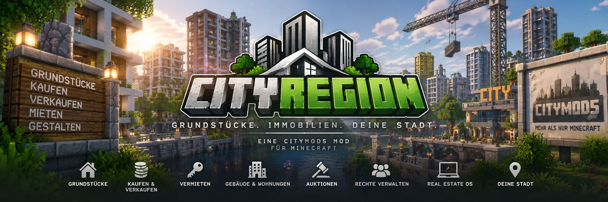

<link rel="stylesheet" href="style.css">

# 🏠 CityRegion

**CityRegion** ist ein umfangreiches Grundstücks- und Immobiliensystem für Minecraft-Server.

Mit CityRegion können Grundstücke erstellt, geschützt, gekauft, verkauft, vermietet, unterteilt und versteigert werden. Gebäude, Wohnungen, Mitgliederrechte und Immobilien können über das Real Estate OS verwaltet werden.

---

## 🆕 Aktuelle Version

### CityRegion 2.1.0

**Minecraft:** 1.20.1  
**Modloader:** Forge  
**Forge-Version:** 47.4.10 oder neuer innerhalb 1.20.1  
**Abhängigkeit:** MineBank 1.0.2 oder neuer  
**WorldEdit:** Optional  
**Installation:** Client und Server

CityRegion **2.1.0** bietet ein umfangreiches System zur Verwaltung von Grundstücken und Immobilien.

Enthalten sind unter anderem:

- geschützte Haupt- und Unterregionen
- eigene Zwei-Punkte-Regionsauswahl
- optionale WorldEdit-Unterstützung
- grafische Regionsvorschau
- Grundstückskauf und -verkauf
- staatliche und private Grundstücke
- zeitlich begrenzte Vermietung
- Mietkautionen
- automatische Mietverlängerung
- Gebäude und Wohnungen
- Grundstücksauktionen
- Mitglieder und getrennte Grundstücksrechte
- Immobilienwerte und Marktinformationen
- Immobilienmakler
- Immobilien-PC
- Real Estate OS
- MineBank-Staatskasse
- Grundstückslizenzen
- automatische Wiederherstellung von Immobilien
- Abhollager für gesicherte Gegenstände

> **MineBank wird benötigt.**  
> Ohne MineBank startet CityRegion nicht.
>
> WorldEdit ist optional, da CityRegion eine eigene Zwei-Punkte-Auswahl besitzt.

---

## 📖 Dokumentation

### 🚀 [Installation](cityregion-installation.md)
Installation, Voraussetzungen und Aktualisierung von CityRegion.

### 🗺️ [Grundstücke erstellen & schützen](cityregion-grundstuecke.md)
Regionen auswählen, erstellen, erweitern, verkleinern und schützen.

### 💰 [Kaufen & Verkaufen](cityregion-kaufen-verkaufen.md)
Staatliche und private Grundstückskäufe, Verkäufe und die Rückgabe an den Staat.

### 🔑 [Vermietung & Mietverträge](cityregion-vermietung.md)
Mietpreise, Mietdauer, Kautionen, Verlängerungen und Kündigungen.

### 🏢 [Gebäude & Wohnungen](cityregion-gebaeude-wohnungen.md)
Gebäude, Unterregionen, Wohnungen und Gemeinschaftsbereiche verwalten.

### 🏷️ [Immobilienarten & Immobilienwerte](cityregion-immobilienwerte.md)
Immobilientypen, Lagefaktor, Gebäudewert und weitere Immobilieninformationen.

### 🔨 [Immobilienauktionen](cityregion-auktionen.md)
Grundstücke versteigern, Gebote abgeben und Auktionen verwalten.

### 👥 [Mitglieder & Rechte](cityregion-mitglieder-rechte.md)
Spieler hinzufügen und getrennte Bau-, Behälter- und Türrechte vergeben.

### 🧑‍💼 [Makler & Real Estate OS](cityregion-real-estate-os.md)
Immobiliensuche, Immobilienmakler, Immobilien-PC und zentrale Immobilienverwaltung.

### 📦 [Rücksetzung & Abhollager](cityregion-ruecksetzung.md)
Ursprungszustände von Immobilien und die Sicherung persönlicher Gegenstände.

### 🪧 [Grundstücksschilder](cityregion-schilder.md)
Verkaufs-, Miet- und Auktionsschilder erstellen und verwenden.

### 🛠️ [Adminfunktionen](cityregion-admin.md)
Regionen, Eigentümer, Immobilientypen, Lagefaktoren und weitere Einstellungen verwalten.

### ⌨️ [Befehle](cityregion-befehle.md)
Übersicht über die verfügbaren CityRegion-Befehle.

### ❓ [Häufige Fragen](cityregion-haeufige-fragen.md)
Antworten auf häufige Fragen und Lösungen für bekannte Probleme.

### 📋 [Versionen & Changelog](cityregion-versionen.md)
Übersicht über CityRegion-Versionen, Änderungen und neue Funktionen.

---

## ✅ Weiterhin enthalten

CityRegion **2.1.0** enthält die bestehenden Grundstücks- und Immobiliensysteme:

- Hauptregionen und Unterregionen
- maximale Regionsgröße von 500.000 Blöcken
- Regionsschutz
- eigene Zwei-Punkte-Auswahl
- WorldEdit-Unterstützung
- vertikales und horizontales Erweitern von Auswahlen
- Verkleinern von Auswahlen
- grafische Regionsvorschau
- staatliche Grundstücke
- private Grundstücksverkäufe
- Grundstücksvermietung
- Mietkautionen
- automatische Mietverlängerung
- Wohnungen als Unterregionen
- Gebäude und Gemeinschaftsbereiche
- Grundstücksauktionen
- Mitgliederverwaltung
- getrennte Bau-, Behälter- und Türrechte
- Immobilienarten
- Lagefaktor und Gebäudewert
- Immobilienwerte und Marktinformationen
- Immobilienmakler
- Immobilien-PC
- Real Estate OS
- Grundstückslizenzen
- Besichtigungsteleport
- MineBank-Staatskasse
- Rückgabe von Grundstücken an den Staat
- Wiederherstellung des Ursprungszustands
- Abhollager für gesicherte Gegenstände
- optionale Firmenzuordnung für Gewerbeimmobilien

---

## 🔮 Zukünftige Updates

CityRegion wird auch nach Version **2.1.0** weiterentwickelt.

Für zukünftige Versionen sind unter anderem weitere Erweiterungen rund um Immobilienverwaltung, Stadtteile, Adressen, das Real Estate OS und zusätzliche Verwaltungsfunktionen geplant.

Weitere Funktionen und Anleitungen werden mit zukünftigen CityRegion-Versionen ergänzt.

---

[← Zurück zur CityMods Wiki](./)
