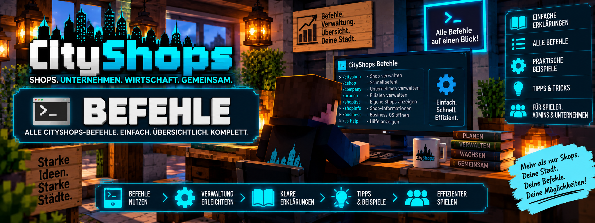

<link rel="stylesheet" href="style.css">



# ⌨️ CityShops – Befehle

Auf dieser Seite findest du die dokumentierten Befehle von **CityShops**.

Die Befehle sind nach Bereichen sortiert, damit du schnell findest, was du für Shops, Unternehmen, Bewertungen, Statistiken oder die Unternehmensverwaltung benötigst.

---

# 🛒 Shop-Befehle

## 🔗 Bewertungsschild mit Shop verbinden

```text
/chestshop link
```

Startet die Verknüpfung eines persönlichen Shops mit einem `[Bewertung]`-Schild.

### Verwendung

1. Stelle ein Schild mit `[Bewertung]` auf.
2. Führe den Befehl aus.
3. Klicke deinen Shop an.
4. Klicke anschließend das Bewertungsschild an.

Danach ist das Bewertungsschild mit dem Shop verbunden.

---

## 🏷️ Shop benennen

```text
/chestshop name <Name>
```

Ermöglicht es dir, deinem eigenen Shop einen Namen zu geben.

### Beispiel

```text
/chestshop name Martiniis Markt
```

Anschließend klickst du deinen eigenen Shop an.

Der ausgewählte Shop erhält danach den angegebenen Namen.

---

## ⭐ Shop bewerten

```text
/chestshop rate <1-5>
```

Startet eine Bewertung über einen Befehl.

Die Bewertung muss zwischen **1 und 5 Sternen** liegen.

### Beispiel

```text
/chestshop rate 5
```

Anschließend klickst du den Shop an, den du bewerten möchtest.

> Eine Bewertung ist nur nach einem echten Handel möglich. Eigene Shops beziehungsweise die eigene Firma können nicht selbst bewertet werden.

---

## 📊 Eigene Handelsstatistik

```text
/chestshop stats
```

Zeigt deine persönliche Handelsstatistik an.

CityShops zeichnet bei echten Handelsvorgängen unter anderem folgende Werte auf:

- Anzahl der Transaktionen
- gehandelte Itemmenge
- Umsatz

---

## 📜 Shop-Verlauf prüfen

```text
/chestshop history
```

Dieser Befehl ist für **OP-Spieler** vorgesehen.

Nach dem Ausführen klickst du das Shopschild an, dessen Handelsverlauf du überprüfen möchtest.

CityShops speichert pro Shop die letzten:

```text
50 Handelsvorgänge
```

---

# 🏢 Unternehmens-Befehle

CityShops besitzt ein eigenes Unternehmenssystem.

Ein Unternehmen kann gemeinsame Shops besitzen und verwendet ein eigenes MineBank-Firmenkonto.

Mit **CityShops 2.3.0** wurden die Unternehmensbefehle um zusätzliche Verwaltungsfunktionen für Shop-IDs, interne Namen, Abteilungen, Vorlagen, Mitarbeiterrollen, Rechte und Aktivitäten erweitert.

---

## 🏢 Unternehmen erstellen

```text
/company create <Name>
```

Erstellt ein neues Unternehmen und das zugehörige MineBank-Firmenkonto.

### Beispiel

```text
/company create Martiniis Markt
```

Vorhandene persönliche Shops werden beim Gründen des Unternehmens automatisch übernommen.

Neue Shops von Unternehmensmitgliedern werden anschließend automatisch dem Unternehmen zugeordnet.

---

## ✏️ Unternehmen umbenennen

```text
/company rename <Neuer Name>
```

Ändert den Namen des Unternehmens.

Geladene Firmenshop-Schilder werden dabei ebenfalls entsprechend aktualisiert.

### Beispiel

```text
/company rename City Markt
```

Diese Funktion steht dem Firmenbesitzer zur Verfügung.

---

## ℹ️ Unternehmensinformationen

```text
/company info
```

Zeigt Informationen über dein Unternehmen an.

Dazu gehören:

- Firmenname
- Anzahl der Mitarbeiter
- Firmenkontostand

---

# 👥 Mitarbeiter verwalten

## ➕ Mitarbeiter hinzufügen

```text
/company add <Spieler>
```

Fügt einen Spieler als Mitarbeiter zum Unternehmen hinzu.

Der Spieler muss dafür **online** sein.

### Beispiel

```text
/company add Spielername
```

Die Mitarbeiterverwaltung ist dem Firmenbesitzer vorbehalten.

---

## ➖ Mitarbeiter entfernen

```text
/company remove <Spieler>
```

Entfernt einen Mitarbeiter aus dem Unternehmen.

### Beispiel

```text
/company remove Spielername
```

Auch dieser Befehl gehört zur Mitarbeiterverwaltung des Firmenbesitzers.

---

## 🚪 Unternehmen verlassen

```text
/company leave
```

Mit diesem Befehl kann ein Mitarbeiter das Unternehmen verlassen.

> Der Firmenbesitzer kann sein Unternehmen nicht einfach mit `/company leave` verlassen.

---

# 👥 Mitarbeiterrollen

Mit **CityShops 2.3.0** können Mitarbeitern verschiedene Rollen innerhalb des Unternehmens zugewiesen werden.

Verfügbare Rollen:

```text
geschaeftsfuehrer
filialleiter
lagerist
einkaeufer
verkaeufer
buchhalter
pruefer
```

## Rolle vergeben

```text
/company role set SPIELER filialleiter
```

### Beispiel

```text
/company role set Spielername filialleiter
```

Damit erhält der angegebene Mitarbeiter die Rolle `filialleiter`.

> 💡 Der Firmenbesitzer besitzt automatisch sämtliche Rechte und benötigt keine zusätzliche Mitarbeiterrolle.

---

# 🔐 Einzelne Mitarbeiterrechte

Neben den Rollen können mit CityShops 2.3.0 auch einzelne Mitarbeiterrechte vergeben oder entzogen werden.

Verfügbare Rechte:

| Recht | Funktion |
| --- | --- |
| `shops` | Shops verwalten |
| `prices` | Preise bearbeiten |
| `stock` | Warenbestand verwalten |
| `templates` | Shop-Vorlagen speichern und anwenden |
| `departments` | Abteilungen verwalten |
| `statistics` | Firmenstatistiken ansehen |
| `activity` | Aktivitätsprotokoll ansehen |

## ➕ Recht vergeben

```text
/company permission set SPIELER templates true
```

### Beispiel

```text
/company permission set Spielername templates true
```

Dadurch erhält der Mitarbeiter das Recht, Shop-Vorlagen zu verwenden.

---

## ➖ Recht entziehen

```text
/company permission set SPIELER templates false
```

### Beispiel

```text
/company permission set Spielername templates false
```

Dadurch wird dem Mitarbeiter das entsprechende Recht wieder entzogen.

---

# 🛒 Persönlichen Shop der Firma zuweisen

```text
/company claim
```

Mit diesem Befehl kannst du einen bereits vorhandenen eigenen Shop manuell deinem Unternehmen zuweisen.

Nach dem Befehl wählst du den entsprechenden Shop aus.

Das ist besonders praktisch für Shops, die bereits vor der Unternehmenszuordnung existiert haben.

---

# 🆔 Feste Shop-IDs

Seit **CityShops 2.3.0** erhalten Firmenshops automatisch eindeutige interne Shop-IDs.

Beispiele:

```text
SHOP-0001
SHOP-0002
SHOP-0003
```

Für die Vergabe der Shop-ID ist **kein eigener Befehl notwendig**.

Die ID wird von CityShops automatisch vergeben und bleibt auch bei Änderungen am Namen, Preis, an der Abteilung oder Filiale erhalten.

---

# 🏷️ Internen Shop-Namen festlegen

```text
/company shop internalname <Name>
```

Legt einen internen Namen für einen Firmenshop fest.

### Beispiel

```text
/company shop internalname Getränke-01
```

Nach dem Ausführen des Befehls klickst du das gewünschte Shopschild an.

Weitere Beispiele:

```text
Baumarkt-Holz-03
Getränke-01
Lager-Ankauf-02
```

Der interne Name dient der Verwaltung und muss nicht mit dem sichtbaren Namen des Shops übereinstimmen.

---

# 🗂️ Abteilungen

Mit CityShops 2.3.0 können Unternehmen ihre Shops in Abteilungen organisieren.

## ➕ Abteilung erstellen

```text
/company department create <Name>
```

### Beispiel

```text
/company department create Getränke
```

Erstellt eine neue Abteilung mit dem Namen `Getränke`.

---

## 🛒 Shop einer Abteilung zuordnen

```text
/company department assign <Name>
```

### Beispiel

```text
/company department assign Getränke
```

Nach dem Ausführen klickst du das gewünschte Shopschild an.

Der Shop wird anschließend der Abteilung `Getränke` zugeordnet.

---

# 📋 Shop-Vorlagen

Shop-Vorlagen ermöglichen es, Einstellungen eines Shops zu speichern und auf weitere Shops derselben Firma zu übertragen.

Eine Vorlage speichert:

- Ankauf oder Verkauf
- Menge pro Klick
- Preis
- Abteilung

> ⚠️ Das Item des Zielshops wird beim Anwenden einer Vorlage nicht verändert.

---

## 💾 Shop-Vorlage speichern

```text
/company template save <Name>
```

### Beispiel

```text
/company template save Standard16
```

Nach dem Ausführen klickst du den Shop an, dessen Einstellungen als Vorlage gespeichert werden sollen.

---

## 📥 Shop-Vorlage anwenden

```text
/company template apply <Name>
```

### Beispiel

```text
/company template apply Standard16
```

Nach dem Ausführen klickst du den gewünschten Zielshop an.

Die gespeicherten Einstellungen der Vorlage werden anschließend auf den Shop übertragen.

---

# 📜 Aktivitätsprotokoll

```text
/company activity
```

Zeigt das Aktivitätsprotokoll des Unternehmens an.

Seit CityShops 2.3.0 können dort unter anderem folgende Aktionen nachvollzogen werden:

- Shop erstellt
- Shop gelöscht
- internen Shop-Namen geändert
- Abteilung zugewiesen
- Vorlage gespeichert
- Vorlage angewendet
- Mitarbeiterrolle geändert
- Mitarbeiterrecht geändert

Das Aktivitätsprotokoll enthält Informationen über **Ersteller, Zeitpunkt und Aktion**.

Es kann außerdem im **Business OS** im Bereich **„Verwaltung“** eingesehen werden.

---

# 💰 Firmenkonto

CityShops verwendet für Unternehmen die Firmenkonten von **MineBank**.

Damit ist das Firmenvermögen vom privaten Spielerkonto getrennt.

---

## 💵 Geld einzahlen

```text
/company deposit <Betrag>
```

Überträgt Geld von deinem persönlichen Konto auf das Firmenkonto.

### Beispiel

```text
/company deposit 5000
```

Dadurch werden:

```text
5.000
```

vom persönlichen Konto auf das Firmenkonto übertragen.

---

## 💸 Geld auszahlen

```text
/company withdraw <Betrag>
```

Zahlt Geld vom Firmenkonto aus.

### Beispiel

```text
/company withdraw 2500
```

Die Auszahlung vom Firmenkonto ist dem **Firmenbesitzer** vorbehalten.

---

# 📋 Alle dokumentierten Befehle

| Befehl | Funktion |
| --- | --- |
| `/chestshop link` | Bewertungsschild mit einem persönlichen Shop verbinden |
| `/chestshop name <Name>` | Eigenen Shop benennen |
| `/chestshop rate <1-5>` | Shop nach einem Handel bewerten |
| `/chestshop stats` | Eigene Handelsstatistik anzeigen |
| `/chestshop history` | Handelsverlauf eines Shops als OP prüfen |
| `/company create <Name>` | Unternehmen und Firmenkonto erstellen |
| `/company rename <Neuer Name>` | Unternehmen umbenennen |
| `/company info` | Unternehmensinformationen anzeigen |
| `/company add <Spieler>` | Mitarbeiter hinzufügen |
| `/company remove <Spieler>` | Mitarbeiter entfernen |
| `/company leave` | Unternehmen als Mitarbeiter verlassen |
| `/company claim` | Eigenen Shop der Firma zuweisen |
| `/company deposit <Betrag>` | Geld auf das Firmenkonto einzahlen |
| `/company withdraw <Betrag>` | Geld vom Firmenkonto auszahlen |
| `/company shop internalname <Name>` | Internen Namen für einen Firmenshop festlegen |
| `/company department create <Name>` | Neue Abteilung erstellen |
| `/company department assign <Name>` | Shop einer Abteilung zuordnen |
| `/company template save <Name>` | Einstellungen eines Shops als Vorlage speichern |
| `/company template apply <Name>` | Gespeicherte Vorlage auf einen Shop anwenden |
| `/company activity` | Aktivitätsprotokoll des Unternehmens anzeigen |
| `/company role set <Spieler> <Rolle>` | Mitarbeiterrolle vergeben |
| `/company permission set <Spieler> <Recht> true` | Mitarbeiterrecht vergeben |
| `/company permission set <Spieler> <Recht> false` | Mitarbeiterrecht entziehen |

---

# 👤 Mitarbeiter oder Firmenbesitzer?

Nicht jeder Unternehmensbefehl besitzt dieselben Rechte.

Mit CityShops 2.3.0 können die Möglichkeiten eines Mitarbeiters zusätzlich durch seine **Rolle und individuellen Rechte** bestimmt werden.

Der Firmenbesitzer besitzt automatisch sämtliche Rechte.

| Funktion | Mitarbeiter | Firmenbesitzer |
| --- | ---: | ---: |
| Firmeninformationen ansehen | ✅ | ✅ |
| Firma verlassen | ✅ | — |
| Firmenkisten verwenden | abhängig von Rechten | ✅ |
| Gemeinsame Shops im Shop-PC sehen | abhängig von Rechten | ✅ |
| Shops verwalten | abhängig von `shops` | ✅ |
| Preise bearbeiten | abhängig von `prices` | ✅ |
| Warenbestand verwalten | abhängig von `stock` | ✅ |
| Shop-Vorlagen verwenden | abhängig von `templates` | ✅ |
| Abteilungen verwalten | abhängig von `departments` | ✅ |
| Firmenstatistiken ansehen | abhängig von `statistics` | ✅ |
| Aktivitätsprotokoll ansehen | abhängig von `activity` | ✅ |
| Mitarbeiter verwalten | abhängig von Rolle/Rechten | ✅ |
| Unternehmen umbenennen | ❌ | ✅ |
| Geld vom Firmenkonto auszahlen | ❌ | ✅ |

Weitere Einzelheiten findest du auf der Seite:

**🔐 Berechtigungen**

---

# 👑 OP-Befehle

Der ausdrücklich als OP-Befehl dokumentierte Statistikbefehl ist:

```text
/chestshop history
```

Damit kann der gespeicherte Handelsverlauf eines Shops überprüft werden.

Zusätzlich benötigen bestimmte CityShops-Funktionen OP-Rechte, beispielsweise die Registrierung von Admin-Shops.

---

# 🪧 Funktionen ohne eigenen Befehl

Nicht jede CityShops-Funktion benötigt einen Chatbefehl.

Viele Funktionen werden direkt über:

- Schilder
- Shopkisten
- Rechtsklick
- Shop-PC
- Business OS

gesteuert.

Beispielsweise werden normale Shops über ihre Schilder erstellt und anschließend mit einem Rechtsklick registriert.

Auch die neuen festen Shop-IDs werden automatisch von CityShops vergeben und benötigen keinen eigenen Befehl.

---

# 🛒 Shop-Schilder

Für normale Shops werden unter anderem folgende Schildtypen verwendet:

```text
[Verkauf]
```

Alternative:

```text
[Shop]
```

Für Ankaufsshops:

```text
[Ankauf]
```

---

# 👑 Admin-Shop-Schilder

Für Admin-Verkauf:

```text
[AdminVerkauf]
```

Alternative:

```text
[AdminShop]
```

Für Admin-Ankauf:

```text
[AdminAnkauf]
```

Admin-Shops können nur von OP-Spielern registriert werden.

---

# ⭐ Bewertungsschilder

Bewertungsschilder verwenden:

```text
[Bewertung]
```

Persönliche Bewertungsschilder werden über:

```text
/chestshop link
```

mit einem Shop verbunden.

Bei einem Unternehmen kann der Firmenbesitzer das Bewertungsschild aufstellen und per Rechtsklick mit dem Unternehmen verbinden.

---

# ❤️ Spendenschilder

CityShops unterstützt außerdem Spendenschilder.

Für Spieler beziehungsweise Unternehmen:

```text
[Spende]
```

Für die Staatskasse:

```text
[AdminSpende]
```

Diese Funktionen werden über die Schilder gesteuert und benötigen keinen eigenen `/chestshop`-Befehl.

---

# 💻 Business OS

Viele erweiterte Unternehmensfunktionen werden direkt über den **Shop-PC und das Business OS** verwaltet.

Mit CityShops 2.3.0 wurde das Business OS um den Bereich **„Verwaltung“** erweitert.

Dort werden unter anderem angezeigt:

- Abteilungen
- feste Shop-IDs
- interne Shop-Namen
- Shop-Vorlagen
- Mitarbeiteraktivitäten

Lange Listen können dort mit dem **Mausrad gescrollt** werden.

Dadurch muss nicht jede CityShops-Funktion ausschließlich über einen Chatbefehl bedient werden.

---

# ❓ Befehl funktioniert nicht?

Falls ein Befehl nicht funktioniert, überprüfe:

- Ist CityShops korrekt installiert?
- Ist MineBank installiert?
- Verwendest du Minecraft 1.20.1?
- Verwendest du eine passende Forge-Version?
- Besitzt du die benötigten Rechte?
- Bist du Mitglied beziehungsweise Besitzer des richtigen Unternehmens?
- Ist der angegebene Spieler bei `/company add` online?
- Wurde der Befehl vollständig und korrekt eingegeben?
- Wurde nach einem Befehl mit Shop-Auswahl das richtige Shopschild angeklickt?
- Wurde der Rollenname korrekt geschrieben?
- Wurde das Mitarbeiterrecht korrekt geschrieben?
- Verwendet der Server die passende CityShops-Version?

---

# 💡 Tipp

Minecraft zeigt beim Eingeben eines Befehls verfügbare Unterbefehle und Argumente an.

Beginne beispielsweise mit:

```text
/chestshop
```

oder:

```text
/company
```

und beachte die Vorschläge im Minecraft-Chat.

Das ist besonders hilfreich, wenn du dir die genaue Schreibweise eines Befehls nicht mehr sicher bist.

---

# 📚 Weitere CityShops-Anleitungen

Weitere Informationen findest du in den anderen Bereichen der CityShops-Wiki:

- 🚀 **Installation**
- 🛒 **Shop erstellen**
- 👑 **Admin-Shops**
- 🏢 **Unternehmen & Filialen**
- 💰 **Kaufen & Verkaufen**
- 📊 **Statistiken & Bewertungen**
- ❤️ **Spendenschilder**
- 💻 **Business OS**
- 🔐 **Berechtigungen**
- ❓ **Häufige Fragen**
- 📋 **Versionen & Changelog**

---

## 🔗 Offizielle Seite

[CityShops auf CurseForge](https://www.curseforge.com/minecraft/mc-mods/cityshops)

---

[← Business OS](cityshops-business-os.md) | [Weiter: Berechtigungen →](cityshops-berechtigungen.md)
