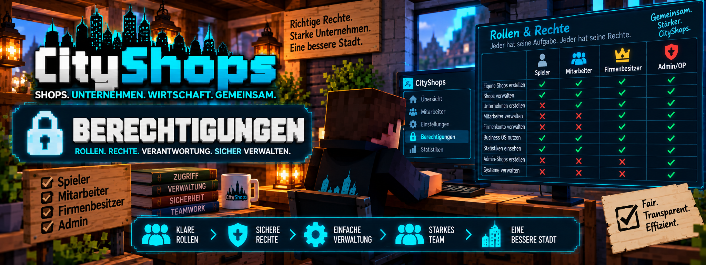

<link rel="stylesheet" href="style.css">



# 🔐 CityShops – Berechtigungen

CityShops unterscheidet zwischen verschiedenen Rollen und Zugriffsrechten.

Dadurch können normale Spieler ihre eigenen Shops verwalten, Mitarbeiter gemeinsam in einem Unternehmen arbeiten und Firmenbesitzer wichtige Unternehmensfunktionen kontrollieren.

Bestimmte Verwaltungsfunktionen sind ausschließlich für **Server-Administratoren beziehungsweise OP-Spieler** vorgesehen.

---

# 👥 Rollen im Überblick

In CityShops sind vor allem folgende Rollen wichtig:

| Rolle | Beschreibung |
| --- | --- |
| 👤 Spieler | Verwaltet seine eigenen Shops und handelt bei anderen Shops |
| 👥 Mitarbeiter | Arbeitet zusätzlich in einem Unternehmen und dessen Shops |
| 👑 Firmenbesitzer | Verwaltet das Unternehmen, Mitarbeiter und wichtige Firmenfunktionen |
| 🛡️ Admin / OP | Besitzt Zugriff auf administrative CityShops-Funktionen |

> Ein Spieler kann gleichzeitig Besitzer seiner persönlichen Shops und Mitarbeiter eines Unternehmens sein.

---

# 👤 Normale Spieler

Jeder normale Spieler kann das grundlegende Shopsystem von CityShops verwenden.

Dazu gehören insbesondere:

- eigene Verkaufsshops erstellen
- eigene Ankaufsshops erstellen
- eigene Shops verwalten
- Waren kaufen
- Waren verkaufen
- eigene Shops benennen
- eigene Handelsstatistiken ansehen
- andere Shops nach einem echten Handel bewerten
- Bewertungsschilder für eigene Shops verwenden
- Spendenschilder verwenden

---

# 🛒 Eigene Shops

Ein normaler Spieler darf grundsätzlich nur seine **eigenen Shops** verwalten.

Dazu gehören beispielsweise Shops mit:

```text
[Verkauf]
```

oder:

```text
[Shop]
```

sowie Ankaufsshops mit:

```text
[Ankauf]
```

Die zugehörige Shopkiste und das Shopschild bilden gemeinsam den Shop.

---

# 🔒 Fremde Shops

Ein Spieler erhält durch CityShops nicht automatisch Verwaltungsrechte für Shops anderer Spieler.

Dadurch soll verhindert werden, dass fremde Spieler:

- Shop-Einstellungen verändern
- Shops übernehmen
- geschützte Shop-Inhalte verwalten
- fremde Unternehmensfunktionen benutzen

Die Besitzverhältnisse eines Shops bestimmen, wer ihn verwalten darf.

---

# 👥 Mitarbeiter eines Unternehmens

Wird ein Spieler zu einem Unternehmen hinzugefügt, erhält er Zugriff auf die für Mitarbeiter vorgesehenen Unternehmensfunktionen.

Ein Mitarbeiter kann dadurch gemeinsam mit anderen Spielern innerhalb eines Unternehmens arbeiten.

---

# 🏢 Gemeinsame Unternehmensshops

Unternehmensmitglieder können mit den Shops ihres Unternehmens arbeiten.

Neue Shops von Unternehmensmitgliedern können dem Unternehmen zugeordnet werden.

Bereits vorhandene persönliche Shops können über:

```text
/company claim
```

dem Unternehmen zugewiesen werden.

---

# 💻 Business OS für Mitarbeiter

Mitarbeiter können das **Business OS** beziehungsweise die Unternehmensbereiche des Shop-PCs verwenden, soweit die jeweilige Funktion für ihre Rolle vorgesehen ist.

Dadurch können Unternehmensinformationen zentral eingesehen und gemeinsame Geschäftsbereiche verwendet werden.

---

# 🚪 Unternehmen verlassen

Ein normaler Mitarbeiter kann das Unternehmen mit:

```text
/company leave
```

verlassen.

Der Firmenbesitzer selbst kann sein Unternehmen nicht einfach über diesen Mitarbeiter-Befehl verlassen.

---

# 👑 Firmenbesitzer

Der Firmenbesitzer besitzt zusätzliche Verwaltungsrechte.

Er trägt die Verantwortung für die zentrale Verwaltung seines Unternehmens.

Dazu gehören insbesondere:

- Mitarbeiter hinzufügen
- Mitarbeiter entfernen
- Unternehmen umbenennen
- Firmeninformationen verwalten
- Unternehmensshops verwalten
- vorhandene Shops dem Unternehmen zuweisen
- Firmenkonto verwalten
- Geld vom Firmenkonto auszahlen
- Unternehmensbereiche im Business OS verwalten

---

# ➕ Mitarbeiter hinzufügen

Der Firmenbesitzer kann einen Spieler mit:

```text
/company add <Spieler>
```

zum Unternehmen hinzufügen.

### Beispiel

```text
/company add Spielername
```

Der entsprechende Spieler muss dafür online sein.

---

# ➖ Mitarbeiter entfernen

Mit:

```text
/company remove <Spieler>
```

kann der Firmenbesitzer einen Mitarbeiter aus seinem Unternehmen entfernen.

### Beispiel

```text
/company remove Spielername
```

---

# ✏️ Unternehmen umbenennen

Der Firmenbesitzer kann sein Unternehmen mit:

```text
/company rename <Neuer Name>
```

umbenennen.

### Beispiel

```text
/company rename City Markt
```

---

# 💰 Firmenkonto

Unternehmen verwenden ein eigenes Firmenkonto über **MineBank**.

Dadurch werden:

- privates Spielergeld
- Firmenvermögen

voneinander getrennt.

MineBank ist eine **externe Abhängigkeit** von CityShops und kein Bestandteil der CityMods.

---

# 💵 Geld einzahlen

Geld kann mit:

```text
/company deposit <Betrag>
```

auf das Firmenkonto eingezahlt werden.

### Beispiel

```text
/company deposit 5000
```

Dadurch werden 5.000 vom persönlichen Konto auf das Firmenkonto übertragen.

---

# 💸 Geld auszahlen

Für Auszahlungen wird:

```text
/company withdraw <Betrag>
```

verwendet.

### Beispiel

```text
/company withdraw 2500
```

Die Auszahlung vom Firmenkonto ist dem **Firmenbesitzer** vorbehalten.

Dadurch können normale Mitarbeiter nicht einfach Firmenvermögen vom Konto auszahlen.

---

# 📊 Rollenübersicht

| Funktion | Spieler | Mitarbeiter | Firmenbesitzer | Admin / OP |
| --- | :---: | :---: | :---: | :---: |
| Eigene Shops erstellen | ✅ | ✅ | ✅ | ✅ |
| Eigene Shops verwalten | ✅ | ✅ | ✅ | ✅ |
| Bei Shops kaufen | ✅ | ✅ | ✅ | ✅ |
| Bei Shops verkaufen | ✅ | ✅ | ✅ | ✅ |
| Shops bewerten | ✅ | ✅ | ✅ | ✅ |
| Eigene Statistiken ansehen | ✅ | ✅ | ✅ | ✅ |
| Unternehmensfunktionen verwenden | ❌ | ✅ | ✅ | ✅ |
| Unternehmensshops verwenden | ❌ | ✅ | ✅ | ✅ |
| Unternehmen umbenennen | ❌ | ❌ | ✅ | ✅ |
| Mitarbeiter hinzufügen | ❌ | ❌ | ✅ | ✅ |
| Mitarbeiter entfernen | ❌ | ❌ | ✅ | ✅ |
| Firmenkonto verwalten | ❌ | eingeschränkt | ✅ | ✅ |
| Geld vom Firmenkonto auszahlen | ❌ | ❌ | ✅ | ✅ |
| Admin-Shops registrieren | ❌ | ❌ | ❌ | ✅ |
| Shop-History administrativ prüfen | ❌ | ❌ | ❌ | ✅ |

> Die Tabelle zeigt die Rollen innerhalb des CityShops-Systems. Serveradministratoren können darüber hinaus durch Minecraft-OP-Rechte Zugriff auf administrative Funktionen besitzen.

---

# 🛡️ Admin / OP

Einige Funktionen von CityShops sind bewusst ausschließlich für Administratoren beziehungsweise Spieler mit OP-Rechten vorgesehen.

Dazu gehören insbesondere administrative Shops und bestimmte Kontrollfunktionen.

---

# 🏪 Admin-Shops

Admin-Shops unterscheiden sich von normalen Spielershops.

Sie können ausschließlich von Spielern mit den erforderlichen administrativen Rechten registriert werden.

Für einen Admin-Verkauf wird beispielsweise verwendet:

```text
[AdminVerkauf]
```

Alternativ:

```text
[AdminShop]
```

Für einen Admin-Ankauf:

```text
[AdminAnkauf]
```

---

# ♾️ Unbegrenzter Warenbestand

Ein Admin-Verkauf benötigt keinen normalen Spieler-Warenbestand.

Die Waren können unbegrenzt angeboten werden.

Dadurch eignen sich Admin-Shops beispielsweise für serverseitige Grundversorgung oder eine kontrollierte Serverwirtschaft.

---

# 🏦 Staatskasse

Admin-Shops arbeiten mit der serverseitigen Wirtschaft beziehungsweise der vorgesehenen Staatskasse.

Damit wird das Geld nicht wie bei einem normalen Spielershop einem privaten Shopbesitzer zugeordnet.

Weitere Informationen findest du im Bereich:

**🏪 Admin-Shops**

---

# 📜 Shop-History für OP

Mit:

```text
/chestshop history
```

können OP-Spieler den gespeicherten Handelsverlauf eines Shops überprüfen.

Nach dem Ausführen des Befehls wird der gewünschte Shop ausgewählt.

CityShops speichert für einen Shop die letzten:

```text
50 Handelsvorgänge
```

Diese Funktion kann bei der Administration und Kontrolle der Serverwirtschaft hilfreich sein.

---

# ❤️ Admin-Spendenschilder

Neben normalen Spendenschildern unterstützt CityShops:

```text
[AdminSpende]
```

Diese Variante ist für Spenden an die vorgesehene Staatskasse gedacht.

Normale Spieler beziehungsweise Unternehmen verwenden dagegen:

```text
[Spende]
```

---

# ⭐ Bewertungen und Rechte

Auch das Bewertungssystem besitzt Schutzmechanismen.

Ein Shop kann nicht einfach beliebig bewertet werden.

Eine Bewertung setzt einen tatsächlichen Handel voraus.

Für eine Bewertung über den Befehl wird verwendet:

```text
/chestshop rate <1-5>
```

### Beispiel

```text
/chestshop rate 5
```

Eigene Shops beziehungsweise das eigene Unternehmen können nicht einfach selbst bewertet werden.

---

# 🔗 Bewertungsschilder

Für persönliche Shops können Bewertungsschilder mit:

```text
/chestshop link
```

verbunden werden.

Das Schild verwendet:

```text
[Bewertung]
```

Dadurch wird das Bewertungssystem eindeutig dem entsprechenden Shop zugeordnet.

---

# 🔐 Warum gibt es unterschiedliche Rechte?

Die Rollenaufteilung schützt die Wirtschaft des Servers.

Sie verhindert beispielsweise, dass ein normaler Mitarbeiter ohne entsprechende Rechte:

- Mitarbeiter entfernt
- die Firma umbenennt
- Firmenvermögen auszahlt
- administrative Shops erstellt
- administrative Kontrollfunktionen verwendet

Dadurch können mehrere Spieler gemeinsam in einem Unternehmen arbeiten, ohne dass jeder automatisch vollständige Kontrolle über das gesamte Unternehmen erhält.

---

# 🏢 Beispiel

Ein Unternehmen besitzt mehrere Shops und drei Mitarbeiter.

### Mitarbeiter

Die Mitarbeiter können im Unternehmen arbeiten und die für sie vorgesehenen gemeinsamen Funktionen verwenden.

Sie können aber nicht einfach:

```text
/company remove Spielername
```

verwenden, um andere Mitarbeiter zu entfernen.

Auch:

```text
/company withdraw 10000
```

steht ihnen nicht als normale Auszahlung vom Firmenkonto zur Verfügung.

### Firmenbesitzer

Der Firmenbesitzer besitzt die erweiterten Verwaltungsrechte und kann beispielsweise:

```text
/company add Spielername
```

```text
/company remove Spielername
```

```text
/company rename NeuerName
```

und:

```text
/company withdraw 10000
```

verwenden.

---

# ⚠️ Keine Berechtigung?

Wenn eine CityShops-Funktion nicht verwendet werden kann, überprüfe zuerst:

- Gehört der Shop dir?
- Gehört der Shop zu deinem Unternehmen?
- Bist du Mitglied des Unternehmens?
- Bist du Firmenbesitzer?
- Benötigt die Funktion OP-Rechte?
- Ist der richtige Shop ausgewählt?
- Ist MineBank korrekt installiert?
- Verwendet der Server die passende CityShops-Version?

Bei administrativen Funktionen sollte zusätzlich überprüft werden, ob der Spieler tatsächlich die notwendigen Minecraft-OP-Rechte besitzt.

---

# 💡 Wichtig

**OP-Rechte sollten nur vertrauenswürdigen Serveradministratoren gegeben werden.**

CityShops nutzt administrative Rechte unter anderem für Funktionen, die direkten Einfluss auf Shops und die Serverwirtschaft haben können.

Für normale Unternehmensmitarbeiter sind OP-Rechte nicht notwendig.

---

# 📚 Passende Wiki-Seiten

Weitere Informationen zu den einzelnen Bereichen findest du hier:

- 🛒 **Shop erstellen**
- 🏪 **Admin-Shops**
- 🏢 **Unternehmen & Filialen**
- 💰 **Kaufen & Verkaufen**
- 📊 **Statistiken & Bewertungen**
- ❤️ **Spendenschilder**
- 💻 **Business OS**
- ⌨️ **Befehle**

---

# ➡️ Als Nächstes

Im nächsten Bereich findest du Antworten auf häufig auftretende Fragen und Probleme rund um CityShops.

**❓ Häufige Fragen**

---

[← Befehle](cityshops-befehle.html) | [Weiter: Häufige Fragen →](cityshops-haeufige-fragen.html)
