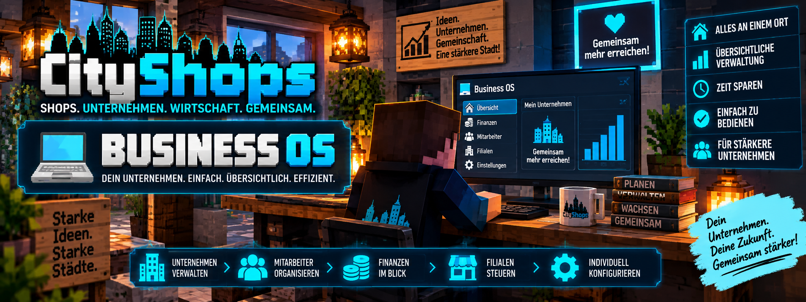

<link rel="stylesheet" href="style.css">



# 💻 CityShops – Business OS

Das **Business OS** ist die zentrale Verwaltungsoberfläche von CityShops.

Über den Shop-PC können Spieler ihre Shops und Unternehmen übersichtlich verwalten, Statistiken einsehen und verschiedene Funktionen des CityShops-Wirtschaftssystems an einem Ort verwenden.

Statt viele Informationen ausschließlich über Befehle abzurufen, stellt das Business OS wichtige Daten in einer grafischen Oberfläche zur Verfügung.

Seit **CityShops 2.3.0** wurde das Business OS um den neuen Bereich **„Verwaltung“** erweitert.

---

# 🖥️ Der Shop-PC

Das Business OS wird über den **CityShops Shop-PC** verwendet.

Der Shop-PC dient als zentrale Verwaltungsstelle für deine CityShops.

Darüber kannst du unter anderem:

- 🛒 deine Shops verwalten
- 🏢 Unternehmensinformationen einsehen
- 👥 Mitarbeiter verwalten
- 🔐 Mitarbeiterrollen und Rechte verwalten
- 💰 Finanzinformationen überprüfen
- 🏪 Filialen und Verkaufsstellen überblicken
- 🆔 feste Shop-IDs einsehen
- 🏷️ interne Shop-Namen verwalten
- 🗂️ Abteilungen verwalten
- 📋 Shop-Vorlagen verwenden
- 📜 Mitarbeiteraktivitäten nachvollziehen
- 📊 Shopstatistiken auswerten
- 📜 Handelsverläufe einsehen
- ⭐ Bewertungen überprüfen

Damit bündelt das Business OS viele CityShops-Funktionen in einer gemeinsamen Oberfläche.

---

# 🏠 Übersicht

Nach dem Öffnen des Business OS erhältst du eine zentrale Übersicht über deine verfügbaren Geschäftsbereiche.

Je nach vorhandenen Shops, Unternehmen und deinen Berechtigungen können unterschiedliche Informationen und Verwaltungsfunktionen zur Verfügung stehen.

Das Business OS ist damit die Schaltzentrale für deine CityShops-Wirtschaft.

---

# 🛒 Shopverwaltung

Im Business OS kannst du deine vorhandenen Shops übersichtlich betrachten.

Für einen Shop können wichtige Informationen angezeigt werden.

Dazu gehören unter anderem:

| Information | Bedeutung |
| --- | --- |
| 🆔 Shop-ID | Eindeutige interne ID des Firmenshops |
| 🏷️ Shop | Der ausgewählte Shop |
| 📝 Interner Name | Interner Name zur besseren Verwaltung |
| 🗂️ Abteilung | Zugeordnete Abteilung des Shops |
| 📍 Position | Standort des Shops |
| 📦 Bestand | Aktuell verfügbarer Warenbestand |
| 💵 Preis | Eingestellter Preis |
| 🔢 Menge | Itemmenge pro Handel |
| 📊 Statistik | Handelsdaten des Shops |
| 📜 Verlauf | Gespeicherte Transaktionen |

Dadurch musst du nicht jeden Shop einzeln vor Ort überprüfen, um einen Überblick über dein Geschäft zu bekommen.

---

# 🆔 Feste Shop-IDs

Seit **CityShops 2.3.0** erhält jeder Firmenshop automatisch eine eindeutige Shop-ID.

Beispiele:

```text
SHOP-0001
SHOP-0002
SHOP-0003
```

Diese ID ermöglicht es, Shops innerhalb eines Unternehmens dauerhaft eindeutig zu unterscheiden.

Die Shop-ID bleibt erhalten, wenn beispielsweise:

- der Shop-Name geändert wird
- der Preis geändert wird
- die Abteilung geändert wird
- die Filiale geändert wird

Wird ein Shop vollständig gelöscht und anschließend neu erstellt, erhält der neue Shop eine neue Shop-ID.

> 💡 Bereits bestehende Firmenshops erhalten beim Update auf CityShops 2.3.0 automatisch eine feste Shop-ID.

---

# 🏷️ Interne Shop-Namen

Firmenshops können zusätzlich einen eigenen **internen Shop-Namen** besitzen.

Dieser Name dient der internen Organisation und muss nicht mit dem sichtbaren Namen auf dem Shopschild übereinstimmen.

Beispiele:

```text
Baumarkt-Holz-03
Getränke-01
Lager-Ankauf-02
```

Dadurch können besonders große Unternehmen mit vielen Shops ihre Verkaufsstellen im Business OS leichter auseinanderhalten.

Der interne Name kann mit folgendem Befehl vergeben werden:

```text
/company shop internalname Getränke-01
```

Anschließend wird das gewünschte Shopschild angeklickt.

---

# 🗂️ Abteilungen

Seit **CityShops 2.3.0** können Unternehmen ihre Shops in Abteilungen organisieren.

Beispiele für Abteilungen:

- Lebensmittel
- Getränke
- Werkzeuge
- Baustoffe
- Rohstoffe

Eine neue Abteilung wird erstellt mit:

```text
/company department create Getränke
```

Ein Shop kann anschließend einer Abteilung zugeordnet werden mit:

```text
/company department assign Getränke
```

Danach wird das gewünschte Shopschild angeklickt.

Die Abteilungen können im Business OS im Bereich **„Verwaltung“** eingesehen werden.

---

# 📋 Shop-Vorlagen

Das Business OS unterstützt mit CityShops 2.3.0 die neue Verwaltung von **Shop-Vorlagen**.

Mit einer Vorlage können Einstellungen eines bestehenden Shops gespeichert und anschließend auf weitere Shops derselben Firma übertragen werden.

Eine Shop-Vorlage speichert:

- Ankauf oder Verkauf
- Menge pro Klick
- Preis
- Abteilung

Eine Vorlage wird gespeichert mit:

```text
/company template save Standard16
```

Danach wird der gewünschte Quellshop angeklickt.

Eine gespeicherte Vorlage wird angewendet mit:

```text
/company template apply Standard16
```

Danach wird der gewünschte Zielshop angeklickt.

> ⚠️ Das Item des Zielshops wird durch eine Vorlage nicht verändert.

---

# 🆕 Verwaltung

Mit **CityShops 2.3.0** wurde das Business OS um den neuen Bereich **„Verwaltung“** erweitert.

Dieser Bereich fasst wichtige Verwaltungsfunktionen eines Unternehmens an einer zentralen Stelle zusammen.

Dort werden unter anderem angezeigt:

- 🗂️ Abteilungen
- 🆔 feste Shop-IDs
- 🏷️ interne Shop-Namen
- 📋 Shop-Vorlagen
- 📜 Mitarbeiteraktivitäten

Dadurch können besonders Unternehmen mit vielen Shops und Mitarbeitern übersichtlicher verwaltet werden.

## 🖱️ Scrollbare Listen

Bei größeren Unternehmen können die Verwaltungslisten entsprechend lang werden.

Die Listen im Bereich **„Verwaltung“** können deshalb mit dem **Mausrad gescrollt** werden.

So bleiben auch Unternehmen mit vielen Shops, Abteilungen oder Aktivitäten übersichtlich bedienbar.

---

# 📜 Mitarbeiter-Aktivitätsprotokoll

Seit CityShops 2.3.0 werden wichtige Verwaltungsaktionen innerhalb eines Unternehmens protokolliert.

Das Aktivitätsprotokoll kann unter anderem folgende Aktionen enthalten:

- Shop erstellt
- Shop gelöscht
- internen Shop-Namen geändert
- Abteilung zugewiesen
- Vorlage gespeichert
- Vorlage angewendet
- Mitarbeiterrolle geändert
- Mitarbeiterrecht geändert

Dabei können unter anderem der **Ersteller, der Zeitpunkt und die ausgeführte Aktion** nachvollzogen werden.

Das Aktivitätsprotokoll ist direkt im Business OS unter **„Verwaltung“** verfügbar.

Zusätzlich kann es mit folgendem Befehl aufgerufen werden:

```text
/company activity
```

---

# 📊 Shopstatistiken

Das Business OS stellt die Statistikdaten deiner Shops grafisch und übersichtlich dar.

CityShops erfasst bei echten Handelsvorgängen unter anderem:

- 🛒 Anzahl der Transaktionen
- 📦 gehandelte Itemmenge
- 💰 Umsatz

Damit kannst du erkennen, welche deiner Shops besonders häufig verwendet werden.

---

# 📈 7-Tage-Diagramm

Für Shops steht im Shop-PC außerdem eine **7-Tage-Auswertung** zur Verfügung.

Das Diagramm zeigt die Entwicklung der letzten Tage.

Dabei können unter anderem folgende Werte betrachtet werden:

- Handelsvorgänge
- gehandelte Itemmenge
- Umsatz

So kannst du erkennen, wie sich die Aktivität eines Shops entwickelt.

---

# 📜 Handelsverlauf

CityShops speichert für Shops einen Handelsverlauf.

Dabei werden pro Shop die:

**letzten 50 Handelsvorgänge**

gespeichert.

Diese Daten können bei der Verwaltung und Kontrolle eines Shops helfen.

So lässt sich beispielsweise nachvollziehen, ob und wie häufig an einem bestimmten Shop gehandelt wurde.

---

# 🏢 Unternehmensverwaltung

Das Business OS ist nicht nur für einzelne Shops gedacht.

Auch das **Unternehmenssystem von CityShops** ist mit der Verwaltungsoberfläche verbunden.

Unternehmen können mehrere Shops beziehungsweise Verkaufsstellen besitzen und gemeinsam verwalten.

Durch die neuen Verwaltungsfunktionen von CityShops 2.3.0 können auch größere Firmenstrukturen übersichtlich organisiert werden.

Dazu gehören insbesondere:

- feste Shop-IDs
- interne Shop-Namen
- Abteilungen
- Shop-Vorlagen
- Mitarbeiterrollen
- einzelne Mitarbeiterrechte
- Aktivitätsprotokolle

Dadurch eignet sich das Business OS besonders für größere Firmen mit mehreren Mitarbeitern und Shops.

---

# 👥 Mitarbeiter

Unternehmen können Mitarbeiter besitzen.

Das Business OS unterstützt die übersichtliche Verwaltung des Unternehmens und seiner Mitglieder.

Dadurch können Firmenstrukturen einfacher organisiert werden, ohne dass sämtliche Informationen einzeln zusammengesucht werden müssen.

Welche Aktionen ein Spieler durchführen kann, hängt von seiner Stellung beziehungsweise seinen Rechten innerhalb des Unternehmens ab.

---

# 👥 Mitarbeiterrollen

Mit CityShops 2.3.0 stehen verschiedene Mitarbeiterrollen zur Verfügung.

Verfügbare Rollen:

```text
geschaeftsfuehrer
filialleiter
lagerist
einkaeufer
verkaeufer
buchhalter
pruefer
```

Eine Mitarbeiterrolle kann mit folgendem Befehl vergeben werden:

```text
/company role set SPIELER filialleiter
```

Der Firmenbesitzer besitzt automatisch sämtliche Rechte und benötigt keine zusätzliche Rolle.

---

# 🔐 Einzelne Mitarbeiterrechte

Zusätzlich zu den Rollen können einzelne Mitarbeiterrechte verwaltet werden.

| Recht | Funktion |
| --- | --- |
| `shops` | Shops verwalten |
| `prices` | Preise bearbeiten |
| `stock` | Warenbestand verwalten |
| `templates` | Shop-Vorlagen speichern und anwenden |
| `departments` | Abteilungen verwalten |
| `statistics` | Firmenstatistiken ansehen |
| `activity` | Aktivitätsprotokoll ansehen |

Ein Recht kann beispielsweise vergeben werden mit:

```text
/company permission set SPIELER templates true
```

Mit:

```text
/company permission set SPIELER templates false
```

wird dieses Recht wieder entzogen.

Dadurch kann genau festgelegt werden, welche Verwaltungsfunktionen ein Mitarbeiter verwenden darf.

---

# 🏪 Filialen & Verkaufsstellen

CityShops unterstützt Unternehmen mit mehreren Verkaufsstellen.

Dadurch können beispielsweise unterschiedliche Geschäfte unter einem gemeinsamen Unternehmen betrieben werden.

Das Business OS hilft dabei, die verschiedenen Bereiche des Unternehmens übersichtlich zusammenzuführen.

Beispiel:

```text
Martiniis Markt
│
├── Innenstadt
│   ├── Lebensmittel
│   └── Getränke
│
├── Einkaufszentrum
│   └── Baumarkt
│
└── Industriegebiet
    └── Großhandel
```

So können auch größere Unternehmen mit mehreren Verkaufsstellen organisiert werden.

---

# 💰 Finanzen

CityShops verwendet **MineBank** für sein Geldsystem.

Unternehmen besitzen dadurch ein vom privaten Spielerkonto getrenntes Firmenkonto.

Einnahmen aus Firmenshops können dem Unternehmen zugeordnet werden.

Das Business OS ermöglicht es, die wirtschaftlichen Informationen des Unternehmens übersichtlich im Blick zu behalten.

> 💡 MineBank ist eine externe Pflichtabhängigkeit und gehört nicht zu den CityMods.

---

# 💵 Firmenkonto

Das Firmenkonto ist vom privaten Geld eines Spielers getrennt.

Dadurch können Unternehmen eine eigene Wirtschaft besitzen.

Beispielsweise können Einnahmen aus verschiedenen Firmenshops gemeinsam dem Unternehmen zugutekommen.

Das ist besonders praktisch, wenn mehrere Spieler gemeinsam ein Unternehmen betreiben.

---

# ⭐ Bewertungen

CityShops besitzt ein Bewertungssystem für Shops und Unternehmen.

Kunden können nach einem echten Handel Bewertungen abgeben.

Dabei stehen:

**⭐ 1 bis ⭐⭐⭐⭐⭐ 5 Sterne**

zur Verfügung.

Bewertungen helfen Unternehmen dabei, einen Überblick über die Zufriedenheit ihrer Kunden zu erhalten.

Weitere Informationen dazu findest du unter:

**📊 Statistiken & Bewertungen**

---

# 📊 Firmenstatistiken & Marktberichte

Neben einzelnen Shopstatistiken unterstützt CityShops auch die Auswertung größerer Geschäftsaktivitäten.

Dadurch können Unternehmen ihre wirtschaftliche Entwicklung besser überblicken.

Das Business OS bildet dafür die zentrale Verwaltungsoberfläche.

---

# 🧾 Shopinformationen an einem Ort

Einer der größten Vorteile des Business OS ist die zentrale Übersicht.

Statt jeden Shop einzeln aufzusuchen, können wichtige Daten gemeinsam dargestellt werden.

Beispielsweise:

```text
Shop
↓
Shop-ID & interner Name
↓
Abteilung
↓
Bestand
↓
Preis & Menge
↓
Transaktionen
↓
Umsatz
↓
Handelsverlauf
↓
Auswertung
```

Dadurch eignet sich das Business OS besonders für Spieler mit vielen Shops.

---

# 🌙 Verkäufe während du offline bist

CityShops kann Handelsaktivitäten auch erfassen, während der Shopbesitzer nicht auf dem Server ist.

Beim nächsten Login erhält der Besitzer eine Zusammenfassung über Verkäufe und Ankäufe während seiner Abwesenheit.

Zusammen mit dem Business OS und den gespeicherten Statistiken können Shopbesitzer dadurch auch nach längerer Abwesenheit nachvollziehen, wie ihre Geschäfte gelaufen sind.

---

# 🏪 Kleine und große Unternehmen

Das Business OS kann sowohl für kleinere Geschäfte als auch für größere Unternehmensstrukturen verwendet werden.

### Kleiner Shop

```text
Spieler
  ↓
Shop
  ↓
Verkäufe
```

### Unternehmen

```text
Unternehmen
   │
   ├── Mitarbeiter
   │
   ├── Mitarbeiterrollen & Rechte
   │
   ├── Firmenkonto
   │
   ├── Abteilungen
   │
   ├── Shop 1
   │
   ├── Shop 2
   │
   ├── Shop 3
   │
   └── weitere Verkaufsstellen
```

Dadurch kann das System mit dem Unternehmen mitwachsen.

---

# 🔐 Berechtigungen

Nicht jeder Spieler darf automatisch sämtliche Unternehmensfunktionen verwenden.

CityShops unterscheidet zwischen verschiedenen Verwaltungsrechten.

Seit CityShops 2.3.0 können Mitarbeiter über **Rollen und einzelne Rechte** genauer verwaltet werden.

Zu den einzelnen Rechten gehören:

- Shops verwalten
- Preise bearbeiten
- Warenbestand verwalten
- Shop-Vorlagen speichern und anwenden
- Abteilungen verwalten
- Firmenstatistiken ansehen
- Aktivitätsprotokoll ansehen

Der Firmenbesitzer besitzt automatisch sämtliche Rechte.

Dadurch können Unternehmen gemeinsam betrieben werden, ohne jedem Mitglied vollständigen Zugriff auf alle Funktionen geben zu müssen.

Die Berechtigungen erklären wir ausführlicher unter:

**🔐 Berechtigungen**

---

# 🏦 Verbindung mit MineBank

Das Business OS arbeitet mit der bestehenden MineBank-Integration von CityShops zusammen.

MineBank stellt die Kontostruktur bereit, die CityShops für seine Wirtschaft verwendet.

Dazu gehören unter anderem:

- 👤 Spielerkonten
- 🏢 Firmenkonten
- 🏛️ Staatskasse

CityShops baut seine Shop- und Unternehmensfunktionen darauf auf.

---

# 💡 Warum Business OS verwenden?

Besonders bei vielen Shops kann die Verwaltung über einzelne Schilder und Standorte schnell unübersichtlich werden.

Das Business OS hilft dabei, wichtige Geschäftsinformationen zentral zusammenzuführen.

Besonders hilfreich ist es für:

- Spieler mit mehreren Shops
- Unternehmen
- Unternehmen mit mehreren Mitarbeitern
- Unternehmen mit mehreren Verkaufsstellen
- Unternehmen mit vielen Abteilungen
- Unternehmen mit vielen Firmenshops
- Shopbesitzer, die ihre Umsätze verfolgen möchten
- Spieler, die Handelsverläufe und Statistiken auswerten möchten
- Firmenbesitzer, die Mitarbeiteraktivitäten kontrollieren möchten

---

# ❓ Business OS zeigt keine Shops?

Falls ein Shop nicht angezeigt wird, überprüfe:

- Existiert der Shop noch?
- Wurde der Shop korrekt registriert?
- Gehört der Shop dem richtigen Spieler beziehungsweise Unternehmen?
- Ist der Shop noch aktiv?
- Verwendest du die passende CityShops-Version?
- Sind CityShops und MineBank korrekt installiert?

Entfernte Shops werden von CityShops aus den entsprechenden Übersichten bereinigt.

---

# ❓ Verwaltungsbereich zeigt keine Daten?

Falls im neuen Bereich **„Verwaltung“** Informationen fehlen, überprüfe:

- Gehört der Shop zum richtigen Unternehmen?
- Besitzt der Shop bereits eine feste Shop-ID?
- Wurde der interne Shop-Name korrekt vergeben?
- Wurde die gewünschte Abteilung erstellt?
- Wurde der Shop der richtigen Abteilung zugeordnet?
- Wurde die Shop-Vorlage korrekt gespeichert?
- Besitzt der Mitarbeiter die benötigten Rechte?
- Verwendest du **CityShops 2.3.0**?

---

# ❓ Unternehmensdaten fehlen?

Falls Unternehmensinformationen fehlen, überprüfe:

- Existiert das Unternehmen?
- Bist du Mitglied des richtigen Unternehmens?
- Besitzt du die benötigten Rechte?
- Sind die Shops dem Unternehmen zugeordnet?
- Ist MineBank korrekt installiert?
- Existiert das benötigte Firmenkonto?

---

# 📚 Weitere CityShops-Anleitungen

Weitere Informationen findest du in den anderen Bereichen der CityShops-Wiki:

- 🚀 **Installation**
- 🛒 **Shop erstellen**
- 👑 **Admin-Shops**
- 🏢 **Unternehmen & Filialen**
- 💰 **Kaufen & Verkaufen**
- 📊 **Statistiken & Bewertungen**
- ❤️ **Spendenschilder**
- ⌨️ **Befehle**
- 🔐 **Berechtigungen**
- ❓ **Häufige Fragen**
- 📋 **Versionen & Changelog**

---

## 🔗 Offizielle Seite

[CityShops auf CurseForge](https://www.curseforge.com/minecraft/mc-mods/cityshops)

---

[← Spendenschilder](cityshops-spendenschilder.md) | [Weiter: Befehle →](cityshops-befehle.md)
