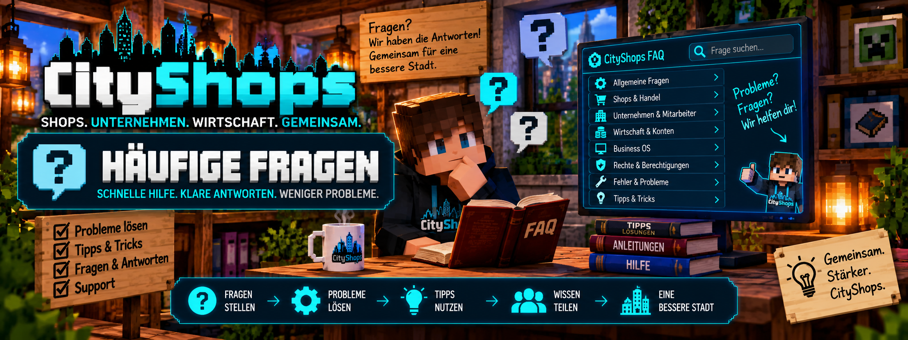

<link rel="stylesheet" href="style.css">



# ❓ CityShops – Häufige Fragen

Hier findest du Antworten auf häufige Fragen und Probleme rund um **CityShops**.

Die Antworten behandeln Shops, Unternehmen, MineBank, Bewertungen, Spendenschilder, Business OS, Berechtigungen und typische Fehler.

Wenn du hier keine Lösung findest, kannst du über unseren **Discord-Support** weitere Hilfe erhalten.

---

# 🛒 Shops & Handel

## ❓ Wie erstelle ich einen normalen Verkaufsshop?

Für einen normalen Verkaufsshop benötigst du eine Truhe oder Doppeltruhe und ein Shopschild.

Verwende auf dem Schild:

```text
[Verkauf]
```

Alternativ:

```text
[Shop]
```

Lege das gewünschte Item oben links in die Shopkiste und registriere anschließend den Shop über das Schild.

Eine ausführliche Anleitung findest du unter:

**🛒 Shop erstellen**

---

## ❓ Wie erstelle ich einen Ankaufsshop?

Für einen Ankaufsshop verwendest du:

```text
[Ankauf]
```

Bei einem Ankauf verkauft ein Spieler seine Items an den Shop.

Der Shop benötigt dafür genügend Geld beziehungsweise das zugehörige Konto muss die Transaktion bezahlen können.

---

## ❓ Kann ich eine Doppeltruhe verwenden?

Ja.

CityShops unterstützt normale Truhen und Doppeltruhen als Shoplager.

Dadurch kannst du bei größeren Shops mehr Waren lagern.

---

## ❓ Welches Item wird für den Shop verwendet?

Das gewünschte Handelsitem wird in der Shopkiste **oben links** platziert.

CityShops verwendet dieses Item für den Shop.

Achte darauf, dass wirklich das richtige Item in diesem Slot liegt, bevor du den Shop registrierst.

---

## ❓ Warum kann ein Kunde nichts kaufen?

Überprüfe zuerst:

- Ist der Shop korrekt registriert?
- Befindet sich genügend Ware im Shop?
- Ist das richtige Item eingelagert?
- Besitzt der Kunde genügend Geld?
- Ist MineBank korrekt installiert?
- Funktioniert das zugehörige Konto?
- Verwendet der Server die passende CityShops-Version?

Bei einem normalen Verkaufsshop muss ausreichend Ware vorhanden sein.

---

## ❓ Warum kann ein Spieler nichts an meinen Shop verkaufen?

Bei einem Ankaufsshop sollte geprüft werden:

- Ist der Ankaufsshop korrekt registriert?
- Hat der Spieler das richtige Item?
- Ist genügend Platz in der Shopkiste?
- Ist genügend Geld für den Ankauf vorhanden?
- Funktioniert MineBank korrekt?

---

## ❓ Kann ich mehrfach hintereinander kaufen oder verkaufen?

Ja.

CityShops unterstützt wiederholte Handelsvorgänge.

Dadurch können Spieler mehrere Käufe beziehungsweise Verkäufe durchführen, ohne den Shop jedes Mal neu erstellen zu müssen.

---

## ❓ Kann ich meinen eigenen Shop testen?

Ja.

Als Shopbesitzer kannst du deinen Shop testen.

Beim Testen des eigenen Shops soll dabei kein normaler Geldtransfer wie bei einem echten Kundenhandel stattfinden.

---

# 📦 Lager & Automatisierung

## ❓ Kann ich Hopper an meinen Shops verwenden?

Ja.

CityShops kann zusammen mit Hoppern verwendet werden, sodass Waren automatisiert in Shoplager transportiert beziehungsweise aus entsprechenden Lagersystemen weiterverarbeitet werden können.

Achte darauf, dass deine Hopper-Anordnung nicht versehentlich das Item entfernt, das für die Shop-Erkennung benötigt wird.

---

## ❓ Warum ist mein Shop plötzlich leer?

Überprüfe:

- den Inhalt der Shopkiste
- angeschlossene Hopper
- andere Automatisierungen
- ob andere Spieler Waren gekauft haben
- ob das richtige Item weiterhin vorhanden ist

Bei automatisierten Lagersystemen sollte besonders auf die Hopper-Richtung geachtet werden.

---

# 🏢 Unternehmen

## ❓ Wie erstelle ich ein Unternehmen?

Verwende:

```text
/company create <Name>
```

Beispiel:

```text
/company create City Markt
```

Beim Erstellen wird das Unternehmen angelegt und mit dem vorgesehenen Firmenkonto verbunden.

---

## ❓ Was passiert mit meinen vorhandenen Shops, wenn ich eine Firma gründe?

Vorhandene persönliche Shops können in das Unternehmenssystem übernommen werden.

Falls ein Shop manuell dem Unternehmen zugewiesen werden soll, steht dafür:

```text
/company claim
```

zur Verfügung.

---

## ❓ Wie füge ich einen Mitarbeiter hinzu?

Der Firmenbesitzer verwendet:

```text
/company add <Spieler>
```

Beispiel:

```text
/company add Spielername
```

Der Spieler muss dafür online sein.

---

## ❓ Wie entferne ich einen Mitarbeiter?

Der Firmenbesitzer verwendet:

```text
/company remove <Spieler>
```

Beispiel:

```text
/company remove Spielername
```

---

## ❓ Wie verlasse ich ein Unternehmen?

Als Mitarbeiter verwendest du:

```text
/company leave
```

Der Firmenbesitzer kann sein eigenes Unternehmen nicht einfach über diesen Mitarbeiter-Befehl verlassen.

---

## ❓ Wie sehe ich Informationen über mein Unternehmen?

Verwende:

```text
/company info
```

Damit kannst du Informationen zu deinem Unternehmen aufrufen.

---

## ❓ Kann ich mein Unternehmen umbenennen?

Ja.

Als Firmenbesitzer verwendest du:

```text
/company rename <Neuer Name>
```

Beispiel:

```text
/company rename City Supermarkt
```

---

# 💰 Firmenkonto & MineBank

## ❓ Benötigt CityShops MineBank?

Ja.

**MineBank ist eine externe Abhängigkeit von CityShops.**

MineBank stellt die benötigten Bank- und Kontofunktionen bereit.

> MineBank gehört nicht zu den CityMods und wird von CityShops lediglich als Abhängigkeit verwendet.

---

## ❓ Muss MineBank ebenfalls installiert sein?

Ja.

Wenn CityShops MineBank als erforderliche Abhängigkeit verwendet, müssen die benötigten Mods entsprechend korrekt installiert sein.

Bei einem Forge-Server müssen außerdem Server und Clients die für den Betrieb benötigten Mods in den jeweils passenden Versionen verwenden.

---

## ❓ Wie zahle ich Geld auf das Firmenkonto ein?

Verwende:

```text
/company deposit <Betrag>
```

Beispiel:

```text
/company deposit 5000
```

Damit wird der angegebene Betrag vom persönlichen Konto auf das Firmenkonto übertragen.

---

## ❓ Wie zahle ich Geld vom Firmenkonto aus?

Als Firmenbesitzer verwendest du:

```text
/company withdraw <Betrag>
```

Beispiel:

```text
/company withdraw 2500
```

Normale Mitarbeiter dürfen nicht einfach Geld vom Firmenkonto auszahlen.

---

## ❓ Warum funktioniert eine Zahlung nicht?

Überprüfe:

- Ist MineBank installiert?
- Läuft die richtige MineBank-Version?
- Besitzt das entsprechende Konto genügend Geld?
- Ist CityShops korrekt geladen?
- Ist der Shop richtig registriert?
- Handelt es sich um das richtige Firmenkonto?
- Zeigt die Serverkonsole einen Fehler?

---

# 👑 Admin-Shops

## ❓ Was ist ein Admin-Shop?

Ein Admin-Shop ist ein serverseitiger Shop, der nicht wie ein normaler Spielershop an einen privaten Shopbesitzer gebunden ist.

Er eignet sich beispielsweise für eine kontrollierte Serverwirtschaft oder serverseitige Grundversorgung.

---

## ❓ Wie erstelle ich einen Admin-Verkauf?

Verwende:

```text
[AdminVerkauf]
```

Alternativ:

```text
[AdminShop]
```

Die Registrierung eines Admin-Shops benötigt die entsprechenden administrativen Rechte.

---

## ❓ Wie erstelle ich einen Admin-Ankauf?

Verwende:

```text
[AdminAnkauf]
```

Auch hierfür werden die entsprechenden administrativen Rechte benötigt.

---

## ❓ Hat ein Admin-Verkauf unbegrenzten Bestand?

Ja.

Der Admin-Verkauf ist nicht auf einen normalen Spieler-Warenbestand angewiesen.

Dadurch können serverseitig Waren angeboten werden, ohne dass ein Spieler den Shop ständig auffüllen muss.

---

## ❓ Werden Admin-Shops wegen Inaktivität entfernt?

Nein.

Admin-Shops sind von der normalen Inaktivitätsbehandlung für Spielershops ausgenommen.

---

# ⭐ Bewertungen

## ❓ Wie bewerte ich einen Shop?

Nach einem echten Handel kann ein Shop mit:

```text
/chestshop rate <1-5>
```

bewertet werden.

Beispiel:

```text
/chestshop rate 5
```

Danach wählst du den entsprechenden Shop aus.

---

## ❓ Kann ich einen Shop mit 1 bis 5 Sternen bewerten?

Ja.

Das Bewertungssystem verwendet:

```text
1 bis 5 Sterne
```

---

## ❓ Kann ich meinen eigenen Shop bewerten?

Nein.

Das Bewertungssystem soll echte Kundenerfahrungen abbilden.

Eigene Shops beziehungsweise das eigene Unternehmen können deshalb nicht einfach selbst bewertet werden.

---

## ❓ Muss ich vorher etwas gekauft oder verkauft haben?

Ja.

Eine Bewertung setzt einen echten Handelsvorgang voraus.

Dadurch wird verhindert, dass Shops ohne vorherige Transaktion beliebig bewertet werden.

---

## ❓ Wie erstelle ich ein Bewertungsschild?

Verwende:

```text
[Bewertung]
```

Für einen persönlichen Shop kann das Schild anschließend mit:

```text
/chestshop link
```

mit dem entsprechenden Shop verbunden werden.

---

# 📊 Statistiken

## ❓ Wie sehe ich meine Handelsstatistik?

Verwende:

```text
/chestshop stats
```

Damit kannst du deine persönlichen Handelsstatistiken aufrufen.

---

## ❓ Werden Transaktionen gespeichert?

Ja.

CityShops zeichnet Handelsinformationen für seine Statistikfunktionen auf.

Für einen Shop werden die letzten:

```text
50 Handelsvorgänge
```

für die entsprechende Verlaufsauswertung gespeichert.

---

## ❓ Wie kann ein Admin den Verlauf eines Shops prüfen?

Ein OP-Spieler verwendet:

```text
/chestshop history
```

Danach wird der entsprechende Shop ausgewählt.

---

## ❓ Gibt es Statistiken im Business OS?

Ja.

Das Business OS beziehungsweise der Shop-PC stellt zentrale Informationen und Statistiken für die entsprechenden Geschäftsbereiche bereit.

Dazu gehören unter anderem Auswertungen rund um Shops und Unternehmen.

---

# ❤️ Spendenschilder

## ❓ Wie erstelle ich ein normales Spendenschild?

Verwende:

```text
[Spende]
```

Damit können Spenden über das dafür vorgesehene System durchgeführt werden.

---

## ❓ Gibt es auch ein Spendenschild für die Staatskasse?

Ja.

Dafür wird:

```text
[AdminSpende]
```

verwendet.

Diese Variante ist für die vorgesehene serverseitige Staatskasse bestimmt.

---

# 💻 Business OS

## ❓ Was ist das Business OS?

Das **Business OS** ist die zentrale Verwaltungsoberfläche für erweiterte Geschäfts- und Unternehmensfunktionen von CityShops.

Je nach Rolle können dort Informationen zu verschiedenen Geschäftsbereichen eingesehen und verwaltet werden.

---

## ❓ Was kann ich im Business OS sehen?

Je nach vorhandenen Rechten und Unternehmensstatus können dort Bereiche wie:

- Shops
- Unternehmen
- Mitarbeiter
- Finanzen
- Filialen
- Statistiken
- Handelsinformationen
- Bewertungen

eine Rolle spielen.

Nicht jede Funktion steht jeder Rolle zur Verfügung.

---

## ❓ Warum sehe ich bestimmte Funktionen nicht?

CityShops unterscheidet zwischen verschiedenen Rollen.

Beispielsweise:

- 👤 Spieler
- 👥 Mitarbeiter
- 👑 Firmenbesitzer
- 🛡️ Admin / OP

Ein Mitarbeiter besitzt nicht automatisch dieselben Verwaltungsrechte wie ein Firmenbesitzer.

Weitere Informationen findest du unter:

**🔐 Berechtigungen**

---

# 🔐 Berechtigungen

## ❓ Muss ich OP sein, um CityShops zu benutzen?

Nein.

Normale Spieler benötigen keine OP-Rechte, um ihre normalen CityShops-Funktionen zu verwenden.

OP-Rechte sind für bestimmte administrative Funktionen vorgesehen.

---

## ❓ Brauche ich OP-Rechte für einen normalen Shop?

Nein.

Normale Spieler können ihre eigenen Verkauf- und Ankaufsshops verwenden, ohne Serveradministrator zu sein.

---

## ❓ Wer darf Admin-Shops registrieren?

Admin-Shops sind administrative Shops.

Dafür werden die entsprechenden Admin- beziehungsweise OP-Rechte benötigt.

---

## ❓ Darf ein Mitarbeiter andere Mitarbeiter entfernen?

Nein.

Die Mitarbeiterverwaltung gehört zu den erweiterten Rechten des Firmenbesitzers.

Zum Entfernen wird:

```text
/company remove <Spieler>
```

verwendet.

---

## ❓ Darf ein Mitarbeiter Geld vom Firmenkonto auszahlen?

Die normale Auszahlung über:

```text
/company withdraw <Betrag>
```

ist dem Firmenbesitzer vorbehalten.

Damit kann nicht jeder Mitarbeiter beliebig Firmenvermögen auszahlen.

---

# 🕒 Inaktive Shops

## ❓ Können inaktive Spielershops entfernt werden?

CityShops besitzt eine Inaktivitätsverwaltung für Spielershops.

Die entsprechende Zeit kann über die Serverkonfiguration gesteuert werden.

---

## ❓ Wie lange gilt ein Shop standardmäßig als aktiv?

Der dokumentierte Standardwert beträgt:

```text
168 Stunden
```

Das entspricht:

```text
7 Tagen
```

---

## ❓ Wo kann ich die Zeit ändern?

Die Einstellung befindet sich in der CityShops-Serverkonfiguration.

Der entsprechende Wert lautet:

```text
inactiveHours
```

und befindet sich in:

```text
serverconfig/chestshop-server.toml
```

---

## ❓ Betrifft das auch Admin-Shops?

Nein.

Admin-Shops sind von dieser normalen Inaktivitätsbehandlung ausgenommen.

---

# 🏷️ Shop-Namen

## ❓ Kann ich meinem Shop einen eigenen Namen geben?

Ja.

Verwende:

```text
/chestshop name <Name>
```

Beispiel:

```text
/chestshop name City Markt
```

Danach wählst du deinen eigenen Shop aus.

---

# 🔧 Installation & Fehler

## ❓ Welche Minecraft-Version verwendet CityShops?

Diese Wiki dokumentiert CityShops für:

```text
Minecraft 1.20.1
```

mit Forge.

---

## ❓ CityShops startet nicht – was soll ich prüfen?

Überprüfe zuerst:

- Ist CityShops im richtigen `mods`-Ordner?
- Ist MineBank installiert?
- Stimmen Minecraft- und Forge-Version?
- Ist die benötigte MineBank-Version vorhanden?
- Befinden sich die benötigten Mods auf Server und Client?
- Gibt es doppelte oder alte CityShops-Versionen im `mods`-Ordner?
- Zeigt die Serverkonsole einen Fehler?

---

## ❓ Kann ich mehrere CityShops-Versionen gleichzeitig im mods-Ordner haben?

Nein.

Im `mods`-Ordner sollte nur die Version liegen, die tatsächlich verwendet werden soll.

Alte CityShops-Dateien sollten nach einem Update entfernt werden, damit nicht mehrere Versionen gleichzeitig geladen werden.

---

## ❓ Mein Launcher bietet immer wieder ein altes Update an. Was kann ich tun?

Überprüfe zuerst:

- welche CityShops-Datei tatsächlich installiert ist
- ob noch eine ältere `.jar` im `mods`-Ordner liegt
- welche Versionsnummer Minecraft im Mod-Menü anzeigt
- welche Datei der Launcher als aktuelle Version erkennt
- ob die richtige Datei beziehungsweise der richtige Release-Kanal verwendet wird

Bei Update-Problemen ist die tatsächlich geladene Mod-Version entscheidend.

---

# 🧰 Ein Befehl funktioniert nicht

Überprüfe zunächst die Schreibweise.

Die beiden wichtigsten Befehlsbereiche sind:

```text
/chestshop
```

und:

```text
/company
```

Minecraft kann beim Eingeben verfügbare Unterbefehle und Argumente anzeigen.

Prüfe außerdem:

- Besitzt du die erforderliche Rolle?
- Bist du Mitglied des Unternehmens?
- Bist du Firmenbesitzer?
- Benötigt die Funktion OP-Rechte?
- Ist der betroffene Spieler online?
- Gehört der ausgewählte Shop wirklich dir beziehungsweise deinem Unternehmen?

---

# 🖥️ Serverkonsole prüfen

Wenn CityShops nicht wie erwartet funktioniert, ist die Serverkonsole eine der wichtigsten Stellen zur Fehlersuche.

Achte besonders auf Meldungen mit Begriffen wie:

```text
CityShops
```

```text
chestshop
```

```text
MineBank
```

```text
bankmod
```

oder auf allgemeine Forge-Fehler.

Die eigentliche Fehlermeldung ist meistens hilfreicher als nur die Information, dass eine Funktion im Spiel nicht funktioniert.

---

# 🔄 Nach einem Update funktioniert etwas nicht

Überprüfe nach einem CityShops-Update:

1. Server vollständig stoppen.
2. Alte CityShops-`.jar` aus dem `mods`-Ordner entfernen.
3. Neue Version einfügen.
4. Prüfen, dass nicht zwei CityShops-Versionen gleichzeitig vorhanden sind.
5. Benötigte Abhängigkeiten überprüfen.
6. Server wieder starten.
7. Serverkonsole auf Fehler kontrollieren.

> Erstelle vor größeren Updates grundsätzlich eine Sicherung deiner Welt und wichtigen Serverdaten.

---

# 💬 Discord-Support

Du hast ein Problem mit **CityShops**, findest einen Fehler oder kommst bei der Einrichtung nicht weiter?

Dann kannst du unserem **CityMods Discord** beitreten und dort nach Hilfe fragen.

### 💬 Support & Community

👉 **[CityMods Discord – Jetzt beitreten]((https://discord.gg/PVm9HchMRc))**

Auf unserem Discord kannst du:

- 🆘 Hilfe bei Problemen mit CityShops bekommen
- 🐛 Fehler und Bugs melden
- 💡 Ideen und Verbesserungsvorschläge einreichen
- 🛒 Fragen zu Shops und Unternehmen stellen
- 💻 Hilfe beim Business OS erhalten
- 🔧 Unterstützung bei Installation und Einrichtung bekommen
- 📢 Informationen zu neuen Versionen und Updates erhalten
- 👥 dich mit anderen CityMods-Nutzern austauschen

### 🐛 Bei einer Fehlermeldung

Wenn du auf Discord Hilfe zu einem Fehler benötigst, schicke möglichst folgende Informationen mit:

- verwendete Minecraft-Version
- verwendete Forge-Version
- verwendete CityShops-Version
- verwendete MineBank-Version
- Beschreibung des Problems
- relevante Fehlermeldung aus der Serverkonsole
- gegebenenfalls einen Screenshot

Je mehr Informationen vorhanden sind, desto leichter lässt sich die Ursache eines Problems finden.

> Bitte poste keine Passwörter, Zugangsdaten, Server-Login-Daten oder andere private Informationen im Support.

---

# 📚 Wo finde ich weitere Hilfe?

Diese Wiki enthält ausführliche Anleitungen zu allen wichtigen CityShops-Bereichen:

- 🚀 **Installation**
- 🛒 **Shop erstellen**
- 🏪 **Admin-Shops**
- 🏢 **Unternehmen & Filialen**
- 💰 **Kaufen & Verkaufen**
- 📊 **Statistiken & Bewertungen**
- ❤️ **Spendenschilder**
- 💻 **Business OS**
- ⌨️ **Befehle**
- 🔐 **Berechtigungen**

Wenn du eine bestimmte Funktion suchst, findest du auf der jeweiligen Seite eine ausführlichere Erklärung.

Falls deine Frage dort nicht beantwortet wird, kannst du unseren Discord-Support verwenden:

👉 **[CityMods Discord – Support erhalten](DEIN-DISCORD-LINK-HIER-EINFÜGEN)**

---

# 💡 Noch ein Tipp

Wenn etwas nicht funktioniert, prüfe zuerst, **welcher Bereich betroffen ist**:

```text
Shop → Shop und Lager prüfen
```

```text
Zahlung → MineBank und Kontostand prüfen
```

```text
Unternehmen → Rolle und Firmenzugehörigkeit prüfen
```

```text
Befehl → Schreibweise und Berechtigung prüfen
```

```text
Admin-Funktion → OP-Rechte prüfen
```

```text
Serverfehler → Konsole und Log prüfen
```

So lässt sich die Ursache meistens deutlich schneller eingrenzen.

---

# 🔗 Links & Support

### 🛒 CityShops auf CurseForge

https://www.curseforge.com/minecraft/mc-mods/cityshops

### 💬 CityMods Discord

👉 **[Discord beitreten & Support erhalten](DEIN-DISCORD-LINK-HIER-EINFÜGEN)**

---

[← Berechtigungen](cityshops-berechtigungen.md) | [🏠 Zurück zu CityShops](cityshops.md)
