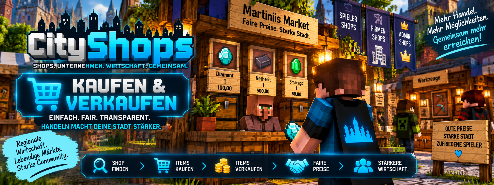

<link rel="stylesheet" href="style.css">



# 💰 CityShops – Kaufen & Verkaufen

Auf dieser Seite erfährst du, wie der eigentliche Handel mit **CityShops** funktioniert.

CityShops unterscheidet zwischen **Verkaufsshops** und **Ankaufsshops**. Spieler können dadurch Waren bei anderen Spielern oder Unternehmen kaufen und eigene Waren an Ankaufsshops verkaufen.

Die Bezahlung wird über **MineBank** abgewickelt.

> 💡 Wie du einen eigenen Shop erstellst, findest du auf der separaten Wiki-Seite **Shop erstellen**.

---

## 🧭 Kaufen & Verkaufen im Überblick

| Shop | Spieler macht | Geld | Ware |
| --- | --- | --- | --- |
| 🛒 Verkaufsshop | kauft Items | Spieler bezahlt | Spieler erhält Items |
| 📥 Ankaufsshop | verkauft Items | Spieler erhält Geld | Spieler gibt Items ab |
| 👑 Admin-Verkauf | kauft beim Server | Geld geht an Staatskasse | unbegrenzter Bestand |
| 👑 Admin-Ankauf | verkauft an Server | Staatskasse bezahlt | Server nimmt Items an |

---

# 🛒 Items kaufen

Bei einem **Verkaufsshop** kaufst du die auf dem Schild angezeigte Ware.

Der Handel wird über einen:

**Rechtsklick auf das Shop-Schild**

ausgeführt.

### Beispiel

Ein Shop-Schild zeigt:

```text
[Verkauf]
16

5,00
```

Das bedeutet:

**Du kaufst 16 Items für insgesamt 5,00.**

---

## 💰 Preis und Menge

Die zweite Zeile des Shop-Schildes bestimmt die **Menge pro Handel**.

Die vierte Zeile bestimmt den **Gesamtpreis für diese Menge**.

Bei:

```text
[Verkauf]
16

5,00
```

bedeutet das deshalb nicht:

**5,00 pro Item**

sondern:

**16 Items kosten zusammen 5,00.**

> 💡 Jeder erfolgreiche Rechtsklick führt einen vollständigen Handel mit der eingestellten Menge durch.

---

# 💳 Bezahlung beim Kauf

Beim Kauf prüft CityShops, ob genügend Geld für den Handel vorhanden ist.

Ist ausreichend Guthaben vorhanden, wird der Preis über **MineBank** abgebucht.

Bei einem persönlichen Spielershop erhält der **Shopbesitzer** das Geld.

Bei einem Firmenshop geht das Geld auf das entsprechende **MineBank-Firmenkonto**.

Bei einem Admin-Verkauf geht das Geld in die **MineBank-Staatskasse**.

---

# 📦 Warenbestand beim Verkauf

Normale Verkaufsshops benötigen einen echten Warenbestand.

CityShops prüft beim Handel, ob genügend passende Items in der Shopkiste vorhanden sind.

Beispiel:

Der Shop verkauft:

```text
16 Items
```

pro Handel.

Dann müssen mindestens:

**16 passende Items**

vorhanden sein.

Sind nicht genügend Items vorhanden, wird der Handel nicht durchgeführt.

---

# 📥 Items an einen Shop verkaufen

Bei einem **Ankaufsshop** funktioniert der Handel in die andere Richtung.

Hier verkaufst du deine Items an den Shop.

Der Handel wird ebenfalls über einen:

**Rechtsklick auf das Shop-Schild**

ausgeführt.

### Beispiel

```text
[Ankauf]
16

3,00
```

Das bedeutet:

**Du verkaufst 16 Items und erhältst insgesamt 3,00.**

---

# 🎒 Benötigte Items

Damit ein Ankauf durchgeführt werden kann, musst du die auf dem Schild angegebene Menge besitzen.

Bei:

```text
[Ankauf]
16

3,00
```

benötigst du mindestens:

**16 passende Items**

Besitzt du weniger als die benötigte Menge, kann der Handel nicht durchgeführt werden.

---

# 💰 Auszahlung beim Ankauf

Nach einem erfolgreichen Ankauf erhältst du den auf dem Schild angegebenen Betrag.

Bei einem persönlichen Ankaufsshop kommt das Geld vom **MineBank-Konto des Shopbesitzers**.

Bei einem Firmen-Ankaufsshop wird das Geld vom **MineBank-Firmenkonto** bezahlt.

Bei einem Admin-Ankauf kommt das Geld aus der **MineBank-Staatskasse**.

---

# 📦 Wohin gehen verkaufte Items?

Bei einem normalen Spieler- oder Firmen-Ankauf werden die angekauften Items in der zugehörigen **Shopkiste** gelagert.

Deshalb benötigt die Shopkiste ausreichend freien Platz.

Ist nicht genügend Platz vorhanden, kann der Ankauf nicht durchgeführt werden.

---

# 🏢 Handel mit Firmenshops

Firmenshops funktionieren für den Kunden grundsätzlich genauso wie normale Spielershops.

Der Unterschied liegt hauptsächlich beim Geldfluss.

### Verkauf

Du kaufst Ware bei einem Firmenshop:

**Spieler → bezahlt → Firmenkonto**

### Ankauf

Du verkaufst Ware an einen Firmenshop:

**Firmenkonto → bezahlt → Spieler**

Dadurch laufen die Einnahmen und Ausgaben des Unternehmens über das gemeinsame **MineBank-Firmenkonto**.

---

# 👑 Handel mit Admin-Shops

Auch Admin-Shops können von Spielern normal über das Shop-Schild verwendet werden.

## Admin-Verkauf

Beim Admin-Verkauf:

**Spieler bezahlt → Staatskasse**

und erhält die angebotene Ware.

Admin-Verkaufsshops besitzen einen **unbegrenzten Warenbestand**.

---

## Admin-Ankauf

Beim Admin-Ankauf:

**Staatskasse bezahlt → Spieler**

und der Spieler gibt die entsprechende Ware ab.

> ⚠️ Für einen Admin-Ankauf muss genügend Geld in der MineBank-Staatskasse vorhanden sein.

Die vollständige Einrichtung dieser Shops findest du auf der Wiki-Seite **Admin-Shops**.

---

# ⚙️ Hopper & Automatisierung

CityShops unterstützt Minecraft-Trichter.

Dadurch können normale Shopkisten mit anderen Lager- oder Transportsystemen verbunden werden.

---

## 📦 Verkaufsshops automatisch auffüllen

Ein Hopper kann Items automatisch in eine Verkaufskiste transportieren.

Dadurch können beispielsweise:

- Lager
- Farmen
- Produktionsanlagen
- Sortiersysteme

mit einem CityShops-Verkaufsshop verbunden werden.

Der Shop kann dadurch automatisch mit neuer Ware versorgt werden.

---

## 📥 Ankaufsshops automatisch leeren

Bei einem Ankaufsshop können Hopper die angekauften Items automatisch aus der Shopkiste transportieren.

Dadurch wird wieder Platz für weitere Ankäufe geschaffen.

Das eignet sich beispielsweise für:

- automatische Lager
- Sortieranlagen
- Produktionssysteme
- größere Firmenshops

---

# 🎯 Welches Item wird gehandelt?

Für den Handel zählt ausschließlich das **für den Shop registrierte Item**.

Andere Items, die sich zusätzlich in der Kiste befinden, werden nicht automatisch als Shopware gehandelt.

Das verhindert, dass versehentlich andere Gegenstände über denselben Shop verkauft oder angekauft werden.

---

# 🖱️ Mehrere Handelsvorgänge

Jeder erfolgreiche Rechtsklick führt **einen Handel** aus.

Beispiel:

```text
[Verkauf]
16

5,00
```

Ein erfolgreicher Handel:

**16 Items → 5,00**

Ein weiterer erfolgreicher Handel:

**weitere 16 Items → weitere 5,00**

Die Menge auf dem Schild ist also die **Handelsmenge pro Vorgang** und kein Gesamtlimit.

---

# ❌ Wann wird ein Kauf abgelehnt?

Ein Verkauf an einen Spieler kann beispielsweise nicht durchgeführt werden, wenn:

- der Käufer nicht genügend Geld besitzt,
- der Verkaufsshop nicht genügend passende Items besitzt,
- oder der Shop nicht mehr aktiv beziehungsweise verfügbar ist.

In diesem Fall wird kein normaler Handel abgeschlossen.

---

# ❌ Wann wird ein Ankauf abgelehnt?

Ein Ankauf kann beispielsweise nicht durchgeführt werden, wenn:

- der Spieler nicht genügend passende Items besitzt,
- der Shopbesitzer nicht genügend Geld besitzt,
- das Firmenkonto nicht genügend Guthaben besitzt,
- die Shopkiste keinen ausreichenden freien Platz besitzt,
- oder bei einem Admin-Ankauf die Staatskasse nicht genügend Guthaben besitzt.

---

# 🧪 Eigenen Shop testen

Shopbesitzer können ihre eigenen Shops testen.

Dafür verwendest du:

**Sneaken + Rechtsklick auf den eigenen Shop**

CityShops führt anschließend einen Testhandel aus.

> 💡 Beim Testhandel wird **kein Geld übertragen**.

Dadurch kannst du überprüfen, ob Menge, Item und Shop grundsätzlich richtig eingerichtet wurden.

---

# 🔒 Sicherer Handel

CityShops führt die notwendigen Prüfungen vor einem Handel durch.

Dadurch wird unter anderem geprüft, ob:

- genügend Geld vorhanden ist,
- genügend Ware vorhanden ist,
- der Spieler die benötigten Items besitzt,
- ausreichend Platz vorhanden ist,
- und der Shop für den Handel verfügbar ist.

Erst wenn die Voraussetzungen erfüllt sind, kann der Handel erfolgreich abgeschlossen werden.

---

# 📊 Handelsstatistiken

Erfolgreiche Handelsvorgänge werden von CityShops für die Statistikfunktionen erfasst.

Dazu gehören unter anderem:

- Anzahl der Transaktionen
- gehandelte Itemmengen
- Umsatz
- Handelsverlauf

Die ausführliche Erklärung findest du unter:

**📊 Statistiken & Bewertungen**

---

# 💡 Tipps für Shopbetreiber

Damit deine Shops zuverlässig funktionieren:

- Sorge bei Verkaufsshops für ausreichend Warenbestand.
- Sorge bei Ankaufsshops für ausreichend Kontoguthaben.
- Lass in Ankaufskisten genügend freien Platz.
- Nutze Hopper, wenn Shops automatisch aufgefüllt oder geleert werden sollen.
- Überprüfe Menge und Preis auf dem Shop-Schild.
- Teste einen neuen Shop vor der öffentlichen Verwendung.
- Kontrolliere bei Firmenshops regelmäßig das Firmenkonto.

---

# ❓ Handel funktioniert nicht?

Wenn ein Kauf oder Verkauf nicht funktioniert, überprüfe zuerst:

- Besitzt der Käufer genügend Geld?
- Besitzt der Verkaufsshop genügend Ware?
- Besitzt der Verkäufer genügend passende Items?
- Ist beim Ankauf genügend Geld vorhanden?
- Ist in der Ankaufskiste genügend freier Platz?
- Ist beim Firmenshop genügend Guthaben auf dem Firmenkonto?
- Ist beim Admin-Ankauf genügend Guthaben in der Staatskasse?
- Handelst du das richtige Item?
- Ist der Shop noch aktiv?
- Ist CityShops korrekt installiert?
- Ist MineBank korrekt installiert?

---

# 📚 Weitere CityShops-Anleitungen

Weitere Informationen findest du in den anderen Bereichen der Wiki:

- 🛒 **Shop erstellen**
- 👑 **Admin-Shops**
- 🏢 **Unternehmen & Filialen**
- 📊 **Statistiken & Bewertungen**
- ❤️ **Spendenschilder**
- 💻 **Business OS**
- ⌨️ **Befehle**
- 🔐 **Berechtigungen**
- ❓ **Häufige Fragen**

---

## 🔗 Offizielle Seiten

- **[CityShops auf CurseForge](https://www.curseforge.com/minecraft/mc-mods/cityshops)**
- **[MineBank auf CurseForge](https://www.curseforge.com/minecraft/mc-mods/minebank)**

---

[← Zurück zu CityShops](cityshops.md)
