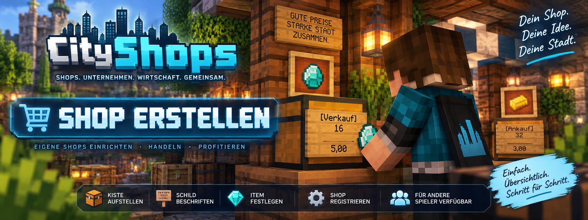

<link rel="stylesheet" href="style.css">



# 🛒 CityShops – Shop erstellen

Mit **[CityShops](https://www.curseforge.com/minecraft/mc-mods/cityshops)** kannst du direkt in deiner Minecraft-Welt eigene Verkaufs- und Ankaufsshops erstellen.

Für einen Shop benötigst du nur eine **Kiste oder Doppelkiste, ein Schild und das Item**, das du handeln möchtest.

Die Bezahlung der Shops erfolgt über **[MineBank](https://www.curseforge.com/minecraft/mc-mods/minebank)**.

---

## 🧭 Welche Spieler-Shops gibt es?

CityShops unterstützt zwei grundlegende Spieler-Shoptypen:

| Shoptyp | Funktion |
| --- | --- |
| 🟢 **Verkaufsshop** | Andere Spieler kaufen Waren aus deiner Shopkiste |
| 🔵 **Ankaufsshop** | Andere Spieler verkaufen Waren an deine Shopkiste |

> 💡 **Wichtig:** Eine Kiste kann entweder verkaufen oder ankaufen. Beides gleichzeitig ist mit derselben Shopkiste nicht möglich.

---

# 💰 Verkaufsshop erstellen

Mit einem Verkaufsshop kannst du Items aus deiner Shopkiste an andere Spieler verkaufen.

## 1️⃣ Kiste aufstellen

Stelle zuerst eine normale **Kiste oder Doppelkiste** an der gewünschten Stelle auf.

Eine Doppelkiste wird von CityShops automatisch als **ein gemeinsamer Shop mit gemeinsamem Warenbestand** behandelt.

---

## 2️⃣ Verkaufsitem festlegen

Öffne die Kiste und lege das Item, das du verkaufen möchtest, in den **obersten linken Slot**.

CityShops erkennt dieses Item automatisch als Handelsware des Shops.

Dabei verwendet CityShops automatisch den übersetzten Namen des Items.

Du musst also keine technische Item-ID wie:

```text
minecraft:stone
```

auf das Schild schreiben.

---

## 3️⃣ Schild anbringen

Sneake und befestige ein **Schild direkt an der Shopkiste**.

Beschrifte das Schild beispielsweise so:

```text
[Verkauf]
16

5,00
```

Alternativ kannst du auch:

```text
[Shop]
16

5,00
```

verwenden.

---

## 4️⃣ Was bedeutet das Schild?

Bei diesem Beispiel:

```text
[Verkauf]
16

5,00
```

gilt:

| Schildzeile | Bedeutung |
| --- | --- |
| `[Verkauf]` | Erstellt einen Verkaufsshop |
| `16` | Menge pro Handel |
| leer | Diese Zeile bleibt leer |
| `5,00` | Gesamtpreis für die eingestellte Menge |

Der Kunde erhält also:

**16 Items für insgesamt 5,00**

> 💡 **Wichtig:** Die `16` ist kein Gesamtlimit des Shops. Bei jedem erfolgreichen Handel werden 16 Items verkauft.

---

## 5️⃣ Shop registrieren

Nachdem du:

1. die Kiste aufgestellt hast,
2. das gewünschte Item oben links hineingelegt hast,
3. das Schild direkt an der Kiste angebracht hast,
4. und das Schild korrekt beschriftet hast,

klickst du das **Shop-Schild mit der rechten Maustaste an**.

CityShops registriert anschließend deinen Shop.

🎉 **Dein Verkaufsshop ist jetzt eingerichtet!**

---

## 📦 Verkaufsshop auffüllen

Nach der Registrierung benötigt dein Shop ausreichend Ware.

Wenn dein Schild beispielsweise:

```text
[Verkauf]
16

5,00
```

anzeigt, müssen mindestens **16 passende Items** für einen erfolgreichen Handel vorhanden sein.

Sind nicht genügend Items vorhanden, kann der Verkauf nicht durchgeführt werden.

---

## 💳 Wohin gehen die Einnahmen?

Bei einem persönlichen Shop werden die Einnahmen deinem **MineBank-Konto** gutgeschrieben.

Wenn der Shop einer Firma zugeordnet ist, werden die Einnahmen stattdessen über das entsprechende **MineBank-Firmenkonto** abgewickelt.

---

# 📥 Ankaufsshop erstellen

Mit einem Ankaufsshop funktioniert der Handel in die andere Richtung.

Andere Spieler können ihre Items an deinen Shop verkaufen und erhalten dafür Geld.

---

## 1️⃣ Kiste aufstellen

Stelle wieder eine normale **Kiste oder Doppelkiste** auf.

Auch beim Ankauf behandelt CityShops eine Doppelkiste als einen gemeinsamen Shop.

---

## 2️⃣ Ankaufitem festlegen

Lege das Item, das dein Shop ankaufen soll, in den **obersten linken Slot der Kiste**.

CityShops erkennt dadurch automatisch, welches Item angekauft werden soll.

---

## 3️⃣ Schild anbringen

Sneake und befestige ein Schild direkt an der Kiste.

Für einen Ankauf beschriftest du das Schild beispielsweise so:

```text
[Ankauf]
16

3,00
```

---

## 4️⃣ Was bedeutet das Schild?

Bei:

```text
[Ankauf]
16

3,00
```

gilt:

| Schildzeile | Bedeutung |
| --- | --- |
| `[Ankauf]` | Erstellt einen Ankaufsshop |
| `16` | Menge pro Handel |
| leer | Diese Zeile bleibt leer |
| `3,00` | Gesamtpreis für die eingestellte Menge |

Der Shop kauft also:

**16 Items für insgesamt 3,00**

Der Spieler gibt die 16 Items ab und erhält dafür 3,00.

---

## 5️⃣ Ankaufsshop registrieren

Wenn Kiste, Item und Schild vorbereitet sind, klickst du wieder mit der **rechten Maustaste auf das Shop-Schild**.

CityShops registriert den Ankaufsshop.

🎉 **Dein Ankaufsshop ist jetzt eingerichtet!**

---

## 📦 Wohin gehen angekaufte Items?

Die von anderen Spielern verkauften Items werden in deiner Shopkiste gelagert.

Deshalb muss ausreichend **freier Platz in der Kiste** vorhanden sein.

Ist die Kiste zu voll, kann der entsprechende Ankauf nicht durchgeführt werden.

---

## 💳 Woher kommt das Geld?

Bei einem persönlichen Ankaufsshop wird die Auszahlung über dein **MineBank-Konto** abgewickelt.

Bei einem Firmenshop wird das entsprechende **Firmenkonto** verwendet.

Ein Ankauf kann nicht durchgeführt werden, wenn:

- der Verkäufer nicht genügend Items besitzt,
- nicht genügend Geld für den Ankauf vorhanden ist,
- oder die Shopkiste nicht genügend freien Platz besitzt.

---

# 📋 Verkauf & Ankauf im Vergleich

| | 🟢 Verkauf | 🔵 Ankauf |
| --- | --- | --- |
| Schild | `[Verkauf]` / `[Shop]` | `[Ankauf]` |
| Spieler | kauft Items | verkauft Items |
| Items | werden aus der Kiste entnommen | werden in der Kiste gelagert |
| Geld | geht an den Shopbesitzer | wird vom Shopbesitzer bezahlt |
| Kistenbestand | genügend Ware nötig | genügend freier Platz nötig |

---

# 🖱️ An einem Shop handeln

Spieler handeln über einen **Rechtsklick auf das Shop-Schild**.

Dabei wird immer die Menge gehandelt, die auf dem Schild angegeben wurde.

### Beispiel

```text
[Verkauf]
16

5,00
```

Ein erfolgreicher Rechtsklick bedeutet:

**16 Items kaufen → 5,00 bezahlen**

Ein weiterer erfolgreicher Rechtsklick führt denselben Handel erneut durch.

---

# 🧪 Eigenen Shop testen

Du brauchst keinen zweiten Spieler, um deinen Shop zu testen.

Als Besitzer kannst du:

**Sneaken + Rechtsklick auf deinen eigenen Shop**

CityShops führt anschließend einen Testhandel durch.

> 💡 **Beim Testhandel wird kein Geld übertragen.**

So kannst du überprüfen, ob dein Shop richtig eingerichtet wurde.

---

# 📦 Doppelkisten

CityShops unterstützt normale Einzelkisten und Doppelkisten.

Bei einer Doppelkiste gilt:

- beide Seiten teilen sich denselben Warenbestand,
- beide Seiten gehören zur selben Shopregistrierung,
- die komplette Doppelkiste zählt als **ein Shop**.

Du kannst deshalb nicht eine Hälfte als Verkaufsshop und die andere Hälfte als Ankaufsshop verwenden.

---

# 🔒 Schutz der Shopkisten

Registrierte Shopkisten sind vor unberechtigtem Zugriff geschützt.

Andere Spieler können dadurch nicht einfach auf den Warenbestand eines fremden Shops zugreifen.

OP-Spieler behalten ihren administrativen Zugriff.

Sie können trotzdem weiterhin normal an Shops handeln.

---

# 🏢 Persönlicher Shop oder Firmenshop?

CityShops unterstützt sowohl persönliche Shops als auch Shops, die zu einem Unternehmen gehören.

Bei einem persönlichen Shop werden Zahlungen über das **MineBank-Konto des Shopbesitzers** abgewickelt.

Bei einem Firmenshop wird das entsprechende **MineBank-Firmenkonto** verwendet.

> 🏢 Alles Weitere zu Unternehmen, Mitarbeitern, Firmenshops und Filialen findest du in der Wiki unter **Unternehmen & Filialen**.

---

# ⚠️ Wichtige Regeln

Beachte beim Erstellen eines Shops:

- Pro Kiste beziehungsweise Doppelkiste kann nur **ein Shop** registriert werden.
- Ein Shop kann entweder **ankaufen oder verkaufen**.
- Eine Kiste kann nicht gleichzeitig Ankauf und Verkauf sein.
- Eine Doppelkiste zählt als **ein gemeinsamer Shop**.
- Das Shop-Item wird über den obersten linken Slot festgelegt.
- Die zweite Schildzeile bestimmt die **Menge pro Handel**.
- Die vierte Schildzeile bestimmt den **Gesamtpreis für diese Menge**.
- Shopkisten sind vor unberechtigtem Zugriff geschützt.
- Besitzer können ihren Shop mit **Sneaken + Rechtsklick** testen.
- Beim Testhandel wird kein Geld übertragen.

---

# ❓ Shop funktioniert nicht?

Falls sich dein Shop nicht erstellen lässt oder ein Handel nicht funktioniert, überprüfe:

- Ist **[CityShops](https://www.curseforge.com/minecraft/mc-mods/cityshops)** korrekt installiert?
- Ist **[MineBank](https://www.curseforge.com/minecraft/mc-mods/minebank)** installiert?
- Ist das Schild direkt an der Kiste angebracht?
- Hast du beim Anbringen des Schildes gesneakt?
- Liegt das gewünschte Item im obersten linken Slot?
- Ist das Schild korrekt beschriftet?
- Hast du das Schild anschließend mit Rechtsklick registriert?
- Befinden sich bei einem Verkauf genügend Items in der Kiste?
- Besitzt der Verkäufer bei einem Ankauf genügend Items?
- Ist beim Ankauf genügend Geld vorhanden?
- Ist beim Ankauf genügend Platz in der Shopkiste vorhanden?

---

# 📚 Weitere CityShops-Anleitungen

Weitere Funktionen von CityShops werden in eigenen Wiki-Bereichen erklärt:

- 👑 **Admin-Shops**
- 🏢 **Unternehmen & Filialen**
- 💰 **Kaufen & Verkaufen**
- 📊 **Statistiken & Bewertungen**
- ❤️ **Spendenschilder**
- 🎟️ **Lottery**
- 💻 **Business OS**
- ⌨️ **Befehle**
- 🔐 **Berechtigungen**
- ❓ **Häufige Fragen**

---

## 🔗 Offizielle Seiten

- **[CityShops auf CurseForge](https://www.curseforge.com/minecraft/mc-mods/cityshops)**
- **[MineBank auf CurseForge](https://www.curseforge.com/minecraft/mc-mods/minebank)**

---

[← Installation](cityshops-installation.md) | [Weiter: Admin-Shops →](cityshops-admin-shops.md)
