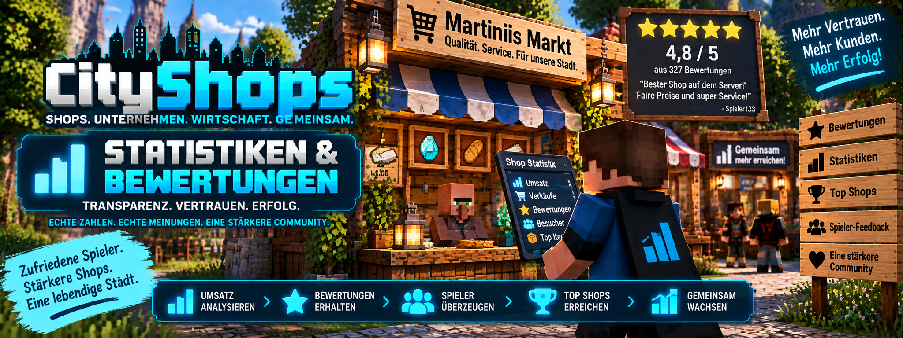

<link rel="stylesheet" href="style.css">



# 📊 CityShops – Statistiken & Bewertungen

CityShops besitzt ein umfangreiches **Statistik- und Bewertungssystem**.

Jeder echte Handel kann für die Shopstatistik erfasst werden. Zusätzlich können Kunden Shops und Unternehmen nach einem erfolgreichen Handel mit **1 bis 5 Sternen** bewerten.

So können Shopbesitzer ihre Verkäufe auswerten und Spieler sehen, wie andere Kunden einen Shop beziehungsweise ein Unternehmen bewertet haben.

---

# ⭐ Bewertungen

Nach einem **echten Handel** kann ein Kunde den verwendeten Shop oder das zugehörige Unternehmen mit:

**⭐ 1 bis ⭐⭐⭐⭐⭐ 5 Sternen**

bewerten.

> 💡 Eine Bewertung ist erst nach einem echten Handel möglich.

Dadurch können nicht einfach beliebige Bewertungen abgegeben werden, ohne vorher tatsächlich mit dem Shop gehandelt zu haben.

---

## 🚫 Eigenen Shop bewerten

Shopbesitzer können ihren eigenen Shop nicht bewerten.

Auch Mitglieder eines Unternehmens können das eigene Unternehmen beziehungsweise die eigenen Firmenshops nicht bewerten.

Dadurch verhindert CityShops, dass Besitzer oder Mitarbeiter die Bewertung ihres eigenen Geschäfts selbst erhöhen.

---

# 🪧 Bewertungsschild für einen persönlichen Shop

Für einen persönlichen Shop kannst du ein eigenes Bewertungsschild erstellen.

Das Bewertungsschild muss **nicht direkt an der Shopkiste** angebracht werden.

Du kannst es an einer passenden Stelle in deinem Geschäft platzieren.

---

## 1️⃣ Bewertungsschild aufstellen

Stelle ein Schild auf und schreibe in die erste Zeile:

```text
[Bewertung]
```

Die anderen Zeilen müssen für die Registrierung nicht mit Shopinformationen ausgefüllt werden.

---

## 2️⃣ Verknüpfung starten

Führe anschließend folgenden Befehl aus:

```text
/chestshop link
```

CityShops wartet jetzt darauf, dass du den Shop auswählst, der mit dem Bewertungsschild verbunden werden soll.

---

## 3️⃣ Shop auswählen

Klicke anschließend deinen gewünschten **Shop** an.

Damit weiß CityShops, welcher Shop mit dem Bewertungsschild verbunden werden soll.

---

## 4️⃣ Bewertungsschild auswählen

Klicke danach das zuvor erstellte:

```text
[Bewertung]
```

Schild an.

CityShops verbindet das Bewertungsschild nun mit dem ausgewählten Shop.

🎉 **Das Bewertungsschild ist jetzt mit deinem Shop verbunden.**

---

# 🏢 Bewertungsschild für Unternehmen

Bei einem Unternehmen ist die Einrichtung einfacher.

Der **Firmenbesitzer** stellt ein Schild mit:

```text
[Bewertung]
```

auf.

Anschließend klickt der Firmenbesitzer das Schild mit der **rechten Maustaste** an.

CityShops verbindet das Bewertungsschild automatisch mit dem Unternehmen.

Du musst bei einem Firmen-Bewertungsschild deshalb nicht zuerst `/chestshop link` verwenden.

---

# ⭐ Eine Bewertung abgeben

Wenn ein Spieler nach einem echten Handel ein verbundenes Bewertungsschild mit der **rechten Maustaste** anklickt, öffnet CityShops im Chat eine anklickbare Auswahl.

Dort kann der Spieler zwischen:

```text
⭐
⭐⭐
⭐⭐⭐
⭐⭐⭐⭐
⭐⭐⭐⭐⭐
```

wählen.

Damit kann eine Bewertung zwischen **1 und 5 Sternen** abgegeben werden.

---

## 🔐 Sicherheit der Bewertungsauswahl

Die Auswahl im Chat ist aus Sicherheitsgründen nur **kurze Zeit gültig**.

Außerdem funktioniert sie nur, solange sich der Spieler noch in der Nähe des Bewertungsschildes befindet.

Dadurch verhindert CityShops, dass eine alte Bewertungsauswahl später von einem anderen Ort aus verwendet wird.

---

# ⌨️ Bewertung per Befehl

Alternativ kann eine Bewertung über einen Befehl gestartet werden:

```text
/chestshop rate <1-5>
```

### Beispiel

```text
/chestshop rate 5
```

Anschließend klickst du den Shop an, den du bewerten möchtest.

Auch hierbei gelten die normalen CityShops-Regeln für Bewertungen.

---

# 🏷️ Shops benennen

CityShops ermöglicht es Shopbesitzern, ihren Shops eigene Namen zu geben.

Dafür verwendest du:

```text
/chestshop name <Name>
```

### Beispiel

```text
/chestshop name Martiniis Markt
```

Anschließend klickst du deinen eigenen Shop an.

CityShops weist dem Shop danach den gewünschten Namen zu.

---

## 🪧 Umbenennen über das Bewertungssystem

Besitzer können die Umbenennung außerdem über das Menü des Bewertungsschildes starten.

Dadurch sind Bewertung und Shopverwaltung direkt miteinander verbunden.

---

# 📊 Shopstatistiken

CityShops zeichnet bei **echten Handelsvorgängen** verschiedene Statistikwerte auf.

Dazu gehören:

| Statistik | Bedeutung |
| --- | --- |
| 🛒 Transaktionen | Anzahl der durchgeführten Handelsvorgänge |
| 📦 Itemmenge | Insgesamt gehandelte Itemmenge |
| 💰 Umsatz | Insgesamt über den Shop gehandelter Geldwert |

Die Statistikdaten werden **serverseitig in der Minecraft-Welt gespeichert**.

---

# 📈 Eigene Handelsstatistik anzeigen

Mit:

```text
/chestshop stats
```

kannst du deine persönliche Handelsstatistik anzeigen.

Damit erhältst du einen schnellen Überblick über deine CityShops-Handelsaktivitäten.

---

# 📜 Handelsverlauf

CityShops speichert für jeden Shop einen Handelsverlauf.

Pro Shop werden die:

**letzten 50 Handelsvorgänge**

gespeichert.

Dadurch können Shopaktivitäten auch nachträglich nachvollzogen werden.

---

# 👑 Handelsverlauf als Administrator prüfen

Administratoren können einen Shop gezielt überprüfen.

Dafür gibt es:

```text
/chestshop history
```

> ⚠️ Dieser Befehl ist für **OP-Spieler** vorgesehen.

Nach dem Befehl klickst du das Shop-Schild an, dessen Handelsverlauf du überprüfen möchtest.

CityShops zeigt anschließend den gespeicherten Verlauf dieses Shops an.

---

# 🌙 Offline-Zusammenfassung

Du musst nicht online sein, während Kunden an deinen Shops handeln.

CityShops merkt sich Verkäufe und Ankäufe während deiner Abwesenheit.

Wenn du dich später wieder auf dem Server anmeldest, erhältst du eine **Zusammenfassung der während deiner Abwesenheit erfolgten Verkäufe und Ankäufe**.

So kannst du direkt sehen, was passiert ist, während du offline warst.

---

# 💻 Statistiken im Shop-PC

Der CityShops Shop-PC bietet eine umfangreichere Darstellung deiner Shopdaten.

Dort werden unter anderem angezeigt:

- 🛒 Anzahl der Transaktionen
- 📦 gehandelte Itemmenge
- 💰 Umsatz
- 📍 Position des Shops
- 📦 aktueller Bestand
- 💵 Preis
- 🔢 Menge pro Handel
- 📜 gespeicherter Handelsverlauf

Damit kannst du deine Shops zentral überwachen.

---

# 📈 7-Tage-Diagramm

Der Shop-PC enthält außerdem ein **7-Tage-Diagramm**.

Damit kannst du die Entwicklung eines Shops über die letzten Tage betrachten.

Das Diagramm zeigt pro Tag:

- Anzahl der Handelsvorgänge
- gehandelte Itemmenge
- Umsatz

Dadurch lässt sich beispielsweise erkennen, an welchen Tagen besonders viel gehandelt wurde.

---

# 🏢 Firmenstatistiken

CityShops unterstützt zusätzlich **Firmenstatistiken und Marktberichte**.

Unternehmen können dadurch ihre gemeinsamen Shopaktivitäten innerhalb des Business OS auswerten.

Die ausführlichen Business-Funktionen erklären wir separat unter:

**💻 Business OS**

---

# 🧹 Entfernte Shops

Wenn ein Shop entfernt wird, bereinigt CityShops die zugehörigen Einträge automatisch.

Entfernte Shops werden dadurch auch aus:

- der Statistik
- dem Shop-PC

entfernt.

Damit bleiben die Übersichten sauber und enthalten keine alten, nicht mehr vorhandenen Shops.

---

# ⏰ Inaktive Shops

Spielershops werden standardmäßig nach:

**168 Stunden Abwesenheit des Besitzers**

deaktiviert.

Das entspricht:

**7 Tagen**

Dabei werden weder die Shopkiste noch die darin enthaltenen Items gelöscht.

Der Shop wird lediglich deaktiviert.

---

## ⚙️ Inaktivitätszeit einstellen

Serverbetreiber können diese Zeit über die CityShops-Serverkonfiguration ändern.

Die Einstellung befindet sich in:

```text
serverconfig/chestshop-server.toml
```

Dort kann der Wert:

```text
inactiveHours
```

angepasst werden.

---

## 👑 Admin-Shops

Admin-Shops sind von dieser automatischen Inaktivitätsregel ausgenommen.

Sie bleiben aktiv, auch wenn der Ersteller längere Zeit nicht auf dem Server war.

---

# 📋 Befehle dieser Seite

| Befehl | Funktion |
| --- | --- |
| `/chestshop link` | Persönlichen Shop mit einem Bewertungsschild verbinden |
| `/chestshop rate <1-5>` | Bewertung per Befehl starten |
| `/chestshop name <Name>` | Eigenen Shop benennen |
| `/chestshop stats` | Eigene Handelsstatistik anzeigen |
| `/chestshop history` | Als OP den Verlauf eines Shops überprüfen |

---

# 💡 Tipps für Shopbesitzer

Nutze die Statistiken und Bewertungen, um deine Shops besser im Blick zu behalten.

Achte besonders auf:

- die Anzahl deiner Transaktionen
- die gehandelte Itemmenge
- deinen Umsatz
- deine Kundenbewertungen
- den gespeicherten Handelsverlauf
- die Offline-Zusammenfassung
- die Entwicklung im 7-Tage-Diagramm

So kannst du schnell erkennen, welche Shops besonders häufig genutzt werden.

---

# ❓ Bewertung funktioniert nicht?

Falls eine Bewertung nicht funktioniert, überprüfe:

- Hat der Spieler vorher einen **echten Handel** durchgeführt?
- Versucht der Besitzer, seinen eigenen Shop zu bewerten?
- Gehört der Spieler zum Unternehmen, das er bewerten möchte?
- Ist das `[Bewertung]`-Schild korrekt registriert?
- Wurde bei einem persönlichen Shop `/chestshop link` verwendet?
- Wurde zuerst der Shop und danach das Bewertungsschild angeklickt?
- Befindet sich der Spieler noch in der Nähe des Schildes?
- Ist die Bewertungsauswahl im Chat möglicherweise bereits abgelaufen?

---

# ❓ Statistik fehlt?

Falls ein Shop nicht richtig in der Statistik erscheint, überprüfe:

- Wurde tatsächlich ein **echter Handel** durchgeführt?
- Existiert der Shop noch?
- Ist der Shop aktiv?
- Wurde der Shop möglicherweise entfernt?
- Wird der richtige Shop beziehungsweise die richtige Firma im Shop-PC angezeigt?

Testhandlungen des Besitzers dienen zum Prüfen des Shops und sollten nicht mit normalen echten Kundentransaktionen verwechselt werden.

---

# 📚 Weitere CityShops-Anleitungen

Weitere Informationen findest du in den anderen Bereichen der CityShops-Wiki:

- 🛒 **Shop erstellen**
- 👑 **Admin-Shops**
- 🏢 **Unternehmen & Filialen**
- 💰 **Kaufen & Verkaufen**
- ❤️ **Spendenschilder**
- 💻 **Business OS**
- ⌨️ **Befehle**
- 🔐 **Berechtigungen**
- ❓ **Häufige Fragen**

---

## 🔗 Offizielle Seite

**[CityShops auf CurseForge](https://www.curseforge.com/minecraft/mc-mods/cityshops)**

---

[← Kaufen & Verkaufen](cityshops-kaufen-verkaufen.md) | [Weiter: Spendenschilder →](cityshops-spendenschilder.md)
