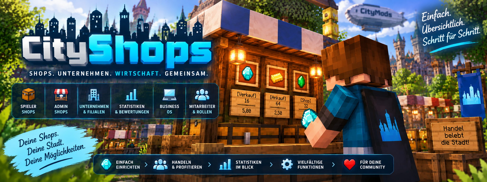

<link rel="stylesheet" href="style.css">

# 🛒 CityShops

**CityShops** ist ein umfangreiches Shop- und Wirtschaftssystem für Minecraft-Server.

Mit CityShops können Spieler eigene Shops betreiben, Waren kaufen und verkaufen sowie Unternehmen und Filialen verwalten.

---

## 📖 Dokumentation

### 🚀 [Installation](cityshops-installation.md)
Installation und Voraussetzungen von CityShops.

### 🛒 [Shop erstellen](cityshops-shop-erstellen.md)
Anleitung zum Erstellen und Einrichten eines eigenen Shops.

### 🏪 [Admin-Shops](cityshops-admin-shops.md)
Erstellen und Verwalten von Admin-Verkaufs- und Ankaufsshops mit MineBank-Staatskasse.

### 🏢 Unternehmen & Filialen
Verwalte Unternehmen, Mitarbeiter und mehrere Verkaufsstellen.

### 💰 Kaufen & Verkaufen
Informationen zum Kauf und Verkauf von Waren.

### 📊 Statistiken & Bewertungen
Übersicht über Verkaufsstatistiken und Bewertungen von Shops.

### 💻 Business OS
Informationen und Anleitung zum CityShops Business OS.

### ⌨️ Befehle
Übersicht über die verfügbaren CityShops-Befehle.

### 🔐 Berechtigungen
Informationen zu Berechtigungen und administrativen Funktionen.

### ❓ Häufige Fragen
Lösungen für häufige Fragen und Probleme.

---

## 🆕 Neuere Funktionen

Weitere Funktionen und Anleitungen werden mit zukünftigen CityShops-Versionen ergänzt.

---

[← Zurück zur CityMods Wiki](./)
